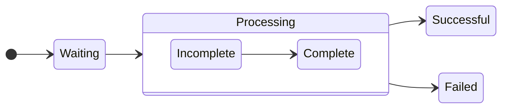

---

### ✅ Q1  
**Question:**  
Your company uses a Git repository in Azure Repos to manage the source code of a web application...  
**Requirements:**  
- Consolidate commit histories.  
- Merge the changes into a single commit.  
**Which merge strategy should you use in the branch policy?**

**A.** squash merge ✅  
**B.** fast-forward merge  
**C.** Git fetch  
**D.** no-fast-forward merge  

---

### ✅ Q2  
**Question:**  
You store source code in a Git repository in Azure Repos. You use a third-party CI tool to control builds. What will Azure DevOps use to authenticate with the tool?

**A.** Certificate authentication  
**B.** a personal access token (PAT) ✅  
**C.** a Shared Access Signature (SAS) token  
**D.** NTLM authentication  

---

### ✅ Q3  
**Question:**  
You configure Azure Application Insights and enable Smart Detection... You don’t receive a Smart Detection notification after a test failure. What prevents the notification?

**A.** You must enable the Snapshot Debugger  
**B.** Smart Detection uses the first 24 hours to establish the normal behavior of the web app ✅  
**C.** The web app is configured to use the shared plan tier  
**D.** You must restart the app  

---

### ✅ Q4  
**Question:**  
You need a solution for continuous inspection of the company’s code base to locate common code patterns that are problematic. What should you recommend?

**A.** Microsoft Visual Studio test plans  
**B.** Gradle wrapper scripts  
**C.** SonarCloud analysis ✅  
**D.** the JavaScript task runner  

---

### ✅ Q5 – Part 1  
**Question:**  
You use GitHub for source control. Documentation is stored as `.docx` and `.bmp`. You must optimize versioning and meet requirements like storing as plain text and simplifying reuse.

**Convert the `.docx` files to:**  
**A.** LaTex Typesetting (.tex)  
**B.** Markdown (.md) ✅  
**C.** Portable Document Format (.pdf)  

---

### ✅ Q5 – Part 2  
**Convert the flow charts to:**  
**A.** Mermaid diagrams ✅  
**B.** PNG  
**C.** TIFF  

---

### ✅ Q6  
**Question:**  
You need to send an SMS alert when Azure service scheduled maintenance is planned. Which two actions should you perform?

**A.** Enable Azure Security Center  
**B.** Create and configure Azure Monitor alert rule  
**C.** Create an Azure Service Health alert ✅  
**D.** Create and configure an action group ✅  

---

### ✅ Q7  
**Question:**  
You experience intermittent delays before a build pipeline starts in Azure Pipelines. What should you do?

**A.** Enable self-hosted build agents ✅  
**B.** Create a new agent pool  
**C.** Split the pipeline into multiple stages  
**D.** Purchase additional parallel job  

---

### ✅ Q8  
**Question:**  
You need an integration strategy for Java build that must use on-prem dependency management and store artifacts in Azure DevOps...  
**Solution:** Use Microsoft-hosted agent with Visual Studio 2019 and Java Tool Installer.  
**Does this meet the goal?**

**A.** Yes  
**B.** No ✅  

---

### ✅ Q9  
**Question:**  
You configure an Azure Application Insights availability test and create a logic app to handle email notifications. What trigger should invoke the logic app?

**A.** HTTPWebhook trigger  
**B.** HTTP trigger  
**C.** Request trigger ✅  
**D.** ApiConnection trigger  

---

Вот следующие вопросы с вариантами и правильными ответами:

---

### ✅ Q11  
**Question:**  
You use Azure Pipelines and notice increased cycle times. You suspect agent pool exhaustion.  
**What are two possible ways to verify this?**

**Options:**  
A. Query the PipelineRun/PipelineRuns endpoint  
B. **Query the TaskAgentPoolSizeSnapshots endpoint** ✅  
C. View the Pipeline duration report  
D. **View the pool consumption report at the organization level** ✅

**Correct Answers:** B and D

---

### ✅ Q12  
**Question:**  
Using Semantic Versioning (SemVer), which version part should be incremented?

| Change   | New functionality | Incompatibility | Version Part |
|----------|-------------------|------------------|--------------|
| Change1  | Yes               | Minor            | **Minor** ✅ |
| Change2  | Yes               | Significant      | **Major** ✅ |
| Change3  | No                | Minor            | **Patch** ✅ |

---

### ✅ Q13  
**Question:**  
You need to deploy a new version of an Azure web app with minimal downtime and allow rollback.  
**What should you use?**

**Options:**  
A. **a single web app and two deployment slots** ✅  
B. a single web app and two deployment pipelines  
C. two web apps and an Azure Standard Load Balancer  
D. two web apps and an Azure Traffic Manager instance

**Correct Answer:** A

---

### ✅ Q14  
**Question:**  
You need to minimize troubleshooting effort for intermittent test failures.  
**Solution:** Implement the Test Results Trend widget.  
**Does this meet the goal?**

**Options:**  
A. Yes  
B. **No** ✅

**Correct Answer:** B

---

### ✅ Q15  
**Question:**  
YAML strategy value for each app to minimize downtime?

| App  | Platform                      | Strategy   |
|------|-------------------------------|------------|
| App1 | Azure Virtual Machine         | **rolling** ✅  
| App2 | Azure Kubernetes Service (AKS)| **canary** ✅  

**Correct Answers:**  
App1: B. rolling  
App2: A. canary

---

---

### **Q16.**
Your company uses Azure DevOps for the build pipelines and deployment pipelines of Java-based projects. You need to recommend a strategy for managing technical debt.  
**Which two actions should you include in the recommendation?**

✅ **B. Configure pre-deployment approvals in the deployment pipeline.**  
✅ **C. Integrate Azure DevOps and SonarQube.**

---

### **Q17.**
You are developing a full Microsoft .NET Framework solution that includes unit tests. You need to configure SonarQube to perform a code quality validation of the C# code as part of the build pipelines.  
**Which four tasks should you perform in sequence?**

🟢 **Correct order:**  
1️⃣ **E. Prepare Analysis Configuration**  
2️⃣ **D. Visual Studio Build**  
3️⃣ **B. Visual Studio Test**  
4️⃣ **A. Run Code Analysis**

---

### **Q18.**
During a code review, you discover many quality issues. Many modules contain unused variables and empty catch blocks. You need to recommend a solution to improve the quality of the code.  
**What should you recommend?**

✅ **B. In a Maven build task, select Run PMD.**

---

### **Q19.**
You have a multi-tier application that has an Azure Web Apps front end and an Azure SQL Database back end. You need to recommend a solution to capture and store telemetry data.  
The solution must meet the following requirements:  
- Support using ad-hoc queries to identify baselines.  
- Trigger alerts when metrics in the baseline are exceeded.  
- Store application and database metrics in a central location.  
**What should you include in the recommendation?**

✅ **D. Azure Log Analytics**

---

### **Q20.**
You are automating the testing process for your company. You need to automate UI testing of a web application.  
**Which framework should you use?**

✅ **B. Selenium**

---
Готово! Вот оформленные вопросы и правильные ответы в точности с изображений:

---

✅ Q21  
**Question:**  
You have a build pipeline in Azure Pipelines that occasionally fails. You discover that a test measuring the response time of an API endpoint causes the failures. You need to prevent the build pipeline from failing due to the test. Which two actions should you perform?  
A. Set Flaky test detection to Off.  
B. **Clear Flaky tests included in test pass percentage.** ✅  
C. Enable Test Impact Analysis (TIA).  
D. **Manually mark the test as flaky.** ✅  
E. Enable test slicing.

---

✅ Q22  
**Question:**  
You manage a project in Azure DevOps. You need to prevent the configuration of the project from changing over time.  
**Solution:** Perform a Subscription Health scan when packages are created.  
A. Yes  
B. **No** ✅

---

✅ Q23  
**Question:**  
You use Azure Pipelines to manage build pipelines, GitHub to store source code, and Dependabot to manage dependencies. You have an app named App1. Dependabot detects a dependency in App1 that requires an update. What should you do first to apply the update?  
A. Create a pull request.  
B. **Approve the pull request.** ✅  
C. Create a branch.  
D. Perform a commit.

---

✅ Q24  
**Question:**  
You are designing a configuration management solution to support five apps hosted on Azure App Service. Each app is available in the following three environments: development, test, and production. You need to recommend a configuration management solution that meets the following requirements:  
- Supports feature flags  
- Tracks configuration changes from the past 30 days  
- Stores hierarchically structured configuration values  
- Controls access to the configurations by using role-based access control (RBAC) permissions  
- Stores shared values as key/value pairs that can be used by all the apps  
**Which Azure service should you recommend as the configuration management solution?**  
A. Azure Cosmos DB  
B. Azure App Service  
C. **Azure App Configuration** ✅  
D. Azure Key Vault

---

✅ Q25  
**Question:**  
You are designing a strategy to monitor the baseline metrics of Azure virtual machines that run Windows Server. You need to collect detailed data about the processes running in the guest operating system. Which two agents should you deploy?  
A. the Telegraf agent  
B. **the Azure Monitor agent** ✅  
C. the Azure Network Watcher Agent for Windows  
D. **the Dependency agent** ✅

---

✅ Q26  
**Question:**  
You need to find and isolate shared code. The shared code will be maintained in a series of packages. Which three actions should you perform in sequence?  
**Correct sequence of actions:**  
C. **Create a dependency graph for the application.** ✅  
A. **Group the related components.** ✅  
B. **Assign ownership to each component group.** ✅  
D. Identify the most common language used.  
E. Rewrite the components in the most common language.

---

✅ Q27  
**Question:**  
You use GitHub for source control. A file that contains sensitive data is committed accidentally to the Git repository of a project. You need to delete the file and its history from the repository. Which two tools can you use?  
A. **the git filter-branch command** ✅  
B. **BFG Repo-Cleaner** ✅  
C. the git rebase command  
D. GitHub Desktop

---

✅ Q28  
**Question:**  
You have a GitHub repository. You create a new repository in Azure DevOps. You need to recommend a procedure to clone the repository from GitHub to Azure DevOps. What should you recommend?  
A. Create a pull request.  
B. Create a webhook.  
C. Create a service connection for GitHub.  
D. **From Import a Git repository, click Import.** ✅  
E. Create a personal access token in Azure DevOps.

---

✅ Q29  
**Question:**  
You use a Git repository in Azure Repos to manage the source code of a web application. Developers commit changes directly to the default branch. You need to implement a change management procedure that meets the following requirements:  
- The default branch must be protected, and new changes must be built in the feature branches first.  
- Changes must be reviewed and approved by at least one release manager before each merge.  
- Changes must be brought into the default branch by using pull requests.  
**What should you configure in Azure Repos?**  
A. ~~Services in Project Settings~~  
B. ~~Deployment pools in Project Settings~~  
C. **branch policies of the default branch** ✅  
D. branch security of the default branch

---
✅ Q30  
**Question:**  
You plan to publish build artifacts by using an Azure pipeline. You need to create an .artifactignore file that meets the following requirements:  
- Includes all files in the build output folder and all subfolders  
- Excludes files that have the .dll extension  
**What should you include in the file?**  
A. ./\*\*  
  !*.dll  
B. **\*\*/\***  
  **!*.dll** ✅  
C. */\*\*  
  *.dll  
D. \*\*/\*  
  #*.dll

---

✅ Q31  
**Question:**  
You manage a project by using Azure Boards. You manage the project code by using GitHub. You have three work items that have IDs of 456, 457, and 458. You need to create a pull request that will be linked to all the work items. The solution must set the state of work item 456 to done.  
**What should you add to the commit message?**  
A. ~~Fixes #456, #457, #458~~  
B. **Fixes #AB456, #AB457, #AB458** ✅  
C. ~~#456, #457, #458~~  
  Completed #456  
D. ~~#AB456, #AB457, #AB458~~

---

✅ Q32  
**Question:**  
Your company deploys applications in Docker containers. You want to detect known exploits in the Docker images used to provision the Docker containers. You need to integrate image scanning into the application lifecycle. The solution must expose the exploits as early as possible during the application lifecycle.  
**What should you configure?**  
A. **a task executed in the continuous integration pipeline and a scheduled task that analyzes the image registry** ✅  
B. manual tasks performed during the planning phase and the deployment phase  
C. a task executed in the continuous deployment pipeline and a scheduled task against a running production container  
D. a task executed in the continuous integration pipeline and a scheduled task that analyzes the production container

---

✅ Q33  
**Question:**  
Your company has an Azure DevOps project. The source code for the project is stored in an on-premises repository and uses an on-premises build server. You plan to use Azure DevOps to control the build process on the build server by using a self-hosted agent. You need to implement the self-hosted agent. You download and install the agent on the build server.  
**Which two actions should you perform next?**  
D. **From DevOps, create a personal access token (PAT).** ✅  
E. **From the build server, run config.cmd.** ✅  
A. From Azure, create a shared access signature (SAS).  
B. From the build server, create a certificate, and then upload the certificate to Azure Storage.  
C. From the build server, create a certificate, and then upload the certificate to Azure Key Vault.

---
✅ Q34  
**Question:**  
You are designing an Azure DevOps strategy for your company's development team. You suspect that the team's productivity is low due to accumulated technical debt. You need to recommend a metric to assess the amount of the team's technical debt.  
**What should you recommend?**  
A. the number of code modules in an application  
B. the number of unit test failures  
C. the percentage of unit test failures  
D. **the percentage of overall time spent on rework** ✅

---

✅ Q35  
**Question:**  
You use GitHub for source control and project-related discussions. You receive a notification when an entry is made to any team discussion. You need to ensure that you receive email notifications only for discussions in which you commented or in which you are mentioned.  
**Which two Notification settings should you clear?**  
A. **Automatically watch teams** ✅  
B. Participating  
C. **Automatically watch repositories** ✅  
D. Watching

---

✅ Q36  
**Question:**  
You use Git for source control. You enable GitHub code scanning. You raise a pull request from a non-default branch. In the code scanning output, you receive the following error message: "Analysis not found." You need to ensure that the code scanning completes successfully for the pull request.  
**Which two actions should you perform?**  
B. **Add the name of the non-default branch to the on:push specification in the code scanning workflow.** ✅  
D. **Update the code in the pull request.** ✅  
A. Add the name of the default branch to the on:push specification in the code scanning workflow.  
C. Delete the pull request, and then raise the request again from the default branch.  
E. Add a new workflow for code scanning.

---

✅ Q37  
**Question:**  
You have a GitHub repository that contains multiple versions of an Azure Pipelines template. You plan to deploy multiple pipelines that will use a template stored in the repository. You need to ensure that you use a fixed version of the template.  
**What should you use to reference which version of the template repository to use?**  
A. the serial  
B. the SHA-based hashes  
C. the runner  
D. **the branch** ✅

---

✅ Q38  
**Question:**  
You have an Azure DevOps organization named Contoso and an Azure subscription. The subscription contains an Azure virtual machine scale set named VMSS1 that is configured for autoscaling. You have a project in Azure DevOps named Project1. Project1 is used to build a web app named App1 and deploy App1 to VMSS1. You need to ensure that an email alert is generated whenever VMSS1 scales in or out.  
**Solution:** From Azure DevOps, configure the Notifications settings for Project1  
A. Yes  
B. **No** ✅

---

✅ Q39  
**Question:**  
You are using the Dependency Tracker extension in a project in Azure DevOps. You generate a risk graph for the project. What should you use in the risk graph to identify the number of dependencies and the risk level of the project?  
**Number of Dependencies:** **Link Width** ✅  
**Risk Level:** **Link Color** ✅

---

✅ Q40  
**Question:**  
Your company uses GitHub for source control. The company has a team that performs code reviews. You need to automate the assignment of the code reviews. The solution must meet the following requirements:  
- Prioritize the assignment of code reviews to team members who have the fewest outstanding assignments.  
- Ensure that each team member performs an equal number of code reviews in any 30-day period.  
- Prevent the assignment of code reviews to the team leader.  
**Which two actions should you perform?**  
C. **Select Never assign certain team members.** ✅  
E. **Set Routing algorithm to Load balance.** ✅  
A. Clear Never assign certain team members.  
B. Select If assigning team members, don’t notify the entire team.  
D. Set Routing algorithm to Round robin.

---

✅ Q41  
**Question:**  
A team is planning on using Azure Automation for a set of Azure Virtual Machines. They need to use Azure state configuration to manage the state of the virtual machines. Which of the following actions would need to be performed to ensure the state of the virtual machines are managed effectively?  
**Choose 5 answers from the options given below**

A. **Onboard the set of virtual machines onto Azure Automation state configuration** ✅  
B. **Check the status of the node** ✅  
C. **Assign the node configuration** ✅  
D. Create a node management group  
E. **Compile the configuration** ✅  
F. **Upload a configuration** ✅

---
✅ Q1  
**Question:**  
You are configuring project metrics for dashboards in Azure DevOps.  
You need to configure a chart widget that measures the elapsed time to complete work items once they become active.  
Which of the following is the widget you should use?

A. Cumulative Flow Diagram  
B. Burnup  
C. **Cycle time** ✅  
D. Burndown

---
✅ Q2  
**Question:**  
You need to consider the underlined segment to establish whether it is accurate.  
_The Burnup widget measures the elapsed time from creation of work items to their completion._

Select `No adjustment required` if the underlined segment is accurate. If the underlined segment is inaccurate, select the accurate option.

A. No adjustment required  
B. **Lead time** ✅  
C. Test results trend  
D. Burndown

✅ Q3  
**Question:**  
You are making use of Azure DevOps to manage build pipelines, and also deploy pipelines.  
The development team is quite large, and is regularly added to.  
You have been informed that the management of users and licenses must be automated when it can be.  
Which of the following is a task that can't be automated?

A. Group membership changes  
B. License assignment  
C. Assigning entitlements  
D. **License procurement** ✅

---

✅ Q4  
**Question:**  
You have been tasked with strengthening the security of your team's development process.  
You need to suggest a security tool type for the Continuous Integration (CI) phase of the development process.  
Which of the following is the option you would suggest?

A. Penetration testing  
B. **Static code analysis** ✅  
C. Threat modeling  
D. Dynamic code analysis

---

✅ Q5  
**Question:**  
Your company is currently making use of Team Foundation Server 2013 (TFS 2013), but intend to migrate to Azure DevOps.  
You have been tasked with supplying a migration approach that allows for the preservation of Team Foundation Version Control changesets dates, as well as the changes dates of work item revisions.  
The approach should also allow for the migration of all TFS artifacts, while keeping migration effort to a minimum.  
You have suggested upgrading TFS to the most recent RTW release.  
Which of the following should also be suggested?

A. Installing the TFS kava SDK  
B. **Using the TFS Database Import Service to perform the upgrade.** ✅  
C. Upgrading PowerShell Core to the latest version.  
D. Using the TFS Integration Platform to perform the upgrade.

✅ Q6  
**Question:**  
You have an on-premises Bitbucket Server with a firewall configured to block inbound Internet traffic. The server is used for Git-based source control.  
You intend to manage the build and release processes using Azure DevOps. This plan requires you to integrate Azure DevOps and Bitbucket.  
Which of the following will allow for this integration?  
Answer by dragging the correct options from the list to the answer area.

**Options:**  
- A self-hosted agent  
- A Microsoft-hosted agent  
- An External Git service connection  
- Service hooks  

**Answer:**  
- ✅ A self-hosted agent  
- ✅ An External Git service connection


  ✅ Q7  
**Question:**  
You are currently developing a project for a client that will be managing work items via Azure DevOps.  
You want to make sure that the work item process you use for the client allows for requirements, change requests, risks, and reviews to be tracked.  
Which of the following is the option you would choose?

A. Basic  
B. Agile  
C. Scrum  
D. **CMMI** ✅

---

✅ Q8  
**Question:**  
*Note: The question is included in a number of questions that depicts the identical set-up. However, every question has a distinctive result. Establish if the solution satisfies the requirements.*  
You run the `Register-AzureRmAutomationDscNode` command in your company's environment.  
You need to make sure that your company's test servers remain correctly configured, regardless of configuration drift.  
**Solution:** You set the `-ConfigurationMode` parameter to `ApplyOnly`.  
Does the solution meet the goal?

A. Yes  
B. **No** ✅

---

✅ Q9  
**Question:**  
You run the `Register-AzureRmAutomationDscNode` command in your company's environment.  
You need to make sure that your company's test servers remain correctly configured, regardless of configuration drift.  
**Solution:** You set the `-ConfigurationMode` parameter to `ApplyAndMonitor`.  
Does the solution meet the goal?

A. Yes 
B. ** No**  ✅

---

✅ Q10  
**Question:**  
You run the `Register-AzureRmAutomationDscNode` command in your company's environment.  
You need to make sure that your company's test servers remain correctly configured, regardless of configuration drift.  
**Solution:** You set the `-ConfigurationMode` parameter to `ApplyAndAutocorrect`.  
Does the solution meet the goal?

A. **Yes** ✅  
B. No

✅ Q11  
**Question:**  
You need to consider the underlined segment to establish whether it is accurate.  
*To compile an Internet Information Services (IIS) web application that runs docker, you should use a Default build agent pool.*  
Select `No adjustment required` if the underlined segment is accurate. If the underlined segment is inaccurate, select the accurate option.

A. No adjustment required  
B. **Hosted Windows Container** ✅  
C. Hosted  
D. Hosted macOS

---

✅ Q12  
**Question:**  
Your company has an Azure DevOps environment that can only be accessed by Azure Active Directory users.  
You are instructed to make sure that the Azure DevOps environment can only be accessed from devices connected to the company's on-premises network.  
Which of the following actions should you take?

A. Assign the devices to a security group.  
B. Create a GPO.  
C. Configure Security in Project Settings from Azure DevOps.  
D. **Configure conditional access in Azure Active Directory.** ✅

---

✅ Q13  
**Question:**  
You are making use of Azure DevOps to configure Azure Pipelines for a project, named PROJ-01.  
You are preparing to use a version control system that allows for source code to be stored on a managed Windows server located on the company network.  
Which of the following is the version control system you should use?

A. **Github Enterprise** ✅  
B. Bitbucket cloud  
C. Github Professional  
D. Git in Azure Repos

---

✅ Q14  
**Question:**  
You need to consider the underlined segment to establish whether it is accurate.  
*When moving to Azure DevOps, JIRA must be replaced with the build pipelines Azure DevOps service.*  
Select `No adjustment required` if the underlined segment is accurate. If the underlined segment is inaccurate, select the accurate option.

A. No adjustment required  
B. repos  
C. release pipelines  
D. **boards** ✅

---

✅ Q15  
**Question:**  
You scan a Node.js application using WhiteSource Bolt.  
The scan finds numerous libraries with invalid licenses, but are only used during development.  
You have to make sure that only production dependencies are scanned by WhiteSource Bolt.  
Which of the following is a command you should run?

A. npm edit  
B. npm publish  
C. **npm install** ✅  
D. npm update

---

✅ Q16  
**Question:**  
You are currently defining a release strategy for an app, named APP-01.  
The strategy should allow you to keep the time it takes to deploy new releases of the app to a minimum. The strategy should also allow you to roll back in the shortest time required.  
Which of the following is the release strategy you should use?

A. **Red/Black deployment** ✅  
B. Rolling deployment  
C. “Big Bang” deployment  
D. Canary deployment

---

✅ Q17  
**Question:**  
Your company hosts a web application in Azure, and makes use of Azure Pipelines for managing the build and release of the application.  
When stakeholders report that system performance has been adversely affected by the most recent releases, you configure alerts in Azure Monitor.  
You are informed that new releases must satisfy specified performance baseline conditions in the staging environment before they can be deployed to production.  
You need to make sure that releases not satisfying the performance baseline are prevented from being deployed.  
Which of the following actions should you take?

A. You should make use of a branch control check.  
B. You should make use of an alert trigger.  
C. **You should make use of a gate.** ✅  
D. You should make use of an approval check.

---

✅ Q18  
**Question:**  
You need to consider the underlined segment to establish whether it is accurate.  
*To deploy an application to a number of Azure virtual machines, you should create a universal group.*  
Select `No adjustment required` if the underlined segment is accurate. If the underlined segment is inaccurate, select the accurate option.

A. No adjustment required  
B. security  
C. **deployment** ✅  
D. resource

✅ Q19  
**Question:**  
You are preparing to deploy an Azure resource group via Terraform.  
To achieve your goal, you have to install the necessary frameworks.  
Which of the following are the frameworks you should use?  
Answer by dragging the correct options from the list to the answer area.

**Options:**  
- Yeoman  
- Vault  
- Terratest  
- Tiller  

**Answer:**  
- ✅ Yeoman  
- ✅ Terratest

✅ Q20  
**Question:**  
You intend to make use of Azure Artifacts to share packages that you wrote, tested, validated, and deployed.  
You want to use a solitary feed to release several builds of each package. You have to make sure that the release of packages that are in development is restricted.  
Which of the following actions should you take?

A. You should make use of static code analysis.  
B. **You should make use of views.** ✅  
C. You should make use of dynamic code analysis.  
D. You should make use of upstream sources.

✅ Q21  
**Question:**  
You need to consider the underlined segment to establish whether it is accurate.  
*To find when common open source libraries are added to the code base, you should add Jenkins to the build pipeline.*  
Select `No adjustment required` if the underlined segment is accurate. If the underlined segment is inaccurate, select the accurate option.

A. No adjustment required  
B. SourceGear Vault  
C. **WhiteSource** ✅  
D. OWASP ZAP  

---

✅ Q22  
**Question:**  
Your company has an Azure DevOps project, which includes a build pipeline that makes use of roughly fifty open source libraries.  
You have been tasked with making sure that you are able to scan the project for common security weaknesses in the open source libraries.  
Which of the following actions should you take?

A. **You should create a build task and use the WhiteSource Bolt service.** ✅  
B. You should create a deployment task and use the WhiteSource Bolt service.  
C. You should create a build task and use the Chef service.  
D. You should create a deployment task and use the Chef service.  

---

✅ Q23  
**Question:**  
You need to consider the underlined segment to establish whether it is accurate.  
*Black Duck can be used to make sure that all the open source libraries conform to your company's licensing criteria.*  
Select `No adjustment required` if the underlined segment is accurate. If the underlined segment is inaccurate, select the accurate option.

A. **No adjustment required.** ✅  
B. Maven  
C. Bamboo  
D. CMAKE  

---

✅ Q24  
**Question:**  
You have created an Azure DevOps project for a new application that will be deployed to a number of Windows Server 2016 Azure virtual machines.  
You are preparing a deployment solution that allows for the virtual machines to maintain a uniform configuration, and also keep administrative effort with regards to configuring the virtual machines to a minimum.  
Which of the following should be part of your solution? (Choose two.)

A. ✅ **Azure Resource Manager templates**  
B. ✅ **The PowerShell Desired State Configuration (DSC) extension for Windows**  
C. Azure pipeline deployment groups  
D. The Custom Script Extension for Windows  
E. Azure pipeline stage templates  

---

✅ Q25  
**Question:**  
Your company has an application that contains a number of Azure App Service web apps and Azure functions.  
You would like to view recommendations with regards to the security of the web apps and functions. You plan to navigate to Compute and Apps to achieve your goal.  
Which of the following should you access to make use of Compute and Apps?

A. Azure Log Analytics  
B. Azure Event Hubs  
C. Azure Advisor  
D. **Azure Security Center** ✅  

---

✅ Q26  
**Question:**  
You need to consider the underlined segment to establish whether it is accurate.  
*Your company has a multi-tier application that has its front end hosted in Azure App Service.  
To pinpoint the average load times of the application pages, you should make use of Azure Event Hubs.*  
Select `No adjustment required` if the underlined segment is accurate. If the underlined segment is inaccurate, select the accurate option.

A. No adjustment required  
B. **Azure Application Insights** ✅  
C. Azure Log Analytics  
D. Azure Advisor  

---

✅ Q27  
**Question:**  
Your company makes use of Azure SQL Database Intelligent Insights and Azure Application Insights for monitoring purposes.  
You have been tasked with analyzing the monitoring using ad-hoc queries. You need to utilize the correct query language.  
**Solution:** You use the Contextual Query Language (CQL).  
Does the solution meet the goal?

A. Yes  
B. **No** ✅  

---

✅ Q28  
**Question:**  
Your company makes use of Azure SQL Database Intelligent Insights and Azure Application Insights for monitoring purposes.  
You have been tasked with analyzing the monitoring using ad-hoc queries. You need to utilize the correct query language.  
**Solution:** You use the Transact-SQL.  
Does the solution meet the goal?

A. Yes  
B. **No** ✅  

---

✅ Q29  
**Question:**  
Your company makes use of Azure SQL Database Intelligent Insights and Azure Application Insights for monitoring purposes.  
You have been tasked with analyzing the monitoring using ad-hoc queries. You need to utilize the correct query language.  
**Solution:** You use Azure Log Analytics.  
Does the solution meet the goal?

A. Yes  
B. **No** ✅

✅ Q30  
**Question:**  
You have recently created a web application for your company.  
You have been tasked with making sure that a summary of the exceptions that transpire in the application is automatically sent to Microsoft Teams on a daily basis.  
Which of the following Azure services should you use?  
Answer by dragging the correct options from the list to the answer area.

**Options:**  
- Azure DevOps Project  
- Azure Logic Apps  
- Azure Pipelines  
- Azure Application Insights  

**Answer:**  
- ✅ Azure Logic Apps  
- ✅ Azure Application Insights

✅ Q31  
**Question:**  
You are in the process of building a mobile app aimed at Android and iOS devices.  
All work items and release cycles are managed via Azure DevOps.  
You want to make sure that crash reports for issue analysis are collected, and that beta releases are distributed to your testers.  
Also, you want to ensure that user feedback on the functionality of new apps is received.  
Which of the following must be part of your solution?

A. **The Microsoft Test & Feedback extension** ✅  
B. OWASP ZAP  
C. TFS Integration Platform  
D. Code Style

✅ Q32
Question:
You need to recommend project metrics for dashboards in Azure DevOps.
Which chart widgets should you recommend for each metric? To answer, drag the appropriate chart widgets to the correct metrics. Each chart widget may be used once, more than once, or not at all.

Chart Widgets:

Burndown

Cycle Time

Lead Time

Velocity

Metrics and Answers:

The elapsed time from the creation of work items to their completion: Lead Time ✅

The elapsed time to complete work items once they are active: Cycle Time ✅

The remaining work: Burndown ✅

Explanation:

Lead Time measures the total time from creation to completion.

Cycle Time starts when work begins on the item and ends when it is complete.

Burndown focuses on tracking remaining work over time.


Конечно, вот полный вопрос и ответ в нужном формате:

---

✅ **Q33**  
**Question:**  
You plan to create alerts that will be triggered based on the page load performance of a home page.  
You have the Application Insights log query shown in the exhibit.  
Use the drop-down menus to select the answer choice that completes each statement based on the information presented in the graphic.  

**Statement 1:**  
To create an alert based on the page load experience of most users, the alerting level must be based on:  
**A. percentile_duration_50**  
**B. percentile_duration_90**  
**C. percentile_duration_95** ✅  
**D. threshold**

**Statement 2:**  
To only create an alert when authentication error occurs on the server, the query must be filtered on:  
**A. item Type**  
**B. resultCode**  
**C. source**  
**D. success** ✅

**Explanation:**  
- `percentile_duration_95` is used to alert based on the experience of the slowest 5% of users, which helps catch outliers in performance.  
- `success == false` is the correct filter to detect failed requests like authentication errors.

**References:**  
- [Alerts Based on Analytics Query](https://devblogs.microsoft.com/premier-developer/alerts-based-on-analytics-query-using-custom-log-search/)  
- [Kusto query for App Insights](https://learn.microsoft.com/en-us/azure/data-explorer/kusto/query/)

✅ **Q34**  
**Question:**  
You manage an Azure web app that supports an e-commerce website.  
You need to increase the logging level when the web app exceeds normal usage patterns. The solution must minimize administrative overhead.  
Which two resources should you include in the solution?  

**Each correct selection is worth one point.**

**Options:**  
A. **An Azure Automation runbook** ✅  
B. **An Azure Monitor alert that has a dynamic threshold** ✅  
C. An Azure Monitor alert that has a static threshold  
D. The Azure Monitor autoscale settings  
E. An Azure Monitor alert that uses an action group that has an email action  

**Explanation:**  
- **B. Dynamic threshold alerts** in Azure Monitor automatically adjust based on historical data and patterns, reducing manual tuning — perfect for detecting abnormal usage patterns with minimal overhead.  
- **A. Azure Automation runbook** allows programmatic control, such as increasing logging levels, which can be triggered by the alert.  

**References:**  
- [Dynamic Threshold Alerts](https://learn.microsoft.com/en-us/azure/azure-monitor/alerts/dynamic-thresholds)  
- [Azure Automation Runbooks](https://learn.microsoft.com/en-us/azure/automation/automation-runbook-types)

  ✅ **Q35**  
**Question:**  
You have an Azure Kubernetes Service (AKS) pod.  
You need to configure a probe to perform the following actions:  
- Confirm that the pod is responding to service requests.  
- Check the status of the pod four times a minute.  
- Initiate a shutdown if the pod is unresponsive.  

How should you complete the YAML configuration file? To answer, select the appropriate options in the answer area.  

**Answer Area:**  
**Box 1:** `readinessProbe:` ✅  
👉 This probe checks if the pod is ready to serve traffic. It confirms whether the application is available for requests.  

**Box 2:** `periodSeconds: 15` ✅  
👉 This means the probe will check the pod's readiness every 15 seconds, which is four times a minute (60 / 15 = 4).  

**Explanation:**  
- `readinessProbe` is used to determine when a container is ready to start accepting traffic.  
- `periodSeconds` defines how frequently (in seconds) to perform the probe.  
- Shutdown or restart logic can be implemented by Kubernetes based on probe failure.

**Reference:**  
[Readiness Probes - Azure Docs](https://learn.microsoft.com/en-us/azure/container-instances/container-instances-readiness-probe)

✅ **Q36**  
**Question:**  
You have a Microsoft ASP.NET Core web app in Azure that is accessed worldwide.  
You need to run a URL ping test once every five minutes and create an alert when the web app is unavailable from specific Azure regions. The solution must minimize development time.  
What should you do?

A. Create an Azure Monitor Availability metric and alert.  
B. **Create an Azure Application Insights availability test and alert.** ✅  
C. Write an Azure function and deploy the function to the specific regions.  
D. Create an Azure Service Health alert for the specific regions.

**Explanation:**  
Application Insights provides **availability tests** (including multi-region ping tests) with built-in support for **custom alert rules** and minimal configuration effort — ideal for global monitoring.

---

✅ **Q37**  
**Question:**  
You have a multi-tier application. The front end of the application is hosted in Azure App Service.  
You need to identify the **average load times** of the application pages.  
What should you use?

A. **Azure Application Insights** ✅  
B. The activity log of the App Service  
C. The diagnostics logs of the App Service  
D. Azure Advisor

**Explanation:**  
**Azure Application Insights** captures client-side metrics such as **page load times**, performance, dependencies, and exceptions — perfect for identifying performance bottlenecks in your frontend.

✅ **Q38**  
**Question:**  
You need to create an instance of Azure Application Insights named `az400-123456789-main` and configure the instance to receive telemetry data from an Azure web app named `az400-123456789-main`.  
To complete this task, sign in to the Microsoft Azure portal.

**Correct Answer:**  
**Follow the steps below to complete the simulation:**

---

### 🔹 **Step 1: Create Azure Application Insights instance**
1. Sign in to the [Azure Portal](https://portal.azure.com).
2. Click on **Create a resource**.
3. Navigate to **Developer Tools** → Select **Application Insights**.
4. In the **Create Application Insights** pane:
   - **Name:** `az400-123456789-main`
   - **Resource group:** Select existing or create new.
   - **Region:** Choose the same region as your web app.
   - **Resource Mode:** Classic
5. Click **Review + Create**, then **Create**.

---

### 🔹 **Step 2: Configure telemetry in Visual Studio**
1. Open the **Web App project** (e.g., ASP.NET Core) in **Visual Studio**.
2. In **Solution Explorer**, right-click the **project name** (e.g., `WebApplication1`), then go to:  
   `Add` → `Application Insights Telemetry`
3. In the setup wizard:
   - Click **Get Started**.
   - Select your **Azure account** and **subscription**.
   - Choose the **existing Application Insights resource**: `az400-123456789-main`.
4. Click **Register** to link the app to App Insights.

---

**Result:**  
- Your app will now send telemetry data (requests, dependencies, exceptions, etc.) to Azure Application Insights.  
- You can verify data flow by opening the **Application Insights resource** in Azure and checking for metrics and logs.

**Reference:**  
[Quickstart: ASP.NET Core + Application Insights](https://learn.microsoft.com/en-us/azure/azure-monitor/app/asp-net-core)

✅ Q39
Question:
Your company uses ServiceNow for incident management.
You develop an application that runs on Azure.
The company needs to generate a ticket in ServiceNow when the application fails to authenticate.
Which Azure Log Analytics solution should you use?

A. Application Insights Connector
B. Automation & Control
C. **IT Service Management Connector (ITSM)** ✅  
D. Insight & Analytics

✅ **Q1**  
**Question:**  
Your company is building a new web application.  
You plan to collect feedback from pilot users on the features being delivered.  
All the pilot users have a corporate computer that has Google Chrome and the Microsoft Test & Feedback extension installed. The pilot users will test the application by using Chrome.  
You need to identify which access levels are required to ensure that developers can request and gather feedback from the pilot users. The solution must use the principle of least privilege.  
Which access levels in Azure DevOps should you identify?

**Answer:**  
**Developers:** Basic ✅  
**Pilot users:** Stakeholder ✅

✅ Q1  
**Question:**  
Your company has an Azure DevOps environment that can only be accessed by Azure Active Directory users.  
You are instructed to make sure that the Azure DevOps environment can only be accessed from devices connected to the company’s on-premises network.  
Which of the following actions should you take?

A. Assign the devices to a security group.  
B. Create a GPO.  
C. Configure Security in Project Settings from Azure DevOps.  
D. Configure conditional access in Azure Active Directory. ✅

✅ Q2  
**English (Original):**  
You are making use of Azure DevOps to configure Azure Pipelines for project, named PROJ-01.  
You are preparing to use a version control system that allows for source code to be stored on a managed Windows server located on the company network.  
Which of the following is the version control system you should use?

A. Github Enterprise ✅  
B. Bitbucket cloud  
C. Github Professional  
D. Git in Azure Repos  

---

**Русский (Перевод):**  
Вы используете Azure DevOps для настройки Azure Pipelines для проекта с именем PROJ-01.  
Вы готовитесь использовать систему управления версиями, которая позволяет хранить исходный код на управляемом сервере Windows, находящемся в сети компании.  
Какую из следующих систем управления версиями следует использовать?

A. Github Enterprise ✅  
B. Bitbucket cloud  
C. Github Professional  
D. Git в Azure Repos

✅ Q3  
**English (Original):**  
Your company hosts a web application in Azure, and makes use of Azure Pipelines for managing the build and release of the application.  
When stakeholders report that system performance has been adversely affected by the most recent releases, you configure alerts in Azure Monitor.  
You are informed that new releases must satisfy specified performance baseline conditions in the staging environment before they can be deployed to production.  
You need to make sure that releases not satisfying the performance baseline are prevented from being deployed.  
Which of the following actions should you take?

A. You should make use of a branch control check.  
B. You should make use of an alert trigger.  
C. You should make use of a gate. ✅  
D. You should make use of an approval check.

---

**Русский (Перевод):**  
Ваша компания размещает веб-приложение в Azure и использует Azure Pipelines для управления сборкой и релизом приложения.  
После того как заинтересованные стороны сообщили о снижении производительности системы из-за последних релизов, вы настроили оповещения в Azure Monitor.  
Вас проинформировали, что новые релизы должны соответствовать определённым условиям базовой производительности в staging-среде до развертывания в production.  
Вам нужно гарантировать, что релизы, не соответствующие этим условиям, не будут развернуты.  
Какое из следующих действий следует предпринять?

A. Использовать проверку управления веткой.  
B. Использовать триггер оповещения.  
C. Использовать gate (входной контроль). ✅  
D. Использовать проверку утверждения (approval check).


✅ Q4  
**English (Original):**  
You need to consider the underlined segment to establish whether it is accurate.  
To deploy an application to a number of Azure virtual machines, you should create a **universal** group.  
Select `No adjustment required` if the underlined segment is accurate. If the underlined segment is inaccurate, select the accurate option.

A. No adjustment required  
B. security  
C. deployment ✅  
D. resource  

---

**Русский (Перевод):**  
Вам нужно проанализировать подчёркнутый фрагмент, чтобы определить, является ли он корректным.  
Для развертывания приложения на нескольких виртуальных машинах Azure следует создать **универсальную** группу.  
Выберите `Корректировка не требуется`, если подчёркнутый фрагмент верен. Если он неверен — выберите правильный вариант.

A. Корректировка не требуется  
B. группа безопасности  
C. группа развертывания ✅  
D. группа ресурсов

✅ Q5  
**English (Original):**  
You need to consider the underlined segment to establish whether it is accurate.  
To find when common open source libraries are added to the code base, you should add **Jenkins** to the build pipeline.  
Select `No adjustment required` if the underlined segment is accurate. If the underlined segment is inaccurate, select the accurate option.

A. No adjustment required  
B. SourceGear Vault  
C. WhiteSource ✅  
D. OWASP ZAP  

---

**Русский (Перевод):**  
Вам нужно проанализировать подчёркнутый фрагмент, чтобы определить, является ли он корректным.  
Чтобы отслеживать, когда в код добавляются общие open source библиотеки, следует добавить **Jenkins** в сборочный конвейер.  
Выберите `Корректировка не требуется`, если подчёркнутый фрагмент верен. Если он неверен — выберите правильный вариант.

A. Корректировка не требуется  
B. SourceGear Vault  
C. WhiteSource ✅  
D. OWASP ZAP

✅ Q6  
**English (Original):**  
You need to consider the underlined segment to establish whether it is accurate.  
Black Duck can be used to make sure that all the **open source libraries** conform to your company's licensing criteria.  
Select `No adjustment required` if the underlined segment is accurate. If the underlined segment is inaccurate, select the accurate option.

A. No adjustment required ✅  
B. Maven  
C. Bamboo  
D. CMAKE  

---

**Русский (Перевод):**  
Вам нужно проанализировать подчёркнутый фрагмент, чтобы определить, является ли он корректным.  
Black Duck можно использовать, чтобы убедиться, что все **open source библиотеки** соответствуют лицензионной политике вашей компании.  
Выберите `Корректировка не требуется`, если подчёркнутый фрагмент верен. Если он неверен — выберите правильный вариант.

A. Корректировка не требуется ✅  
B. Maven  
C. Bamboo  
D. CMAKE

✅ Q7  
**English (Original):**  
Your company has an application that contains a number of Azure App Service web apps and Azure functions.  
You would like to view recommendations with regards to the security of the web apps and functions. You plan to navigate to Compute and Apps to achieve your goal.  
Which of the following should you access to make use of Compute and Apps?

A. Azure Log Analytics  
B. Azure Event Hubs  
C. Azure Advisor  
D. Azure Security Center ✅  

---

**Русский (Перевод):**  
В вашей компании есть приложение, содержащее несколько веб-приложений Azure App Service и Azure Functions.  
Вы хотите просмотреть рекомендации по безопасности этих веб-приложений и функций. Для этого вы планируете перейти в раздел Compute and Apps.  
Что из следующего следует использовать для доступа к Compute and Apps?

A. Azure Log Analytics  
B. Azure Event Hubs  
C. Azure Advisor  
D. Azure Security Center ✅

✅ Q8  
**English (Original):**  
You need to consider the underlined segment to establish whether it is accurate.  
Your company has a multi-tier application that has its front end hosted in Azure App Service.  
To pinpoint the average load times of the application pages, you should make use of **Azure Event Hubs**.  
Select `No adjustment required` if the underlined segment is accurate. If the underlined segment is inaccurate, select the accurate option.

A. No adjustment required  
B. Azure Application Insights ✅  
C. Azure Log Analytics  
D. Azure Advisor  

---

**Русский (Перевод):**  
Вам нужно проанализировать подчёркнутый фрагмент, чтобы определить, является ли он корректным.  
У вашей компании многоуровневое приложение, фронтенд которого размещён в Azure App Service.  
Чтобы определить среднее время загрузки страниц приложения, вы должны использовать **Azure Event Hubs**.  
Выберите `Корректировка не требуется`, если подчёркнутый фрагмент верен. Если он неверен — выберите правильный вариант.

A. Корректировка не требуется  
B. Azure Application Insights ✅  
C. Azure Log Analytics  
D. Azure Advisor

✅ Q9  
**English (Original):**  
You are in the process of building a mobile app aimed at Android and iOS devices.  
All work items and release cycles are managed via Azure DevOps.  
You want to make sure that crash reports for issue analysis is collected, and that beta releases are distributed to your testers.  
Also, you want to ensure that user feedback on the functionality of new apps is received.  
Which of the following must be part of your solution?

A. The Microsoft Test & Feedback extension ✅  
B. OWASP ZAP  
C. TFS Integration Platform  
D. Code Style  

---

**Русский (Перевод):**  
Вы разрабатываете мобильное приложение для устройств на Android и iOS.  
Все рабочие элементы и релизные циклы управляются через Azure DevOps.  
Вы хотите обеспечить сбор отчётов об авариях для анализа проблем и распространение бета-релизов среди тестировщиков.  
Также вы хотите получать обратную связь от пользователей о функциональности новых приложений.  
Что из следующего должно быть частью вашего решения?

A. Расширение Microsoft Test & Feedback ✅  
B. OWASP ZAP  
C. Платформа интеграции TFS  
D. Стиль кода

✅ Q10  
**English (Original):**  
You need to recommend project metrics for dashboards in Azure DevOps.  
Which chart widgets should you recommend for each metric? To answer, drag the appropriate chart widgets to the correct metrics. Each chart widget may be used once, more than once, or not at all.  
NOTE: Each correct selection is worth one point.

**Chart Widgets → Answer Area:**  
- **Lead Time** → The elapsed time from the creation of work items to their completion ✅  
- **Cycle Time** → The elapsed time to complete work items once they are active ✅  
- **Burndown** → The remaining work ✅  

---

**Русский (Перевод):**  
Вам нужно порекомендовать метрики проекта для отображения на дашбордах в Azure DevOps.  
Какие виджеты графиков вы бы рекомендовали для каждой метрики? Чтобы ответить, перетащите соответствующие виджеты графиков к нужным метрикам. Каждый виджет может использоваться один или несколько раз, либо не использоваться вовсе.  
**Примечание:** каждый правильный выбор даёт 1 балл.

**Виджеты → Метрики:**  
- **Lead Time** → Время от создания рабочего элемента до его завершения ✅  
- **Cycle Time** → Время выполнения рабочего элемента после начала работы над ним ✅  
- **Burndown** → Оставшийся объём работы ✅

✅ Q11  
**English (Original):**  
You manage an Azure web app that supports an e-commerce website.  
You need to increase the logging level when the web app exceeds normal usage patterns. The solution must minimize administrative overhead.  
Which two resources should you include in the solution? Each correct answer presents part of the solution.  
**NOTE:** Each correct selection is worth one point.

A. an Azure Automation runbook ✅  
B. an Azure Monitor alert that has a dynamic threshold ✅  
C. an Azure Monitor alert that has a static threshold  
D. the Azure Monitor autoscale settings  
E. an Azure Monitor alert that uses an action group that has an email action  

---

**Русский (Перевод):**  
Вы управляете веб-приложением Azure, которое обслуживает сайт электронной коммерции.  
Необходимо повысить уровень логирования, когда приложение превышает обычные шаблоны использования. Решение должно минимизировать административные затраты.  
Какие два ресурса следует включить в решение? Каждый правильный ответ даёт часть решения.  
**Примечание:** за каждый правильный выбор начисляется один балл.

A. Runbook Azure Automation ✅  
B. Оповещение Azure Monitor с динамическим порогом ✅  
C. Оповещение Azure Monitor со статическим порогом  
D. Настройки автомасштабирования Azure Monitor  
E. Оповещение Azure Monitor, использующее action group с email-действием

✅ Q12  
**English (Original):**  
You have a Microsoft ASP.NET Core web app in Azure that is accessed worldwide.  
You need to run a URL ping test once every five minutes and create an alert when the web app is unavailable from specific Azure regions. The solution must minimize development time.  
What should you do?

A. Create an Azure Monitor Availability metric and alert.  
B. Create an Azure Application Insights availability test and alert. ✅  
C. Write an Azure function and deploy the function to the specific regions.  
D. Create an Azure Service Health alert for the specific regions.  

---

**Русский (Перевод):**  
У вас есть веб-приложение Microsoft ASP.NET Core в Azure, доступное по всему миру.  
Вам необходимо запускать тест ping URL каждые пять минут и создавать оповещение, когда веб-приложение недоступно из определённых регионов Azure. Решение должно минимизировать время на разработку.  
Что следует сделать?

A. Создать метрику и оповещение о доступности в Azure Monitor.  
B. Создать тест доступности и оповещение в Azure Application Insights. ✅  
C. Написать функцию Azure и развернуть её в нужных регионах.  
D. Создать оповещение Azure Service Health для указанных регионов.


✅ Q13  
**English (Original):**  
You have a multi-tier application. The front end of the application is hosted in Azure App Service.  
You need to identify the average load times of the application pages.  
What should you use?

A. Azure Application Insights ✅  
B. the activity log of the App Service  
C. the diagnostics logs of the App Service  
D. Azure Advisor  

---

**Русский (Перевод):**  
У вас многоуровневое приложение. Фронтенд приложения размещён в Azure App Service.  
Вам нужно определить среднее время загрузки страниц приложения.  
Что следует использовать?

A. Azure Application Insights ✅  
B. Журнал активности App Service  
C. Диагностические журналы App Service  
D. Azure Advisor

✅ Q14  
**English (Original):**  
Your company uses ServiceNow for incident management.  
You develop an application that runs on Azure.  
The company needs to generate a ticket in ServiceNow when the application fails to authenticate.  
Which Azure Log Analytics solution should you use?

A. Application Insights Connector  
B. Automation & Control  
C. IT Service Management Connector (ITSM) ✅  
D. Insight & Analytics  

---

**Русский (Перевод):**  
Ваша компания использует ServiceNow для управления инцидентами.  
Вы разрабатываете приложение, которое работает в Azure.  
Необходимо создать тикет в ServiceNow, когда приложению не удаётся пройти аутентификацию.  
Какое решение Azure Log Analytics следует использовать?

A. Коннектор Application Insights  
B. Automation & Control  
C. Коннектор управления ИТ-услугами (ITSM) ✅  
D. Insight & Analytics

✅ Q15  
**English (Original):**  
Your company is building a new web application.  
You plan to collect feedback from pilot users on the features being delivered.  
All the pilot users have a corporate computer that has Google Chrome and the Microsoft Test & Feedback extension installed. The pilot users will test the application by using Chrome.  
You need to identify which access levels are required to ensure that developers can request and gather feedback from the pilot users. The solution must use the principle of least privilege.  
Which access levels in Azure DevOps should you identify?  
**NOTE:** Each correct selection is worth one point.

**Answer Area:**  
**Developers:** Basic ✅  
**Pilot users:** Stakeholder ✅  

---

**Русский (Перевод):**  
Ваша компания разрабатывает новое веб-приложение.  
Вы планируете собирать отзывы от пилотных пользователей о предоставляемых функциях.  
У всех пилотных пользователей есть корпоративный компьютер с установленным Google Chrome и расширением Microsoft Test & Feedback. Тестирование они будут проводить в Chrome.  
Необходимо определить, какие уровни доступа требуются, чтобы разработчики могли запрашивать и собирать обратную связь от пилотных пользователей. Решение должно соответствовать принципу наименьших привилегий.  
Какие уровни доступа в Azure DevOps следует указать?

**Разработчики:** Basic ✅  
**Пилотные пользователи:** Stakeholder ✅

✅ Q16  
**English (Original):**  
You use Azure SQL Database Intelligent Insights and Azure Application Insights for monitoring.  
You need to write ad-hoc queries against the monitoring data.  
Which query language should you use?

A. Kusto Query Language (KQL) ✅  
B. PL/pgSQL  
C. PL/SQL  
D. Transact-SQL  

---

**Русский (Перевод):**  
Вы используете Azure SQL Database Intelligent Insights и Azure Application Insights для мониторинга.  
Вам необходимо писать разовые (ad-hoc) запросы к данным мониторинга.  
Какой язык запросов следует использовать?

A. Kusto Query Language (KQL) ✅  
B. PL/pgSQL  
C. PL/SQL  
D. Transact-SQL

✅ Q17  
**English (Original):**  
Your company creates a web application.  
You need to recommend a solution that automatically sends to Microsoft Teams a daily summary of the exceptions that occur in the application.  
Which two Azure services should you recommend? Each correct answer presents part of the solution.  
**NOTE:** Each correct selection is worth one point.

A. Azure Logic Apps ✅  
B. Azure Pipelines  
C. Microsoft Visual Studio App Center  
D. Azure DevOps Project  
E. Azure Application Insights ✅  

---

**Русский (Перевод):**  
Ваша компания разрабатывает веб-приложение.  
Вам нужно порекомендовать решение, которое будет автоматически отправлять в Microsoft Teams ежедневную сводку об исключениях, произошедших в приложении.  
Какие два сервиса Azure вы бы порекомендовали? Каждый правильный ответ даёт часть решения.  
**Примечание:** за каждый правильный выбор начисляется один балл.

A. Azure Logic Apps ✅  
B. Azure Pipelines  
C. Microsoft Visual Studio App Center  
D. Azure DevOps Project  
E. Azure Application Insights ✅

✅ Q18  
**English (Original):**  
Your company wants to use Azure Application Insights to understand how user behaviors affect an application.  
Which Application Insights tool should you use to analyze each behavior?  
To answer, drag the appropriate tools to the correct behaviors. Each tool may be used once, more than once, or not at all.  
**NOTE:** Each correct selection is worth one point.

**Answer Area:**  
- **Feature usage:** → User Flows ✅  
- **Number of people who used the actions and its features:** → Users ✅  
- **The effect that the performance of the application has on the usage of a page or a feature:** → Impact ✅  

---

**Русский (Перевод):**  
Ваша компания хочет использовать Azure Application Insights для понимания того, как поведение пользователей влияет на приложение.  
Какой инструмент Application Insights следует использовать для анализа каждого поведения?  
Перетащите подходящие инструменты к соответствующим описаниям. Каждый инструмент может быть использован один или несколько раз, либо не использоваться вовсе.  
**Примечание:** каждый правильный выбор даёт один балл.

**Зона ответов:**  
- **Использование функций:** → User Flows ✅  
- **Количество пользователей, воспользовавшихся функциями:** → Users ✅  
- **Влияние производительности приложения на использование страницы или функции:** → Impact ✅

✅ Q19  
**English (Original):**  
You have several Azure Virtual Machines that run Windows Server 2019.  
You need to identify the distinct event IDs of each virtual machine as shown in the table.  
How should you complete the Azure Monitor query?  
To answer, drag the appropriate values to the correct locations. Each value may be used once, more than once, or not at all.  
**NOTE:** Each correct selection is worth one point.

**Answer Area:**  
```kql
Event  
| where TimeGenerated > ago(12h)  
| summarize makeset(EventID) by Computer
```

✅ **Correct placements:**  
- `where TimeGenerated > ago(12h)`  
- `summarize`  
- `makeset(EventID)`  
- `by Computer`

---

**Русский (Перевод):**  
У вас есть несколько виртуальных машин Azure с Windows Server 2019.  
Вам нужно определить уникальные идентификаторы событий (Event ID) для каждой виртуальной машины, как показано в таблице.  
Как следует завершить запрос Azure Monitor?  
Перетащите подходящие значения в нужные места. Значения можно использовать один или несколько раз, либо не использовать вовсе.  
**Примечание:** каждый правильный выбор даёт один балл.

**Область ответа:**  
```kql
Event  
| where TimeGenerated > ago(12h)  
| summarize makeset(EventID) by Computer
```

✅ Q20  
**English (Original):**  
You have an Azure web app named Webapp1.  
You need to use an Azure Monitor query to create a report that details the top 10 pages of Webapp1 that failed.  
How should you complete the query? To answer, select the appropriate options in the answer area.  
**NOTE:** Each correct selection is worth one point.

**Answer Area:**  
```kql
requests ✅  
| where success == false ✅  
| summarize failedCount=sum(itemCount) by name, resultCode  
| top 10 by failedCount desc  
| render barchart
```

---

**Русский (Перевод):**  
У вас есть веб-приложение Azure с именем Webapp1.  
Вам нужно использовать запрос Azure Monitor для создания отчёта, который отображает 10 страниц Webapp1 с наибольшим количеством сбоев.  
Как следует завершить запрос? Выберите подходящие параметры в области ответов.  
**Примечание:** каждый правильный выбор даёт один балл.

**Область ответа:**  
```kql
requests ✅  
| where success == false ✅  
| summarize failedCount=sum(itemCount) by name, resultCode  
| top 10 by failedCount desc  
| render barchart
```

✅ Q21  
**English (Original):**  
21) You are monitoring the health and performance of an Azure web app by using Azure Application Insights. 
You need to ensure that an alert is sent when the web app has a sudden rise in performance issues and failures.
What should you use?

A. custom events
B. Application Insights Profiler
C. usage analysis
D. Smart Detection ✅
E. Continuous export

---

**Русский (Перевод):**  
21) Вы отслеживаете работоспособность и производительность веб-приложения Azure с помощью Azure Application Insights.
Вам необходимо обеспечить отправку оповещения, когда в веб-приложении наблюдается внезапный рост проблем с производительностью и сбоев.
Что следует использовать?

A. пользовательские события (custom events)
B. профилировщик Application Insights (Application Insights Profiler)
C. анализ использования (usage analysis)
D. умное обнаружение (Smart Detection) ✅
E. непрерывный экспорт (Continuous export)


✅ Q22  
**English (Original):**  
22) You have a project in Azure DevOps named Contoso App that contains pipelines in Azure Pipelines for GitHub repositories.
You need to ensure that developers receive Microsoft Teams notifications when there are failures in a pipeline of Contoso App.
What should you run in Teams? To answer, select the appropriate options in the answer area.
NOTE: Each correct selection is worth one point.

Box 1: subscribe ✅
Box 2: https://dev.azure.com/contoso/contoso-app/ ✅

---

**Русский (Перевод):**  
22) У вас есть проект в Azure DevOps с названием Contoso App, который содержит пайплайны в Azure Pipelines для репозиториев GitHub.
Вам нужно обеспечить, чтобы разработчики получали уведомления в Microsoft Teams при возникновении сбоев в пайплайне Contoso App.
Что вы должны запустить в Teams? Для ответа выберите соответствующие варианты в области ответа.
ПРИМЕЧАНИЕ: Каждый правильный выбор стоит один балл.

Поле 1: subscribe ✅
Поле 2: https://dev.azure.com/contoso/contoso-app/ ✅

✅ Q23  
**English (Original):**  
23) You have a private GitHub repository.
You need to display the commit status of the repository on Azure Boards.
What should you do first?

A. Configure multi-factor authentication (MFA) for your GitHub account.
B. Add the Azure Pipelines app to the GitHub repository.
C. Add the Azure Boards app to the repository. ✅
D. Create a GitHub action in GitHub.

---

**Русский (Перевод):**  
23) У вас есть приватный репозиторий GitHub.
Вам нужно отображать статус коммитов репозитория на Azure Boards.
Что вам следует сделать в первую очередь?

A. Настроить многофакторную аутентификацию (MFA) для вашей учетной записи GitHub.
B. Добавить приложение Azure Pipelines в репозиторий GitHub.
C. Добавить приложение Azure Boards в репозиторий. ✅
D. Создать GitHub action в GitHub.


✅ Q24  
**English (Original):**  
24) You create an alert rule in Azure Monitor as shown in the following exhibit.

Which action will trigger an alert?

A. a failed attempt to delete the ASP-9bb7 resource ✅
B. a change to a role assignment for the ASP-9bb7 resource
C. a successful attempt to delete the ASP-9bb7 resource
D. a failed attempt to scale up the ASP-9bb7 resource

---

**Русский (Перевод):**  
24) Вы создаете правило оповещения в Azure Monitor, как показано на следующем изображении.

Какое действие вызовет оповещение?

A. неудачная попытка удалить ресурс ASP-9bb7 ✅
B. изменение назначения роли для ресурса ASP-9bb7
C. успешная попытка удалить ресурс ASP-9bb7
D. неудачная попытка масштабирования ресурса ASP-9bb7

✅ Q25  
**English (Original):**  
25) You have a web app hosted on Azure App Service. The web app stores data in an Azure SQL database.
You need to generate an alert when there are 10,000 simultaneous connections to the database. The solution must minimize development effort.
Which option should you select in the Diagnostics settings of the database?

A. Send to Log Analytics ✅
B. Stream to an event hub
C. Archive to a storage account

---

**Русский (Перевод):**  
25) У вас есть веб-приложение, размещенное в Azure App Service. Веб-приложение хранит данные в базе данных Azure SQL.
Вам нужно создать оповещение, когда к базе данных установлено 10 000 одновременных подключений. Решение должно минимизировать затраты на разработку.
Какой вариант следует выбрать в настройках диагностики базы данных?

A. Отправка в Log Analytics ✅
B. Потоковая передача в центр событий (event hub)
C. Архивирование в учетную запись хранения (storage account)

✅ Q26  
**English (Original):**  
26) You use Azure DevOps to manage the build and deployment of an app named App1.
You have a release pipeline that deploys a virtual machine named VM1.
You plan to monitor the release pipeline by using Azure Monitor.
You need to create an alert to monitor the performance of VM1. The alert must be triggered when the average CPU usage exceeds 70 percent for five minutes.
The alert must calculate the average once every minute.
How should you configure the alert rule? To answer, select the appropriate options in the answer area.
NOTE: Each correct selection is worth one point.

Aggregation granularity (Period): 1 minute ✅
Threshold value: Static ✅
Operator: Greater than ✅

---

**Русский (Перевод):**  
26) Вы используете Azure DevOps для управления сборкой и развертыванием приложения с именем App1.
У вас есть пайплайн релиза, который развертывает виртуальную машину с именем VM1.
Вы планируете отслеживать пайплайн релиза с помощью Azure Monitor.
Вам необходимо создать оповещение для мониторинга производительности VM1. Оповещение должно срабатывать, когда среднее использование ЦП превышает 70 процентов в течение пяти минут.
Оповещение должно рассчитывать среднее значение каждую минуту.
Как следует настроить правило оповещения? Для ответа выберите соответствующие варианты в области ответа.
ПРИМЕЧАНИЕ: Каждый правильный выбор стоит один балл.

Детализация агрегации (Период): 1 минута ✅
Пороговое значение: Статическое ✅ 
Оператор: Больше чем ✅

✅ Q27  
**English (Original):**  
27) You have an Azure virtual machine that is monitored by using Azure Monitor.
The virtual machine has the Azure Log Analytics agent installed.
You plan to deploy the Service Map solution from the Azure Marketplace.
What should you deploy to the virtual machine to support the Service Map solution?

A. the Dependency agent ✅
B. the Telegraf agent
C. the Windows Azure diagnostics extension (WAD)
D. the Azure monitor agent

---

**Русский (Перевод):**  
27) У вас есть виртуальная машина Azure, которая отслеживается с помощью Azure Monitor.
На виртуальной машине установлен агент Azure Log Analytics.
Вы планируете развернуть решение Service Map из Azure Marketplace.
Что вы должны развернуть на виртуальной машине для поддержки решения Service Map?

A. агент зависимостей (Dependency agent) ✅
B. агент Telegraf
C. расширение диагностики Windows Azure (WAD)
D. агент Azure Monitor

✅ Q28  
**English (Original):**  
28) You have a project in Azure DevOps that contains a Continuous Integration/Continuous Deployment (CI/CD) pipeline.
You need to enable detailed logging by defining a pipeline variable.
How should you configure the variable? To answer, select the appropriate options in the answer area.
NOTE: Each correct selection is worth one point.

Name: System.Debug ✅
Value: true ✅

---

**Русский (Перевод):**  
28) У вас есть проект в Azure DevOps, который содержит пайплайн непрерывной интеграции/непрерывного развертывания (CI/CD).
Вам необходимо включить детальное логирование, определив переменную пайплайна.
Как следует настроить переменную? Для ответа выберите соответствующие варианты в области ответа.
ПРИМЕЧАНИЕ: Каждый правильный выбор стоит один балл.

Имя: System.Debug ✅
Значение: true ✅

✅ Q29  
**English (Original):**  
29) You build an iOS app.
You receive crash reports from Crashlytics.
You need to capture the following data:
⟹ Crash-free users
⟹ Custom events
⟹ Breadcrumbs
What should you do?

A. Configure the xcworkspace file in the project
B. Add the GoogleAnalytics pod to the app.
C. Configure the Crashlytics pod in the app.
D. Import the Firebase module to UIApplicationDelegate. ✅

---

**Русский (Перевод):**  
29) Вы создаете приложение для iOS.
Вы получаете отчеты о сбоях от Crashlytics.
Вам необходимо записывать следующие данные:
⟹ Пользователи без сбоев
⟹ Пользовательские события
⟹ Хлебные крошки (breadcrumbs)
Что вам следует сделать?

A. Настроить файл xcworkspace в проекте
B. Добавить pod GoogleAnalytics в приложение.
C. Настроить pod Crashlytics в приложении.
D. Импортировать модуль Firebase в UIApplicationDelegate. ✅


✅ Q30  
**English (Original):**  
30) You have multiple teams that work on multiple projects in Azure DevOps.

You need to plan and manage the consumers and producers for each project. The solution must provide an overview of all the projects.
What should you do?

A. Add a Predecessor or Successor link to the feature or user story for the items of each project.
B. Add a Parent or Child link to the feature or user story for the items of each project.
C. Install the Dependency Tracker extension and create dependencies for each project. ✅
D. Create a custom query to show the consumers and producers and add a widget to a dashboard.

---

**Русский (Перевод):**  
30) У вас есть несколько команд, которые работают над несколькими проектами в Azure DevOps.

Вам необходимо планировать и управлять потребителями и производителями для каждого проекта. Решение должно обеспечить обзор всех проектов.
Что вам следует сделать?

A. Добавить связь Предшественник или Преемник (Predecessor or Successor) к функции или пользовательской истории для элементов каждого проекта.
B. Добавить связь Родитель или Потомок (Parent or Child) к функции или пользовательской истории для элементов каждого проекта.
C. Установить расширение Dependency Tracker и создать зависимости для каждого проекта. ✅
D. Создать пользовательский запрос для отображения потребителей и производителей и добавить виджет на панель мониторинга.


Понял, спасибо за уточнение! В этом случае, поскольку это вопрос типа Drag and Drop, где правильные ответы уже размещены в области ответа (Answer Area), я опишу задание и правильное решение так, как оно представлено на скриншоте.


✅ Q31  
**English (Original):**  
31) You have a GitHub repository that contains the source code for an app named App1.
You need to create process documentation for App1. The solution must include a diagram that displays the relationships between the phases of App1 as shown in the following exhibit.

[Diagram showing: Waiting → Processing (which contains Incomplete → Complete) → Successful/Failed]

How should you complete the markdown code? To answer, drag the appropriate values to the correct targets. Each value may be used once, more than once, or not at all. You may need to drag the split bar between panes or scroll to view content.
NOTE: Each correct selection is worth one point.

The correct markdown code structure is:


---

**Русский (Перевод):**  
31) У вас есть репозиторий GitHub, который содержит исходный код приложения с именем App1.
Вам нужно создать документацию процесса для App1. Решение должно включать диаграмму, отображающую взаимосвязи между фазами App1, как показано на следующем изображении.

[Диаграмма показывает: Ожидание → Обработка (которая содержит Неполная → Завершенная) → Успешно/Неудачно]

Как следует заполнить код markdown? Для ответа перетащите соответствующие значения в правильные места. Каждое значение может быть использовано один раз, несколько раз или не использоваться вообще. Возможно, потребуется перетащить разделительную полосу между панелями или прокрутить, чтобы просмотреть содержимое.
ПРИМЕЧАНИЕ: Каждый правильный выбор стоит один балл.

Правильная структура markdown-кода:


✅ Q32  
**English (Original):**  
32) You have an Azure web app named webapp1 that uses the .NET Core runtime stack. You have an Azure Application Insights resource named AppInsights1 that collects telemetry data generated by webapp1.

You plan to deploy webapp1 by using an Azure DevOps pipeline.
You need to modify the sampling rate of the telemetry data processed by AppInsights1 without having to redeploy webapp1 after each modification.
What should you do? To answer, select the appropriate options in the answer area.
NOTE: Each correct selection is worth one point.

From the code repository of webapp1: Modify ApplicationInsights.config. ✅
From AppInsights1: Modify the Usage and estimated costs settings. ✅

---

**Русский (Перевод):**  
32) У вас есть веб-приложение Azure с именем webapp1, использующее стек среды выполнения .NET Core. У вас есть ресурс Azure Application Insights с именем AppInsights1, который собирает телеметрические данные, генерируемые webapp1.

Вы планируете развертывать webapp1 с помощью пайплайна Azure DevOps.
Вам необходимо изменить частоту сэмплирования телеметрических данных, обрабатываемых AppInsights1, без необходимости повторного развертывания webapp1 после каждого изменения.
Что вам следует сделать? Для ответа выберите соответствующие варианты в области ответа.
ПРИМЕЧАНИЕ: Каждый правильный выбор стоит один балл.

Из репозитория кода webapp1: Изменить ApplicationInsights.config. ✅
Из AppInsights1: Изменить настройки использования и предполагаемых затрат. ✅


✅ Q33  
**English (Original):**  
33) Your company has multiple microservices-based apps that use the following tracing libraries:
- OpenTelemetry
- OpenCensus
- OpenTracing
- Honeycomb
- Jaeger
The company purchases an Azure subscription and implements Application Insights in Azure Monitor.

You plan to centralize distributed tracing for the apps.
You need to identify which libraries can integrate directly with Application Insights.
Which two libraries should you identify? Each correct answer presents a complete solution.
NOTE: Each correct solution is worth one point.

A. Honeycomb
B. OpenTracing
C. Jaeger
D. OpenTelemetry ✅
E. OpenCensus ✅

---

**Русский (Перевод):**  
33) В вашей компании используются несколько приложений на основе микросервисов, которые используют следующие библиотеки трассировки:
- OpenTelemetry
- OpenCensus
- OpenTracing
- Honeycomb
- Jaeger
Компания приобретает подписку Azure и внедряет Application Insights в Azure Monitor.

Вы планируете централизовать распределенную трассировку для приложений.
Вам нужно определить, какие библиотеки могут напрямую интегрироваться с Application Insights.
Какие две библиотеки вы должны выбрать? Каждый правильный ответ представляет полное решение.
ПРИМЕЧАНИЕ: Каждое правильное решение стоит один балл.

A. Honeycomb
B. OpenTracing
C. Jaeger
D. OpenTelemetry ✅
E. OpenCensus ✅

✅ Q34  
**English (Original):**  
34) You have an Azure web app named webapp1 that uses the .NET Core runtime stack. You have an Azure Application Insights resource named AppInsights1. Webapp1 sends telemetry data to AppInsights1.

You need to ensure that webapp1 sends the telemetry data at a fixed sampling rate.

What should you do?

A. From the code repository of webapp1, modify the ApplicationInsights.config file.
B. From the code repository of webapp1, modify the Startup.cs file. ✅
C. From AppInsights1, modify the Usage and estimated costs settings.
D. From AppInsights1, configure the Continuous export settings.

---

**Русский (Перевод):**  
34) У вас есть веб-приложение Azure с именем webapp1, использующее стек среды выполнения .NET Core. У вас есть ресурс Azure Application Insights с именем AppInsights1. Webapp1 отправляет телеметрические данные в AppInsights1.

Вам необходимо обеспечить, чтобы webapp1 отправлял телеметрические данные с фиксированной частотой сэмплирования.

Что вам следует сделать?

A. Из репозитория кода webapp1 изменить файл ApplicationInsights.config.
B. Из репозитория кода webapp1 изменить файл Startup.cs. ✅
C. Из AppInsights1 изменить настройки использования и предполагаемых затрат.
D. Из AppInsights1 настроить параметры непрерывного экспорта.


✅ Q35  
**English (Original):**  
35) You have an app named App1. You have a Log Analytics workspace named Workspace1 that contains two tables named Events and Logs. App1 manages events in multiple locations and writes logs to Workspace1.

You need to query Workspace1 for all log entries related to Asia that occurred during the last two days.
In which order should you arrange the query statements? To answer, move all statements from the list of statements to the answer area and arrange them in the correct order.

The correct order is:
1. Logs
2. | where continent == 'Asia'
3. | join ( Events
4. | where timestamp > ago(2d)
5. ) on RequestId

---

**Русский (Перевод):**  
35) У вас есть приложение с именем App1. У вас есть рабочая область Log Analytics с именем Workspace1, которая содержит две таблицы с именами Events и Logs. App1 управляет событиями в нескольких местоположениях и записывает логи в Workspace1.

Вам нужно запросить Workspace1 для всех записей журнала, связанных с Азией, которые произошли в течение последних двух дней.
В каком порядке следует расположить операторы запроса? Для ответа переместите все операторы из списка операторов в область ответа и расположите их в правильном порядке.

Правильный порядок:
1. Logs
2. | where continent == 'Asia'
3. | join ( Events
4. | where timestamp > ago(2d)
5. ) on RequestId

✅ Q36  
**English (Original):**  
36) You have an Azure subscription that contains multiple Azure services.
You need to send an SMS alert when scheduled maintenance is planned for the Azure services.
Which two actions should you perform? Each correct answer presents part of the solution.
NOTE: Each correct selection is worth one point.

A. Enable Azure Security Center.
B. Create and configure an Azure Monitor alert rule.
C. Create an Azure Service Health alert. ✅
D. Create and configure an action group. ✅

---

**Русский (Перевод):**  
36) У вас есть подписка Azure, содержащая несколько служб Azure.
Вам нужно отправлять SMS-оповещение, когда планируется регламентное обслуживание служб Azure.
Какие два действия вам следует выполнить? Каждый правильный ответ представляет часть решения.
ПРИМЕЧАНИЕ: Каждый правильный выбор стоит один балл.

A. Включить Azure Security Center.
B. Создать и настроить правило оповещения Azure Monitor.
C. Создать оповещение Azure Service Health. ✅
D. Создать и настроить группу действий. ✅

✅ Q36  
**English (Original):**  
36) You have an Azure subscription that contains multiple Azure services.
You need to send an SMS alert when scheduled maintenance is planned for the Azure services.
Which two actions should you perform? Each correct answer presents part of the solution.
NOTE: Each correct selection is worth one point.

A. Enable Azure Security Center.
B. Create and configure an Azure Monitor alert rule.
C. Create an Azure Service Health alert. ✅
D. Create and configure an action group. ✅

---

**Русский (Перевод):**  
36) У вас есть подписка Azure, содержащая несколько служб Azure.
Вам нужно отправлять SMS-оповещение, когда планируется регламентное обслуживание служб Azure.
Какие два действия вам следует выполнить? Каждый правильный ответ представляет часть решения.
ПРИМЕЧАНИЕ: Каждый правильный выбор стоит один балл.

A. Включить Azure Security Center.
B. Создать и настроить правило оповещения Azure Monitor.
C. Создать оповещение Azure Service Health. ✅
D. Создать и настроить группу действий. ✅

✅ Q37  
**English (Original):**  
37) You have an Azure DevOps organization named Contoso and an Azure subscription. The subscription contains an Azure virtual machine scale set named VMSS1 that is configured for autoscaling.
You have a project in Azure DevOps named Project1. Project1 is used to build a web app named App1 and deploy App1 to VMSS1.
You need to ensure that an email alert is generated whenever VMSS1 scales in or out.
Solution: From Azure Monitor, configure the autoscale settings.
Does this meet the goal?

A. Yes
B. No ✅

---

**Русский (Перевод):**  
37) У вас есть организация Azure DevOps с именем Contoso и подписка Azure. Подписка содержит набор масштабирования виртуальных машин Azure с именем VMSS1, настроенный для автомасштабирования.
У вас есть проект в Azure DevOps с именем Project1. Project1 используется для сборки веб-приложения с именем App1 и развертывания App1 в VMSS1.
Вам нужно обеспечить, чтобы уведомление по электронной почте создавалось каждый раз, когда VMSS1 масштабируется внутрь или наружу.
Решение: Из Azure Monitor настроить параметры автомасштабирования.
Соответствует ли это цели?

A. Да
B. Нет ✅


✅ Q38  
**English (Original):**  
38) You configure Azure Application Insights and the shared service plan tier for a web app.
You enable Smart Detection.
You confirm that standard metrics are visible in the logs, but when you test a failure, you do not receive a Smart Detection notification.
What prevents the Smart Detection notification from being sent?

A. You must enable the Snapshot Debugger for the web app.
B. Smart Detection uses the first 24 hours to establish the normal behavior of the web app. ✅
C. The web app is configured to use the shared service plan tier.
D. You must restart the web app before Smart Detection is enabled.

---

**Русский (Перевод):**  
38) Вы настраиваете Azure Application Insights и уровень плана общего обслуживания для веб-приложения.
Вы включаете Smart Detection (Умное обнаружение).
Вы подтверждаете, что стандартные метрики видны в журналах, но когда вы тестируете сбой, вы не получаете уведомление от Smart Detection.
Что препятствует отправке уведомления Smart Detection?

A. Вы должны включить Snapshot Debugger (Отладчик снимков) для веб-приложения.
B. Smart Detection использует первые 24 часа для установления нормального поведения веб-приложения. ✅
C. Веб-приложение настроено на использование уровня плана общего обслуживания.
D. Вы должны перезапустить веб-приложение перед включением Smart Detection.

✅ Q39  
**English (Original):**  
39) You need to consider the underlined segment to establish whether it is accurate.
To compile an Internet Information Services (IIS) web application that runs docker, you should use a Default build agent pool.
Select `No adjustment required` if the underlined segment is accurate. If the underlined segment is inaccurate, select the accurate option.

A. No adjustment required.
B. Hosted Windows Container
C. Hosted ✅
D. Hosted macOS

---

**Русский (Перевод):**  
39) Вам нужно рассмотреть подчеркнутый сегмент, чтобы установить, является ли он точным.
Для компиляции веб-приложения Internet Information Services (IIS), работающего с docker, следует использовать пул агентов сборки Default.
Выберите "Корректировка не требуется", если подчеркнутый сегмент точен. Если подчеркнутый сегмент неточен, выберите точный вариант.

A. Корректировка не требуется.
B. Hosted Windows Container (Размещенный контейнер Windows)
C. Hosted (Размещенный) ✅
D. Hosted macOS (Размещенный macOS)

✅ Q40  
**English (Original):**  
40) You are planning projects for three customers. Each customer's preferred process for work items is shown in the following table.
[Table showing:
Litware, Inc.: Track product backlog items (PBIs) and bugs on the Kanban board. Break the PBIs down into tasks on the task board.
Contoso, Ltd.: Track user stories and bugs on the Kanban board. Track the bugs and tasks on the task board.
A. Datum Corporation: Track requirements, change requests, risks, and reviews.]

The customers all plan to use Azure DevOps for work item management.
Which work item process should you use for each customer? To answer, drag the appropriate work item processes to the correct customers. Each work item process may be used once, more than once, or not at all. You may need to drag the split bar between panes or scroll to view content.
NOTE: Each correct selection is worth one point.

Litware: Scrum ✅
Contoso: Agile ✅
A. Datum: CMMI ✅

---

**Русский (Перевод):**  
40) Вы планируете проекты для трех клиентов. Предпочтительный процесс каждого клиента для рабочих элементов показан в следующей таблице.
[Таблица, показывающая:
Litware, Inc.: Отслеживание элементов бэклога продукта (PBI) и ошибок на доске Канбан. Разбивка PBI на задачи на доске задач.
Contoso, Ltd.: Отслеживание пользовательских историй и ошибок на доске Канбан. Отслеживание ошибок и задач на доске задач.
A. Datum Corporation: Отслеживание требований, запросов на изменение, рисков и обзоров.]

Все клиенты планируют использовать Azure DevOps для управления рабочими элементами.
Какой процесс рабочих элементов следует использовать для каждого клиента? Для ответа перетащите соответствующие процессы работы с элементами к правильным клиентам. Каждый процесс работы с элементами может быть использован один раз, несколько раз или не использоваться вообще. Возможно, потребуется перетащить разделительную полосу между панелями или прокрутить для просмотра содержимого.
ПРИМЕЧАНИЕ: Каждый правильный выбор стоит один балл.

Litware: Scrum ✅
Contoso: Agile ✅
A. Datum: CMMI ✅


✅ Q41  
**English (Original):**  
41) You have a multi-tier application that has an Azure Web Apps front end and an Azure SQL Database back end.
You need to recommend a solution to capture and store telemetry data. The solution must meet the following requirements:
⟹ Support using ad-hoc queries to identify baselines.
⟹ Trigger alerts when metrics in the baseline are exceeded.
⟹ Store application and database metrics in a central location.
What should you include in the recommendation?

A. Azure Event Hubs
B. Azure SQL Database Intelligent Insights
C. Azure Application Insights
D. Azure Log Analytics ✅

---

**Русский (Перевод):**  
41) У вас есть многоуровневое приложение с фронтендом на Azure Web Apps и бэкендом на Azure SQL Database.
Вам нужно рекомендовать решение для сбора и хранения телеметрических данных. Решение должно соответствовать следующим требованиям:
⟹ Поддержка использования специальных запросов для определения базовых показателей.
⟹ Запуск оповещений при превышении базовых метрик.
⟹ Хранение метрик приложения и базы данных в центральном месте.
Что следует включить в рекомендацию?

A. Azure Event Hubs
B. Azure SQL Database Intelligent Insights
C. Azure Application Insights
D. Azure Log Analytics ✅

✅ Q42  
**English (Original):**  
42) You have an Azure DevOps organization named Contoso and an Azure subscription. The subscription contains an Azure virtual machine scale set named VMSS1 that is configured for autoscaling.
You use Azure DevOps to build a web app named App1 and deploy App1 to VMSS1. App1 is used heavily and has usage patterns that vary on a weekly basis.
You need to recommend a solution to detect an abnormal rise in the rate of failed requests to App1. The solution must minimize administrative effort.
What should you include in the recommendation?

A. the Smart Detection feature in Azure Application Insights ✅
B. the Failures feature in Azure Application Insights
C. an Azure Service Health alert
D. an Azure Monitor alert that uses an Azure Log Analytics query

---

**Русский (Перевод):**  
42) У вас есть организация Azure DevOps с именем Contoso и подписка Azure. Подписка содержит набор масштабирования виртуальных машин Azure с именем VMSS1, настроенный для автомасштабирования.
Вы используете Azure DevOps для сборки веб-приложения с именем App1 и развертывания App1 в VMSS1. App1 интенсивно используется и имеет шаблоны использования, которые меняются на еженедельной основе.
Вам нужно рекомендовать решение для обнаружения аномального повышения частоты неудачных запросов к App1. Решение должно минимизировать административные усилия.
Что следует включить в рекомендацию?

A. функцию Smart Detection (Умное обнаружение) в Azure Application Insights ✅
B. функцию Failures (Сбои) в Azure Application Insights
C. оповещение Azure Service Health
D. оповещение Azure Monitor, использующее запрос Azure Log Analytics

✅ Q43  
**English (Original):**  
43) You are automating the testing process for your company.
You need to automate UI testing of a web application.
Which framework should you use?

A. JaCoco
B. Selenium ✅
C. Xamarin.UITest
D. Microsoft.CodeAnalysis

---

**Русский (Перевод):**  
43) Вы автоматизируете процесс тестирования для вашей компании.
Вам необходимо автоматизировать UI-тестирование веб-приложения.
Какой фреймворк следует использовать?

A. JaCoco
B. Selenium ✅
C. Xamarin.UITest
D. Microsoft.CodeAnalysis

✅ Q44  
**English (Original):**  
44) You have an Azure DevOps organization named Contoso and an Azure subscription. The subscription contains an Azure virtual machine scale set named VMSS1 and an Azure Standard Load Balancer named LB1. LB1 distributes incoming requests across VMSS1 instances.
You use Azure DevOps to build a web app named App1 and deploy App1 to VMSS1. App1 is accessible via HTTPS only and configured to require mutual authentication by using a client certificate.
You need to recommend a solution for implementing a health check of App1. The solution must meet the following requirements:
⟹ Identify whether individual instances of VMSS1 are eligible for an upgrade operation.
⟹ Minimize administrative effort.
What should you include in the recommendation?

A. an Azure Load Balancer health probe
B. Azure Monitor autoscale
C. the Custom Script Extension
D. the Application Health extension ✅

---

**Русский (Перевод):**  
44) У вас есть организация Azure DevOps с именем Contoso и подписка Azure. Подписка содержит набор масштабирования виртуальных машин Azure с именем VMSS1 и стандартный балансировщик нагрузки Azure с именем LB1. LB1 распределяет входящие запросы между экземплярами VMSS1.
Вы используете Azure DevOps для сборки веб-приложения с именем App1 и развертывания App1 в VMSS1. App1 доступен только через HTTPS и настроен на требование взаимной аутентификации с использованием клиентского сертификата.
Вам необходимо рекомендовать решение для реализации проверки работоспособности App1. Решение должно соответствовать следующим требованиям:
⟹ Определять, подходят ли отдельные экземпляры VMSS1 для операции обновления.
⟹ Минимизировать административные усилия.
Что следует включить в рекомендацию?

A. проверка работоспособности балансировщика нагрузки Azure
B. автомасштабирование Azure Monitor
C. расширение пользовательских скриптов (Custom Script Extension)
D. расширение проверки работоспособности приложений (Application Health extension) ✅

✅ Q45  
**English (Original):**  
45) You have a build pipeline in Azure Pipelines that occasionally fails.
You discover that a test measuring the response time of an API endpoint causes the failures.
You need to prevent the build pipeline from failing due to the test.
Which two actions should you perform? Each correct answer presents part of the solution.
NOTE: Each correct selection is worth one point.

A. Set Flaky test detection to Off.
B. Clear Flaky tests included in test pass percentage.
C. Enable Test Impact Analysis (TIA).
D. Manually mark the test as flaky. ✅
E. Enable test slicing.

Correct Answer: BD ✅

---

**Русский (Перевод):**  
45) У вас есть пайплайн сборки в Azure Pipelines, который иногда завершается с ошибкой.
Вы обнаружили, что тест, измеряющий время отклика конечной точки API, вызывает сбои.
Вам нужно предотвратить сбой пайплайна сборки из-за этого теста.
Какие два действия следует выполнить? Каждый правильный ответ пр


✅ Q46  
**English (Original):**  
46) Your company hosts a web application in Azure. The company uses Azure Pipelines for the build and release management of the application.
Stakeholders report that the past few releases have negatively affected system performance.
You configure alerts in Azure Monitor.
You need to ensure that new releases are only deployed to production if the releases meet defined performance baseline criteria in the staging environment first.
What should you use to prevent the deployment of releases that fail to meet the performance baseline?

A. an Azure Scheduler job
B. a trigger
C. a gate ✅
D. an Azure function

---

**Русский (Перевод):**  
46) Ваша компания размещает веб-приложение в Azure. Компания использует Azure Pipelines для управления сборкой и выпуском приложения.
Заинтересованные лица сообщают, что последние несколько выпусков негативно повлияли на производительность системы.
Вы настраиваете оповещения в Azure Monitor.
Вам нужно обеспечить, чтобы новые выпуски развертывались в производственной среде только в том случае, если они сначала соответствуют определенным критериям базовой производительности в промежуточной среде.
Что следует использовать для предотвращения развертывания выпусков, которые не соответствуют базовым показателям производительности?

A. задание Azure Scheduler
B. триггер (trigger)
C. шлюз (gate) ✅
D. функцию Azure (Azure function)


✅ Q47  
**English (Original):**  
47) You manage a project in Azure DevOps.
You need to prevent the configuration of the project from changing over time.
Solution: Perform a Subscription Health scan when packages are created.
Does this meet the goal?

A. Yes
B. No ✅

---

**Русский (Перевод):**  
47) Вы управляете проектом в Azure DevOps.
Вам нужно предотвратить изменение конфигурации проекта с течением времени.
Решение: Выполнить сканирование работоспособности подписки (Subscription Health scan) при создании пакетов.
Соответствует ли это цели?

A. Да
B. Нет ✅


✅ Q48  
**English (Original):**  
48) You use Azure Pipelines to manage build pipelines, GitHub to store source code, and Dependabot to manage dependencies.
You have an app named App1.
Dependabot detects a dependency in App1 that requires an update.
What should you do first to apply the update?

A. Create a pull request.
B. Approve the pull request. ✅
C. Create a branch.
D. Perform a commit.

---

**Русский (Перевод):**  
48) Вы используете Azure Pipelines для управления конвейерами сборки, GitHub для хранения исходного кода и Dependabot для управления зависимостями.
У вас есть приложение с именем App1.
Dependabot обнаруживает зависимость в App1, которая требует обновления.
Что вам следует сделать в первую очередь, чтобы применить обновление?

A. Создать запрос на включение изменений (pull request).
B. Одобрить запрос на включение изменений (pull request). ✅
C. Создать ветку (branch).
D. Выполнить фиксацию изменений (commit).

✅ Q49  
**English (Original):**  
49) After you answer a question in this section, you will NOT be able to return to it. As a result, these questions will not appear in the review screen.
You manage a project in Azure DevOps.
You need to prevent the configuration of the project from changing over time.
Solution: Add a code coverage step to the build pipelines.
Does this meet the goal?

A. Yes
B. No ✅

---

**Русский (Перевод):**  
49) После того, как вы ответите на вопрос в этом разделе, вы НЕ сможете вернуться к нему. В результате эти вопросы не будут отображаться на экране обзора.
Вы управляете проектом в Azure DevOps.
Вам нужно предотвратить изменение конфигурации проекта с течением времени.
Решение: Добавить шаг покрытия кода в пайплайны сборки.
Соответствует ли это цели?

A. Да
B. Нет ✅


✅ Q50  
**English (Original):**  
50) After you answer a question in this section, you will NOT be able to return to it. As a result, these questions will not appear in the review screen.
You manage a project in Azure DevOps.
You need to prevent the configuration of the project from changing over time.
Solution: Implement Continuous Integration for the project.
Does this meet the goal?

A. Yes
B. No ✅

Explanation:
Instead implement Continuous Assurance for the project.

---

**Русский (Перевод):**  
50) После того, как вы ответите на вопрос в этом разделе, вы НЕ сможете вернуться к нему. В результате эти вопросы не будут отображаться на экране обзора.
Вы управляете проектом в Azure DevOps.
Вам нужно предотвратить изменение конфигурации проекта с течением времени.
Решение: Внедрить непрерывную интеграцию (Continuous Integration) для проекта.
Соответствует ли это цели?

A. Да
B. Нет ✅

Объяснение:
Вместо этого внедрите непрерывное обеспечение (Continuous Assurance) для проекта.


✅ Q51  
**English (Original):**  
51) You manage a project in Azure DevOps.
You need to prevent the configuration of the project from changing over time.
Solution: Implement Continuous Assurance for the project.
Does this meet the goal?

A. Yes ✅
B. No

---

**Русский (Перевод):**  
51) Вы управляете проектом в Azure DevOps.
Вам нужно предотвратить изменение конфигурации проекта с течением времени.
Решение: Внедрить непрерывное обеспечение (Continuous Assurance) для проекта.
Соответствует ли это цели?

A. Да ✅
B. Нет

✅ Q52  
**English (Original):**  
52) You are implementing a configuration management solution to support five apps hosted on Azure App Service. Each app is available in the following three environments: development, test, and production.
You need to recommend a configuration management solution that meets the following requirements:
⟹ Supports feature flags
⟹ Tracks configuration changes from the past 30 days
⟹ Stores hierarchically structured configuration values
⟹ Controls access to the configurations by using role-based access control (RBAC) permissions
⟹ Stores shared values as key/value pairs that can be used by all the apps
Which Azure service should you recommend as the configuration management solution?

A. Azure Cosmos DB
B. Azure App Service
C. Azure App Configuration ✅
D. Azure Key Vault

---

**Русский (Перевод):**  
52) Вы внедряете решение для управления конфигурацией для поддержки пяти приложений, размещенных в Azure App Service. Каждое приложение доступно в следующих трех средах: разработка, тестирование и производство.
Вам нужно рекомендовать решение для управления конфигурацией, которое соответствует следующим требованиям:
⟹ Поддерживает флаги функций
⟹ Отслеживает изменения конфигурации за последние 30 дней
⟹ Сохраняет иерархически структурированные значения конфигурации
⟹ Контролирует доступ к конфигурациям с использованием разрешений на основе ролей (RBAC)
⟹ Хранит общие значения в виде пар ключ/значение, которые могут использоваться всеми приложениями
Какую службу Azure следует рекомендовать в качестве решения для управления конфигурацией?

A. Azure Cosmos DB
B. Azure App Service
C. Azure App Configuration ✅
D. Azure Key Vault

