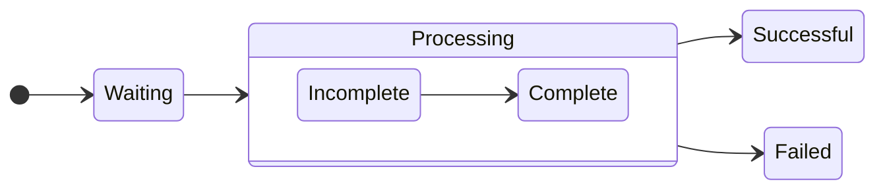

---

### ✅ Q1  
**Question:**  
Your company uses a Git repository in Azure Repos to manage the source code of a web application...  
**Requirements:**  
- Consolidate commit histories.  
- Merge the changes into a single commit.  
**Which merge strategy should you use in the branch policy?**

**A.** squash merge ✅  
**B.** fast-forward merge  
**C.** Git fetch  
**D.** no-fast-forward merge  

---

### ✅ Q2  
**Question:**  
You store source code in a Git repository in Azure Repos. You use a third-party CI tool to control builds. What will Azure DevOps use to authenticate with the tool?

**A.** Certificate authentication  
**B.** a personal access token (PAT) ✅  
**C.** a Shared Access Signature (SAS) token  
**D.** NTLM authentication  

---

### ✅ Q3  
**Question:**  
You configure Azure Application Insights and enable Smart Detection... You don’t receive a Smart Detection notification after a test failure. What prevents the notification?

**A.** You must enable the Snapshot Debugger  
**B.** Smart Detection uses the first 24 hours to establish the normal behavior of the web app ✅  
**C.** The web app is configured to use the shared plan tier  
**D.** You must restart the app  

---

### ✅ Q4  
**Question:**  
You need a solution for continuous inspection of the company’s code base to locate common code patterns that are problematic. What should you recommend?

**A.** Microsoft Visual Studio test plans  
**B.** Gradle wrapper scripts  
**C.** SonarCloud analysis ✅  
**D.** the JavaScript task runner  

---

### ✅ Q5 – Part 1  
**Question:**  
You use GitHub for source control. Documentation is stored as `.docx` and `.bmp`. You must optimize versioning and meet requirements like storing as plain text and simplifying reuse.

**Convert the `.docx` files to:**  
**A.** LaTex Typesetting (.tex)  
**B.** Markdown (.md) ✅  
**C.** Portable Document Format (.pdf)  

---

### ✅ Q5 – Part 2  
**Convert the flow charts to:**  
**A.** Mermaid diagrams ✅  
**B.** PNG  
**C.** TIFF  

---

### ✅ Q6  
**Question:**  
You need to send an SMS alert when Azure service scheduled maintenance is planned. Which two actions should you perform?

**A.** Enable Azure Security Center  
**B.** Create and configure Azure Monitor alert rule  
**C.** Create an Azure Service Health alert ✅  
**D.** Create and configure an action group ✅  

---

### ✅ Q7  
**Question:**  
You experience intermittent delays before a build pipeline starts in Azure Pipelines. What should you do?

**A.** Enable self-hosted build agents ✅  
**B.** Create a new agent pool  
**C.** Split the pipeline into multiple stages  
**D.** Purchase additional parallel job  

---

### ✅ Q8  
**Question:**  
You need an integration strategy for Java build that must use on-prem dependency management and store artifacts in Azure DevOps...  
**Solution:** Use Microsoft-hosted agent with Visual Studio 2019 and Java Tool Installer.  
**Does this meet the goal?**

**A.** Yes  
**B.** No ✅  

---

### ✅ Q9  
**Question:**  
You configure an Azure Application Insights availability test and create a logic app to handle email notifications. What trigger should invoke the logic app?

**A.** HTTPWebhook trigger  
**B.** HTTP trigger  
**C.** Request trigger ✅  
**D.** ApiConnection trigger  

---

Вот следующие вопросы с вариантами и правильными ответами:

---

### ✅ Q11  
**Question:**  
You use Azure Pipelines and notice increased cycle times. You suspect agent pool exhaustion.  
**What are two possible ways to verify this?**

**Options:**  
A. Query the PipelineRun/PipelineRuns endpoint  
B. **Query the TaskAgentPoolSizeSnapshots endpoint** ✅  
C. View the Pipeline duration report  
D. **View the pool consumption report at the organization level** ✅

**Correct Answers:** B and D

---

### ✅ Q12  
**Question:**  
Using Semantic Versioning (SemVer), which version part should be incremented?

| Change   | New functionality | Incompatibility | Version Part |
|----------|-------------------|------------------|--------------|
| Change1  | Yes               | Minor            | **Minor** ✅ |
| Change2  | Yes               | Significant      | **Major** ✅ |
| Change3  | No                | Minor            | **Patch** ✅ |

---

### ✅ Q13  
**Question:**  
You need to deploy a new version of an Azure web app with minimal downtime and allow rollback.  
**What should you use?**

**Options:**  
A. **a single web app and two deployment slots** ✅  
B. a single web app and two deployment pipelines  
C. two web apps and an Azure Standard Load Balancer  
D. two web apps and an Azure Traffic Manager instance

**Correct Answer:** A

---

### ✅ Q14  
**Question:**  
You need to minimize troubleshooting effort for intermittent test failures.  
**Solution:** Implement the Test Results Trend widget.  
**Does this meet the goal?**

**Options:**  
A. Yes  
B. **No** ✅

**Correct Answer:** B

---

### ✅ Q15  
**Question:**  
YAML strategy value for each app to minimize downtime?

| App  | Platform                      | Strategy   |
|------|-------------------------------|------------|
| App1 | Azure Virtual Machine         | **rolling** ✅  
| App2 | Azure Kubernetes Service (AKS)| **canary** ✅  

**Correct Answers:**  
App1: B. rolling  
App2: A. canary

---

---

### **Q16.**
Your company uses Azure DevOps for the build pipelines and deployment pipelines of Java-based projects. You need to recommend a strategy for managing technical debt.  
**Which two actions should you include in the recommendation?**

✅ **B. Configure pre-deployment approvals in the deployment pipeline.**  
✅ **C. Integrate Azure DevOps and SonarQube.**

---

### **Q17.**
You are developing a full Microsoft .NET Framework solution that includes unit tests. You need to configure SonarQube to perform a code quality validation of the C# code as part of the build pipelines.  
**Which four tasks should you perform in sequence?**

🟢 **Correct order:**  
1️⃣ **E. Prepare Analysis Configuration**  
2️⃣ **D. Visual Studio Build**  
3️⃣ **B. Visual Studio Test**  
4️⃣ **A. Run Code Analysis**

---

### **Q18.**
During a code review, you discover many quality issues. Many modules contain unused variables and empty catch blocks. You need to recommend a solution to improve the quality of the code.  
**What should you recommend?**

✅ **B. In a Maven build task, select Run PMD.**

---

### **Q19.**
You have a multi-tier application that has an Azure Web Apps front end and an Azure SQL Database back end. You need to recommend a solution to capture and store telemetry data.  
The solution must meet the following requirements:  
- Support using ad-hoc queries to identify baselines.  
- Trigger alerts when metrics in the baseline are exceeded.  
- Store application and database metrics in a central location.  
**What should you include in the recommendation?**

✅ **D. Azure Log Analytics**

---

### **Q20.**
You are automating the testing process for your company. You need to automate UI testing of a web application.  
**Which framework should you use?**

✅ **B. Selenium**

---
Готово! Вот оформленные вопросы и правильные ответы в точности с изображений:

---

✅ Q21  
**Question:**  
You have a build pipeline in Azure Pipelines that occasionally fails. You discover that a test measuring the response time of an API endpoint causes the failures. You need to prevent the build pipeline from failing due to the test. Which two actions should you perform?  
A. Set Flaky test detection to Off.  
B. **Clear Flaky tests included in test pass percentage.** ✅  
C. Enable Test Impact Analysis (TIA).  
D. **Manually mark the test as flaky.** ✅  
E. Enable test slicing.

---

✅ Q22  
**Question:**  
You manage a project in Azure DevOps. You need to prevent the configuration of the project from changing over time.  
**Solution:** Perform a Subscription Health scan when packages are created.  
A. Yes  
B. **No** ✅

---

✅ Q23  
**Question:**  
You use Azure Pipelines to manage build pipelines, GitHub to store source code, and Dependabot to manage dependencies. You have an app named App1. Dependabot detects a dependency in App1 that requires an update. What should you do first to apply the update?  
A. Create a pull request.  
B. **Approve the pull request.** ✅  
C. Create a branch.  
D. Perform a commit.

---

✅ Q24  
**Question:**  
You are designing a configuration management solution to support five apps hosted on Azure App Service. Each app is available in the following three environments: development, test, and production. You need to recommend a configuration management solution that meets the following requirements:  
- Supports feature flags  
- Tracks configuration changes from the past 30 days  
- Stores hierarchically structured configuration values  
- Controls access to the configurations by using role-based access control (RBAC) permissions  
- Stores shared values as key/value pairs that can be used by all the apps  
**Which Azure service should you recommend as the configuration management solution?**  
A. Azure Cosmos DB  
B. Azure App Service  
C. **Azure App Configuration** ✅  
D. Azure Key Vault

---

✅ Q25  
**Question:**  
You are designing a strategy to monitor the baseline metrics of Azure virtual machines that run Windows Server. You need to collect detailed data about the processes running in the guest operating system. Which two agents should you deploy?  
A. the Telegraf agent  
B. **the Azure Monitor agent** ✅  
C. the Azure Network Watcher Agent for Windows  
D. **the Dependency agent** ✅

---

✅ Q26  
**Question:**  
You need to find and isolate shared code. The shared code will be maintained in a series of packages. Which three actions should you perform in sequence?  
**Correct sequence of actions:**  
C. **Create a dependency graph for the application.** ✅  
A. **Group the related components.** ✅  
B. **Assign ownership to each component group.** ✅  
D. Identify the most common language used.  
E. Rewrite the components in the most common language.

---

✅ Q27  
**Question:**  
You use GitHub for source control. A file that contains sensitive data is committed accidentally to the Git repository of a project. You need to delete the file and its history from the repository. Which two tools can you use?  
A. **the git filter-branch command** ✅  
B. **BFG Repo-Cleaner** ✅  
C. the git rebase command  
D. GitHub Desktop

---

✅ Q28  
**Question:**  
You have a GitHub repository. You create a new repository in Azure DevOps. You need to recommend a procedure to clone the repository from GitHub to Azure DevOps. What should you recommend?  
A. Create a pull request.  
B. Create a webhook.  
C. Create a service connection for GitHub.  
D. **From Import a Git repository, click Import.** ✅  
E. Create a personal access token in Azure DevOps.

---

✅ Q29  
**Question:**  
You use a Git repository in Azure Repos to manage the source code of a web application. Developers commit changes directly to the default branch. You need to implement a change management procedure that meets the following requirements:  
- The default branch must be protected, and new changes must be built in the feature branches first.  
- Changes must be reviewed and approved by at least one release manager before each merge.  
- Changes must be brought into the default branch by using pull requests.  
**What should you configure in Azure Repos?**  
A. ~~Services in Project Settings~~  
B. ~~Deployment pools in Project Settings~~  
C. **branch policies of the default branch** ✅  
D. branch security of the default branch

---
✅ Q30  
**Question:**  
You plan to publish build artifacts by using an Azure pipeline. You need to create an .artifactignore file that meets the following requirements:  
- Includes all files in the build output folder and all subfolders  
- Excludes files that have the .dll extension  
**What should you include in the file?**  
A. ./\*\*  
  !*.dll  
B. **\*\*/\***  
  **!*.dll** ✅  
C. */\*\*  
  *.dll  
D. \*\*/\*  
  #*.dll

---

✅ Q31  
**Question:**  
You manage a project by using Azure Boards. You manage the project code by using GitHub. You have three work items that have IDs of 456, 457, and 458. You need to create a pull request that will be linked to all the work items. The solution must set the state of work item 456 to done.  
**What should you add to the commit message?**  
A. ~~Fixes #456, #457, #458~~  
B. **Fixes #AB456, #AB457, #AB458** ✅  
C. ~~#456, #457, #458~~  
  Completed #456  
D. ~~#AB456, #AB457, #AB458~~

---

✅ Q32  
**Question:**  
Your company deploys applications in Docker containers. You want to detect known exploits in the Docker images used to provision the Docker containers. You need to integrate image scanning into the application lifecycle. The solution must expose the exploits as early as possible during the application lifecycle.  
**What should you configure?**  
A. **a task executed in the continuous integration pipeline and a scheduled task that analyzes the image registry** ✅  
B. manual tasks performed during the planning phase and the deployment phase  
C. a task executed in the continuous deployment pipeline and a scheduled task against a running production container  
D. a task executed in the continuous integration pipeline and a scheduled task that analyzes the production container

---

✅ Q33  
**Question:**  
Your company has an Azure DevOps project. The source code for the project is stored in an on-premises repository and uses an on-premises build server. You plan to use Azure DevOps to control the build process on the build server by using a self-hosted agent. You need to implement the self-hosted agent. You download and install the agent on the build server.  
**Which two actions should you perform next?**  
D. **From DevOps, create a personal access token (PAT).** ✅  
E. **From the build server, run config.cmd.** ✅  
A. From Azure, create a shared access signature (SAS).  
B. From the build server, create a certificate, and then upload the certificate to Azure Storage.  
C. From the build server, create a certificate, and then upload the certificate to Azure Key Vault.

---
✅ Q34  
**Question:**  
You are designing an Azure DevOps strategy for your company's development team. You suspect that the team's productivity is low due to accumulated technical debt. You need to recommend a metric to assess the amount of the team's technical debt.  
**What should you recommend?**  
A. the number of code modules in an application  
B. the number of unit test failures  
C. the percentage of unit test failures  
D. **the percentage of overall time spent on rework** ✅

---

✅ Q35  
**Question:**  
You use GitHub for source control and project-related discussions. You receive a notification when an entry is made to any team discussion. You need to ensure that you receive email notifications only for discussions in which you commented or in which you are mentioned.  
**Which two Notification settings should you clear?**  
A. **Automatically watch teams** ✅  
B. Participating  
C. **Automatically watch repositories** ✅  
D. Watching

---

✅ Q36  
**Question:**  
You use Git for source control. You enable GitHub code scanning. You raise a pull request from a non-default branch. In the code scanning output, you receive the following error message: "Analysis not found." You need to ensure that the code scanning completes successfully for the pull request.  
**Which two actions should you perform?**  
B. **Add the name of the non-default branch to the on:push specification in the code scanning workflow.** ✅  
D. **Update the code in the pull request.** ✅  
A. Add the name of the default branch to the on:push specification in the code scanning workflow.  
C. Delete the pull request, and then raise the request again from the default branch.  
E. Add a new workflow for code scanning.

---

✅ Q37  
**Question:**  
You have a GitHub repository that contains multiple versions of an Azure Pipelines template. You plan to deploy multiple pipelines that will use a template stored in the repository. You need to ensure that you use a fixed version of the template.  
**What should you use to reference which version of the template repository to use?**  
A. the serial  
B. the SHA-based hashes  
C. the runner  
D. **the branch** ✅

---

✅ Q38  
**Question:**  
You have an Azure DevOps organization named Contoso and an Azure subscription. The subscription contains an Azure virtual machine scale set named VMSS1 that is configured for autoscaling. You have a project in Azure DevOps named Project1. Project1 is used to build a web app named App1 and deploy App1 to VMSS1. You need to ensure that an email alert is generated whenever VMSS1 scales in or out.  
**Solution:** From Azure DevOps, configure the Notifications settings for Project1  
A. Yes  
B. **No** ✅

---

✅ Q39  
**Question:**  
You are using the Dependency Tracker extension in a project in Azure DevOps. You generate a risk graph for the project. What should you use in the risk graph to identify the number of dependencies and the risk level of the project?  
**Number of Dependencies:** **Link Width** ✅  
**Risk Level:** **Link Color** ✅

---

✅ Q40  
**Question:**  
Your company uses GitHub for source control. The company has a team that performs code reviews. You need to automate the assignment of the code reviews. The solution must meet the following requirements:  
- Prioritize the assignment of code reviews to team members who have the fewest outstanding assignments.  
- Ensure that each team member performs an equal number of code reviews in any 30-day period.  
- Prevent the assignment of code reviews to the team leader.  
**Which two actions should you perform?**  
C. **Select Never assign certain team members.** ✅  
E. **Set Routing algorithm to Load balance.** ✅  
A. Clear Never assign certain team members.  
B. Select If assigning team members, don’t notify the entire team.  
D. Set Routing algorithm to Round robin.

---

✅ Q41  
**Question:**  
A team is planning on using Azure Automation for a set of Azure Virtual Machines. They need to use Azure state configuration to manage the state of the virtual machines. Which of the following actions would need to be performed to ensure the state of the virtual machines are managed effectively?  
**Choose 5 answers from the options given below**

A. **Onboard the set of virtual machines onto Azure Automation state configuration** ✅  
B. **Check the status of the node** ✅  
C. **Assign the node configuration** ✅  
D. Create a node management group  
E. **Compile the configuration** ✅  
F. **Upload a configuration** ✅

---
✅ Q1  
**Question:**  
You are configuring project metrics for dashboards in Azure DevOps.  
You need to configure a chart widget that measures the elapsed time to complete work items once they become active.  
Which of the following is the widget you should use?

A. Cumulative Flow Diagram  
B. Burnup  
C. **Cycle time** ✅  
D. Burndown

---
✅ Q2  
**Question:**  
You need to consider the underlined segment to establish whether it is accurate.  
_The Burnup widget measures the elapsed time from creation of work items to their completion._

Select `No adjustment required` if the underlined segment is accurate. If the underlined segment is inaccurate, select the accurate option.

A. No adjustment required  
B. **Lead time** ✅  
C. Test results trend  
D. Burndown

✅ Q3  
**Question:**  
You are making use of Azure DevOps to manage build pipelines, and also deploy pipelines.  
The development team is quite large, and is regularly added to.  
You have been informed that the management of users and licenses must be automated when it can be.  
Which of the following is a task that can't be automated?

A. Group membership changes  
B. License assignment  
C. Assigning entitlements  
D. **License procurement** ✅

---

✅ Q4  
**Question:**  
You have been tasked with strengthening the security of your team's development process.  
You need to suggest a security tool type for the Continuous Integration (CI) phase of the development process.  
Which of the following is the option you would suggest?

A. Penetration testing  
B. **Static code analysis** ✅  
C. Threat modeling  
D. Dynamic code analysis

---

✅ Q5  
**Question:**  
Your company is currently making use of Team Foundation Server 2013 (TFS 2013), but intend to migrate to Azure DevOps.  
You have been tasked with supplying a migration approach that allows for the preservation of Team Foundation Version Control changesets dates, as well as the changes dates of work item revisions.  
The approach should also allow for the migration of all TFS artifacts, while keeping migration effort to a minimum.  
You have suggested upgrading TFS to the most recent RTW release.  
Which of the following should also be suggested?

A. Installing the TFS kava SDK  
B. **Using the TFS Database Import Service to perform the upgrade.** ✅  
C. Upgrading PowerShell Core to the latest version.  
D. Using the TFS Integration Platform to perform the upgrade.

✅ Q6  
**Question:**  
You have an on-premises Bitbucket Server with a firewall configured to block inbound Internet traffic. The server is used for Git-based source control.  
You intend to manage the build and release processes using Azure DevOps. This plan requires you to integrate Azure DevOps and Bitbucket.  
Which of the following will allow for this integration?  
Answer by dragging the correct options from the list to the answer area.

**Options:**  
- A self-hosted agent  
- A Microsoft-hosted agent  
- An External Git service connection  
- Service hooks  

**Answer:**  
- ✅ A self-hosted agent  
- ✅ An External Git service connection


  ✅ Q7  
**Question:**  
You are currently developing a project for a client that will be managing work items via Azure DevOps.  
You want to make sure that the work item process you use for the client allows for requirements, change requests, risks, and reviews to be tracked.  
Which of the following is the option you would choose?

A. Basic  
B. Agile  
C. Scrum  
D. **CMMI** ✅

---

✅ Q8  
**Question:**  
*Note: The question is included in a number of questions that depicts the identical set-up. However, every question has a distinctive result. Establish if the solution satisfies the requirements.*  
You run the `Register-AzureRmAutomationDscNode` command in your company's environment.  
You need to make sure that your company's test servers remain correctly configured, regardless of configuration drift.  
**Solution:** You set the `-ConfigurationMode` parameter to `ApplyOnly`.  
Does the solution meet the goal?

A. Yes  
B. **No** ✅

---

✅ Q9  
**Question:**  
You run the `Register-AzureRmAutomationDscNode` command in your company's environment.  
You need to make sure that your company's test servers remain correctly configured, regardless of configuration drift.  
**Solution:** You set the `-ConfigurationMode` parameter to `ApplyAndMonitor`.  
Does the solution meet the goal?

A. Yes 
B. ** No**  ✅

---

✅ Q10  
**Question:**  
You run the `Register-AzureRmAutomationDscNode` command in your company's environment.  
You need to make sure that your company's test servers remain correctly configured, regardless of configuration drift.  
**Solution:** You set the `-ConfigurationMode` parameter to `ApplyAndAutocorrect`.  
Does the solution meet the goal?

A. **Yes** ✅  
B. No

✅ Q11  
**Question:**  
You need to consider the underlined segment to establish whether it is accurate.  
*To compile an Internet Information Services (IIS) web application that runs docker, you should use a Default build agent pool.*  
Select `No adjustment required` if the underlined segment is accurate. If the underlined segment is inaccurate, select the accurate option.

A. No adjustment required  
B. **Hosted Windows Container** ✅  
C. Hosted  
D. Hosted macOS

---

✅ Q12  
**Question:**  
Your company has an Azure DevOps environment that can only be accessed by Azure Active Directory users.  
You are instructed to make sure that the Azure DevOps environment can only be accessed from devices connected to the company's on-premises network.  
Which of the following actions should you take?

A. Assign the devices to a security group.  
B. Create a GPO.  
C. Configure Security in Project Settings from Azure DevOps.  
D. **Configure conditional access in Azure Active Directory.** ✅

---

✅ Q13  
**Question:**  
You are making use of Azure DevOps to configure Azure Pipelines for a project, named PROJ-01.  
You are preparing to use a version control system that allows for source code to be stored on a managed Windows server located on the company network.  
Which of the following is the version control system you should use?

A. **Github Enterprise** ✅  
B. Bitbucket cloud  
C. Github Professional  
D. Git in Azure Repos

---

✅ Q14  
**Question:**  
You need to consider the underlined segment to establish whether it is accurate.  
*When moving to Azure DevOps, JIRA must be replaced with the build pipelines Azure DevOps service.*  
Select `No adjustment required` if the underlined segment is accurate. If the underlined segment is inaccurate, select the accurate option.

A. No adjustment required  
B. repos  
C. release pipelines  
D. **boards** ✅

---

✅ Q15  
**Question:**  
You scan a Node.js application using WhiteSource Bolt.  
The scan finds numerous libraries with invalid licenses, but are only used during development.  
You have to make sure that only production dependencies are scanned by WhiteSource Bolt.  
Which of the following is a command you should run?

A. npm edit  
B. npm publish  
C. **npm install** ✅  
D. npm update

---

✅ Q16  
**Question:**  
You are currently defining a release strategy for an app, named APP-01.  
The strategy should allow you to keep the time it takes to deploy new releases of the app to a minimum. The strategy should also allow you to roll back in the shortest time required.  
Which of the following is the release strategy you should use?

A. **Red/Black deployment** ✅  
B. Rolling deployment  
C. “Big Bang” deployment  
D. Canary deployment

---

✅ Q17  
**Question:**  
Your company hosts a web application in Azure, and makes use of Azure Pipelines for managing the build and release of the application.  
When stakeholders report that system performance has been adversely affected by the most recent releases, you configure alerts in Azure Monitor.  
You are informed that new releases must satisfy specified performance baseline conditions in the staging environment before they can be deployed to production.  
You need to make sure that releases not satisfying the performance baseline are prevented from being deployed.  
Which of the following actions should you take?

A. You should make use of a branch control check.  
B. You should make use of an alert trigger.  
C. **You should make use of a gate.** ✅  
D. You should make use of an approval check.

---

✅ Q18  
**Question:**  
You need to consider the underlined segment to establish whether it is accurate.  
*To deploy an application to a number of Azure virtual machines, you should create a universal group.*  
Select `No adjustment required` if the underlined segment is accurate. If the underlined segment is inaccurate, select the accurate option.

A. No adjustment required  
B. security  
C. **deployment** ✅  
D. resource

✅ Q19  
**Question:**  
You are preparing to deploy an Azure resource group via Terraform.  
To achieve your goal, you have to install the necessary frameworks.  
Which of the following are the frameworks you should use?  
Answer by dragging the correct options from the list to the answer area.

**Options:**  
- Yeoman  
- Vault  
- Terratest  
- Tiller  

**Answer:**  
- ✅ Yeoman  
- ✅ Terratest

✅ Q20  
**Question:**  
You intend to make use of Azure Artifacts to share packages that you wrote, tested, validated, and deployed.  
You want to use a solitary feed to release several builds of each package. You have to make sure that the release of packages that are in development is restricted.  
Which of the following actions should you take?

A. You should make use of static code analysis.  
B. **You should make use of views.** ✅  
C. You should make use of dynamic code analysis.  
D. You should make use of upstream sources.

✅ Q21  
**Question:**  
You need to consider the underlined segment to establish whether it is accurate.  
*To find when common open source libraries are added to the code base, you should add Jenkins to the build pipeline.*  
Select `No adjustment required` if the underlined segment is accurate. If the underlined segment is inaccurate, select the accurate option.

A. No adjustment required  
B. SourceGear Vault  
C. **WhiteSource** ✅  
D. OWASP ZAP  

---

✅ Q22  
**Question:**  
Your company has an Azure DevOps project, which includes a build pipeline that makes use of roughly fifty open source libraries.  
You have been tasked with making sure that you are able to scan the project for common security weaknesses in the open source libraries.  
Which of the following actions should you take?

A. **You should create a build task and use the WhiteSource Bolt service.** ✅  
B. You should create a deployment task and use the WhiteSource Bolt service.  
C. You should create a build task and use the Chef service.  
D. You should create a deployment task and use the Chef service.  

---

✅ Q23  
**Question:**  
You need to consider the underlined segment to establish whether it is accurate.  
*Black Duck can be used to make sure that all the open source libraries conform to your company's licensing criteria.*  
Select `No adjustment required` if the underlined segment is accurate. If the underlined segment is inaccurate, select the accurate option.

A. **No adjustment required.** ✅  
B. Maven  
C. Bamboo  
D. CMAKE  

---

✅ Q24  
**Question:**  
You have created an Azure DevOps project for a new application that will be deployed to a number of Windows Server 2016 Azure virtual machines.  
You are preparing a deployment solution that allows for the virtual machines to maintain a uniform configuration, and also keep administrative effort with regards to configuring the virtual machines to a minimum.  
Which of the following should be part of your solution? (Choose two.)

A. ✅ **Azure Resource Manager templates**  
B. ✅ **The PowerShell Desired State Configuration (DSC) extension for Windows**  
C. Azure pipeline deployment groups  
D. The Custom Script Extension for Windows  
E. Azure pipeline stage templates  

---

✅ Q25  
**Question:**  
Your company has an application that contains a number of Azure App Service web apps and Azure functions.  
You would like to view recommendations with regards to the security of the web apps and functions. You plan to navigate to Compute and Apps to achieve your goal.  
Which of the following should you access to make use of Compute and Apps?

A. Azure Log Analytics  
B. Azure Event Hubs  
C. Azure Advisor  
D. **Azure Security Center** ✅  

---

✅ Q26  
**Question:**  
You need to consider the underlined segment to establish whether it is accurate.  
*Your company has a multi-tier application that has its front end hosted in Azure App Service.  
To pinpoint the average load times of the application pages, you should make use of Azure Event Hubs.*  
Select `No adjustment required` if the underlined segment is accurate. If the underlined segment is inaccurate, select the accurate option.

A. No adjustment required  
B. **Azure Application Insights** ✅  
C. Azure Log Analytics  
D. Azure Advisor  

---

✅ Q27  
**Question:**  
Your company makes use of Azure SQL Database Intelligent Insights and Azure Application Insights for monitoring purposes.  
You have been tasked with analyzing the monitoring using ad-hoc queries. You need to utilize the correct query language.  
**Solution:** You use the Contextual Query Language (CQL).  
Does the solution meet the goal?

A. Yes  
B. **No** ✅  

---

✅ Q28  
**Question:**  
Your company makes use of Azure SQL Database Intelligent Insights and Azure Application Insights for monitoring purposes.  
You have been tasked with analyzing the monitoring using ad-hoc queries. You need to utilize the correct query language.  
**Solution:** You use the Transact-SQL.  
Does the solution meet the goal?

A. Yes  
B. **No** ✅  

---

✅ Q29  
**Question:**  
Your company makes use of Azure SQL Database Intelligent Insights and Azure Application Insights for monitoring purposes.  
You have been tasked with analyzing the monitoring using ad-hoc queries. You need to utilize the correct query language.  
**Solution:** You use Azure Log Analytics.  
Does the solution meet the goal?

A. Yes  
B. **No** ✅

✅ Q30  
**Question:**  
You have recently created a web application for your company.  
You have been tasked with making sure that a summary of the exceptions that transpire in the application is automatically sent to Microsoft Teams on a daily basis.  
Which of the following Azure services should you use?  
Answer by dragging the correct options from the list to the answer area.

**Options:**  
- Azure DevOps Project  
- Azure Logic Apps  
- Azure Pipelines  
- Azure Application Insights  

**Answer:**  
- ✅ Azure Logic Apps  
- ✅ Azure Application Insights

✅ Q31  
**Question:**  
You are in the process of building a mobile app aimed at Android and iOS devices.  
All work items and release cycles are managed via Azure DevOps.  
You want to make sure that crash reports for issue analysis are collected, and that beta releases are distributed to your testers.  
Also, you want to ensure that user feedback on the functionality of new apps is received.  
Which of the following must be part of your solution?

A. **The Microsoft Test & Feedback extension** ✅  
B. OWASP ZAP  
C. TFS Integration Platform  
D. Code Style

✅ Q32
Question:
You need to recommend project metrics for dashboards in Azure DevOps.
Which chart widgets should you recommend for each metric? To answer, drag the appropriate chart widgets to the correct metrics. Each chart widget may be used once, more than once, or not at all.

Chart Widgets:

Burndown

Cycle Time

Lead Time

Velocity

Metrics and Answers:

The elapsed time from the creation of work items to their completion: Lead Time ✅

The elapsed time to complete work items once they are active: Cycle Time ✅

The remaining work: Burndown ✅

Explanation:

Lead Time measures the total time from creation to completion.

Cycle Time starts when work begins on the item and ends when it is complete.

Burndown focuses on tracking remaining work over time.


Конечно, вот полный вопрос и ответ в нужном формате:

---

✅ **Q33**  
**Question:**  
You plan to create alerts that will be triggered based on the page load performance of a home page.  
You have the Application Insights log query shown in the exhibit.  
Use the drop-down menus to select the answer choice that completes each statement based on the information presented in the graphic.  

**Statement 1:**  
To create an alert based on the page load experience of most users, the alerting level must be based on:  
**A. percentile_duration_50**  
**B. percentile_duration_90**  
**C. percentile_duration_95** ✅  
**D. threshold**

**Statement 2:**  
To only create an alert when authentication error occurs on the server, the query must be filtered on:  
**A. item Type**  
**B. resultCode**  
**C. source**  
**D. success** ✅

**Explanation:**  
- `percentile_duration_95` is used to alert based on the experience of the slowest 5% of users, which helps catch outliers in performance.  
- `success == false` is the correct filter to detect failed requests like authentication errors.

**References:**  
- [Alerts Based on Analytics Query](https://devblogs.microsoft.com/premier-developer/alerts-based-on-analytics-query-using-custom-log-search/)  
- [Kusto query for App Insights](https://learn.microsoft.com/en-us/azure/data-explorer/kusto/query/)

✅ **Q34**  
**Question:**  
You manage an Azure web app that supports an e-commerce website.  
You need to increase the logging level when the web app exceeds normal usage patterns. The solution must minimize administrative overhead.  
Which two resources should you include in the solution?  

**Each correct selection is worth one point.**

**Options:**  
A. **An Azure Automation runbook** ✅  
B. **An Azure Monitor alert that has a dynamic threshold** ✅  
C. An Azure Monitor alert that has a static threshold  
D. The Azure Monitor autoscale settings  
E. An Azure Monitor alert that uses an action group that has an email action  

**Explanation:**  
- **B. Dynamic threshold alerts** in Azure Monitor automatically adjust based on historical data and patterns, reducing manual tuning — perfect for detecting abnormal usage patterns with minimal overhead.  
- **A. Azure Automation runbook** allows programmatic control, such as increasing logging levels, which can be triggered by the alert.  

**References:**  
- [Dynamic Threshold Alerts](https://learn.microsoft.com/en-us/azure/azure-monitor/alerts/dynamic-thresholds)  
- [Azure Automation Runbooks](https://learn.microsoft.com/en-us/azure/automation/automation-runbook-types)

  ✅ **Q35**  
**Question:**  
You have an Azure Kubernetes Service (AKS) pod.  
You need to configure a probe to perform the following actions:  
- Confirm that the pod is responding to service requests.  
- Check the status of the pod four times a minute.  
- Initiate a shutdown if the pod is unresponsive.  

How should you complete the YAML configuration file? To answer, select the appropriate options in the answer area.  

**Answer Area:**  
**Box 1:** `readinessProbe:` ✅  
👉 This probe checks if the pod is ready to serve traffic. It confirms whether the application is available for requests.  

**Box 2:** `periodSeconds: 15` ✅  
👉 This means the probe will check the pod's readiness every 15 seconds, which is four times a minute (60 / 15 = 4).  

**Explanation:**  
- `readinessProbe` is used to determine when a container is ready to start accepting traffic.  
- `periodSeconds` defines how frequently (in seconds) to perform the probe.  
- Shutdown or restart logic can be implemented by Kubernetes based on probe failure.

**Reference:**  
[Readiness Probes - Azure Docs](https://learn.microsoft.com/en-us/azure/container-instances/container-instances-readiness-probe)

✅ **Q36**  
**Question:**  
You have a Microsoft ASP.NET Core web app in Azure that is accessed worldwide.  
You need to run a URL ping test once every five minutes and create an alert when the web app is unavailable from specific Azure regions. The solution must minimize development time.  
What should you do?

A. Create an Azure Monitor Availability metric and alert.  
B. **Create an Azure Application Insights availability test and alert.** ✅  
C. Write an Azure function and deploy the function to the specific regions.  
D. Create an Azure Service Health alert for the specific regions.

**Explanation:**  
Application Insights provides **availability tests** (including multi-region ping tests) with built-in support for **custom alert rules** and minimal configuration effort — ideal for global monitoring.

---

✅ **Q37**  
**Question:**  
You have a multi-tier application. The front end of the application is hosted in Azure App Service.  
You need to identify the **average load times** of the application pages.  
What should you use?

A. **Azure Application Insights** ✅  
B. The activity log of the App Service  
C. The diagnostics logs of the App Service  
D. Azure Advisor

**Explanation:**  
**Azure Application Insights** captures client-side metrics such as **page load times**, performance, dependencies, and exceptions — perfect for identifying performance bottlenecks in your frontend.

✅ **Q38**  
**Question:**  
You need to create an instance of Azure Application Insights named `az400-123456789-main` and configure the instance to receive telemetry data from an Azure web app named `az400-123456789-main`.  
To complete this task, sign in to the Microsoft Azure portal.

**Correct Answer:**  
**Follow the steps below to complete the simulation:**

---

### 🔹 **Step 1: Create Azure Application Insights instance**
1. Sign in to the [Azure Portal](https://portal.azure.com).
2. Click on **Create a resource**.
3. Navigate to **Developer Tools** → Select **Application Insights**.
4. In the **Create Application Insights** pane:
   - **Name:** `az400-123456789-main`
   - **Resource group:** Select existing or create new.
   - **Region:** Choose the same region as your web app.
   - **Resource Mode:** Classic
5. Click **Review + Create**, then **Create**.

---

### 🔹 **Step 2: Configure telemetry in Visual Studio**
1. Open the **Web App project** (e.g., ASP.NET Core) in **Visual Studio**.
2. In **Solution Explorer**, right-click the **project name** (e.g., `WebApplication1`), then go to:  
   `Add` → `Application Insights Telemetry`
3. In the setup wizard:
   - Click **Get Started**.
   - Select your **Azure account** and **subscription**.
   - Choose the **existing Application Insights resource**: `az400-123456789-main`.
4. Click **Register** to link the app to App Insights.

---

**Result:**  
- Your app will now send telemetry data (requests, dependencies, exceptions, etc.) to Azure Application Insights.  
- You can verify data flow by opening the **Application Insights resource** in Azure and checking for metrics and logs.

**Reference:**  
[Quickstart: ASP.NET Core + Application Insights](https://learn.microsoft.com/en-us/azure/azure-monitor/app/asp-net-core)

✅ Q39
Question:
Your company uses ServiceNow for incident management.
You develop an application that runs on Azure.
The company needs to generate a ticket in ServiceNow when the application fails to authenticate.
Which Azure Log Analytics solution should you use?

A. Application Insights Connector
B. Automation & Control
C. **IT Service Management Connector (ITSM)** ✅  
D. Insight & Analytics

✅ **Q1**  
**Question:**  
Your company is building a new web application.  
You plan to collect feedback from pilot users on the features being delivered.  
All the pilot users have a corporate computer that has Google Chrome and the Microsoft Test & Feedback extension installed. The pilot users will test the application by using Chrome.  
You need to identify which access levels are required to ensure that developers can request and gather feedback from the pilot users. The solution must use the principle of least privilege.  
Which access levels in Azure DevOps should you identify?

**Answer:**  
**Developers:** Basic ✅  
**Pilot users:** Stakeholder ✅

✅ Q1  
**Question:**  
Your company has an Azure DevOps environment that can only be accessed by Azure Active Directory users.  
You are instructed to make sure that the Azure DevOps environment can only be accessed from devices connected to the company’s on-premises network.  
Which of the following actions should you take?

A. Assign the devices to a security group.  
B. Create a GPO.  
C. Configure Security in Project Settings from Azure DevOps.  
D. Configure conditional access in Azure Active Directory. ✅

✅ Q2  
**English (Original):**  
You are making use of Azure DevOps to configure Azure Pipelines for project, named PROJ-01.  
You are preparing to use a version control system that allows for source code to be stored on a managed Windows server located on the company network.  
Which of the following is the version control system you should use?

A. Github Enterprise ✅  
B. Bitbucket cloud  
C. Github Professional  
D. Git in Azure Repos  

---

**Русский (Перевод):**  
Вы используете Azure DevOps для настройки Azure Pipelines для проекта с именем PROJ-01.  
Вы готовитесь использовать систему управления версиями, которая позволяет хранить исходный код на управляемом сервере Windows, находящемся в сети компании.  
Какую из следующих систем управления версиями следует использовать?

A. Github Enterprise ✅  
B. Bitbucket cloud  
C. Github Professional  
D. Git в Azure Repos

✅ Q3  
**English (Original):**  
Your company hosts a web application in Azure, and makes use of Azure Pipelines for managing the build and release of the application.  
When stakeholders report that system performance has been adversely affected by the most recent releases, you configure alerts in Azure Monitor.  
You are informed that new releases must satisfy specified performance baseline conditions in the staging environment before they can be deployed to production.  
You need to make sure that releases not satisfying the performance baseline are prevented from being deployed.  
Which of the following actions should you take?

A. You should make use of a branch control check.  
B. You should make use of an alert trigger.  
C. You should make use of a gate. ✅  
D. You should make use of an approval check.

---

**Русский (Перевод):**  
Ваша компания размещает веб-приложение в Azure и использует Azure Pipelines для управления сборкой и релизом приложения.  
После того как заинтересованные стороны сообщили о снижении производительности системы из-за последних релизов, вы настроили оповещения в Azure Monitor.  
Вас проинформировали, что новые релизы должны соответствовать определённым условиям базовой производительности в staging-среде до развертывания в production.  
Вам нужно гарантировать, что релизы, не соответствующие этим условиям, не будут развернуты.  
Какое из следующих действий следует предпринять?

A. Использовать проверку управления веткой.  
B. Использовать триггер оповещения.  
C. Использовать gate (входной контроль). ✅  
D. Использовать проверку утверждения (approval check).


✅ Q4  
**English (Original):**  
You need to consider the underlined segment to establish whether it is accurate.  
To deploy an application to a number of Azure virtual machines, you should create a **universal** group.  
Select `No adjustment required` if the underlined segment is accurate. If the underlined segment is inaccurate, select the accurate option.

A. No adjustment required  
B. security  
C. deployment ✅  
D. resource  

---

**Русский (Перевод):**  
Вам нужно проанализировать подчёркнутый фрагмент, чтобы определить, является ли он корректным.  
Для развертывания приложения на нескольких виртуальных машинах Azure следует создать **универсальную** группу.  
Выберите `Корректировка не требуется`, если подчёркнутый фрагмент верен. Если он неверен — выберите правильный вариант.

A. Корректировка не требуется  
B. группа безопасности  
C. группа развертывания ✅  
D. группа ресурсов

✅ Q5  
**English (Original):**  
You need to consider the underlined segment to establish whether it is accurate.  
To find when common open source libraries are added to the code base, you should add **Jenkins** to the build pipeline.  
Select `No adjustment required` if the underlined segment is accurate. If the underlined segment is inaccurate, select the accurate option.

A. No adjustment required  
B. SourceGear Vault  
C. WhiteSource ✅  
D. OWASP ZAP  

---

**Русский (Перевод):**  
Вам нужно проанализировать подчёркнутый фрагмент, чтобы определить, является ли он корректным.  
Чтобы отслеживать, когда в код добавляются общие open source библиотеки, следует добавить **Jenkins** в сборочный конвейер.  
Выберите `Корректировка не требуется`, если подчёркнутый фрагмент верен. Если он неверен — выберите правильный вариант.

A. Корректировка не требуется  
B. SourceGear Vault  
C. WhiteSource ✅  
D. OWASP ZAP

✅ Q6  
**English (Original):**  
You need to consider the underlined segment to establish whether it is accurate.  
Black Duck can be used to make sure that all the **open source libraries** conform to your company's licensing criteria.  
Select `No adjustment required` if the underlined segment is accurate. If the underlined segment is inaccurate, select the accurate option.

A. No adjustment required ✅  
B. Maven  
C. Bamboo  
D. CMAKE  

---

**Русский (Перевод):**  
Вам нужно проанализировать подчёркнутый фрагмент, чтобы определить, является ли он корректным.  
Black Duck можно использовать, чтобы убедиться, что все **open source библиотеки** соответствуют лицензионной политике вашей компании.  
Выберите `Корректировка не требуется`, если подчёркнутый фрагмент верен. Если он неверен — выберите правильный вариант.

A. Корректировка не требуется ✅  
B. Maven  
C. Bamboo  
D. CMAKE

✅ Q7  
**English (Original):**  
Your company has an application that contains a number of Azure App Service web apps and Azure functions.  
You would like to view recommendations with regards to the security of the web apps and functions. You plan to navigate to Compute and Apps to achieve your goal.  
Which of the following should you access to make use of Compute and Apps?

A. Azure Log Analytics  
B. Azure Event Hubs  
C. Azure Advisor  
D. Azure Security Center ✅  

---

**Русский (Перевод):**  
В вашей компании есть приложение, содержащее несколько веб-приложений Azure App Service и Azure Functions.  
Вы хотите просмотреть рекомендации по безопасности этих веб-приложений и функций. Для этого вы планируете перейти в раздел Compute and Apps.  
Что из следующего следует использовать для доступа к Compute and Apps?

A. Azure Log Analytics  
B. Azure Event Hubs  
C. Azure Advisor  
D. Azure Security Center ✅

✅ Q8  
**English (Original):**  
You need to consider the underlined segment to establish whether it is accurate.  
Your company has a multi-tier application that has its front end hosted in Azure App Service.  
To pinpoint the average load times of the application pages, you should make use of **Azure Event Hubs**.  
Select `No adjustment required` if the underlined segment is accurate. If the underlined segment is inaccurate, select the accurate option.

A. No adjustment required  
B. Azure Application Insights ✅  
C. Azure Log Analytics  
D. Azure Advisor  

---

**Русский (Перевод):**  
Вам нужно проанализировать подчёркнутый фрагмент, чтобы определить, является ли он корректным.  
У вашей компании многоуровневое приложение, фронтенд которого размещён в Azure App Service.  
Чтобы определить среднее время загрузки страниц приложения, вы должны использовать **Azure Event Hubs**.  
Выберите `Корректировка не требуется`, если подчёркнутый фрагмент верен. Если он неверен — выберите правильный вариант.

A. Корректировка не требуется  
B. Azure Application Insights ✅  
C. Azure Log Analytics  
D. Azure Advisor

✅ Q9  
**English (Original):**  
You are in the process of building a mobile app aimed at Android and iOS devices.  
All work items and release cycles are managed via Azure DevOps.  
You want to make sure that crash reports for issue analysis is collected, and that beta releases are distributed to your testers.  
Also, you want to ensure that user feedback on the functionality of new apps is received.  
Which of the following must be part of your solution?

A. The Microsoft Test & Feedback extension ✅  
B. OWASP ZAP  
C. TFS Integration Platform  
D. Code Style  

---

**Русский (Перевод):**  
Вы разрабатываете мобильное приложение для устройств на Android и iOS.  
Все рабочие элементы и релизные циклы управляются через Azure DevOps.  
Вы хотите обеспечить сбор отчётов об авариях для анализа проблем и распространение бета-релизов среди тестировщиков.  
Также вы хотите получать обратную связь от пользователей о функциональности новых приложений.  
Что из следующего должно быть частью вашего решения?

A. Расширение Microsoft Test & Feedback ✅  
B. OWASP ZAP  
C. Платформа интеграции TFS  
D. Стиль кода

✅ Q10  
**English (Original):**  
You need to recommend project metrics for dashboards in Azure DevOps.  
Which chart widgets should you recommend for each metric? To answer, drag the appropriate chart widgets to the correct metrics. Each chart widget may be used once, more than once, or not at all.  
NOTE: Each correct selection is worth one point.

**Chart Widgets → Answer Area:**  
- **Lead Time** → The elapsed time from the creation of work items to their completion ✅  
- **Cycle Time** → The elapsed time to complete work items once they are active ✅  
- **Burndown** → The remaining work ✅  

---

**Русский (Перевод):**  
Вам нужно порекомендовать метрики проекта для отображения на дашбордах в Azure DevOps.  
Какие виджеты графиков вы бы рекомендовали для каждой метрики? Чтобы ответить, перетащите соответствующие виджеты графиков к нужным метрикам. Каждый виджет может использоваться один или несколько раз, либо не использоваться вовсе.  
**Примечание:** каждый правильный выбор даёт 1 балл.

**Виджеты → Метрики:**  
- **Lead Time** → Время от создания рабочего элемента до его завершения ✅  
- **Cycle Time** → Время выполнения рабочего элемента после начала работы над ним ✅  
- **Burndown** → Оставшийся объём работы ✅

✅ Q11  
**English (Original):**  
You manage an Azure web app that supports an e-commerce website.  
You need to increase the logging level when the web app exceeds normal usage patterns. The solution must minimize administrative overhead.  
Which two resources should you include in the solution? Each correct answer presents part of the solution.  
**NOTE:** Each correct selection is worth one point.

A. an Azure Automation runbook ✅  
B. an Azure Monitor alert that has a dynamic threshold ✅  
C. an Azure Monitor alert that has a static threshold  
D. the Azure Monitor autoscale settings  
E. an Azure Monitor alert that uses an action group that has an email action  

---

**Русский (Перевод):**  
Вы управляете веб-приложением Azure, которое обслуживает сайт электронной коммерции.  
Необходимо повысить уровень логирования, когда приложение превышает обычные шаблоны использования. Решение должно минимизировать административные затраты.  
Какие два ресурса следует включить в решение? Каждый правильный ответ даёт часть решения.  
**Примечание:** за каждый правильный выбор начисляется один балл.

A. Runbook Azure Automation ✅  
B. Оповещение Azure Monitor с динамическим порогом ✅  
C. Оповещение Azure Monitor со статическим порогом  
D. Настройки автомасштабирования Azure Monitor  
E. Оповещение Azure Monitor, использующее action group с email-действием

✅ Q12  
**English (Original):**  
You have a Microsoft ASP.NET Core web app in Azure that is accessed worldwide.  
You need to run a URL ping test once every five minutes and create an alert when the web app is unavailable from specific Azure regions. The solution must minimize development time.  
What should you do?

A. Create an Azure Monitor Availability metric and alert.  
B. Create an Azure Application Insights availability test and alert. ✅  
C. Write an Azure function and deploy the function to the specific regions.  
D. Create an Azure Service Health alert for the specific regions.  

---

**Русский (Перевод):**  
У вас есть веб-приложение Microsoft ASP.NET Core в Azure, доступное по всему миру.  
Вам необходимо запускать тест ping URL каждые пять минут и создавать оповещение, когда веб-приложение недоступно из определённых регионов Azure. Решение должно минимизировать время на разработку.  
Что следует сделать?

A. Создать метрику и оповещение о доступности в Azure Monitor.  
B. Создать тест доступности и оповещение в Azure Application Insights. ✅  
C. Написать функцию Azure и развернуть её в нужных регионах.  
D. Создать оповещение Azure Service Health для указанных регионов.


✅ Q13  
**English (Original):**  
You have a multi-tier application. The front end of the application is hosted in Azure App Service.  
You need to identify the average load times of the application pages.  
What should you use?

A. Azure Application Insights ✅  
B. the activity log of the App Service  
C. the diagnostics logs of the App Service  
D. Azure Advisor  

---

**Русский (Перевод):**  
У вас многоуровневое приложение. Фронтенд приложения размещён в Azure App Service.  
Вам нужно определить среднее время загрузки страниц приложения.  
Что следует использовать?

A. Azure Application Insights ✅  
B. Журнал активности App Service  
C. Диагностические журналы App Service  
D. Azure Advisor

✅ Q14  
**English (Original):**  
Your company uses ServiceNow for incident management.  
You develop an application that runs on Azure.  
The company needs to generate a ticket in ServiceNow when the application fails to authenticate.  
Which Azure Log Analytics solution should you use?

A. Application Insights Connector  
B. Automation & Control  
C. IT Service Management Connector (ITSM) ✅  
D. Insight & Analytics  

---

**Русский (Перевод):**  
Ваша компания использует ServiceNow для управления инцидентами.  
Вы разрабатываете приложение, которое работает в Azure.  
Необходимо создать тикет в ServiceNow, когда приложению не удаётся пройти аутентификацию.  
Какое решение Azure Log Analytics следует использовать?

A. Коннектор Application Insights  
B. Automation & Control  
C. Коннектор управления ИТ-услугами (ITSM) ✅  
D. Insight & Analytics

✅ Q15  
**English (Original):**  
Your company is building a new web application.  
You plan to collect feedback from pilot users on the features being delivered.  
All the pilot users have a corporate computer that has Google Chrome and the Microsoft Test & Feedback extension installed. The pilot users will test the application by using Chrome.  
You need to identify which access levels are required to ensure that developers can request and gather feedback from the pilot users. The solution must use the principle of least privilege.  
Which access levels in Azure DevOps should you identify?  
**NOTE:** Each correct selection is worth one point.

**Answer Area:**  
**Developers:** Basic ✅  
**Pilot users:** Stakeholder ✅  

---

**Русский (Перевод):**  
Ваша компания разрабатывает новое веб-приложение.  
Вы планируете собирать отзывы от пилотных пользователей о предоставляемых функциях.  
У всех пилотных пользователей есть корпоративный компьютер с установленным Google Chrome и расширением Microsoft Test & Feedback. Тестирование они будут проводить в Chrome.  
Необходимо определить, какие уровни доступа требуются, чтобы разработчики могли запрашивать и собирать обратную связь от пилотных пользователей. Решение должно соответствовать принципу наименьших привилегий.  
Какие уровни доступа в Azure DevOps следует указать?

**Разработчики:** Basic ✅  
**Пилотные пользователи:** Stakeholder ✅

✅ Q16  
**English (Original):**  
You use Azure SQL Database Intelligent Insights and Azure Application Insights for monitoring.  
You need to write ad-hoc queries against the monitoring data.  
Which query language should you use?

A. Kusto Query Language (KQL) ✅  
B. PL/pgSQL  
C. PL/SQL  
D. Transact-SQL  

---

**Русский (Перевод):**  
Вы используете Azure SQL Database Intelligent Insights и Azure Application Insights для мониторинга.  
Вам необходимо писать разовые (ad-hoc) запросы к данным мониторинга.  
Какой язык запросов следует использовать?

A. Kusto Query Language (KQL) ✅  
B. PL/pgSQL  
C. PL/SQL  
D. Transact-SQL

✅ Q17  
**English (Original):**  
Your company creates a web application.  
You need to recommend a solution that automatically sends to Microsoft Teams a daily summary of the exceptions that occur in the application.  
Which two Azure services should you recommend? Each correct answer presents part of the solution.  
**NOTE:** Each correct selection is worth one point.

A. Azure Logic Apps ✅  
B. Azure Pipelines  
C. Microsoft Visual Studio App Center  
D. Azure DevOps Project  
E. Azure Application Insights ✅  

---

**Русский (Перевод):**  
Ваша компания разрабатывает веб-приложение.  
Вам нужно порекомендовать решение, которое будет автоматически отправлять в Microsoft Teams ежедневную сводку об исключениях, произошедших в приложении.  
Какие два сервиса Azure вы бы порекомендовали? Каждый правильный ответ даёт часть решения.  
**Примечание:** за каждый правильный выбор начисляется один балл.

A. Azure Logic Apps ✅  
B. Azure Pipelines  
C. Microsoft Visual Studio App Center  
D. Azure DevOps Project  
E. Azure Application Insights ✅

✅ Q18  
**English (Original):**  
Your company wants to use Azure Application Insights to understand how user behaviors affect an application.  
Which Application Insights tool should you use to analyze each behavior?  
To answer, drag the appropriate tools to the correct behaviors. Each tool may be used once, more than once, or not at all.  
**NOTE:** Each correct selection is worth one point.

**Answer Area:**  
- **Feature usage:** → User Flows ✅  
- **Number of people who used the actions and its features:** → Users ✅  
- **The effect that the performance of the application has on the usage of a page or a feature:** → Impact ✅  

---

**Русский (Перевод):**  
Ваша компания хочет использовать Azure Application Insights для понимания того, как поведение пользователей влияет на приложение.  
Какой инструмент Application Insights следует использовать для анализа каждого поведения?  
Перетащите подходящие инструменты к соответствующим описаниям. Каждый инструмент может быть использован один или несколько раз, либо не использоваться вовсе.  
**Примечание:** каждый правильный выбор даёт один балл.

**Зона ответов:**  
- **Использование функций:** → User Flows ✅  
- **Количество пользователей, воспользовавшихся функциями:** → Users ✅  
- **Влияние производительности приложения на использование страницы или функции:** → Impact ✅

✅ Q19  
**English (Original):**  
You have several Azure Virtual Machines that run Windows Server 2019.  
You need to identify the distinct event IDs of each virtual machine as shown in the table.  
How should you complete the Azure Monitor query?  
To answer, drag the appropriate values to the correct locations. Each value may be used once, more than once, or not at all.  
**NOTE:** Each correct selection is worth one point.

**Answer Area:**  
```kql
Event  
| where TimeGenerated > ago(12h)  
| summarize makeset(EventID) by Computer
```

✅ **Correct placements:**  
- `where TimeGenerated > ago(12h)`  
- `summarize`  
- `makeset(EventID)`  
- `by Computer`

---

**Русский (Перевод):**  
У вас есть несколько виртуальных машин Azure с Windows Server 2019.  
Вам нужно определить уникальные идентификаторы событий (Event ID) для каждой виртуальной машины, как показано в таблице.  
Как следует завершить запрос Azure Monitor?  
Перетащите подходящие значения в нужные места. Значения можно использовать один или несколько раз, либо не использовать вовсе.  
**Примечание:** каждый правильный выбор даёт один балл.

**Область ответа:**  
```kql
Event  
| where TimeGenerated > ago(12h)  
| summarize makeset(EventID) by Computer
```

✅ Q20  
**English (Original):**  
You have an Azure web app named Webapp1.  
You need to use an Azure Monitor query to create a report that details the top 10 pages of Webapp1 that failed.  
How should you complete the query? To answer, select the appropriate options in the answer area.  
**NOTE:** Each correct selection is worth one point.

**Answer Area:**  
```kql
requests ✅  
| where success == false ✅  
| summarize failedCount=sum(itemCount) by name, resultCode  
| top 10 by failedCount desc  
| render barchart
```

---

**Русский (Перевод):**  
У вас есть веб-приложение Azure с именем Webapp1.  
Вам нужно использовать запрос Azure Monitor для создания отчёта, который отображает 10 страниц Webapp1 с наибольшим количеством сбоев.  
Как следует завершить запрос? Выберите подходящие параметры в области ответов.  
**Примечание:** каждый правильный выбор даёт один балл.

**Область ответа:**  
```kql
requests ✅  
| where success == false ✅  
| summarize failedCount=sum(itemCount) by name, resultCode  
| top 10 by failedCount desc  
| render barchart
```

✅ Q21  
**English (Original):**  
21) You are monitoring the health and performance of an Azure web app by using Azure Application Insights. 
You need to ensure that an alert is sent when the web app has a sudden rise in performance issues and failures.
What should you use?

A. custom events
B. Application Insights Profiler
C. usage analysis
D. Smart Detection ✅
E. Continuous export

---

**Русский (Перевод):**  
21) Вы отслеживаете работоспособность и производительность веб-приложения Azure с помощью Azure Application Insights.
Вам необходимо обеспечить отправку оповещения, когда в веб-приложении наблюдается внезапный рост проблем с производительностью и сбоев.
Что следует использовать?

A. пользовательские события (custom events)
B. профилировщик Application Insights (Application Insights Profiler)
C. анализ использования (usage analysis)
D. умное обнаружение (Smart Detection) ✅
E. непрерывный экспорт (Continuous export)


✅ Q22  
**English (Original):**  
22) You have a project in Azure DevOps named Contoso App that contains pipelines in Azure Pipelines for GitHub repositories.
You need to ensure that developers receive Microsoft Teams notifications when there are failures in a pipeline of Contoso App.
What should you run in Teams? To answer, select the appropriate options in the answer area.
NOTE: Each correct selection is worth one point.

Box 1: subscribe ✅
Box 2: https://dev.azure.com/contoso/contoso-app/ ✅

---

**Русский (Перевод):**  
22) У вас есть проект в Azure DevOps с названием Contoso App, который содержит пайплайны в Azure Pipelines для репозиториев GitHub.
Вам нужно обеспечить, чтобы разработчики получали уведомления в Microsoft Teams при возникновении сбоев в пайплайне Contoso App.
Что вы должны запустить в Teams? Для ответа выберите соответствующие варианты в области ответа.
ПРИМЕЧАНИЕ: Каждый правильный выбор стоит один балл.

Поле 1: subscribe ✅
Поле 2: https://dev.azure.com/contoso/contoso-app/ ✅

✅ Q23  
**English (Original):**  
23) You have a private GitHub repository.
You need to display the commit status of the repository on Azure Boards.
What should you do first?

A. Configure multi-factor authentication (MFA) for your GitHub account.
B. Add the Azure Pipelines app to the GitHub repository.
C. Add the Azure Boards app to the repository. ✅
D. Create a GitHub action in GitHub.

---

**Русский (Перевод):**  
23) У вас есть приватный репозиторий GitHub.
Вам нужно отображать статус коммитов репозитория на Azure Boards.
Что вам следует сделать в первую очередь?

A. Настроить многофакторную аутентификацию (MFA) для вашей учетной записи GitHub.
B. Добавить приложение Azure Pipelines в репозиторий GitHub.
C. Добавить приложение Azure Boards в репозиторий. ✅
D. Создать GitHub action в GitHub.


✅ Q24  
**English (Original):**  
24) You create an alert rule in Azure Monitor as shown in the following exhibit.

Which action will trigger an alert?

A. a failed attempt to delete the ASP-9bb7 resource ✅
B. a change to a role assignment for the ASP-9bb7 resource
C. a successful attempt to delete the ASP-9bb7 resource
D. a failed attempt to scale up the ASP-9bb7 resource

---

**Русский (Перевод):**  
24) Вы создаете правило оповещения в Azure Monitor, как показано на следующем изображении.

Какое действие вызовет оповещение?

A. неудачная попытка удалить ресурс ASP-9bb7 ✅
B. изменение назначения роли для ресурса ASP-9bb7
C. успешная попытка удалить ресурс ASP-9bb7
D. неудачная попытка масштабирования ресурса ASP-9bb7

✅ Q25  
**English (Original):**  
25) You have a web app hosted on Azure App Service. The web app stores data in an Azure SQL database.
You need to generate an alert when there are 10,000 simultaneous connections to the database. The solution must minimize development effort.
Which option should you select in the Diagnostics settings of the database?

A. Send to Log Analytics ✅
B. Stream to an event hub
C. Archive to a storage account

---

**Русский (Перевод):**  
25) У вас есть веб-приложение, размещенное в Azure App Service. Веб-приложение хранит данные в базе данных Azure SQL.
Вам нужно создать оповещение, когда к базе данных установлено 10 000 одновременных подключений. Решение должно минимизировать затраты на разработку.
Какой вариант следует выбрать в настройках диагностики базы данных?

A. Отправка в Log Analytics ✅
B. Потоковая передача в центр событий (event hub)
C. Архивирование в учетную запись хранения (storage account)

✅ Q26  
**English (Original):**  
26) You use Azure DevOps to manage the build and deployment of an app named App1.
You have a release pipeline that deploys a virtual machine named VM1.
You plan to monitor the release pipeline by using Azure Monitor.
You need to create an alert to monitor the performance of VM1. The alert must be triggered when the average CPU usage exceeds 70 percent for five minutes.
The alert must calculate the average once every minute.
How should you configure the alert rule? To answer, select the appropriate options in the answer area.
NOTE: Each correct selection is worth one point.

Aggregation granularity (Period): 1 minute ✅
Threshold value: Static ✅
Operator: Greater than ✅

---

**Русский (Перевод):**  
26) Вы используете Azure DevOps для управления сборкой и развертыванием приложения с именем App1.
У вас есть пайплайн релиза, который развертывает виртуальную машину с именем VM1.
Вы планируете отслеживать пайплайн релиза с помощью Azure Monitor.
Вам необходимо создать оповещение для мониторинга производительности VM1. Оповещение должно срабатывать, когда среднее использование ЦП превышает 70 процентов в течение пяти минут.
Оповещение должно рассчитывать среднее значение каждую минуту.
Как следует настроить правило оповещения? Для ответа выберите соответствующие варианты в области ответа.
ПРИМЕЧАНИЕ: Каждый правильный выбор стоит один балл.

Детализация агрегации (Период): 1 минута ✅
Пороговое значение: Статическое ✅ 
Оператор: Больше чем ✅

✅ Q27  
**English (Original):**  
27) You have an Azure virtual machine that is monitored by using Azure Monitor.
The virtual machine has the Azure Log Analytics agent installed.
You plan to deploy the Service Map solution from the Azure Marketplace.
What should you deploy to the virtual machine to support the Service Map solution?

A. the Dependency agent ✅
B. the Telegraf agent
C. the Windows Azure diagnostics extension (WAD)
D. the Azure monitor agent

---

**Русский (Перевод):**  
27) У вас есть виртуальная машина Azure, которая отслеживается с помощью Azure Monitor.
На виртуальной машине установлен агент Azure Log Analytics.
Вы планируете развернуть решение Service Map из Azure Marketplace.
Что вы должны развернуть на виртуальной машине для поддержки решения Service Map?

A. агент зависимостей (Dependency agent) ✅
B. агент Telegraf
C. расширение диагностики Windows Azure (WAD)
D. агент Azure Monitor

✅ Q28  
**English (Original):**  
28) You have a project in Azure DevOps that contains a Continuous Integration/Continuous Deployment (CI/CD) pipeline.
You need to enable detailed logging by defining a pipeline variable.
How should you configure the variable? To answer, select the appropriate options in the answer area.
NOTE: Each correct selection is worth one point.

Name: System.Debug ✅
Value: true ✅

---

**Русский (Перевод):**  
28) У вас есть проект в Azure DevOps, который содержит пайплайн непрерывной интеграции/непрерывного развертывания (CI/CD).
Вам необходимо включить детальное логирование, определив переменную пайплайна.
Как следует настроить переменную? Для ответа выберите соответствующие варианты в области ответа.
ПРИМЕЧАНИЕ: Каждый правильный выбор стоит один балл.

Имя: System.Debug ✅
Значение: true ✅

✅ Q29  
**English (Original):**  
29) You build an iOS app.
You receive crash reports from Crashlytics.
You need to capture the following data:
⟹ Crash-free users
⟹ Custom events
⟹ Breadcrumbs
What should you do?

A. Configure the xcworkspace file in the project
B. Add the GoogleAnalytics pod to the app.
C. Configure the Crashlytics pod in the app.
D. Import the Firebase module to UIApplicationDelegate. ✅

---

**Русский (Перевод):**  
29) Вы создаете приложение для iOS.
Вы получаете отчеты о сбоях от Crashlytics.
Вам необходимо записывать следующие данные:
⟹ Пользователи без сбоев
⟹ Пользовательские события
⟹ Хлебные крошки (breadcrumbs)
Что вам следует сделать?

A. Настроить файл xcworkspace в проекте
B. Добавить pod GoogleAnalytics в приложение.
C. Настроить pod Crashlytics в приложении.
D. Импортировать модуль Firebase в UIApplicationDelegate. ✅


✅ Q30  
**English (Original):**  
30) You have multiple teams that work on multiple projects in Azure DevOps.

You need to plan and manage the consumers and producers for each project. The solution must provide an overview of all the projects.
What should you do?

A. Add a Predecessor or Successor link to the feature or user story for the items of each project.
B. Add a Parent or Child link to the feature or user story for the items of each project.
C. Install the Dependency Tracker extension and create dependencies for each project. ✅
D. Create a custom query to show the consumers and producers and add a widget to a dashboard.

---

**Русский (Перевод):**  
30) У вас есть несколько команд, которые работают над несколькими проектами в Azure DevOps.

Вам необходимо планировать и управлять потребителями и производителями для каждого проекта. Решение должно обеспечить обзор всех проектов.
Что вам следует сделать?

A. Добавить связь Предшественник или Преемник (Predecessor or Successor) к функции или пользовательской истории для элементов каждого проекта.
B. Добавить связь Родитель или Потомок (Parent or Child) к функции или пользовательской истории для элементов каждого проекта.
C. Установить расширение Dependency Tracker и создать зависимости для каждого проекта. ✅
D. Создать пользовательский запрос для отображения потребителей и производителей и добавить виджет на панель мониторинга.


Понял, спасибо за уточнение! В этом случае, поскольку это вопрос типа Drag and Drop, где правильные ответы уже размещены в области ответа (Answer Area), я опишу задание и правильное решение так, как оно представлено на скриншоте.


✅ Q31  
**English (Original):**  
31) You have a GitHub repository that contains the source code for an app named App1.
You need to create process documentation for App1. The solution must include a diagram that displays the relationships between the phases of App1 as shown in the following exhibit.

[Diagram showing: Waiting → Processing (which contains Incomplete → Complete) → Successful/Failed]

How should you complete the markdown code? To answer, drag the appropriate values to the correct targets. Each value may be used once, more than once, or not at all. You may need to drag the split bar between panes or scroll to view content.
NOTE: Each correct selection is worth one point.

The correct markdown code structure is:


---

**Русский (Перевод):**  
31) У вас есть репозиторий GitHub, который содержит исходный код приложения с именем App1.
Вам нужно создать документацию процесса для App1. Решение должно включать диаграмму, отображающую взаимосвязи между фазами App1, как показано на следующем изображении.

[Диаграмма показывает: Ожидание → Обработка (которая содержит Неполная → Завершенная) → Успешно/Неудачно]

Как следует заполнить код markdown? Для ответа перетащите соответствующие значения в правильные места. Каждое значение может быть использовано один раз, несколько раз или не использоваться вообще. Возможно, потребуется перетащить разделительную полосу между панелями или прокрутить, чтобы просмотреть содержимое.
ПРИМЕЧАНИЕ: Каждый правильный выбор стоит один балл.

Правильная структура markdown-кода:


✅ Q32  
**English (Original):**  
32) You have an Azure web app named webapp1 that uses the .NET Core runtime stack. You have an Azure Application Insights resource named AppInsights1 that collects telemetry data generated by webapp1.

You plan to deploy webapp1 by using an Azure DevOps pipeline.
You need to modify the sampling rate of the telemetry data processed by AppInsights1 without having to redeploy webapp1 after each modification.
What should you do? To answer, select the appropriate options in the answer area.
NOTE: Each correct selection is worth one point.

From the code repository of webapp1: Modify ApplicationInsights.config. ✅
From AppInsights1: Modify the Usage and estimated costs settings. ✅

---

**Русский (Перевод):**  
32) У вас есть веб-приложение Azure с именем webapp1, использующее стек среды выполнения .NET Core. У вас есть ресурс Azure Application Insights с именем AppInsights1, который собирает телеметрические данные, генерируемые webapp1.

Вы планируете развертывать webapp1 с помощью пайплайна Azure DevOps.
Вам необходимо изменить частоту сэмплирования телеметрических данных, обрабатываемых AppInsights1, без необходимости повторного развертывания webapp1 после каждого изменения.
Что вам следует сделать? Для ответа выберите соответствующие варианты в области ответа.
ПРИМЕЧАНИЕ: Каждый правильный выбор стоит один балл.

Из репозитория кода webapp1: Изменить ApplicationInsights.config. ✅
Из AppInsights1: Изменить настройки использования и предполагаемых затрат. ✅


✅ Q33  
**English (Original):**  
33) Your company has multiple microservices-based apps that use the following tracing libraries:
- OpenTelemetry
- OpenCensus
- OpenTracing
- Honeycomb
- Jaeger
The company purchases an Azure subscription and implements Application Insights in Azure Monitor.

You plan to centralize distributed tracing for the apps.
You need to identify which libraries can integrate directly with Application Insights.
Which two libraries should you identify? Each correct answer presents a complete solution.
NOTE: Each correct solution is worth one point.

A. Honeycomb
B. OpenTracing
C. Jaeger
D. OpenTelemetry ✅
E. OpenCensus ✅

---

**Русский (Перевод):**  
33) В вашей компании используются несколько приложений на основе микросервисов, которые используют следующие библиотеки трассировки:
- OpenTelemetry
- OpenCensus
- OpenTracing
- Honeycomb
- Jaeger
Компания приобретает подписку Azure и внедряет Application Insights в Azure Monitor.

Вы планируете централизовать распределенную трассировку для приложений.
Вам нужно определить, какие библиотеки могут напрямую интегрироваться с Application Insights.
Какие две библиотеки вы должны выбрать? Каждый правильный ответ представляет полное решение.
ПРИМЕЧАНИЕ: Каждое правильное решение стоит один балл.

A. Honeycomb
B. OpenTracing
C. Jaeger
D. OpenTelemetry ✅
E. OpenCensus ✅

✅ Q34  
**English (Original):**  
34) You have an Azure web app named webapp1 that uses the .NET Core runtime stack. You have an Azure Application Insights resource named AppInsights1. Webapp1 sends telemetry data to AppInsights1.

You need to ensure that webapp1 sends the telemetry data at a fixed sampling rate.

What should you do?

A. From the code repository of webapp1, modify the ApplicationInsights.config file.
B. From the code repository of webapp1, modify the Startup.cs file. ✅
C. From AppInsights1, modify the Usage and estimated costs settings.
D. From AppInsights1, configure the Continuous export settings.

---

**Русский (Перевод):**  
34) У вас есть веб-приложение Azure с именем webapp1, использующее стек среды выполнения .NET Core. У вас есть ресурс Azure Application Insights с именем AppInsights1. Webapp1 отправляет телеметрические данные в AppInsights1.

Вам необходимо обеспечить, чтобы webapp1 отправлял телеметрические данные с фиксированной частотой сэмплирования.

Что вам следует сделать?

A. Из репозитория кода webapp1 изменить файл ApplicationInsights.config.
B. Из репозитория кода webapp1 изменить файл Startup.cs. ✅
C. Из AppInsights1 изменить настройки использования и предполагаемых затрат.
D. Из AppInsights1 настроить параметры непрерывного экспорта.


✅ Q35  
**English (Original):**  
35) You have an app named App1. You have a Log Analytics workspace named Workspace1 that contains two tables named Events and Logs. App1 manages events in multiple locations and writes logs to Workspace1.

You need to query Workspace1 for all log entries related to Asia that occurred during the last two days.
In which order should you arrange the query statements? To answer, move all statements from the list of statements to the answer area and arrange them in the correct order.

The correct order is:
1. Logs
2. | where continent == 'Asia'
3. | join ( Events
4. | where timestamp > ago(2d)
5. ) on RequestId

---

**Русский (Перевод):**  
35) У вас есть приложение с именем App1. У вас есть рабочая область Log Analytics с именем Workspace1, которая содержит две таблицы с именами Events и Logs. App1 управляет событиями в нескольких местоположениях и записывает логи в Workspace1.

Вам нужно запросить Workspace1 для всех записей журнала, связанных с Азией, которые произошли в течение последних двух дней.
В каком порядке следует расположить операторы запроса? Для ответа переместите все операторы из списка операторов в область ответа и расположите их в правильном порядке.

Правильный порядок:
1. Logs
2. | where continent == 'Asia'
3. | join ( Events
4. | where timestamp > ago(2d)
5. ) on RequestId

✅ Q36  
**English (Original):**  
36) You have an Azure subscription that contains multiple Azure services.
You need to send an SMS alert when scheduled maintenance is planned for the Azure services.
Which two actions should you perform? Each correct answer presents part of the solution.
NOTE: Each correct selection is worth one point.

A. Enable Azure Security Center.
B. Create and configure an Azure Monitor alert rule.
C. Create an Azure Service Health alert. ✅
D. Create and configure an action group. ✅

---

**Русский (Перевод):**  
36) У вас есть подписка Azure, содержащая несколько служб Azure.
Вам нужно отправлять SMS-оповещение, когда планируется регламентное обслуживание служб Azure.
Какие два действия вам следует выполнить? Каждый правильный ответ представляет часть решения.
ПРИМЕЧАНИЕ: Каждый правильный выбор стоит один балл.

A. Включить Azure Security Center.
B. Создать и настроить правило оповещения Azure Monitor.
C. Создать оповещение Azure Service Health. ✅
D. Создать и настроить группу действий. ✅

✅ Q36  
**English (Original):**  
36) You have an Azure subscription that contains multiple Azure services.
You need to send an SMS alert when scheduled maintenance is planned for the Azure services.
Which two actions should you perform? Each correct answer presents part of the solution.
NOTE: Each correct selection is worth one point.

A. Enable Azure Security Center.
B. Create and configure an Azure Monitor alert rule.
C. Create an Azure Service Health alert. ✅
D. Create and configure an action group. ✅

---

**Русский (Перевод):**  
36) У вас есть подписка Azure, содержащая несколько служб Azure.
Вам нужно отправлять SMS-оповещение, когда планируется регламентное обслуживание служб Azure.
Какие два действия вам следует выполнить? Каждый правильный ответ представляет часть решения.
ПРИМЕЧАНИЕ: Каждый правильный выбор стоит один балл.

A. Включить Azure Security Center.
B. Создать и настроить правило оповещения Azure Monitor.
C. Создать оповещение Azure Service Health. ✅
D. Создать и настроить группу действий. ✅

✅ Q37  
**English (Original):**  
37) You have an Azure DevOps organization named Contoso and an Azure subscription. The subscription contains an Azure virtual machine scale set named VMSS1 that is configured for autoscaling.
You have a project in Azure DevOps named Project1. Project1 is used to build a web app named App1 and deploy App1 to VMSS1.
You need to ensure that an email alert is generated whenever VMSS1 scales in or out.
Solution: From Azure Monitor, configure the autoscale settings.
Does this meet the goal?

A. Yes
B. No ✅

---

**Русский (Перевод):**  
37) У вас есть организация Azure DevOps с именем Contoso и подписка Azure. Подписка содержит набор масштабирования виртуальных машин Azure с именем VMSS1, настроенный для автомасштабирования.
У вас есть проект в Azure DevOps с именем Project1. Project1 используется для сборки веб-приложения с именем App1 и развертывания App1 в VMSS1.
Вам нужно обеспечить, чтобы уведомление по электронной почте создавалось каждый раз, когда VMSS1 масштабируется внутрь или наружу.
Решение: Из Azure Monitor настроить параметры автомасштабирования.
Соответствует ли это цели?

A. Да
B. Нет ✅


✅ Q38  
**English (Original):**  
38) You configure Azure Application Insights and the shared service plan tier for a web app.
You enable Smart Detection.
You confirm that standard metrics are visible in the logs, but when you test a failure, you do not receive a Smart Detection notification.
What prevents the Smart Detection notification from being sent?

A. You must enable the Snapshot Debugger for the web app.
B. Smart Detection uses the first 24 hours to establish the normal behavior of the web app. ✅
C. The web app is configured to use the shared service plan tier.
D. You must restart the web app before Smart Detection is enabled.

---

**Русский (Перевод):**  
38) Вы настраиваете Azure Application Insights и уровень плана общего обслуживания для веб-приложения.
Вы включаете Smart Detection (Умное обнаружение).
Вы подтверждаете, что стандартные метрики видны в журналах, но когда вы тестируете сбой, вы не получаете уведомление от Smart Detection.
Что препятствует отправке уведомления Smart Detection?

A. Вы должны включить Snapshot Debugger (Отладчик снимков) для веб-приложения.
B. Smart Detection использует первые 24 часа для установления нормального поведения веб-приложения. ✅
C. Веб-приложение настроено на использование уровня плана общего обслуживания.
D. Вы должны перезапустить веб-приложение перед включением Smart Detection.

✅ Q39  
**English (Original):**  
39) You need to consider the underlined segment to establish whether it is accurate.
To compile an Internet Information Services (IIS) web application that runs docker, you should use a Default build agent pool.
Select `No adjustment required` if the underlined segment is accurate. If the underlined segment is inaccurate, select the accurate option.

A. No adjustment required.
B. Hosted Windows Container
C. Hosted ✅
D. Hosted macOS

---

**Русский (Перевод):**  
39) Вам нужно рассмотреть подчеркнутый сегмент, чтобы установить, является ли он точным.
Для компиляции веб-приложения Internet Information Services (IIS), работающего с docker, следует использовать пул агентов сборки Default.
Выберите "Корректировка не требуется", если подчеркнутый сегмент точен. Если подчеркнутый сегмент неточен, выберите точный вариант.

A. Корректировка не требуется.
B. Hosted Windows Container (Размещенный контейнер Windows)
C. Hosted (Размещенный) ✅
D. Hosted macOS (Размещенный macOS)

✅ Q40  
**English (Original):**  
40) You are planning projects for three customers. Each customer's preferred process for work items is shown in the following table.
[Table showing:
Litware, Inc.: Track product backlog items (PBIs) and bugs on the Kanban board. Break the PBIs down into tasks on the task board.
Contoso, Ltd.: Track user stories and bugs on the Kanban board. Track the bugs and tasks on the task board.
A. Datum Corporation: Track requirements, change requests, risks, and reviews.]

The customers all plan to use Azure DevOps for work item management.
Which work item process should you use for each customer? To answer, drag the appropriate work item processes to the correct customers. Each work item process may be used once, more than once, or not at all. You may need to drag the split bar between panes or scroll to view content.
NOTE: Each correct selection is worth one point.

Litware: Scrum ✅
Contoso: Agile ✅
A. Datum: CMMI ✅

---

**Русский (Перевод):**  
40) Вы планируете проекты для трех клиентов. Предпочтительный процесс каждого клиента для рабочих элементов показан в следующей таблице.
[Таблица, показывающая:
Litware, Inc.: Отслеживание элементов бэклога продукта (PBI) и ошибок на доске Канбан. Разбивка PBI на задачи на доске задач.
Contoso, Ltd.: Отслеживание пользовательских историй и ошибок на доске Канбан. Отслеживание ошибок и задач на доске задач.
A. Datum Corporation: Отслеживание требований, запросов на изменение, рисков и обзоров.]

Все клиенты планируют использовать Azure DevOps для управления рабочими элементами.
Какой процесс рабочих элементов следует использовать для каждого клиента? Для ответа перетащите соответствующие процессы работы с элементами к правильным клиентам. Каждый процесс работы с элементами может быть использован один раз, несколько раз или не использоваться вообще. Возможно, потребуется перетащить разделительную полосу между панелями или прокрутить для просмотра содержимого.
ПРИМЕЧАНИЕ: Каждый правильный выбор стоит один балл.

Litware: Scrum ✅
Contoso: Agile ✅
A. Datum: CMMI ✅


✅ Q41  
**English (Original):**  
41) You have a multi-tier application that has an Azure Web Apps front end and an Azure SQL Database back end.
You need to recommend a solution to capture and store telemetry data. The solution must meet the following requirements:
⟹ Support using ad-hoc queries to identify baselines.
⟹ Trigger alerts when metrics in the baseline are exceeded.
⟹ Store application and database metrics in a central location.
What should you include in the recommendation?

A. Azure Event Hubs
B. Azure SQL Database Intelligent Insights
C. Azure Application Insights
D. Azure Log Analytics ✅

---

**Русский (Перевод):**  
41) У вас есть многоуровневое приложение с фронтендом на Azure Web Apps и бэкендом на Azure SQL Database.
Вам нужно рекомендовать решение для сбора и хранения телеметрических данных. Решение должно соответствовать следующим требованиям:
⟹ Поддержка использования специальных запросов для определения базовых показателей.
⟹ Запуск оповещений при превышении базовых метрик.
⟹ Хранение метрик приложения и базы данных в центральном месте.
Что следует включить в рекомендацию?

A. Azure Event Hubs
B. Azure SQL Database Intelligent Insights
C. Azure Application Insights
D. Azure Log Analytics ✅

✅ Q42  
**English (Original):**  
42) You have an Azure DevOps organization named Contoso and an Azure subscription. The subscription contains an Azure virtual machine scale set named VMSS1 that is configured for autoscaling.
You use Azure DevOps to build a web app named App1 and deploy App1 to VMSS1. App1 is used heavily and has usage patterns that vary on a weekly basis.
You need to recommend a solution to detect an abnormal rise in the rate of failed requests to App1. The solution must minimize administrative effort.
What should you include in the recommendation?

A. the Smart Detection feature in Azure Application Insights ✅
B. the Failures feature in Azure Application Insights
C. an Azure Service Health alert
D. an Azure Monitor alert that uses an Azure Log Analytics query

---

**Русский (Перевод):**  
42) У вас есть организация Azure DevOps с именем Contoso и подписка Azure. Подписка содержит набор масштабирования виртуальных машин Azure с именем VMSS1, настроенный для автомасштабирования.
Вы используете Azure DevOps для сборки веб-приложения с именем App1 и развертывания App1 в VMSS1. App1 интенсивно используется и имеет шаблоны использования, которые меняются на еженедельной основе.
Вам нужно рекомендовать решение для обнаружения аномального повышения частоты неудачных запросов к App1. Решение должно минимизировать административные усилия.
Что следует включить в рекомендацию?

A. функцию Smart Detection (Умное обнаружение) в Azure Application Insights ✅
B. функцию Failures (Сбои) в Azure Application Insights
C. оповещение Azure Service Health
D. оповещение Azure Monitor, использующее запрос Azure Log Analytics

✅ Q43  
**English (Original):**  
43) You are automating the testing process for your company.
You need to automate UI testing of a web application.
Which framework should you use?

A. JaCoco
B. Selenium ✅
C. Xamarin.UITest
D. Microsoft.CodeAnalysis

---

**Русский (Перевод):**  
43) Вы автоматизируете процесс тестирования для вашей компании.
Вам необходимо автоматизировать UI-тестирование веб-приложения.
Какой фреймворк следует использовать?

A. JaCoco
B. Selenium ✅
C. Xamarin.UITest
D. Microsoft.CodeAnalysis

✅ Q44  
**English (Original):**  
44) You have an Azure DevOps organization named Contoso and an Azure subscription. The subscription contains an Azure virtual machine scale set named VMSS1 and an Azure Standard Load Balancer named LB1. LB1 distributes incoming requests across VMSS1 instances.
You use Azure DevOps to build a web app named App1 and deploy App1 to VMSS1. App1 is accessible via HTTPS only and configured to require mutual authentication by using a client certificate.
You need to recommend a solution for implementing a health check of App1. The solution must meet the following requirements:
⟹ Identify whether individual instances of VMSS1 are eligible for an upgrade operation.
⟹ Minimize administrative effort.
What should you include in the recommendation?

A. an Azure Load Balancer health probe
B. Azure Monitor autoscale
C. the Custom Script Extension
D. the Application Health extension ✅

---

**Русский (Перевод):**  
44) У вас есть организация Azure DevOps с именем Contoso и подписка Azure. Подписка содержит набор масштабирования виртуальных машин Azure с именем VMSS1 и стандартный балансировщик нагрузки Azure с именем LB1. LB1 распределяет входящие запросы между экземплярами VMSS1.
Вы используете Azure DevOps для сборки веб-приложения с именем App1 и развертывания App1 в VMSS1. App1 доступен только через HTTPS и настроен на требование взаимной аутентификации с использованием клиентского сертификата.
Вам необходимо рекомендовать решение для реализации проверки работоспособности App1. Решение должно соответствовать следующим требованиям:
⟹ Определять, подходят ли отдельные экземпляры VMSS1 для операции обновления.
⟹ Минимизировать административные усилия.
Что следует включить в рекомендацию?

A. проверка работоспособности балансировщика нагрузки Azure
B. автомасштабирование Azure Monitor
C. расширение пользовательских скриптов (Custom Script Extension)
D. расширение проверки работоспособности приложений (Application Health extension) ✅

✅ Q45  
**English (Original):**  
45) You have a build pipeline in Azure Pipelines that occasionally fails.
You discover that a test measuring the response time of an API endpoint causes the failures.
You need to prevent the build pipeline from failing due to the test.
Which two actions should you perform? Each correct answer presents part of the solution.
NOTE: Each correct selection is worth one point.

A. Set Flaky test detection to Off.
B. Clear Flaky tests included in test pass percentage.
C. Enable Test Impact Analysis (TIA).
D. Manually mark the test as flaky. ✅
E. Enable test slicing.

Correct Answer: BD ✅

---

**Русский (Перевод):**  
45) У вас есть пайплайн сборки в Azure Pipelines, который иногда завершается с ошибкой.
Вы обнаружили, что тест, измеряющий время отклика конечной точки API, вызывает сбои.
Вам нужно предотвратить сбой пайплайна сборки из-за этого теста.
Какие два действия следует выполнить? Каждый правильный ответ пр


✅ Q46  
**English (Original):**  
46) Your company hosts a web application in Azure. The company uses Azure Pipelines for the build and release management of the application.
Stakeholders report that the past few releases have negatively affected system performance.
You configure alerts in Azure Monitor.
You need to ensure that new releases are only deployed to production if the releases meet defined performance baseline criteria in the staging environment first.
What should you use to prevent the deployment of releases that fail to meet the performance baseline?

A. an Azure Scheduler job
B. a trigger
C. a gate ✅
D. an Azure function

---

**Русский (Перевод):**  
46) Ваша компания размещает веб-приложение в Azure. Компания использует Azure Pipelines для управления сборкой и выпуском приложения.
Заинтересованные лица сообщают, что последние несколько выпусков негативно повлияли на производительность системы.
Вы настраиваете оповещения в Azure Monitor.
Вам нужно обеспечить, чтобы новые выпуски развертывались в производственной среде только в том случае, если они сначала соответствуют определенным критериям базовой производительности в промежуточной среде.
Что следует использовать для предотвращения развертывания выпусков, которые не соответствуют базовым показателям производительности?

A. задание Azure Scheduler
B. триггер (trigger)
C. шлюз (gate) ✅
D. функцию Azure (Azure function)


✅ Q47  
**English (Original):**  
47) You manage a project in Azure DevOps.
You need to prevent the configuration of the project from changing over time.
Solution: Perform a Subscription Health scan when packages are created.
Does this meet the goal?

A. Yes
B. No ✅

---

**Русский (Перевод):**  
47) Вы управляете проектом в Azure DevOps.
Вам нужно предотвратить изменение конфигурации проекта с течением времени.
Решение: Выполнить сканирование работоспособности подписки (Subscription Health scan) при создании пакетов.
Соответствует ли это цели?

A. Да
B. Нет ✅


✅ Q48  
**English (Original):**  
48) You use Azure Pipelines to manage build pipelines, GitHub to store source code, and Dependabot to manage dependencies.
You have an app named App1.
Dependabot detects a dependency in App1 that requires an update.
What should you do first to apply the update?

A. Create a pull request.
B. Approve the pull request. ✅
C. Create a branch.
D. Perform a commit.

---

**Русский (Перевод):**  
48) Вы используете Azure Pipelines для управления конвейерами сборки, GitHub для хранения исходного кода и Dependabot для управления зависимостями.
У вас есть приложение с именем App1.
Dependabot обнаруживает зависимость в App1, которая требует обновления.
Что вам следует сделать в первую очередь, чтобы применить обновление?

A. Создать запрос на включение изменений (pull request).
B. Одобрить запрос на включение изменений (pull request). ✅
C. Создать ветку (branch).
D. Выполнить фиксацию изменений (commit).

✅ Q49  
**English (Original):**  
49) After you answer a question in this section, you will NOT be able to return to it. As a result, these questions will not appear in the review screen.
You manage a project in Azure DevOps.
You need to prevent the configuration of the project from changing over time.
Solution: Add a code coverage step to the build pipelines.
Does this meet the goal?

A. Yes
B. No ✅

---

**Русский (Перевод):**  
49) После того, как вы ответите на вопрос в этом разделе, вы НЕ сможете вернуться к нему. В результате эти вопросы не будут отображаться на экране обзора.
Вы управляете проектом в Azure DevOps.
Вам нужно предотвратить изменение конфигурации проекта с течением времени.
Решение: Добавить шаг покрытия кода в пайплайны сборки.
Соответствует ли это цели?

A. Да
B. Нет ✅


✅ Q50  
**English (Original):**  
50) After you answer a question in this section, you will NOT be able to return to it. As a result, these questions will not appear in the review screen.
You manage a project in Azure DevOps.
You need to prevent the configuration of the project from changing over time.
Solution: Implement Continuous Integration for the project.
Does this meet the goal?

A. Yes
B. No ✅

Explanation:
Instead implement Continuous Assurance for the project.

---

**Русский (Перевод):**  
50) После того, как вы ответите на вопрос в этом разделе, вы НЕ сможете вернуться к нему. В результате эти вопросы не будут отображаться на экране обзора.
Вы управляете проектом в Azure DevOps.
Вам нужно предотвратить изменение конфигурации проекта с течением времени.
Решение: Внедрить непрерывную интеграцию (Continuous Integration) для проекта.
Соответствует ли это цели?

A. Да
B. Нет ✅

Объяснение:
Вместо этого внедрите непрерывное обеспечение (Continuous Assurance) для проекта.


✅ Q51  
**English (Original):**  
51) You manage a project in Azure DevOps.
You need to prevent the configuration of the project from changing over time.
Solution: Implement Continuous Assurance for the project.
Does this meet the goal?

A. Yes ✅
B. No

---

**Русский (Перевод):**  
51) Вы управляете проектом в Azure DevOps.
Вам нужно предотвратить изменение конфигурации проекта с течением времени.
Решение: Внедрить непрерывное обеспечение (Continuous Assurance) для проекта.
Соответствует ли это цели?

A. Да ✅
B. Нет

✅ Q52  
**English (Original):**  
52) You are implementing a configuration management solution to support five apps hosted on Azure App Service. Each app is available in the following three environments: development, test, and production.
You need to recommend a configuration management solution that meets the following requirements:
⟹ Supports feature flags
⟹ Tracks configuration changes from the past 30 days
⟹ Stores hierarchically structured configuration values
⟹ Controls access to the configurations by using role-based access control (RBAC) permissions
⟹ Stores shared values as key/value pairs that can be used by all the apps
Which Azure service should you recommend as the configuration management solution?

A. Azure Cosmos DB
B. Azure App Service
C. Azure App Configuration ✅
D. Azure Key Vault

---

**Русский (Перевод):**  
52) Вы внедряете решение для управления конфигурацией для поддержки пяти приложений, размещенных в Azure App Service. Каждое приложение доступно в следующих трех средах: разработка, тестирование и производство.
Вам нужно рекомендовать решение для управления конфигурацией, которое соответствует следующим требованиям:
⟹ Поддерживает флаги функций
⟹ Отслеживает изменения конфигурации за последние 30 дней
⟹ Сохраняет иерархически структурированные значения конфигурации
⟹ Контролирует доступ к конфигурациям с использованием разрешений на основе ролей (RBAC)
⟹ Хранит общие значения в виде пар ключ/значение, которые могут использоваться всеми приложениями
Какую службу Azure следует рекомендовать в качестве решения для управления конфигурацией?

A. Azure Cosmos DB
B. Azure App Service
C. Azure App Configuration ✅
D. Azure Key Vault

✅ Q53  
**English (Original):**  
You have a containerized solution that runs in Azure Container Instances. The solution contains a frontend container named App1 and a backend container named DB1. DB1 loads a large amount of data during startup. You need to verify that DB1 can handle incoming requests before users can submit requests to App1. What should you configure?

A. a liveness probe  
B. a performance log  
C. a readiness probe ✅  
D. an Azure Load Balancer health probe

---

**Русский (Перевод):**  
У вас есть контейнерное решение, работающее в Azure Container Instances. Решение включает фронтенд-контейнер с именем App1 и бэкенд-контейнер с именем DB1. DB1 загружает большой объём данных во время запуска. Вам нужно убедиться, что DB1 может обрабатывать входящие запросы до того, как пользователи начнут отправлять запросы в App1. Что следует настроить?

A. проверка живости (liveness probe)  
B. журнал производительности (performance log)  
C. проверка готовности (readiness probe) ✅  
D. проверка состояния от Azure Load Balancer


✅ Q54  
**English (Original):**  
You are designing a strategy to monitor the baseline metrics of Azure virtual machines that run Windows Server. You need to collect detailed data about the processes running in the guest operating system.  
Which two agents should you deploy? Each correct answer presents part of the solution.  
NOTE: Each correct selection is worth one point.

A. the Telegraf agent  
B. the Azure Log Analytics agent ✅  
C. the Azure Network Watcher Agent for Windows  
D. the Dependency agent ✅

---

**Русский (Перевод):**  
Вы разрабатываете стратегию мониторинга базовых метрик виртуальных машин Azure, работающих под управлением Windows Server. Вам необходимо собирать подробные данные о процессах, выполняющихся в гостевой операционной системе.  
Какие два агента нужно развернуть? Каждый правильный ответ является частью решения.  
ПРИМЕЧАНИЕ: Каждый правильный выбор даёт один балл.

A. агент Telegraf  
B. агент Azure Log Analytics ✅  
C. агент Azure Network Watcher для Windows  
D. агент Dependency ✅

✅ Q55  
**English (Original):**  
You use Azure Pipelines to automate Continuous Integration/Continuous Deployment (CI/CD) for an Azure web app named WebApp1.  
You configure an Azure Monitor alert that is triggered when WebApp1 generates an error.  
You need to configure the alert to forward details of the error to a third-party system. The solution must minimize administrative effort.  
Which three actions should you perform in sequence? To answer, move the appropriate actions from the list of actions to the answer area and arrange them in the correct order.

**Correct sequence:**
1. Create an Azure logic app  
2. Select the HTTP request trigger  
3. Update the action group in Azure Monitor ✅

---

**Русский (Перевод):**  
Вы используете Azure Pipelines для автоматизации CI/CD для веб-приложения Azure под названием WebApp1.  
Вы настраиваете оповещение в Azure Monitor, которое срабатывает при возникновении ошибки в WebApp1.  
Вам необходимо настроить это оповещение так, чтобы оно пересылало сведения об ошибке сторонней системе. Решение должно требовать минимальных административных усилий.  
Какие три действия следует выполнить по порядку?

**Правильная последовательность:**
1. Создайте Azure Logic App  
2. Выберите триггер HTTP-запроса  
3. Обновите группу действий в Azure Monitor ✅


✅ Q56  
**English (Original):**  
You have an Azure DevOps organization named Contoso and an Azure subscription. The subscription contains an Azure virtual machine scale set named VMSS1 that is configured for autoscaling.  
You have a project in Azure DevOps named Project1. Project1 is used to build a web app named App1 and deploy App1 to VMSS1.  
You need to ensure that an email alert is generated whenever VMSS1 scales in or out.  
Solution: From Azure DevOps, configure the Notifications settings for Project1.  
Does this meet the goal?

A. Yes  
B. No ✅

---

**Русский (Перевод):**  
У вас есть организация Azure DevOps с именем Contoso и подписка Azure. В подписке имеется масштабируемый пул виртуальных машин (VMSS) с именем VMSS1, настроенный на авто-масштабирование.  
В Azure DevOps у вас есть проект Project1, который используется для сборки веб-приложения App1 и развертывания его на VMSS1.  
Вы хотите, чтобы при масштабировании VMSS1 (вверх или вниз) отправлялось уведомление по электронной почте.  
Решение: В Azure DevOps настроить параметры уведомлений (Notifications) для проекта Project1.  
Достигает ли это цели?

A. Да  
B. Нет ✅

✅ Q57  
**English (Original):**  
You have an Azure DevOps organization named Contoso and an Azure subscription. The subscription contains an Azure virtual machine scale set named VMSS1 that is configured for autoscaling.  
You have a project in Azure DevOps named Project1. Project1 is used to build a web app named App1 and deploy App1 to VMSS1.  
You need to ensure that an email alert is generated whenever VMSS1 scales in or out.  
Solution: From Azure DevOps, configure the Service hooks settings for Project1.  
Does this meet the goal?

A. Yes  
B. No ✅

---

**Русский (Перевод):**  
У вас есть организация Azure DevOps с именем Contoso и подписка Azure. В подписке настроен масштабируемый пул виртуальных машин (VMSS1) с авто-масштабированием.  
В проекте Azure DevOps под названием Project1 вы собираете веб-приложение App1 и развёртываете его на VMSS1.  
Вы хотите, чтобы при масштабировании VMSS1 (вверх или вниз) отправлялось email-уведомление.  
Решение: В Azure DevOps настроить параметры Service hooks для Project1.  
Достигает ли это цели?

A. Да  
B. Нет ✅


✅ Q58  
**English (Original):**  
You have an Azure DevOps organization named Contoso and an Azure subscription. The subscription contains an Azure virtual machine scale set named VMSS1 that is configured for autoscaling.  
You have a project in Azure DevOps named Project1. Project1 is used to build a web app named App1 and deploy App1 to VMSS1.  
You need to ensure that an email alert is generated whenever VMSS1 scales in or out.  
Solution: From Azure Monitor, create an action group.  
Does this meet the goal?

A. Yes ✅  
B. No

---

**Русский (Перевод):**  
У вас есть организация Azure DevOps под названием Contoso и подписка Azure. В подписке настроен масштабируемый пул виртуальных машин VMSS1 с авто-масштабированием.  
Проект Azure DevOps с именем Project1 используется для сборки веб-приложения App1 и его развёртывания на VMSS1.  
Вы хотите, чтобы при масштабировании VMSS1 (вверх или вниз) отправлялось уведомление по электронной почте.  
Решение: Создать группу действий (action group) в Azure Monitor.  
Достигает ли это цели?

A. Да ✅  
B. Нет

✅ Q59  
**English (Original):**  
You have an Azure subscription that contains the resources shown in the following table:

| Name | Type |
|------|------|
| DF1  | Azure Data Factory |
| SQL1 | Azure SQL Database |
| KV1  | Azure Key Vault |

You plan to create a linked service in DF1. The linked service will connect to SQL1 by using Microsoft SQL Server authentication. The password for the SQL Server login will be stored in KV1.  
You need to configure DF1 to retrieve the password when the data factory connects to SQL1. The solution must use the principle of least privilege.  
How should you configure DF1?  
To answer, select the appropriate options in the answer area.  
NOTE: Each correct selection is worth one point.

**Answer Area:**  
- Permission type: **Secret** ✅  
- Access method: **Access policy** ✅

---

**Русский (Перевод):**  
У вас есть подписка Azure, содержащая следующие ресурсы:

| Имя | Тип |
|-----|-----|
| DF1  | Azure Data Factory |
| SQL1 | Azure SQL Database |
| KV1  | Azure Key Vault |

Вы планируете создать связанный сервис в DF1. Этот сервис будет подключаться к SQL1 с использованием аутентификации Microsoft SQL Server. Пароль от SQL будет храниться в KV1.  
Необходимо настроить DF1 так, чтобы он получал пароль при подключении к SQL1. Решение должно соответствовать принципу наименьших привилегий.  
Как следует настроить DF1?

**Ответ:**  
- Тип разрешения: **Secret** ✅  
- Метод доступа: **Политика доступа (Access policy)** ✅


✅ Q60  
**English (Original):**  
You have several Azure Active Directory (Azure AD) accounts.  
You need to ensure that users use multi-factor authentication (MFA) to access Azure apps from untrusted networks.  
What should you configure in Azure AD?

A. access reviews  
B. managed identities  
C. entitlement management  
D. conditional access ✅

---

**Русский (Перевод):**  
У вас есть несколько учётных записей Azure Active Directory (Azure AD).  
Вам нужно убедиться, что пользователи используют многофакторную аутентификацию (MFA) для доступа к приложениям Azure из ненадёжных сетей.  
Что следует настроить в Azure AD?

A. обзоры доступа (access reviews)  
B. управляемые идентификации (managed identities)  
C. управление правами доступа (entitlement management)  
D. условный доступ (conditional access) ✅

✅ Q61  
**English (Original):**  
You plan to provision a self-hosted Linux agent.  
Which authentication mechanism should you use to register the self-hosted agent?

A. personal access token (PAT) ✅  
B. SSH key  
C. Alternate credentials  
D. certificate

---

**Русский (Перевод):**  
Вы планируете развернуть собственный (self-hosted) агент на Linux.  
Какой механизм аутентификации следует использовать для регистрации этого агента?

A. личный токен доступа (PAT) ✅  
B. SSH-ключ  
C. альтернативные учётные данные  
D. сертификат


✅ Q62  
**English (Original):**  
You are building a Microsoft ASP.NET application that requires authentication.  
You need to authenticate users by using Azure Active Directory (Azure AD).  
What should you do first?

A. Assign an enterprise application to users and groups  
B. Create an app registration in Azure AD ✅  
C. Configure the application to use a SAML endpoint  
D. Create a new OAuth token from the application  
E. Create a membership database in an Azure SQL database

---

**Русский (Перевод):**  
Вы разрабатываете приложение Microsoft ASP.NET, которое требует аутентификацию.  
Вам нужно реализовать аутентификацию пользователей с помощью Azure Active Directory (Azure AD).  
Что следует сделать в первую очередь?

A. Назначить корпоративное приложение пользователям и группам  
B. Зарегистрировать приложение в Azure AD ✅  
C. Настроить приложение для использования SAML-эндпоинта  
D. Создать новый OAuth-токен из приложения  
E. Создать базу данных пользователей в Azure SQL Database


✅ Q63  
**English (Original):**  
You have an Azure DevOps organization named Contoso.  
You need to recommend an authentication mechanism that meets the following requirements:  
➤ Supports authentication from Git  
➤ Minimizes the need to provide credentials during authentication  
What should you recommend?

A. personal access tokens (PATs) in Azure DevOps ✅  
B. Alternate credentials in Azure DevOps  
C. user accounts in Azure Active Directory (Azure AD)  
D. managed identities in Azure Active Directory (Azure AD)

---

**Русский (Перевод):**  
У вас есть организация Azure DevOps с именем Contoso.  
Вам нужно порекомендовать механизм аутентификации, который соответствует следующим требованиям:  
➤ Поддерживает аутентификацию из Git  
➤ Минимизирует необходимость ввода учётных данных при аутентификации  
Что вы порекомендуете?

A. персональные токены доступа (PATs) в Azure DevOps ✅  
B. альтернативные учётные данные в Azure DevOps  
C. учётные записи пользователей в Azure Active Directory (Azure AD)  
D. управляемые идентификаторы в Azure Active Directory (Azure AD)


✅ Q64  
**English (Original):**  
You have an application that consists of several Azure App Service web apps and Azure functions.  
You need to assess the security of the web apps and the functions.  
Which Azure feature can you use to provide a recommendation for the security of the application?

A. Security & Compliance in Azure Log Analytics  
B. Resource health in Azure Service Health  
C. Smart Detection in Azure Application Insights  
D. Compute & apps in Azure Security Center ✅

---

**Русский (Перевод):**  
У вас есть приложение, которое состоит из нескольких веб-приложений Azure App Service и функций Azure.  
Вам нужно оценить безопасность этих веб-приложений и функций.  
Какую возможность Azure можно использовать для получения рекомендаций по безопасности приложения?

A. Безопасность и соответствие в Azure Log Analytics  
B. Состояние ресурсов в Azure Service Health  
C. Умное обнаружение в Azure Application Insights  
D. Раздел Compute & Apps в Azure Security Center ✅


✅ Q65  
**English (Original):**  
You create a Microsoft ASP.NET Core application.  
You plan to use Azure Key Vault to provide secrets to the application as configuration data.  
You need to create a Key Vault access policy to assign secret permissions to the application. The solution must use the principle of least privilege.  
Which secret permissions should you use?

A. List only  
B. Get only ✅  
C. Get and List

---

**Русский (Перевод):**  
Вы создаёте приложение Microsoft ASP.NET Core.  
Планируется использовать Azure Key Vault для предоставления секретов приложению в виде конфигурационных данных.  
Необходимо создать политику доступа Key Vault, чтобы назначить разрешения на секреты для приложения. Решение должно соответствовать принципу наименьших привилегий.  
Какие разрешения на секреты следует указать?

A. Только просмотр списка  
B. Только получение ✅  
C. Получение и просмотр списка


✅ Q66  
**English (Original):**  
Your company has a project in Azure DevOps.  
You plan to create a release pipeline that will deploy resources by using Azure Resource Manager templates. The templates will reference secrets stored in Azure Key Vault.  
You need to recommend a solution for accessing the secrets stored in the key vault during deployments. The solution must use the principle of least privilege.  
What should you include in the recommendation?  
To answer, drag the appropriate configurations to the correct targets.  
Each configuration may be used once, more than once, or not at all.  
NOTE: Each correct selection is worth one point.

**Answer Area:**  
- Enable key vaults for template deployment by using: **A Key Vault advanced access policy** ✅  
- Restrict access to the secrets in Key Vault by using: **RBAC** ✅

---

**Русский (Перевод):**  
У вашей компании есть проект в Azure DevOps.  
Вы планируете создать пайплайн релизов для развертывания ресурсов с помощью шаблонов Azure Resource Manager. Эти шаблоны будут ссылаться на секреты, хранящиеся в Azure Key Vault.  
Нужно предложить решение для доступа к секретам в Key Vault во время развертывания, соблюдая принцип наименьших привилегий.  
Что следует включить в рекомендацию?

**Ответ:**  
- Включить Key Vault для использования в шаблонах развертывания с помощью: **расширенной политики доступа Key Vault (A Key Vault advanced access policy)** ✅  
- Ограничить доступ к секретам в Key Vault с помощью: **RBAC (управление доступом на основе ролей)** ✅


✅ Q67  
**English (Original):**  
You need to configure access to Azure DevOps agent pools to meet the following requirements:  
➤ Use a project agent pool when authoring build or release pipelines.  
➤ View the agent pool and agents of the organization.  
➤ Use the principle of least privilege.  
Which role memberships are required for the Azure DevOps organization and the project?  
To answer, drag the appropriate role memberships to the correct targets. Each role membership may be used once, more than once, or not at all.  
NOTE: Each correct selection is worth one point.

**Answer Area:**  
- Organization: **Reader** ✅  
- Project: **User** ✅

---

**Русский (Перевод):**  
Вам нужно настроить доступ к пулам агентов Azure DevOps, чтобы выполнить следующие требования:  
➤ Использовать агентский пул проекта при создании пайплайнов сборки или релиза.  
➤ Просматривать пул агентов и агентов организации.  
➤ Соблюдать принцип наименьших привилегий.  
Какие роли следует назначить для организации Azure DevOps и проекта?

**Ответ:**  
- Организация: **Читатель (Reader)** ✅  
- Проект: **Пользователь (User)** ✅

✅ Q68  
**English (Original):**  
You have a branch policy in a project in Azure DevOps. The policy requires that code always builds successfully.  
You need to ensure that a specific user can always merge changes to the master branch, even if the code fails to compile. The solution must use the principle of least privilege.  
What should you do?

A. Add the user to the Build Administrators group.  
B. Add the user to the Project Administrators group.  
C. From the Security settings of the repository, modify the access control for the user.  
D. From the Security settings of the branch, modify the access control for the user. ✅

---

**Русский (Перевод):**  
В проекте Azure DevOps настроена политика для ветки, требующая успешной сборки кода.  
Необходимо обеспечить, чтобы определённый пользователь всегда мог выполнять слияние изменений в ветку `master`, даже если код не компилируется. Решение должно соответствовать принципу наименьших привилегий.  
Что следует сделать?

A. Добавить пользователя в группу Build Administrators.  
B. Добавить пользователя в группу Project Administrators.  
C. В настройках безопасности репозитория изменить права доступа для пользователя.  
D. В настройках безопасности ветки изменить права доступа для пользователя. ✅

✅ Q69  
**English (Original):**  
You have an Azure Resource Manager template that deploys a multi-tier application.  
You need to prevent the user who performs the deployment from viewing the account credentials and connection strings used by the application.  
What should you use?

A. Azure Key Vault ✅  
B. a Web.config file  
C. an Appsettings.json file  
D. an Azure Storage table  
E. an Azure Resource Manager parameter file

---

**Русский (Перевод):**  
У вас есть шаблон Azure Resource Manager, который развёртывает многоуровневое приложение.  
Вам нужно запретить пользователю, выполняющему развёртывание, просмотр учётных данных и строк подключения, используемых приложением.  
Что следует использовать?

A. Azure Key Vault ✅  
B. файл Web.config  
C. файл Appsettings.json  
D. таблицу Azure Storage  
E. файл параметров шаблона Azure Resource Manager


✅ Q70  
**English (Original):**  
You are deploying a server application that will run on a Server Core installation of Windows Server 2019.  
You create an Azure key vault and a secret.  
You need to use the key vault to secure API secrets for third-party integrations.  
Which three actions should you perform? Each correct answer presents part of the solution.  
NOTE: Each correct selection is worth one point.

A. Configure RBAC for the key vault  
B. Modify the application to access the key vault ✅  
C. Configure a Key Vault access policy ✅  
D. Deploy an Azure Desired State Configuration (DSC) extension  
E. Deploy a virtual machine that uses a system-assigned managed identity ✅

---

**Русский (Перевод):**  
Вы разворачиваете серверное приложение, которое будет работать на установке Windows Server 2019 Server Core.  
Вы создаёте Azure Key Vault и секрет.  
Необходимо использовать Key Vault для защиты API-секретов, используемых в сторонних интеграциях.  
Какие три действия нужно выполнить? Каждый правильный ответ даёт один балл.

A. Настроить RBAC для хранилища ключей  
B. Модифицировать приложение для доступа к Key Vault ✅  
C. Настроить политику доступа (access policy) к Key Vault ✅  
D. Развернуть расширение Desired State Configuration (DSC)  
E. Развернуть виртуальную машину с системно назначенной управляемой идентификацией ✅

✅ Q71  
**English (Original):**  
You run the Register-AzureRmAutomationDscNode command in your company's environment.  
You need to make sure that your company's test servers remain correctly configured, regardless of configuration drift.  
Solution: You set the -ConfigurationMode parameter to ApplyOnly.  
Does the solution meet the goal?

A. Yes  
B. No ✅

---

**Русский (Перевод):**  
Вы запускаете команду `Register-AzureRmAutomationDscNode` в окружении вашей компании.  
Необходимо убедиться, что тестовые серверы вашей компании остаются корректно настроенными, несмотря на возможные отклонения конфигурации (configuration drift).  
Решение: вы задаёте параметр `-ConfigurationMode` в значение `ApplyOnly`.  
Достигает ли решение цели?

A. Да  
B. Нет ✅

✅ Q72  
**English (Original):**  
You are currently developing a project for a client that will be managing work items via Azure DevOps.  
You want to make sure that the work item process you use for the client allows for requirements, change requests, risks, and reviews to be tracked.  
Which of the following is the option you would choose?

A. Basic  
B. Agile  
C. Scrum  
D. CMMI ✅

---

**Русский (Перевод):**  
Вы разрабатываете проект для клиента, который будет управлять рабочими элементами через Azure DevOps.  
Вы хотите удостовериться, что выбранный процесс работы с элементами позволяет отслеживать требования, запросы на изменения, риски и обзоры.  
Какой из следующих вариантов следует выбрать?

A. Базовый (Basic)  
B. Гибкий (Agile)  
C. Скрам (Scrum)  
D. CMMI ✅


✅ Q73  
**English (Original):**  
You have an on-premises Bitbucket Server with a firewall configured to block inbound Internet traffic. The server is used for Git-based source control.  
You intend to manage the build and release processes using Azure DevOps. This plan requires you to integrate Azure DevOps and Bitbucket.  
Which of the following will allow for this integration?  
Answer by dragging the correct options from the list to the answer area.

**Answer Area:**  
- A self-hosted agent ✅  
- An External Git service connection ✅

---

**Русский (Перевод):**  
У вас есть локальный сервер Bitbucket с настроенным файрволом, который блокирует входящий интернет-трафик. Сервер используется для Git-контроля версий.  
Вы планируете управлять процессами сборки и релиза с помощью Azure DevOps. Это требует интеграции Azure DevOps и Bitbucket.  
Что из следующего позволит реализовать эту интеграцию?

**Ответ:**  
- Локально размещённый (self-hosted) агент ✅  
- Внешнее подключение к Git-сервису (External Git service connection) ✅


✅ Q74  
**English (Original):**  
Your company is currently making use of Team Foundation Server 2013 (TFS 2013), but intend to migrate to Azure DevOps.  
You have been tasked with supplying a migration approach that allows for the preservation of Team Foundation Version Control changesets dates, as well as the changes dates of work items revisions. The approach should also allow for the migration of all TFS artifacts, while keeping migration effort to a minimum.  
You have suggested upgrading TFS to the most recent RTW release.  
Which of the following should also be suggested?

A. Installing the TFS kava SDK  
B. Using the TFS Database Import Service to perform the upgrade ✅  
C. Upgrading PowerShell Core to the latest version  
D. Using the TFS Integration Platform to perform the upgrade

---

**Русский (Перевод):**  
Ваша компания использует Team Foundation Server 2013 (TFS 2013), но планирует миграцию в Azure DevOps.  
Ваша задача — предложить подход к миграции, который позволит сохранить даты изменений (changesets) в TFS Version Control, а также даты изменений рабочих элементов (work items). Подход также должен предусматривать перенос всех артефактов TFS при минимальных усилиях.  
Вы предложили обновить TFS до самой последней RTW-версии.  
Что ещё следует предложить?

A. Установить TFS kava SDK  
B. Использовать TFS Database Import Service для выполнения обновления ✅  
C. Обновить PowerShell Core до последней версии  
D. Использовать TFS Integration Platform для обновления

✅ Q75  
**English (Original):**  
You have been tasked with strengthening the security of your team's development process.  
You need to suggest a security tool type for the Continuous Integration (CI) phase of the development process.  
Which of the following is the option you would suggest?

A. Penetration testing  
B. Static code analysis ✅  
C. Threat modeling  
D. Dynamic code analysis

---

**Русский (Перевод):**  
Ваша задача — усилить безопасность процесса разработки в вашей команде.  
Вам нужно порекомендовать тип инструмента безопасности для этапа непрерывной интеграции (CI) процесса разработки.  
Какой из следующих вариантов вы бы выбрали?

A. Тестирование на проникновение (Penetration testing)  
B. Статический анализ кода ✅  
C. Моделирование угроз (Threat modeling)  
D. Динамический анализ кода (Dynamic code analysis)


✅ Q76  
**English (Original):**  
You are making use of Azure DevOps to manage build pipelines, and also deploy pipelines.  
The development team is quite large, and is regularly added to.  
You have been informed that the management of users and licenses must be automated when it can be.  
Which of the following is a task that can't be automated?

A. Group membership changes  
B. License assignment  
C. Assigning entitlements  
D. License procurement ✅

---

**Русский (Перевод):**  
Вы используете Azure DevOps для управления пайплайнами сборки и развертывания.  
Команда разработки достаточно большая и регулярно пополняется.  
Вам сообщили, что управление пользователями и лицензиями должно быть автоматизировано, где это возможно.  
Какая из следующих задач **не может быть автоматизирована**?

A. Изменение членства в группах  
B. Назначение лицензий  
C. Назначение прав доступа (entitlements)  
D. Приобретение лицензий ✅

✅ Q77  
**English (Original):**  
You need to consider the underlined segment to establish whether it is accurate.  
The **Burnup widget measures the elapsed time from creation of work items to their completion**.  
Select ‘No adjustment required’ if the underlined segment is accurate. If the underlined segment is inaccurate, select the accurate option.

A. No adjustment required  
B. Lead time ✅  
C. Test results trend  
D. Burndown

---

**Русский (Перевод):**  
Вам нужно проверить правильность подчёркнутого утверждения:  
**Виджет Burnup измеряет прошедшее время от создания рабочих элементов до их завершения**.  
Выберите «No adjustment required» (Корректировка не требуется), если утверждение верно. Если оно неверно, выберите правильный вариант.

A. Корректировка не требуется  
B. Время выполнения (Lead time) ✅  
C. Тренд результатов тестов  
D. Диаграмма сгорания задач (Burndown)


✅ Q78  
**English (Original):**  
You are configuring project metrics for dashboards in Azure DevOps.  
You need to configure a chart widget that measures the elapsed time to complete work items once they become active.  
Which of the following is the widget you should use?

A. Cumulative Flow Diagram  
B. Burnup  
C. Cycle time ✅  
D. Burndown

---

**Русский (Перевод):**  
Вы настраиваете метрики проекта для дашбордов в Azure DevOps.  
Необходимо настроить виджет графика, который измеряет время, прошедшее с момента, когда рабочие элементы становятся активными, до их завершения.  
Какой из следующих виджетов следует использовать?

A. Кумулятивная диаграмма потока (Cumulative Flow Diagram)  
B. Диаграмма прироста (Burnup)  
C. Время цикла (Cycle time) ✅  
D. Диаграмма сгорания задач (Burndown)


✅ Q79  
**English (Original):**  
Your company is creating a suite of three mobile applications.  
You need to control access to the application builds. The solution must be managed at the organization level.  
What should you use? To answer, select the appropriate options in the answer area.  
NOTE: Each correct selection is worth one point.

**Answer Area:**  
- Groups to control the build access: **Azure Active Directory groups** ✅  
- Group type: **Private** ✅

---

**Русский (Перевод):**  
Ваша компания разрабатывает набор из трёх мобильных приложений.  
Вам нужно контролировать доступ к сборкам этих приложений. Решение должно управляться на уровне организации.  
Что следует использовать?

**Ответ:**  
- Группы для управления доступом к сборкам: **Группы Azure Active Directory** ✅  
- Тип группы: **Приватная (Private)** ✅


✅ Q80  
**English (Original):**  
Your company uses Azure DevOps.  
Only users who have accounts in Azure Active Directory can access the Azure DevOps environment.  
You need to ensure that only devices that are connected to the on-premises network can access the Azure DevOps environment.  
What should you do?

A. Assign the Stakeholder access level to all users.  
B. In Azure Active Directory, configure risky sign-ins.  
C. In Azure DevOps, configure Security in Project Settings.  
D. In Azure Active Directory, configure conditional access. ✅

---

**Русский (Перевод):**  
Ваша компания использует Azure DevOps.  
Доступ к среде Azure DevOps имеют только пользователи с учётными записями в Azure Active Directory.  
Необходимо обеспечить, чтобы доступ к среде Azure DevOps имели только устройства, подключённые к локальной сети.  
Что следует сделать?

A. Назначить всем пользователям уровень доступа Stakeholder  
B. Настроить в Azure Active Directory обнаружение рисковых входов  
C. Настроить безопасность в разделе Project Settings в Azure DevOps  
D. Настроить условный доступ (Conditional Access) в Azure Active Directory ✅


✅ Q81  
**English (Original):**  
You have the following Azure policy:

```json
"if": {
  "allOf": [
    {
      "field": "type",
      "equals": "Microsoft.Storage/storageAccounts"
    },
    {
      "field": "Microsoft.Storage/storageAccounts/supportsHttpsTrafficOnly",
      "notEquals": "true"
    }
  ]
},
"then": {
  "effect": "deny"
}
```

You assign the policy to the Tenant root group.  
What is the effect of the policy?

A. prevents all HTTP traffic to existing Azure Storage accounts  
B. ensures that all traffic to new Azure Storage accounts is encrypted ✅  
C. prevents HTTPS traffic to new Azure Storage accounts when the accounts are accessed over the Internet  
D. ensures that all data for new Azure Storage accounts is encrypted at rest

---

**Русский (Перевод):**  
У вас есть следующая политика Azure:

```json
"if": {
  "allOf": [
    {
      "field": "type",
      "equals": "Microsoft.Storage/storageAccounts"
    },
    {
      "field": "Microsoft.Storage/storageAccounts/supportsHttpsTrafficOnly",
      "notEquals": "true"
    }
  ]
},
"then": {
  "effect": "deny"
}
```

Вы назначаете эту политику на корневую группу арендатора.  
Каков эффект этой политики?

A. блокирует весь HTTP-трафик к существующим аккаунтам хранилища Azure  
B. гарантирует, что весь трафик к новым аккаунтам хранилища Azure будет зашифрован ✅  
C. блокирует HTTPS-трафик к новым аккаунтам хранилища Azure при доступе из Интернета  
D. гарантирует, что все данные в новых аккаунтах хранилища Azure будут зашифрованы при хранении


✅ Q82  
**English (Original):**  
You have an Azure DevOps organization named Contoso, an Azure DevOps project named Project1,  
an Azure subscription named Sub1, and an Azure key vault named vault1.  
You need to ensure that you can reference the values of the secrets stored in vault1 in all the pipelines of Project1.  
The solution must prevent the values from being stored in the pipelines.  
What should you do?

A. Create a variable group in Project1. ✅  
B. Add a secure file to Project1.  
C. Modify the security settings of the pipelines.  
D. Configure the security policy of Contoso.

---

**Русский (Перевод):**  
У вас есть организация Azure DevOps под названием Contoso, проект Azure DevOps с именем Project1,  
подписка Azure с именем Sub1 и хранилище ключей Azure Key Vault с именем vault1.  
Вам нужно обеспечить возможность ссылаться на значения секретов, хранящихся в vault1, во всех пайплайнах проекта Project1.  
При этом необходимо, чтобы значения не сохранялись в самих пайплайнах.  
Что следует сделать?

A. Создать группу переменных (variable group) в Project1 ✅  
B. Добавить защищённый файл (secure file) в Project1  
C. Изменить настройки безопасности пайплайнов  
D. Настроить политику безопасности Contoso


✅ Q83  
**English (Original):**  
You use GitHub Enterprise Server as a source code repository.  
You create an Azure DevOps organization named Contoso.  
In the Contoso organization, you create a project named Project1.  
You need to link GitHub commits, pull requests, and issues to the work items of Project1.  
The solution must use OAuth-based authentication.  
Which three actions should you perform in sequence?

**Correct sequence:**
1. From Developer settings in GitHub Enterprise Server, register a new OAuth app ✅  
2. From Organization settings in Azure DevOps, add an OAuth configuration ✅  
3. From Project Settings in Azure DevOps, add a GitHub connection ✅

---

**Русский (Перевод):**  
Вы используете GitHub Enterprise Server как репозиторий исходного кода.  
Вы создаёте организацию Azure DevOps с именем Contoso.  
В этой организации создаёте проект Project1.  
Необходимо связать коммиты, pull-запросы и задачи из GitHub с рабочими элементами Project1, используя OAuth-аутентификацию.  
В каком порядке нужно выполнить действия?

**Правильная последовательность:**
1. В настройках разработчика на GitHub Enterprise Server зарегистрировать новое OAuth-приложение ✅  
2. В настройках организации Azure DevOps добавить конфигурацию OAuth ✅  
3. В настройках проекта Azure DevOps добавить подключение к GitHub ✅


✅ Q84  
**English (Original):**  
You are configuring an Azure DevOps deployment pipeline. The deployed application will authenticate to a web service by using a secret stored in an Azure key vault.  
You need to use the secret in the deployment pipeline.  
Which three actions should you perform in sequence?

**Correct sequence:**
1. Create a service principal in Azure Active Directory (Azure AD) ✅  
2. Configure an access policy in the key vault ✅  
3. Add an Azure Resource Manager service connection to the pipeline ✅

---

**Русский (Перевод):**  
Вы настраиваете пайплайн развёртывания в Azure DevOps. Развёрнутое приложение будет аутентифицироваться в веб-сервисе с использованием секрета, хранящегося в Azure Key Vault.  
Вам нужно использовать этот секрет в пайплайне.  
Какие три действия нужно выполнить и в каком порядке?

**Правильная последовательность:**
1. Создайте сервис-принципал в Azure Active Directory (Azure AD) ✅  
2. Настройте политику доступа в Azure Key Vault ✅  
3. Добавьте подключение к Azure Resource Manager в пайплайн ✅


✅ Q85  
**English (Original):**  
You have a private project in Azure DevOps and two users named User1 and User2.  
You need to add User1 and User2 to groups to meet the following requirements:  
➤ User1 must be able to create a code wiki.  
➤ User2 must be able to edit wiki pages.  
➤ The solution must use the principle of least privilege.  
To which group should you add each user?

**Answer Area:**  
- User1: **Project Administrators** ✅  
- User2: **Contributors** ✅

**Options:**
A. Build Administrators  
B. Contributors ✅  
C. Project Administrators ✅  
D. Project Valid Users  
E. Stakeholders

---

**Русский (Перевод):**  
У вас есть приватный проект в Azure DevOps и два пользователя: User1 и User2.  
Вам нужно добавить их в группы, чтобы выполнить следующие требования:  
➤ User1 должен иметь возможность создавать **кодовую вики** (code wiki).  
➤ User2 должен иметь возможность **редактировать страницы вики**.  
➤ Решение должно соответствовать принципу наименьших привилегий.

**Ответ:**  
- User1: **Project Administrators** — только админы проекта могут создавать кодовую вики ✅  
- User2: **Contributors** — могут редактировать страницы вики ✅


✅ Q86  
**English (Original):**  
You plan to update the Azure DevOps strategy of your company.  
You need to identify the following issues as they occur during the company's development process:  
➤ Licensing violations  
➤ Prohibited libraries  
**Solution:** You implement pre-deployment gates.  
**Does this meet the goal?**

A. Yes  
B. No ✅

---

**Русский (Перевод):**  
Вы планируете обновить стратегию Azure DevOps вашей компании.  
Вам нужно отслеживать следующие проблемы по мере их возникновения в процессе разработки:  
➤ Нарушения лицензирования  
➤ Запрещённые библиотеки  
**Решение:** Вы реализуете **предразвёртывательные условия (pre-deployment gates)**.  
**Достигает ли это цели?**

A. Да  
B. Нет ✅

📌 *Пояснение:*  
Pre-deployment gates проверяют внешние зависимости и условия перед развертыванием, но **не предназначены для анализа кода на предмет лицензий или запрещённых библиотек**. Для этого нужны **инструменты статического анализа кода и проверки зависимостей**, такие как WhiteSource, Black Duck, или встроенные проверки в Azure DevOps через extensions (например, [WhiteSource Bolt]).


✅ Q87  
**English (Original):**  
You plan to update the Azure DevOps strategy of your company.  
You need to identify the following issues as they occur during the company's development process:  
➤ Licensing violations  
➤ Prohibited libraries  
**Solution:** You implement continuous deployment.  
**Does this meet the goal?**

A. Yes  
B. No ✅

---

**Русский (Перевод):**  
Вы планируете обновить стратегию Azure DevOps в вашей компании.  
Необходимо выявлять следующие проблемы в процессе разработки:  
➤ Нарушения лицензий  
➤ Запрещённые библиотеки  
**Решение:** Вы реализуете непрерывное развертывание (continuous deployment).  
**Достигается ли цель?**

A. Да  
B. Нет ✅

📌 *Пояснение:*  
Проблемы с лицензиями и запрещёнными библиотеками следует отслеживать на **этапе сборки (continuous integration)**, а не при развёртывании. Для этого используются инструменты типа **WhiteSource**, которые анализируют зависимости, лицензии и качество кода на этапе CI.  
Continuous Deployment — это про доставку готового кода в прод, а не про анализ безопасности.


✅ Q88  
**English (Original):**  
You need to configure GitHub to use Azure Active Directory (Azure AD) for authentication.  
What should you do first?

A. Create a conditional access policy in Azure AD.  
B. Register GitHub in Azure AD. ✅  
C. Create an Azure Active Directory B2C (Azure AD B2C) tenant.  
D. Modify the Security settings of the GitHub organization.

---

**Русский (Перевод):**  
Вам нужно настроить GitHub для использования Azure Active Directory (Azure AD) для аутентификации.  
Что следует сделать в первую очередь?

A. Создать политику условного доступа в Azure AD  
B. Зарегистрировать GitHub в Azure AD ✅  
C. Создать арендатора Azure Active Directory B2C (Azure AD B2C)  
D. Изменить настройки безопасности организации в GitHub

📌 *Пояснение:*  
Чтобы интегрировать GitHub с Azure AD, необходимо сначала **зарегистрировать GitHub как приложение** в Azure Active Directory. Это позволяет использовать учетные данные Azure AD для аутентификации пользователей и включать поддержку MFA.

✅ Q89  
**English (Original):**  
You have an Azure DevOps project named Project1 and an Azure subscription named Sub1.  
You need to prevent releases from being deployed unless the releases comply with the Azure Policy rules assigned to Sub1.  
What should you do in the release pipeline of Project1?

A. Add a deployment gate ✅  
B. Modify the Deployment queue settings  
C. Configure a deployment trigger  
D. Create a pipeline variable

---

**Русский (Перевод):**  
У вас есть проект Azure DevOps с именем Project1 и подписка Azure с именем Sub1.  
Необходимо запретить развертывание релизов, если они не соответствуют политикам Azure, назначенным для Sub1.  
Что следует сделать в пайплайне релизов Project1?

A. Добавить условие (deployment gate) ✅  
B. Изменить настройки очереди развертывания  
C. Настроить триггер развертывания  
D. Создать переменную пайплайна

📌 *Пояснение:*  
Deployment gate позволяет автоматически проверять соответствие политике с помощью внешнего API или сервиса, прежде чем развертывание продолжится. Это идеальный способ обеспечить соблюдение политик без ручного вмешательства.


✅ Q90  
**English (Original):**  
You have an Azure Kubernetes Service (AKS) implementation that is RBAC-enabled.  
You plan to use Azure Container Instances as a hosted development environment to run containers in the AKS implementation.  
You need to configure Azure Container Instances as a hosted environment for running the containers in AKS.  
Which three actions should you perform in sequence?

**Correct sequence:**  
1. Run `az aks install-connector` ✅  
2. Run `az role assignment create` ✅  
3. Run `kubectl apply` ✅

---

**Русский (Перевод):**  
У вас есть реализация Azure Kubernetes Service (AKS) с включённым RBAC.  
Вы планируете использовать Azure Container Instances как изолированную среду разработки для запуска контейнеров в AKS.  
Необходимо настроить Azure Container Instances как среду для выполнения контейнеров в рамках AKS.  
Какие три действия нужно выполнить и в каком порядке?

**Правильная последовательность:**  
1. Выполнить команду `az aks install-connector` ✅  
2. Выполнить команду `az role assignment create` ✅  
3. Выполнить команду `kubectl apply` ✅

📌 *Пояснение:*  
- `az aks install-connector` устанавливает коннектор между AKS и ACI  
- `az role assignment create` назначает нужные разрешения  
- `kubectl apply` применяется к YAML-файлу, чтобы задать манифесты подов и связей


✅ Q91  
**English (Original):**  
You have an Azure DevOps project that contains a build pipeline. The build pipeline uses approximately 50 open source libraries.  
You need to ensure that all the open source libraries comply with your company’s licensing standards.  
Which service should you use?

A. Ansible  
B. Maven  
C. WhiteSource Bolt ✅  
D. Helm

---

**Русский (Перевод):**  
У вас есть проект Azure DevOps, который включает пайплайн сборки. В пайплайне используется примерно 50 библиотек с открытым исходным кодом.  
Вам нужно убедиться, что все библиотеки соответствуют лицензионным стандартам вашей компании.  
Какой сервис следует использовать?

A. Ansible  
B. Maven  
C. WhiteSource Bolt ✅  
D. Helm

📌 *Пояснение:*  
**WhiteSource Bolt** — лёгкое решение для анализа безопасности и лицензий open source-библиотек, созданное для интеграции с Azure DevOps. Оно автоматически проверяет лицензии, качество и уязвимости зависимостей во время CI/CD.

✅ Q92  
**English (Original):**  
You administer an Azure DevOps project that includes package feeds.  
You need to ensure that developers can unlist and deprecate packages. The solution must use the principle of least privilege.  
Which access level should you grant to the developers?

A. Collaborator  
B. Contributor ✅  
C. Owner

---

**Русский (Перевод):**  
Вы администрируете проект Azure DevOps, который использует package feeds (каналы пакетов).  
Необходимо предоставить разработчикам возможность снимать пакеты с публикации (unlist) и помечать как устаревшие (deprecate), при этом соблюдая принцип наименьших привилегий.  
Какой уровень доступа следует назначить разработчикам?

A. Сотрудник (Collaborator)  
B. Участник (Contributor) ✅  
C. Владелец (Owner)

📌 *Пояснение:*  
Уровень **Contributor** позволяет разработчикам управлять пакетами, включая снятие с публикации и устаревание, без излишнего административного доступа. Это оптимально с точки зрения безопасности.

✅ Q93  
**English (Original):**  
Your company is concerned that when developers introduce open source libraries, it creates licensing compliance issues.  
You need to add an automated process to the build pipeline to detect when common open source libraries are added to the code base.  
What should you use?

A. Microsoft Visual SourceSafe  
B. Code Style  
C. Black Duck ✅  
D. Jenkins

---

**Русский (Перевод):**  
Ваша компания обеспокоена тем, что при добавлении разработчиками библиотек с открытым исходным кодом могут возникать проблемы с лицензированием.  
Необходимо внедрить автоматизированный процесс в пайплайн сборки, который будет определять, когда такие библиотеки добавляются в кодовую базу.  
Что следует использовать?

A. Microsoft Visual SourceSafe  
B. Code Style  
C. **Black Duck** ✅  
D. Jenkins

📌 *Пояснение:*  
**Black Duck** — это инструмент для анализа безопасности и соответствия лицензий в open source, который интегрируется с CI/CD пайплайнами и уведомляет, если появляются библиотеки, нарушающие лицензионные или корпоративные политики.


✅ Q94  
**English (Original):**  
You are implementing a package management solution for a Node.js application by using Azure Artifacts.  
You need to configure the development environment to connect to the package repository. The solution must minimize the likelihood that credentials will be leaked.  
Which file should you use to configure each connection?

**Answer Area:**  
- **Feed registry information:** *The .npmrc file in the project* ✅  
- **Credentials:** *The .npmrc file in the user’s home folder* ✅

---

**Русский (Перевод):**  
Вы реализуете систему управления пакетами для Node.js-приложения с помощью Azure Artifacts.  
Нужно настроить окружение разработчика для подключения к репозиторию пакетов, при этом минимизировать риск утечки учётных данных.  
Какой файл следует использовать для каждого из соединений?

**Ответ:**  
- **Информация о реестре пакетов:** *.npmrc файл в проекте* ✅  
- **Учётные данные:** *.npmrc файл в домашней папке пользователя* ✅

📌 *Пояснение:*  
- `.npmrc` в проекте указывает, какой реестр использовать (feed URL)  
- `.npmrc` в домашней директории содержит токен/логин — защищает от попадания в систему контроля версий


✅ Q95  
**English (Original):**  
You have an Azure DevOps project that contains a build pipeline. The build pipeline uses approximately 50 open source libraries.  
You need to ensure that the project can be scanned for known security vulnerabilities in the open source libraries.  
What should you do?

**Answer Area:**  
- **Object to create:** *A build task* ✅  
- **Service to use:** *WhiteSource Bolt* ✅

---

**Русский (Перевод):**  
У вас есть проект в Azure DevOps с пайплайном сборки, использующим около 50 библиотек с открытым исходным кодом.  
Нужно обеспечить проверку проекта на известные уязвимости в этих библиотеках.  
Что следует сделать?

**Ответ:**  
- **Объект для создания:** *Задача сборки (build task)* ✅  
- **Сервис для использования:** *WhiteSource Bolt* ✅

📌 *Пояснение:*  
WhiteSource Bolt интегрируется как build task в CI/CD пайплайн и автоматически сканирует зависимости на наличие уязвимостей и нарушений лицензий.

✅ Q96  
**English (Original):**  
You have an Azure DevOps project that contains a build pipeline. The build pipeline uses approximately 50 open source libraries.  
You need to ensure that all the open source libraries comply with your company's licensing standards.  
Which service should you use?

A. NuGet  
B. Maven  
C. Black Duck ✅  
D. Helm

---

**Русский (Перевод):**  
У вас есть проект Azure DevOps с пайплайном сборки, который использует около 50 open source библиотек.  
Необходимо убедиться, что все библиотеки соответствуют лицензионным стандартам вашей компании.  
Какой сервис следует использовать?

A. NuGet  
B. Maven  
C. **Black Duck** ✅  
D. Helm

📌 *Пояснение:*  
**Black Duck** — это инструмент управления безопасностью open source, который анализирует зависимости на соответствие лицензиям, уязвимостям и стандартам качества кода.  
Он хорошо интегрируется с Azure DevOps и может автоматически останавливать сборки при обнаружении нарушений.


✅ Q97  
**English (Original):**  
You plan to use Azure Kubernetes Service (AKS) to host containers deployed from images hosted in a Docker Trusted Registry.  
You need to recommend a solution for provisioning and connecting to AKS. The solution must ensure that AKS is RBAC-enabled and uses a custom service principal.  
Which three commands should you recommend be run in sequence?

**Correct sequence:**  
1. `az ad sp create-for-rbac` ✅  
2. `az aks create` ✅  
3. `az aks get-credentials` ✅

---

**Русский (Перевод):**  
Вы планируете использовать Azure Kubernetes Service (AKS) для размещения контейнеров, развёртываемых из образов, размещённых в Docker Trusted Registry.  
Необходимо предложить решение для развертывания и подключения к AKS, при этом AKS должен быть с включенным RBAC и использовать пользовательский service principal.  
Какие три команды нужно выполнить и в каком порядке?

**Правильная последовательность:**  
1. `az ad sp create-for-rbac` — создать service principal с RBAC ✅  
2. `az aks create` — создать AKS кластер с этим service principal ✅  
3. `az aks get-credentials` — получить kubeconfig для подключения к кластеру ✅

📌 *Пояснение:*  
- `az ad sp create-for-rbac` — создаёт нужную идентичность  
- `az aks create` — использует эту идентичность при создании кластера  
- `az aks get-credentials` — подключает локально `kubectl` к кластеру


✅ Q98  
**English (Original):**  
Your company develops an app for iOS. All users of the app have devices that are members of a private distribution group in Microsoft Visual Studio App Center.  
You plan to distribute a new release of the app.  
You need to identify which certificate file you require to distribute the new release from App Center.  
Which file type should you upload to App Center?

A. .cer  
B. .pfx  
C. .p12 ✅  
D. .pvk

---

**Русский (Перевод):**  
Ваша компания разрабатывает приложение для iOS. Все пользователи приложения входят в частную группу распространения в Microsoft Visual Studio App Center.  
Вы планируете выпустить новую версию приложения.  
Необходимо определить, какой тип сертификата требуется для публикации этой версии через App Center.  
Какой файл следует загрузить?

A. .cer  
B. .pfx  
C. **.p12** ✅  
D. .pvk

📌 *Пояснение:*  
Для публикации iOS-приложений через App Center используется файл сертификата в формате **.p12**, который содержит закрытый ключ и сертификат. Он используется вместе с provisioning profile для подписания и развертывания ipa-файлов на устройства.


✅ Q99  
**English (Original):**  
You have a project in Azure DevOps named Project1 that contains two Azure DevOps pipelines named Pipeline1 and Pipeline2.  
You need to ensure that Pipeline1 can deploy code successfully to an Azure web app named webapp1. The solution must ensure that Pipeline2 does not have permission to webapp1.  
Which three actions should you perform in sequence?

**Correct sequence:**  
1. Create a service principal in Azure Active Directory ✅  
2. In Project1, create a service connection ✅  
3. In Project1, configure permissions ✅

---

**Русский (Перевод):**  
У вас есть проект в Azure DevOps с двумя пайплайнами: Pipeline1 и Pipeline2.  
Необходимо, чтобы **Pipeline1 мог развернуть код в Azure Web App `webapp1`**, при этом **Pipeline2 не должен иметь доступ к `webapp1`**.  
Какие три действия нужно выполнить и в каком порядке?

**Правильная последовательность:**  
1. Создать service principal в Azure Active Directory ✅  
2. В Project1 создать service connection с этим service principal ✅  
3. В Project1 настроить разрешения, чтобы только Pipeline1 имел доступ к connection ✅

📌 *Пояснение:*  
Service principal — это сущность, от имени которой пайплайн может выполнять действия в Azure.  
Service connection — связывает Azure DevOps с Azure через этот principal.  
Настройка разрешений на уровне пайплайна позволяет ограничить доступ к connection только для нужного пайплайна.

✅ Q100  
**English (Original):**  
You need to increase the security of your team’s development process.  
Which type of security tool should you recommend for each stage of the development process?

**Answer Area:**  
- **Pull request:** Threat modeling ✅  
- **Continuous integration:** Static code analysis ✅  
- **Continuous delivery:** Penetration testing ✅

---

**Русский (Перевод):**  
Нужно повысить безопасность процесса разработки в команде.  
Какой тип инструмента безопасности следует использовать на каждом этапе?

**Ответ:**  
- **Pull request:** Моделирование угроз (Threat modeling) ✅  
- **Непрерывная интеграция (CI):** Статический анализ кода (Static code analysis) ✅  
- **Непрерывная доставка (CD):** Тестирование на проникновение (Penetration testing) ✅

📌 *Пояснение:*  
- **Threat modeling** — используется на ранних этапах для выявления возможных векторов атак и проектирования безопасной архитектуры.  
- **Static code analysis** — выявляет уязвимости и дефекты в коде до запуска приложения.  
- **Penetration testing** — проводится после развертывания, чтобы проверить безопасность конечного решения в реальной среде.

✅ Q101  
**English (Original):**  
Your company is concerned that when developers introduce open source libraries, it creates licensing compliance issues.  
You need to add an automated process to the build pipeline to detect when common open source libraries are added to the code base.  
What should you use?

A. OWASP ZAP  
B. Jenkins  
C. Code Style  
D. WhiteSource Bolt ✅

---

**Русский (Перевод):**  
Ваша компания обеспокоена тем, что при добавлении библиотек с открытым исходным кодом могут возникнуть проблемы с соблюдением лицензий.  
Необходимо добавить автоматическую проверку в пайплайн сборки, чтобы обнаруживать распространённые open source библиотеки при их добавлении в кодовую базу.  
Что следует использовать?

A. OWASP ZAP  
B. Jenkins  
C. Code Style  
D. **WhiteSource Bolt** ✅

📌 *Пояснение:*  
**WhiteSource Bolt** автоматически сканирует зависимости на наличие проблем с лицензиями и уязвимостей, интегрируется с Azure DevOps, действует в фоновом режиме и проверяет компоненты на соответствие политикам безопасности.


✅ Q102  
**English (Original):**  
You plan to use a NuGet package in a project in Azure DevOps. The NuGet package is in a feed that requires authentication.  
You need to ensure that the project can restore the NuGet package automatically.  
What should the project use to automate the authentication?

A. an Azure Automation account  
B. an Azure Artifacts Credential Provider ✅  
C. an Azure Active Directory (Azure AD) account that has multi-factor authentication (MFA) enabled  
D. an Azure Active Directory (Azure AD) service principal

---

**Русский (Перевод):**  
Вы планируете использовать NuGet-пакет в проекте Azure DevOps. Пакет размещён в фиде, который требует аутентификации.  
Необходимо, чтобы проект мог автоматически восстанавливать (restore) пакет.  
Что следует использовать для автоматизации аутентификации?

A. Учетная запись Azure Automation  
B. Провайдер учетных данных Azure Artifacts ✅  
C. Учетная запись Azure AD с включённым MFA  
D. Служебная учётная запись (service principal) в Azure AD

📌 *Пояснение:*  
**Azure Artifacts Credential Provider** автоматически получает и кэширует токены для доступа к защищённым NuGet фидам при сборке .NET проектов в Azure DevOps. Это наилучший способ обеспечить автоматическое восстановление зависимостей без ручного ввода учётных данных.


✅ Q103  
**English (Original):**  
You use Azure Pipelines to manage project builds and deployments.  
You plan to use Azure Pipelines for Microsoft Teams to notify the legal team when a new build is ready for release.  
You need to configure the Organization Settings in Azure DevOps to support Azure Pipelines for Microsoft Teams.  
What should you turn on?

A. Third-party application access via OAuth ✅  
B. Azure Active Directory Conditional Access Policy Validation  
C. Alternate authentication credentials  
D. SSH authentication

---

**Русский (Перевод):**  
Вы используете Azure Pipelines для управления сборками и развертываниями проекта.  
Планируется настроить интеграцию с Microsoft Teams, чтобы уведомлять юридический отдел о готовности новой сборки к выпуску.  
Необходимо изменить настройки организации в Azure DevOps для поддержки этой интеграции.  
Что нужно включить?

A. Доступ сторонних приложений через OAuth ✅  
B. Проверка политик условного доступа Azure AD  
C. Альтернативные учетные данные  
D. Аутентификация через SSH

📌 *Пояснение:*  
Интеграция Azure Pipelines с Microsoft Teams использует протокол **OAuth**, поэтому нужно включить **Third-party application access via OAuth** в настройках:  
**Organization Settings → Security → Policies → Third-party application access via OAuth → On**


✅ Q104  
**English (Original):**  
You have an existing project in Azure DevOps.  
You plan to integrate GitHub as the repository for the project.  
You need to ensure that Azure Pipelines runs under the Azure Pipelines identity.  
Which authentication mechanism should you use?

A. personal access token (PAT)  
B. GitHub App ✅  
C. Azure Active Directory (Azure AD)  
D. OAuth

---

**Русский (Перевод):**  
У вас есть существующий проект в Azure DevOps.  
Вы планируете использовать GitHub как репозиторий для проекта.  
Нужно, чтобы Azure Pipelines выполнялся от имени служебной учетной записи Azure Pipelines.  
Какой механизм аутентификации нужно использовать?

A. Персональный токен доступа (PAT)  
B. **GitHub App** ✅  
C. Azure Active Directory (Azure AD)  
D. OAuth

📌 *Пояснение:*  
Интеграция через **GitHub App** позволяет Azure Pipelines использовать свою собственную идентичность, а не учетную запись пользователя. Это безопаснее и рекомендуется Microsoft для всех новых подключений к GitHub.


✅ Q105  
**English (Original):**  
You have an Azure subscription that uses Azure Monitor and contains a Log Analytics workspace.  
You have an encryption key.  
You need to configure Azure Monitor to use the key to encrypt log data.  
Which five actions should you perform in sequence?

**Answer Order (any of the following orders is valid):**  
1. Create an Azure key vault and store the key ✅  
2. Create an Azure Monitor Logs dedicated cluster that has a system-assigned managed identity ✅  
3. Grant the system-assigned managed identity Key permissions for the key vault ✅  
4. Configure the key vault properties for the cluster ✅  
5. Link the Log Analytics workspace to the cluster ✅

---

**Русский (Перевод):**  
У вас есть подписка Azure с Azure Monitor и рабочей областью Log Analytics.  
Также имеется ключ шифрования.  
Необходимо настроить Azure Monitor так, чтобы он использовал этот ключ для шифрования логов.  
Какие пять действий нужно выполнить по порядку?

**Порядок действий (один из возможных):**  
1. Создать Key Vault и сохранить в нем ключ ✅  
2. Создать выделенный кластер Azure Monitor Logs с системно назначенной управляемой идентичностью ✅  
3. Назначить этой идентичности права на ключ в Key Vault (Key permissions) ✅  
4. Настроить свойства Key Vault для кластера ✅  
5. Привязать рабочую область Log Analytics к кластеру ✅

📌 *Пояснение:*  
Это стандартный порядок при включении Customer-managed keys (CMK) для Log Analytics через Azure Monitor. Главное — соблюдение принципа least privilege и назначение доступа через managed identity.


✅ Q106  
**English (Original):**  
You have an Azure Key Vault that contains an encryption key named key1.  
You plan to create a Log Analytics workspace that will store logging data.  
You need to encrypt the workspace by using key1.  
Which four actions should you perform in sequence?

**Correct Sequence:**  
1. Enable soft delete for the key vault ✅  
2. Create a Log Analytics cluster ✅  
3. Grant permissions to the key vault ✅  
4. Link the workspace ✅

---

**Русский (Перевод):**  
У вас есть Azure Key Vault с ключом шифрования key1.  
Вы планируете создать рабочую область Log Analytics для хранения логов.  
Нужно зашифровать эту область с помощью key1.  
Какие четыре действия следует выполнить по порядку?

**Правильный порядок:**  
1. Включить Soft Delete для Key Vault ✅  
2. Создать кластер Log Analytics ✅  
3. Назначить разрешения на Key Vault (управляемой идентичности) ✅  
4. Привязать рабочую область к кластеру ✅

📌 *Пояснение:*  
Шифрование CMK требует активированного soft-delete, выделенного кластера, разрешений для доступа к ключу и только после этого — привязки Log Analytics workspace к кластеру.


✅ Q107  
**English (Original):**  
You use release pipelines in Azure Pipelines to deploy an app. Secrets required by the pipeline are stored as pipeline variables. Logging of commands is enabled for the Azure Pipelines agent.  
You need to prevent the values of the secrets from being logged.  
What should you do?

A. Store the secrets in the environment variables instead of the pipeline variables ✅  
B. Pass the secrets on the command line instead of in the pipeline variables.  
C. Apply a prefix of secret to the name of the variables.  
D. Echo the values of the secrets to the command line.

---

**Русский (Перевод):**  
Вы используете release pipeline в Azure Pipelines для деплоя приложения.  
Секреты, нужные для пайплайна, хранятся как переменные. Логирование команд включено для агента Azure Pipelines.  
Нужно предотвратить попадание значений секретов в лог.

Что следует сделать?

A. Хранить секреты в переменных окружения, а не в переменных пайплайна ✅  
B. Передавать секреты через командную строку вместо переменных пайплайна  
C. Добавить префикс "secret" к именам переменных  
D. Выводить значения секретов в консоль

📌 *Комментарий:*  
Секреты не должны напрямую попадать в YAML. Лучше использовать переменные окружения или переменные с `isSecret: true`, чтобы избежать их отображения в логах.

✅ Q108  
**English (Original):**  
You need to deploy a new project in Azure DevOps that has the following requirements:  
* The lead developer must be able to create repositories, manage permissions, manage policies, and contribute to the repository.  
* Developers must be able to contribute to the repository and create branches, but NOT bypass policies when pushing builds.  
* Project managers must only be able to view the repository.  
* The principle of least privilege must be used.  

You create a new Azure DevOps project team for each role.  
To which Azure DevOps groups should you add each team?

**Answer Area:**  
- Project manager: `Readers` ✅  
- Lead developer: `Project Administrators` ✅  
- Developer: `Contributors` ✅

---

**Русский (Перевод):**  
Вам нужно развернуть новый проект в Azure DevOps с такими требованиями:  
* Ведущий разработчик должен иметь возможность создавать репозитории, управлять правами, политиками и делать коммиты.  
* Разработчики должны иметь возможность делать коммиты и создавать ветки, но **не** обходить политики.  
* Менеджеры проекта должны **только просматривать** репозиторий.  
* Следует использовать принцип наименьших привилегий.

Вы создаёте отдельные команды под каждую роль.  
К каким группам Azure DevOps нужно добавить каждую из них?

**Ответ:**  
- Project manager (Менеджер проекта): `Readers` ✅  
- Lead developer (Ведущий разработчик): `Project Administrators` ✅  
- Developer (Разработчик): `Contributors` ✅

✅ Q109  
**English (Original):**  
You have an Azure subscription that contains a project in Azure DevOps named Project1.  
You have three Azure Active Directory (Azure AD) users that require access to Project1:  

| Name   | Title              | Requirement                               |
|--------|--------------------|-------------------------------------------|
| User1  | Project Manager     | View repositories                         |
| User2  | Development Lead    | Create repositories and manage permissions|
| User3  | Developer           | Create branches and tags                  |

You need to ensure that the users have the appropriate permissions. The solution must use the principle of least privilege.  
To which permission group in Azure DevOps should you add each user?

**Answer Area:**  
- User1: `Readers` ✅  
- User2: `Project Administrators` ✅  
- User3: `Contributors` ✅

---

**Русский (Перевод):**  
У вас есть подписка Azure и проект Project1 в Azure DevOps.  
Три пользователя Azure AD должны получить доступ к Project1:  

| Имя    | Должность             | Требование                                |
|--------|------------------------|-------------------------------------------|
| User1  | Менеджер проекта       | Просматривать репозитории                 |
| User2  | Технический лидер      | Создавать репозитории и управлять правами |
| User3  | Разработчик            | Создавать ветки и теги                    |

Нужно предоставить соответствующие права доступа, соблюдая принцип наименьших привилегий.

**Ответ:**  
- User1: `Readers` ✅  
- User2: `Project Administrators` ✅  
- User3: `Contributors` ✅


✅ Q110  
**English (Original):**  
You have a GitHub Enterprise account.  
You need to enable push protection for secret scanning of the account repositories.  
What should you do first?

A. Purchase a GitHub Advanced Security license. ✅  
B. Purchase Premium Plus support.  
C. Enforce multi-factor authentication (MFA).  
D. Create an access policy for secrets.

---

**Русский (Перевод):**  
У вас есть корпоративная учетная запись GitHub Enterprise.  
Вам нужно включить защиту от пуша (push protection) для сканирования репозиториев на наличие секретов.  
Что нужно сделать в первую очередь?

A. Приобрести лицензию GitHub Advanced Security. ✅  
B. Приобрести поддержку Premium Plus.  
C. Включить многофакторную аутентификацию (MFA).  
D. Создать политику доступа для секретов.

✅ Q111  
**English (Original):**  
Your company has a project in Azure DevOps named Project1.  
All the developers at the company have Windows 10 devices.  
You need to create a Git repository for Project1. The solution must meet the following requirements:  
• Support large binary files.  
• Store binary files outside of the repository.  
• Use a standard Git workflow to maintain the metadata of the binary files by using commits to the repository.  
Which three actions should you perform in sequence on each developer’s device?

Answer Area:  
1. Configure personal access token (PAT)-based authentication ✅  
2. Perform a custom installation of Git for Windows that includes Git Virtual File System (GVFS) ✅  
3. Configure Git Large File Storage (LFS) file tracking ✅  

---

**Русский (Перевод):**  
У вашей компании есть проект в Azure DevOps с именем Project1.  
У всех разработчиков установлена Windows 10.  
Необходимо создать Git-репозиторий для Project1, который будет:  
• Поддерживать большие бинарные файлы.  
• Хранить бинарные файлы вне репозитория.  
• Использовать стандартный Git-процесс для отслеживания метаданных бинарных файлов через коммиты.  
Какие три действия нужно выполнить на каждом компьютере разработчика?

Ответ:  
1. Настроить аутентификацию с помощью персонального токена доступа (PAT) ✅  
2. Установить кастомную версию Git с поддержкой Git Virtual File System (GVFS) ✅  
3. Настроить отслеживание файлов с помощью Git Large File Storage (LFS) ✅

✅ Q112  
**English (Original):**  
You are designing the development process for your company.  
You need to recommend a solution for continuous inspection of the company’s code base to locate common code patterns that are known to be problematic.  
What should you include in the recommendation?

A. Microsoft Visual Studio test plans  
B. Gradle wrapper scripts  
✅ C. SonarCloud analysis  
D. the JavaScript task runner  

---

**Русский (Перевод):**  
Вы разрабатываете процесс разработки для вашей компании.  
Необходимо порекомендовать решение для непрерывной инспекции кодовой базы, чтобы находить распространённые проблемные паттерны кода.  
Что следует включить в рекомендацию?

A. План тестов Microsoft Visual Studio  
B. Скрипты обёртки Gradle  
✅ C. Анализ SonarCloud  
D. JavaScript task runner  

📌 SonarCloud — это облачный сервис от SonarSource на базе SonarQube, позволяющий находить баги, уязвимости и «code smells» в более чем 20 языках программирования. Идеально подходит для интеграции в Azure DevOps.


✅ Q113  
**English (Original):**  
The lead developer at your company reports that adding new application features takes longer than expected due to a large accumulated technical debt.  
You need to recommend changes to reduce the accumulated technical debt.  
Solution: You recommend reducing the code coupling and the dependency cycles?  
Does this meet the goal?

✅ A. Yes  
B. No  

---

**Русский (Перевод):**  
Ведущий разработчик в вашей компании сообщает, что добавление новых функций в приложение занимает больше времени, чем ожидалось, из-за накопленного технического долга.  
Вам нужно предложить изменения для его снижения.  
Решение: вы предлагаете уменьшить связанность кода и циклы зависимостей.  
Достигает ли это цели?

✅ A. Да  
B. Нет  

📌 Комментарий: Снижение связанности компонентов и разрыв циклов зависимостей действительно помогает снизить технический долг, упрощая сопровождение и развитие кода.


✅ Q114  
**English (Original):**  
Your company uses Azure DevOps for the build pipelines and deployment pipelines of Java-based projects.  
You need to recommend a strategy for managing technical debt.  
Which two actions should you include in the recommendation? Each correct answer presents part of the solution.  
NOTE: Each correct selection is worth one point.

A. Configure post-deployment approvals in the deployment pipeline.  
✅ B. Configure pre-deployment approvals in the deployment pipeline.  
✅ C. Integrate Azure DevOps and SonarQube.  
D. Integrate Azure DevOps and Azure DevTest Labs.  

---

**Русский (Перевод):**  
Ваша компания использует Azure DevOps для сборки и развертывания Java-проектов.  
Вам нужно предложить стратегию управления техническим долгом.  
Какие два действия следует включить в рекомендацию? Каждый правильный ответ является частью решения.  
ПРИМЕЧАНИЕ: каждый правильный выбор оценивается в один балл.

A. Настроить утверждения после развертывания в пайплайне.  
✅ B. Настроить утверждения до развертывания в пайплайне.  
✅ C. Интегрировать Azure DevOps с SonarQube.  
D. Интегрировать Azure DevOps с Azure DevTest Labs.  

📌 Комментарий: SonarQube позволяет проводить статический анализ кода и установить quality gate. С его помощью можно отслеживать баги, уязвимости и технический долг.

✅ Q115  
**English (Original):**  
Your company is building a new solution in Java.  
The company currently uses a SonarQube server to analyze the code of .NET solutions.  
You need to analyze and monitor the code quality of the Java solution.  
Which task types should you add to the build pipeline?

A. ✅ Gradle  
B. CocoaPods  
C. Grunt  
D. Gulp  

---

**Русский (Перевод):**  
Ваша компания разрабатывает новое решение на Java.  
В настоящее время она использует сервер SonarQube для анализа кода .NET-решений.  
Вам нужно анализировать и контролировать качество кода Java-решения.  
Какие типы задач следует добавить в build pipeline?

A. ✅ Gradle  
B. CocoaPods  
C. Grunt  
D. Gulp  

📌 Комментарий: SonarQube поддерживает интеграцию с Gradle для Java-проектов. Это позволяет проводить статический анализ кода на этапе сборки в Azure DevOps.


✅ Q116  
**English (Original):**  
Your company uses GitHub for source control. GitHub repositories store source code and store process documentation. The process documentation is saved as Microsoft Word documents that contain simple flow charts stored as .bmp files.  
You need to optimize the integration and versioning of the process documentation and the flow charts. The solution must meet the following requirements:  
➤ Store documents as plain text.  
➤ Minimize the number of files that must be maintained.  
➤ Simplify the modification, merging, and reuse of flow charts.  

**Answer Area:**  
Convert the .docx files to: ✅ **Markdown (.md)**  
Convert the flow charts to: ✅ **Mermaid diagrams**

---

**Русский (Перевод):**  
Ваша компания использует GitHub для контроля версий. Репозитории GitHub хранят исходный код и документацию по процессам. Документация сохранена в виде Word-файлов с простыми блок-схемами в формате .bmp.  
Нужно оптимизировать интеграцию и управление версиями этой документации и блок-схем. Решение должно:  
➤ Хранить документы в виде обычного текста.  
➤ Минимизировать количество поддерживаемых файлов.  
➤ Упростить редактирование, слияние и повторное использование блок-схем.

**Выбор:**  
Преобразовать .docx в: ✅ **Markdown (.md)**  
Преобразовать блок-схемы в: ✅ **Mermaid diagrams**

📌 Комментарий: Markdown (.md) легко хранится в Git, а Mermaid — это язык описания диаграмм в виде текста, отлично подходящий для версионирования.


✅ Q117  
**English (Original):**  
Your company is building a new solution in Java.  
The company currently uses a SonarQube server to analyze the code of .NET solutions.  
You need to analyze and monitor the code quality of the Java solution.  
Which task types should you add to the build pipeline?  

A. Grunt  
B. Octopus  
✅ C. Maven  
D. Gulp  

---

**Русский (Перевод):**  
Ваша компания разрабатывает новое решение на Java.  
Сейчас компания использует сервер SonarQube для анализа кода .NET решений.  
Вам нужно анализировать и отслеживать качество кода Java-решения.  
Какие типы задач следует добавить в конвейер сборки?

A. Grunt  
B. Octopus  
✅ C. Maven  
D. Gulp  

📌 Комментарий: Maven — один из стандартных инструментов сборки в экосистеме Java, и он отлично интегрируется с SonarQube для статического анализа кода.

✅ Q118  
**English (Original):**  
You are developing a full Microsoft .NET Framework solution that includes unit tests.  
You need to configure SonarQube to perform a code quality validation of the C# code as part of the build pipelines.  
Which four tasks should you perform in sequence? To answer, move the appropriate tasks from the list of tasks to the answer area and arrange them in the correct order.

**Answer Area (correct sequence):**  
1. Prepare Analysis Configuration  
2. Visual Studio Build  
3. Visual Studio Test  
4. Run Code Analysis

---

**Русский (Перевод):**  
Вы разрабатываете полное решение на базе Microsoft .NET Framework, включающее модульные тесты.  
Вам нужно настроить SonarQube для проверки качества C# кода как части пайплайна сборки.  
Какие четыре задачи необходимо выполнить и в каком порядке?

**Правильный порядок выполнения:**  
1. Подготовка конфигурации анализа (Prepare Analysis Configuration)  
2. Сборка в Visual Studio (Visual Studio Build)  
3. Тестирование в Visual Studio (Visual Studio Test)  
4. Запуск анализа кода (Run Code Analysis)

📌 Пояснение: SonarQube требует подготовки конфигурации анализа до сборки, чтобы правильно подключить сканер. После этого выполняется сборка, затем тестирование, и в конце — анализ кода.


✅ Q119  
**English (Original):**  
You have recently created a web application for your company.  
You have been tasked with making sure that a summary of the exceptions that transpire in the application is automatically sent to Microsoft Teams on a daily basis.  
Which of the following Azure services should you use? Answer by dragging the correct options from the list to the answer area.  

**Answer:**  
Azure Logic Apps  
Azure Application Insights

---

**Русский (Перевод):**  
Вы недавно создали веб-приложение для своей компании.  
Ваша задача — убедиться, что сводка исключений, происходящих в приложении, автоматически отправляется в Microsoft Teams каждый день.  
Какие сервисы Azure вы должны использовать?

**Правильный ответ:**  
- **Azure Application Insights** — для сбора и анализа исключений  
- **Azure Logic Apps** — для автоматизации отправки уведомлений в Microsoft Teams

✅ Q120  
**English (Original):**  
Your company uses Azure DevOps for the build pipelines and deployment pipelines of Java-based projects.  
You need to recommend a strategy for managing technical debt.  
Which action should you include in the recommendation?

A. Configure post-deployment approvals in the deployment pipeline.  
✅ B. Integrate Azure DevOps and SonarQube.  
C. Integrate Azure DevOps and Azure DevTest Labs.

---

**Русский (Перевод):**  
Ваша компания использует Azure DevOps для сборки и деплоймента проектов на Java.  
Вам нужно предложить стратегию для управления техническим долгом.  
Какое действие вы должны включить в рекомендацию?

✅ **B. Интеграция Azure DevOps и SonarQube**  
- Это позволит отслеживать технический долг с помощью анализа кода (выявление багов, уязвимостей и "code smells") в рамках CI/CD.


✅ Q121  
**English (Original):**  
You need to find and isolate shared code. The shared code will be maintained in a series of packages.  
Which three actions should you perform in sequence? To answer, move the appropriate actions from the list of actions to the answer area and arrange them in the correct order.

**Answer Area:**
1. Create a dependency graph for the application.  
2. Group the related components.  
3. Assign ownership to each component group.

---

**Русский (Перевод):**  
Вам нужно найти и изолировать общий код. Этот код будет поддерживаться в виде набора пакетов.  
Какие три действия следует выполнить по порядку?

1. Создайте граф зависимостей для приложения.  
2. Сгруппируйте связанные компоненты.  
3. Назначьте владельца для каждой группы компонентов.

🔹 Это помогает сначала понять архитектуру, затем логически объединить компоненты, и, наконец, распределить ответственность между командами.

✅ Q122  
**English (Original):**  
You are creating a NuGet package.  
You plan to distribute the package to your development team privately.  
You need to share the package and test that the package can be consumed.  
Which four actions should you perform in sequence?

**Answer Area (Correct Order):**  
1. Configure a self-hosted agent.  
2. Create a new Azure Artifacts feed.  
3. Publish a package.  
4. Connect to an Azure Artifacts feed.

---

**Русский (Перевод):**  
Вы создаёте NuGet-пакет и планируете распространять его среди команды разработки.  
Нужно опубликовать пакет и протестировать его потребление.  
Какие четыре действия нужно выполнить по порядку?

1. Настройте self-hosted агент.  
2. Создайте новый фид Azure Artifacts.  
3. Опубликуйте пакет.  
4. Подключитесь к фиду Azure Artifacts.

🔹 Такой порядок обеспечивает как публикацию, так и проверку доступности пакета внутри команды.

✅ Q123  
**English (Original):**  
During a code review, you discover many quality issues. Many modules contain unused variables and empty catch blocks.  
You need to recommend a solution to improve the quality of the code.  
What should you recommend?

A. In a Grunt build task, select Enabled from Control Options.  
✅ B. In a Maven build task, select Run PMD.  
C. In a Xcode build task, select Use xcrpetty from Advanced.  
D. In a Gradle build task, select Run Checkstyle.

---

**Русский (Перевод):**  
Во время code review были обнаружены многочисленные проблемы с качеством кода, включая неиспользуемые переменные и пустые блоки catch.  
Нужно предложить решение для повышения качества кода.  
Что вы порекомендуете?

A. В задаче сборки Grunt выбрать Enabled в разделе Control Options.  
✅ B. В задаче сборки Maven выбрать Run PMD.  
C. В задаче сборки Xcode выбрать Use xcrpetty из раздела Advanced.  
D. В задаче сборки Gradle выбрать Run Checkstyle.

📌 **Обоснование:** PMD — это анализатор исходного кода, который находит распространённые ошибки вроде неиспользуемых переменных или пустых блоков. Maven плагин позволяет легко запускать PMD в процессе сборки.


✅ Q124  
**English (Original):**  
124) Your development team is building a new web solution by using the Microsoft Visual Studio integrated development environment (IDE).
You need to make a custom package available to all the developers. The package must be managed centrally, and the latest version must be available for consumption in Visual Studio automatically.
Which three actions should you perform? Each correct answer presents part of the solution.
NOTE: Each correct selection is worth one point.

A. Publish the package to a feed. ✅
B. Create a new feed in Azure Artifacts. ✅
C. Upload a package to a Git repository.
D. Add the package URL to the Environment settings in Visual Studio.
E. Add the package URL to the NuGet Package Manager settings in Visual Studio. ✅

---

**Русский (Перевод):**  
124) Ваша команда разработчиков создает новое веб-решение с использованием интегрированной среды разработки Microsoft Visual Studio (IDE).
Вам нужно сделать пользовательский пакет доступным для всех разработчиков. Пакет должен управляться централизованно, а последняя версия должна быть автоматически доступна для использования в Visual Studio.
Какие три действия следует выполнить? Каждый правильный ответ представляет часть решения.
ПРИМЕЧАНИЕ: Каждый правильный выбор стоит один балл.

A. Опубликовать пакет в фид (feed). ✅
B. Создать новый фид в Azure Artifacts. ✅
C. Загрузить пакет в репозиторий Git.
D. Добавить URL-адрес пакета в настройки окружения (Environment settings) в Visual Studio.
E. Добавить URL-адрес пакета в настройки NuGet Package Manager в Visual Studio. ✅

✅ Q125  
**English (Original):**  
125) You use GitHub for source control.
A file that contains sensitive data is committed accidentally to the Git repository of a project.
You need to delete the file and its history form the repository.
Which two tools can you use? Each correct answer presents a complete solution.
NOTE: Each correct selection is worth one point.

A. the git filter-branch command ✅
B. BFG Repo-Cleaner ✅
C. the git rebase command
D. GitHub Desktop

To entirely remove unwanted files from a repository's history you can use either the git filter-branch command or the BFG Repo-Cleaner open source tool.

---

**Русский (Перевод):**  
125) Вы используете GitHub для контроля версий.
Файл, содержащий конфиденциальные данные, был случайно зафиксирован в Git-репозитории проекта.
Вам нужно удалить файл и его историю из репозитория.
Какие два инструмента вы можете использовать? Каждый правильный ответ представляет полное решение.
ПРИМЕЧАНИЕ: Каждый правильный выбор стоит один балл.

A. команда git filter-branch ✅
B. BFG Repo-Cleaner ✅
C. команда git rebase
D. GitHub Desktop

Чтобы полностью удалить нежелательные файлы из истории репозитория, вы можете использовать либо команду git filter-branch, либо инструмент с открытым исходным кодом BFG Repo-Cleaner.


✅ Q126  
**English (Original):**  
126) You have a GitHub repository.
You create a new repository in Azure DevOps.
You need to recommend a procedure to clone the repository from GitHub to Azure DevOps.
What should you recommend?

A. Create a pull request.
B. Create a webhook.
C. Create a service connection for GitHub.
D. From Import a Git repository, click Import. ✅
E. Create a personal access token in Azure DevOps.

You can import an existing Git repo from GitHub, Bitbucket, GitLab, or other location into a new or empty existing repo in your project in Azure DevOps.
Import into a new repo -
⟹ Select Repos, Files.
⟹ From the repo drop-down, select Import repository.
⟹ If the source repo is publicly available, just enter the clone URL of the source repository and a name for your new Git repository.

---

**Русский (Перевод):**  
126) У вас есть репозиторий GitHub.
Вы создаете новый репозиторий в Azure DevOps.
Вам нужно рекомендовать процедуру клонирования репозитория из GitHub в Azure DevOps.
Что вы должны рекомендовать?

A. Создать запрос на включение изменений (pull request).
B. Создать вебхук (webhook).
C. Создать подключение службы (service connection) для GitHub.
D. В разделе "Импорт репозитория Git" нажать "Импорт". ✅
E. Создать токен личного доступа (personal access token) в Azure DevOps.

Вы можете импортировать существующий репозиторий Git из GitHub, Bitbucket, GitLab или другого места в новый или пустой существующий репозиторий в вашем проекте в Azure DevOps.
Импорт в новый репозиторий -
⟹ Выберите Repos, Files.
⟹ В выпадающем списке репозитория выберите Import repository.
⟹ Если исходный репозиторий общедоступен, просто введите URL-адрес клонирования исходного репозитория и имя для вашего нового репозитория Git.

✅ Q127  
**English (Original):**  
127) The lead developer at your company reports that adding new application features takes longer than expected due to a large accumulated technical debt.
You need to recommend changes to reduce the accumulated technical debt.
Solution: You recommend increasing the code duplication.
Does this meet the goal?

A. Yes
B. No ✅

Instead reduce the code complexity.
Note: Technical debt is the accumulation of sub-optimal technical decisions made over the lifetime of an application. Eventually, it gets harder and harder to change things; it's the 'sand in the gears' that sees IT initiatives grind to a halt.

---

**Русский (Перевод):**  
127) Ведущий разработчик вашей компании сообщает, что добавление новых функций приложения занимает больше времени, чем ожидалось, из-за большого накопленного технического долга.
Вам необходимо рекомендовать изменения для уменьшения накопленного технического долга.
Решение: Вы рекомендуете увеличить дублирование кода.
Соответствует ли это цели?

A. Да
B. Нет ✅

Вместо этого следует уменьшить сложность кода.
Примечание: Технический долг — это накопление субоптимальных технических решений, принятых за время существования приложения. В конечном итоге становится все труднее и труднее вносить изменения; это "песок в шестернях", который приводит к остановке ИТ-инициатив.

✅ Q128  
**English (Original):**  
128) The lead developer at your company reports that adding new application features takes longer than expected due to a large accumulated technical debt.
You need to recommend changes to reduce the accumulated technical debt.
Solution: You recommend reducing the code complexity.
Does this meet the goal?

A. Yes ✅
B. No

Note: Technical debt is the accumulation of sub-optimal technical decisions made over the lifetime of an application. Eventually, it gets harder and harder to change things; it's the 'sand in the gears' that sees IT initiatives grind to a halt.

---

**Русский (Перевод):**  
128) Ведущий разработчик вашей компании сообщает, что добавление новых функций приложения занимает больше времени, чем ожидалось, из-за большого накопленного технического долга.
Вам необходимо рекомендовать изменения для уменьшения накопленного технического долга.
Решение: Вы рекомендуете уменьшить сложность кода.
Соответствует ли это цели?

A. Да ✅
B. Нет

Примечание: Технический долг — это накопление субоптимальных технических решений, принятых за время существования приложения. В конечном итоге становится все труднее и труднее вносить изменения; это "песок в шестернях", который приводит к остановке ИТ-инициатив.

✅ Q129  
**English (Original):**  
129) During a code review, you discover quality issues in a Java application.
You need to recommend a solution to detect quality issues including unused variables and empty catch blocks.
What should you recommend?

A. In a Maven build task, select Run PMD. ✅
B. In an Xcode build task, select Use xcpretty from Advanced.
C. In a Gulp build task, specify a custom condition expression.
D. In a Grunt build task, select Enabled from Control Options.

PMD is a source code analyzer. It finds common programming flaws like unused variables, empty catch blocks, unnecessary object creation, and so forth.
There is an Apache Maven PMD Plugin which allows you to automatically run the PMD code analysis tool on your project's source code and generate a site report with its results.

---

**Русский (Перевод):**  
129) Во время проверки кода вы обнаруживаете проблемы с качеством в Java-приложении.
Вам нужно рекомендовать решение для обнаружения проблем качества, включая неиспользуемые переменные и пустые блоки catch.
Что вы должны рекомендовать?

A. В задаче сборки Maven выбрать Run PMD. ✅
B. В задаче сборки Xcode выбрать Use xcpretty из Advanced.
C. В задаче сборки Gulp указать пользовательское условное выражение.
D. В задаче сборки Grunt выбрать Enabled из Control Options.

PMD - это анализатор исходного кода. Он находит распространенные программные недостатки, такие как неиспользуемые переменные, пустые блоки catch, ненужное создание объектов и так далее.
Существует плагин Apache Maven PMD, который позволяет автоматически запускать инструмент анализа кода PMD для исходного кода вашего проекта и создавать отчет сайта с результатами.

✅ Q130  
**English (Original):**  
130) You have an Azure Automation account that contains a runbook. The runbook is used to configure the application infrastructure of an Azure subscription.

You have a project in Azure DevOps named Project1. Project1 contains a repository that stores code for the runbook.
You need to ensure that every committed change to the code will update automatically and publish the runbook to Azure Automation.
What should you configure?

A. the Service hooks settings for Project1
B. the Connections settings for the Automation account
C. the Source control settings for the Automation account ✅
D. the Service connections settings for Project1

---

**Русский (Перевод):**  
130) У вас есть учетная запись Azure Automation, содержащая сценарий runbook. Runbook используется для настройки инфраструктуры приложения подписки Azure.

У вас есть проект в Azure DevOps с именем Project1. Project1 содержит репозиторий, в котором хранится код для сценария runbook.
Вам нужно обеспечить, чтобы каждое зафиксированное изменение кода автоматически обновлялось и публиковало сценарий runbook в Azure Automation.
Что вам следует настроить?

A. параметры Service hooks (хуки службы) для Project1
B. параметры Connections (подключения) для учетной записи Automation
C. параметры Source control (контроль исходного кода) для учетной записи Automation ✅
D. параметры Service connections (подключения службы) для Project1

✅ Q131  
**English (Original):**  
131) You have a GitHub repository that contains multiple versions of an Azure Pipelines template.

You plan to deploy multiple pipelines that will use a template stored in the repository.
You need to ensure that you use a fixed version of the template.
What should you use to reference which version of the template repository to use?

A. the serial
B. the SHA-based hashes
C. the runner
D. the branch ✅

---

**Русский (Перевод):**  
131) У вас есть репозиторий GitHub, который содержит несколько версий шаблона Azure Pipelines.

Вы планируете развернуть несколько пайплайнов, которые будут использовать шаблон, хранящийся в репозитории.
Вам нужно обеспечить использование фиксированной версии шаблона.
Что следует использовать для указания, какую версию репозитория шаблонов использовать?

A. серийный номер (serial)
B. хеши на основе SHA
C. раннер (runner)
D. ветку (branch) ✅

✅ Q132  
**English (Original):**  
132) You have the repositories shown in the following table.
| Type | URL |
| --- | --- |
| Azure Repos | https://dev.azure.com/contoso/project1/_git/project1.git |
| GitHub | https://github.com/contoso/project1.git |

You need to migrate the contents of the GitHub repository to the Azure Repos repository. The solution must ensure that the Azure Repos repository only contains branches and history from the GitHub repository.
Which three commands should you run in sequence? To answer, move the appropriate commands from the list of commands to the answer area and arrange them in the correct order.

1. git clone --bare https://github.com/contoso/project1.git
2. cd project1.git
3. git push --mirror https://dev.azure.com/contoso/project1/_git/proj

---

**Русский (Перевод):**  
132) У вас есть репозитории, показанные в следующей таблице.
| Тип | URL |
| --- | --- |
| Azure Repos | https://dev.azure.com/contoso/project1/_git/project1.git |
| GitHub | https://github.com/contoso/project1.git |

Вам нужно перенести содержимое репозитория GitHub в репозиторий Azure Repos. Решение должно гарантировать, что репозиторий Azure Repos содержит только ветки и историю из репозитория GitHub.
Какие три команды следует выполнить по порядку? Для ответа переместите соответствующие команды из списка команд в область ответа и расположите их в правильном порядке.

1. git clone --bare https://github.com/contoso/project1.git
2. cd project1.git
3. git push --mirror https://dev.azure.com/contoso/project1/_git/proj

✅ Q133  
**English (Original):**  
133) You have a GitHub repository that contains the code for an app named App1.

App1 depends on a library of functions from a repository at https://github.com/contoso/afeed.
You need to keep a clone of the afeed repository as a subdirectory of the App1 repository.
How should you complete the Git command? To answer, drag the appropriate values to the correct targets. Each value may be used once, more than once, or not at all. You may need to drag the split bar between panes or scroll to view content.
NOTE: Each correct selection is worth one point.

git submodule add https://github.com/contoso/afeed

---

**Русский (Перевод):**  
133) У вас есть репозиторий GitHub, содержащий код для приложения с именем App1.

App1 зависит от библиотеки функций из репозитория по адресу https://github.com/contoso/afeed.
Вам нужно сохранить клон репозитория afeed как поддиректорию репозитория App1.
Как следует дополнить команду Git? Для ответа перетащите соответствующие значения в правильные места. Каждое значение может быть использовано один раз, несколько раз или не использоваться вообще. Возможно, потребуется перетащить разделительную полосу между панелями или прокрутить, чтобы просмотреть содержимое.
ПРИМЕЧАНИЕ: Каждый правильный выбор стоит один балл.

git submodule add https://github.com/contoso/afeed

✅ Q134  
**English (Original):**  
134) You use Git for source control.

You need to optimize the performance of a repository. The solution must meet the following requirements:
- Permanently remove all items referenced only in the reflog.
- Remove history that is NOT in any current branch.
How should you complete the command? To answer, select the appropriate options in the answer area.
NOTE: Each correct selection is worth one point.

git gc --expire=now --expire-unreachable=now --all
git gc --prune=now

---

**Русский (Перевод):**  
134) Вы используете Git для контроля версий.

Вам нужно оптимизировать производительность репозитория. Решение должно соответствовать следующим требованиям:
- Навсегда удалить все элементы, на которые ссылаются только в reflog.
- Удалить историю, которой НЕТ ни в одной текущей ветке.
Как следует дополнить команду? Для ответа выберите соответствующие параметры в области ответа.
ПРИМЕЧАНИЕ: Каждый правильный выбор стоит один балл.

git gc --expire=now --expire-unreachable=now --all
git gc --prune=now

✅ Q135  
**English (Original):**  
135) You have an Azure Repos Git repository named repo1.

You need to ensure that you can authenticate to repo1 by using SSH.
Which four actions should you perform in sequence? To answer, move the appropriate actions from the list of actions to the answer area and arrange them in the correct order.
NOTE: More than one order of answer choices is correct. You will receive credit for any of the correct orders you select.

The correct order is:
1. Sign in to Azure DevOps.
2. Create SSH keys by using ssh-keygen
3. Add the SSH public key.
4. Clone repo1.

---

**Русский (Перевод):**  
135) У вас есть Git-репозиторий Azure Repos с именем repo1.

Вам нужно обеспечить возможность аутентификации в repo1 с использованием SSH.
Какие четыре действия следует выполнить последовательно? Для ответа переместите соответствующие действия из списка действий в область ответа и расположите их в правильном порядке.
ПРИМЕЧАНИЕ: Возможно несколько правильных порядков вариантов ответа. Вы получите зачет за любой из правильных порядков, который выберете.

Правильный порядок:
1. Войти в Azure DevOps.
2. Создать SSH-ключи с помощью ssh-keygen
3. Добавить открытый SSH-ключ.
4. Клонировать repo1.


✅ Q136  
**English (Original):**  
136) You use Git for source control.

You delete a file, commit the changes, and continue to work.
You need to recover the deleted file.
Which three commands should you run in sequence? To answer, move the appropriate commands from the list of commands to the answer area and arrange them in the correct order.

The correct order is:
1. git log
2. git checkout [hash]~1 --path/to/file
3. git restore path/to/file

---

**Русский (Перевод):**  
136) Вы используете Git для контроля версий.

Вы удалили файл, зафиксировали изменения и продолжили работу.
Вам необходимо восстановить удаленный файл.
Какие три команды следует выполнить последовательно? Для ответа переместите соответствующие команды из списка команд в область ответа и расположите их в правильном порядке.

Правильный порядок:
1. git log
2. git checkout [hash]~1 --path/to/file
3. git restore path/to/file


✅ Q137  
**English (Original):**  
137) You use Git for source control. You have an app named App1.

In the main branch, you need to restore the third most recent revision of a file named App.exe.config.
How should you complete the command? To answer, select the appropriate options in the answer area.
NOTE: Each correct selection is worth one point.

git checkout main
git restore --staged main~3 App.exe.config

---

**Русский (Перевод):**  
137) Вы используете Git для контроля версий. У вас есть приложение с именем App1.

В основной ветке вам нужно восстановить третью по свежести ревизию файла с именем App.exe.config.
Как следует дополнить команду? Для ответа выберите соответствующие параметры в области ответа.
ПРИМЕЧАНИЕ: Каждый правильный выбор стоит один балл.

git checkout main
git restore --staged main~3 App.exe.config


✅ Q138  
**English (Original):**  
138) You company uses a Git source-code repository.

You plan to implement GitFlow as a workflow strategy.
You need to identify which branch types are used for production code and preproduction code in the strategy.
Which branch type should you identify for each code type? To answer, select the appropriate options in the answer area.
NOTE: Each correct selection is worth one point.

Production code: Main ✅
Preproduction code: Develop ✅

---

**Русский (Перевод):**  
138) Ваша компания использует репозиторий исходного кода Git.

Вы планируете внедрить GitFlow в качестве стратегии рабочего процесса.
Вам нужно определить, какие типы веток используются для производственного кода и предпроизводственного кода в этой стратегии.
Какой тип ветки следует определить для каждого типа кода? Для ответа выберите соответствующие параметры в области ответа.
ПРИМЕЧАНИЕ: Каждый правильный выбор стоит один балл.

Производственный код: Main ✅
Предпроизводственный код: Develop ✅


✅ Q139  
**English (Original):**  
139) Your company creates a new Azure DevOps team.
You plan to use Azure DevOps for sprint planning.
You need to visualize the flow of your work by using an agile methodology.
Which Azure DevOps component should you use?

A. Kanban boards ✅
B. sprint planning
C. delivery plans
D. portfolio backlogs

Customizing Kanban boards.
To maximize a team's ability to consistently deliver high quality software, Kanban emphasize two main practices. The first, visualize the flow of work, requires you to map your team's workflow stages and configure your Kanban board to match. Your Kanban board turns your backlog into an interactive signboard, providing a visual flow of work.

---

**Русский (Перевод):**  
139) Ваша компания создает новую команду Azure DevOps.
Вы планируете использовать Azure DevOps для планирования спринта.
Вам нужно визуализировать поток вашей работы, используя гибкую методологию.
Какой компонент Azure DevOps следует использовать?

A. Канбан-доски (Kanban boards) ✅
B. планирование спринта (sprint planning)
C. планы поставки (delivery plans)
D. портфельные бэклоги (portfolio backlogs)

Настройка Канбан-досок.
Чтобы максимизировать способность команды постоянно поставлять высококачественное программное обеспечение, Канбан подчеркивает две основные практики. Первая, визуализация потока работы, требует от вас отображения этапов рабочего процесса вашей команды и настройки вашей Канбан-доски соответствующим образом. Ваша Канбан-доска превращает ваш бэклог в интерактивную информационную доску, обеспечивая визуальный поток работы.


✅ Q140  
**English (Original):**  
140) Your team uses an agile development approach.
You need to recommend a branching strategy for the team's Git repository. The strategy must meet the following requirements.
⟹ Provide the ability to work on multiple independent tasks in parallel.
⟹ Ensure that checked-in code remains in a releasable state always.
⟹ Ensure that new features can be abandoned at any time.
⟹ Encourage experimentation.
What should you recommend?

A. a single long-running branch without forking
B. multiple long-running branches
C. a single fork per team member
D. a single long-running branch with multiple short-lived feature branches ✅

Topic/feature branches, however, are useful in projects of any size. A topic branch is a short-lived branch that you create and use for a single particular feature or related work. This is something you've likely never done with a VCS before because it's generally too expensive to create and merge branches. But in Git it's common to create, work on, merge, and delete branches several times a day.

---

**Русский (Перевод):**  
140) Ваша команда использует гибкий подход к разработке.
Вам нужно рекомендовать стратегию ветвления для Git-репозитория команды. Стратегия должна соответствовать следующим требованиям.
⟹ Обеспечить возможность работы над несколькими независимыми задачами параллельно.
⟹ Обеспечить, чтобы зафиксированный код всегда оставался в состоянии, пригодном для выпуска.
⟹ Обеспечить возможность отказа от новых функций в любое время.
⟹ Поощрять экспериментирование.
Что вы должны рекомендовать?

A. одну долгоживущую ветку без форкинга
B. несколько долгоживущих веток
C. один форк на каждого члена команды
D. одну долгоживущую ветку с несколькими недолговечными ветками функций ✅

Тематические ветки/ветки функций, однако, полезны в проектах любого размера. Тематическая ветка — это недолговечная ветка, которую вы создаете и используете для одной конкретной функции или связанной работы. Это то, что вы, вероятно, никогда не делали с системой контроля версий ранее, потому что обычно создание и слияние веток слишком затратно. Но в Git создавать, работать, сливать и удалять ветки несколько раз в день — обычное дело.


✅ Q141  
**English (Original):**  
141) You integrate a cloud-hosted Jenkins server and a new Azure DevOps deployment.
You need Azure DevOps to send a notification to Jenkins when a developer commits changes to a branch in Azure Repos.
Solution: You create a service hook subscription that uses the build completed event.
Does this meet the goal?

A. Yes
B. No ✅

You can create a service hook for Azure DevOps Services and TFS with Jenkins.
However, the service subscription event should use the code pushed event, is triggered when the code is pushed to a Git repository.

---

**Русский (Перевод):**  
141) Вы интегрируете облачный сервер Jenkins и новое развертывание Azure DevOps.
Вам нужно, чтобы Azure DevOps отправлял уведомление в Jenkins, когда разработчик фиксирует изменения в ветке в Azure Repos.
Решение: Вы создаете подписку на хук службы, который использует событие завершения сборки.
Соответствует ли это цели?

A. Да
B. Нет ✅

Вы можете создать хук службы для Azure DevOps Services и TFS с Jenkins.
Однако событие подписки службы должно использовать событие отправки кода (code pushed event), которое запускается, когда код отправляется в репозиторий Git.


✅ Q142  
**English (Original):**  
142) You have a project in Azure DevOps that has a release pipeline.
You need to integrate work item tracking and an Agile project management system to meet the following requirements:
⟹ Ensure that developers can track whether their commits are deployed to production.
⟹ Report the deployment status.
⟹ Minimize integration effort.
Which system should you use?

A. Asana
B. Basecamp
C. Trello
D. Jira ✅

Jira Software is a development tool used by agile teams to plan, track, and manage software releases. Using Azure Pipelines, teams can configure CI/CD pipelines for applications of any language, deploying to any platform or cloud.
Note: Microsoft and Atlassian have partnered together to build an integration between Azure Pipelines and Jira Software. This integration connects the tools supporting full tracking of how and when value envisioned with an issue is delivered to end users. This enables teams to setup a tight development cycle from issue creation through release. Key development milestones like builds and deployments associated to a Jira issue can then be tracked from within Jira.

---

**Русский (Перевод):**  
142) У вас есть проект в Azure DevOps, который имеет пайплайн релиза.
Вам нужно интегрировать отслеживание рабочих элементов и систему управления Agile-проектами, чтобы соответствовать следующим требованиям:
⟹ Обеспечить разработчикам возможность отслеживать, развернуты ли их коммиты в продакшн.
⟹ Сообщать о статусе развертывания.
⟹ Минимизировать усилия по интеграции.
Какую систему следует использовать?

A. Asana
B. Basecamp
C. Trello
D. Jira ✅

Jira Software — это инструмент разработки, используемый гибкими командами для планирования, отслеживания и управления выпусками программного обеспечения. Используя Azure Pipelines, команды могут настраивать CI/CD пайплайны для приложений любого языка, с развертыванием на любой платформе или в облаке.
Примечание: Microsoft и Atlassian объединились для создания интеграции между Azure Pipelines и Jira Software. Эта интеграция соединяет инструменты, обеспечивающие полное отслеживание того, как и когда ценность, предусмотренная в задаче, доставляется конечным пользователям. Это позволяет командам настроить тесный цикл разработки от создания задачи до выпуска. Ключевые этапы разработки, такие как сборки и развертывания, связанные с задачей Jira, затем могут отслеживаться из Jira.


✅ Q143  
**English (Original):**  
143) You plan to onboard 10 new developers.
You need to recommend a development environment that meets the following requirements:
⟹ Integrates with GitHub
⟹ Provides integrated debugging tools
⟹ Supports remote workers and hot-desking environments
⟹ Supports developers who use browsers, tablets, and Chromebooks
What should you recommend?

A. VS Code
B. Xamarin Studio
C. MonoDevelop
D. Github Codespaces ✅

You can develop in your codespace directly in Visual Studio Code by connecting the GitHub Codespaces extension with your account on GitHub.

---

**Русский (Перевод):**  
143) Вы планируете принять на работу 10 новых разработчиков.
Вам нужно рекомендовать среду разработки, которая соответствует следующим требованиям:
⟹ Интегрируется с GitHub
⟹ Предоставляет интегрированные инструменты отладки
⟹ Поддерживает удаленных работников и среды с горячими рабочими местами
⟹ Поддерживает разработчиков, использующих браузеры, планшеты и Chromebook
Что следует рекомендовать?

A. VS Code
B. Xamarin Studio
C. MonoDevelop
D. Github Codespaces ✅

Вы можете разрабатывать в своем рабочем пространстве кода непосредственно в Visual Studio Code, подключив расширение GitHub Codespaces к своей учетной записи на GitHub.


