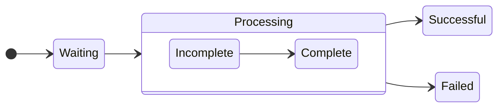

https://youtu.be/j9LW2XmfWjU?t=24058
---

### ✅ Q1  
**Question:**  
Your company uses a Git repository in Azure Repos to manage the source code of a web application...  
**Requirements:**  
- Consolidate commit histories.  
- Merge the changes into a single commit.  
**Which merge strategy should you use in the branch policy?**

**A.** squash merge ✅  
**B.** fast-forward merge  
**C.** Git fetch  
**D.** no-fast-forward merge  

---

### ✅ Q2  
**Question:**  
You store source code in a Git repository in Azure Repos. You use a third-party CI tool to control builds. What will Azure DevOps use to authenticate with the tool?

**A.** Certificate authentication  
**B.** a personal access token (PAT) ✅  
**C.** a Shared Access Signature (SAS) token  
**D.** NTLM authentication  

---

### ✅ Q3  
**Question:**  
You configure Azure Application Insights and enable Smart Detection... You don’t receive a Smart Detection notification after a test failure. What prevents the notification?

**A.** You must enable the Snapshot Debugger  
**B.** Smart Detection uses the first 24 hours to establish the normal behavior of the web app ✅  
**C.** The web app is configured to use the shared plan tier  
**D.** You must restart the app  

---

### ✅ Q4  
**Question:**  
You need a solution for continuous inspection of the company’s code base to locate common code patterns that are problematic. What should you recommend?

**A.** Microsoft Visual Studio test plans  
**B.** Gradle wrapper scripts  
**C.** SonarCloud analysis ✅  
**D.** the JavaScript task runner  

---

### ✅ Q5 – Part 1  
**Question:**  
You use GitHub for source control. Documentation is stored as `.docx` and `.bmp`. You must optimize versioning and meet requirements like storing as plain text and simplifying reuse.

**Convert the `.docx` files to:**  
**A.** LaTex Typesetting (.tex)  
**B.** Markdown (.md) ✅  
**C.** Portable Document Format (.pdf)  

---

### ✅ Q5 – Part 2  
**Convert the flow charts to:**  
**A.** Mermaid diagrams ✅  
**B.** PNG  
**C.** TIFF  

---

### ✅ Q6  
**Question:**  
You need to send an SMS alert when Azure service scheduled maintenance is planned. Which two actions should you perform?

**A.** Enable Azure Security Center  
**B.** Create and configure Azure Monitor alert rule  
**C.** Create an Azure Service Health alert ✅  
**D.** Create and configure an action group ✅  

---

### ✅ Q7  
**Question:**  
You experience intermittent delays before a build pipeline starts in Azure Pipelines. What should you do?

**A.** Enable self-hosted build agents ✅  
**B.** Create a new agent pool  
**C.** Split the pipeline into multiple stages  
**D.** Purchase additional parallel job  

---

### ✅ Q8  
**Question:**  
You need an integration strategy for Java build that must use on-prem dependency management and store artifacts in Azure DevOps...  
**Solution:** Use Microsoft-hosted agent with Visual Studio 2019 and Java Tool Installer.  
**Does this meet the goal?**

**A.** Yes  
**B.** No ✅  

---

### ✅ Q9  
**Question:**  
You configure an Azure Application Insights availability test and create a logic app to handle email notifications. What trigger should invoke the logic app?

**A.** HTTPWebhook trigger  
**B.** HTTP trigger  
**C.** Request trigger ✅  
**D.** ApiConnection trigger  

---

Вот следующие вопросы с вариантами и правильными ответами:

---

### ✅ Q11  
**Question:**  
You use Azure Pipelines and notice increased cycle times. You suspect agent pool exhaustion.  
**What are two possible ways to verify this?**

**Options:**  
A. Query the PipelineRun/PipelineRuns endpoint  
B. **Query the TaskAgentPoolSizeSnapshots endpoint** ✅  
C. View the Pipeline duration report  
D. **View the pool consumption report at the organization level** ✅

**Correct Answers:** B and D

---

### ✅ Q12  
**Question:**  
Using Semantic Versioning (SemVer), which version part should be incremented?

| Change   | New functionality | Incompatibility | Version Part |
|----------|-------------------|------------------|--------------|
| Change1  | Yes               | Minor            | **Minor** ✅ |
| Change2  | Yes               | Significant      | **Major** ✅ |
| Change3  | No                | Minor            | **Patch** ✅ |

---

### ✅ Q13  
**Question:**  
You need to deploy a new version of an Azure web app with minimal downtime and allow rollback.  
**What should you use?**

**Options:**  
A. **a single web app and two deployment slots** ✅  
B. a single web app and two deployment pipelines  
C. two web apps and an Azure Standard Load Balancer  
D. two web apps and an Azure Traffic Manager instance

**Correct Answer:** A

---

### ✅ Q14  
**Question:**  
You need to minimize troubleshooting effort for intermittent test failures.  
**Solution:** Implement the Test Results Trend widget.  
**Does this meet the goal?**

**Options:**  
A. Yes  
B. **No** ✅

**Correct Answer:** B

---

### ✅ Q15  
**Question:**  
YAML strategy value for each app to minimize downtime?

| App  | Platform                      | Strategy   |
|------|-------------------------------|------------|
| App1 | Azure Virtual Machine         | **rolling** ✅  
| App2 | Azure Kubernetes Service (AKS)| **canary** ✅  

**Correct Answers:**  
App1: B. rolling  
App2: A. canary

---

---

### **Q16.**
Your company uses Azure DevOps for the build pipelines and deployment pipelines of Java-based projects. You need to recommend a strategy for managing technical debt.  
**Which two actions should you include in the recommendation?**

✅ **B. Configure pre-deployment approvals in the deployment pipeline.**  
✅ **C. Integrate Azure DevOps and SonarQube.**

---

### **Q17.**
You are developing a full Microsoft .NET Framework solution that includes unit tests. You need to configure SonarQube to perform a code quality validation of the C# code as part of the build pipelines.  
**Which four tasks should you perform in sequence?**

🟢 **Correct order:**  
1️⃣ **E. Prepare Analysis Configuration**  
2️⃣ **D. Visual Studio Build**  
3️⃣ **B. Visual Studio Test**  
4️⃣ **A. Run Code Analysis**

---

### **Q18.**
During a code review, you discover many quality issues. Many modules contain unused variables and empty catch blocks. You need to recommend a solution to improve the quality of the code.  
**What should you recommend?**

✅ **B. In a Maven build task, select Run PMD.**

---

### **Q19.**
You have a multi-tier application that has an Azure Web Apps front end and an Azure SQL Database back end. You need to recommend a solution to capture and store telemetry data.  
The solution must meet the following requirements:  
- Support using ad-hoc queries to identify baselines.  
- Trigger alerts when metrics in the baseline are exceeded.  
- Store application and database metrics in a central location.  
**What should you include in the recommendation?**

✅ **D. Azure Log Analytics**

---

### **Q20.**
You are automating the testing process for your company. You need to automate UI testing of a web application.  
**Which framework should you use?**

✅ **B. Selenium**

---
Готово! Вот оформленные вопросы и правильные ответы в точности с изображений:

---

✅ Q21  
**Question:**  
You have a build pipeline in Azure Pipelines that occasionally fails. You discover that a test measuring the response time of an API endpoint causes the failures. You need to prevent the build pipeline from failing due to the test. Which two actions should you perform?  
A. Set Flaky test detection to Off.  
B. **Clear Flaky tests included in test pass percentage.** ✅  
C. Enable Test Impact Analysis (TIA).  
D. **Manually mark the test as flaky.** ✅  
E. Enable test slicing.

---

✅ Q22  
**Question:**  
You manage a project in Azure DevOps. You need to prevent the configuration of the project from changing over time.  
**Solution:** Perform a Subscription Health scan when packages are created.  
A. Yes  
B. **No** ✅

---

✅ Q23  
**Question:**  
You use Azure Pipelines to manage build pipelines, GitHub to store source code, and Dependabot to manage dependencies. You have an app named App1. Dependabot detects a dependency in App1 that requires an update. What should you do first to apply the update?  
A. Create a pull request.  
B. **Approve the pull request.** ✅  
C. Create a branch.  
D. Perform a commit.

---

✅ Q24  
**Question:**  
You are designing a configuration management solution to support five apps hosted on Azure App Service. Each app is available in the following three environments: development, test, and production. You need to recommend a configuration management solution that meets the following requirements:  
- Supports feature flags  
- Tracks configuration changes from the past 30 days  
- Stores hierarchically structured configuration values  
- Controls access to the configurations by using role-based access control (RBAC) permissions  
- Stores shared values as key/value pairs that can be used by all the apps  
**Which Azure service should you recommend as the configuration management solution?**  
A. Azure Cosmos DB  
B. Azure App Service  
C. **Azure App Configuration** ✅  
D. Azure Key Vault

---

✅ Q25  
**Question:**  
You are designing a strategy to monitor the baseline metrics of Azure virtual machines that run Windows Server. You need to collect detailed data about the processes running in the guest operating system. Which two agents should you deploy?  
A. the Telegraf agent  
B. **the Azure Monitor agent** ✅  
C. the Azure Network Watcher Agent for Windows  
D. **the Dependency agent** ✅

---

✅ Q26  
**Question:**  
You need to find and isolate shared code. The shared code will be maintained in a series of packages. Which three actions should you perform in sequence?  
**Correct sequence of actions:**  
C. **Create a dependency graph for the application.** ✅  
A. **Group the related components.** ✅  
B. **Assign ownership to each component group.** ✅  
D. Identify the most common language used.  
E. Rewrite the components in the most common language.

---

✅ Q27  
**Question:**  
You use GitHub for source control. A file that contains sensitive data is committed accidentally to the Git repository of a project. You need to delete the file and its history from the repository. Which two tools can you use?  
A. **the git filter-branch command** ✅  
B. **BFG Repo-Cleaner** ✅  
C. the git rebase command  
D. GitHub Desktop

---

✅ Q28  
**Question:**  
You have a GitHub repository. You create a new repository in Azure DevOps. You need to recommend a procedure to clone the repository from GitHub to Azure DevOps. What should you recommend?  
A. Create a pull request.  
B. Create a webhook.  
C. Create a service connection for GitHub.  
D. **From Import a Git repository, click Import.** ✅  
E. Create a personal access token in Azure DevOps.

---

✅ Q29  
**Question:**  
You use a Git repository in Azure Repos to manage the source code of a web application. Developers commit changes directly to the default branch. You need to implement a change management procedure that meets the following requirements:  
- The default branch must be protected, and new changes must be built in the feature branches first.  
- Changes must be reviewed and approved by at least one release manager before each merge.  
- Changes must be brought into the default branch by using pull requests.  
**What should you configure in Azure Repos?**  
A. ~~Services in Project Settings~~  
B. ~~Deployment pools in Project Settings~~  
C. **branch policies of the default branch** ✅  
D. branch security of the default branch

---
✅ Q30  
**Question:**  
You plan to publish build artifacts by using an Azure pipeline. You need to create an .artifactignore file that meets the following requirements:  
- Includes all files in the build output folder and all subfolders  
- Excludes files that have the .dll extension  
**What should you include in the file?**  
A. ./\*\*  
  !*.dll  
B. **\*\*/\***  
  **!*.dll** ✅  
C. */\*\*  
  *.dll  
D. \*\*/\*  
  #*.dll

---

✅ Q31  
**Question:**  
You manage a project by using Azure Boards. You manage the project code by using GitHub. You have three work items that have IDs of 456, 457, and 458. You need to create a pull request that will be linked to all the work items. The solution must set the state of work item 456 to done.  
**What should you add to the commit message?**  
A. ~~Fixes #456, #457, #458~~  
B. **Fixes #AB456, #AB457, #AB458** ✅  
C. ~~#456, #457, #458~~  
  Completed #456  
D. ~~#AB456, #AB457, #AB458~~

---

✅ Q32  
**Question:**  
Your company deploys applications in Docker containers. You want to detect known exploits in the Docker images used to provision the Docker containers. You need to integrate image scanning into the application lifecycle. The solution must expose the exploits as early as possible during the application lifecycle.  
**What should you configure?**  
A. **a task executed in the continuous integration pipeline and a scheduled task that analyzes the image registry** ✅  
B. manual tasks performed during the planning phase and the deployment phase  
C. a task executed in the continuous deployment pipeline and a scheduled task against a running production container  
D. a task executed in the continuous integration pipeline and a scheduled task that analyzes the production container

---

✅ Q33  
**Question:**  
Your company has an Azure DevOps project. The source code for the project is stored in an on-premises repository and uses an on-premises build server. You plan to use Azure DevOps to control the build process on the build server by using a self-hosted agent. You need to implement the self-hosted agent. You download and install the agent on the build server.  
**Which two actions should you perform next?**  
D. **From DevOps, create a personal access token (PAT).** ✅  
E. **From the build server, run config.cmd.** ✅  
A. From Azure, create a shared access signature (SAS).  
B. From the build server, create a certificate, and then upload the certificate to Azure Storage.  
C. From the build server, create a certificate, and then upload the certificate to Azure Key Vault.

---
✅ Q34  
**Question:**  
You are designing an Azure DevOps strategy for your company's development team. You suspect that the team's productivity is low due to accumulated technical debt. You need to recommend a metric to assess the amount of the team's technical debt.  
**What should you recommend?**  
A. the number of code modules in an application  
B. the number of unit test failures  
C. the percentage of unit test failures  
D. **the percentage of overall time spent on rework** ✅

---

✅ Q35  
**Question:**  
You use GitHub for source control and project-related discussions. You receive a notification when an entry is made to any team discussion. You need to ensure that you receive email notifications only for discussions in which you commented or in which you are mentioned.  
**Which two Notification settings should you clear?**  
A. **Automatically watch teams** ✅  
B. Participating  
C. **Automatically watch repositories** ✅  
D. Watching

---

✅ Q36  
**Question:**  
You use Git for source control. You enable GitHub code scanning. You raise a pull request from a non-default branch. In the code scanning output, you receive the following error message: "Analysis not found." You need to ensure that the code scanning completes successfully for the pull request.  
**Which two actions should you perform?**  
B. **Add the name of the non-default branch to the on:push specification in the code scanning workflow.** ✅  
D. **Update the code in the pull request.** ✅  
A. Add the name of the default branch to the on:push specification in the code scanning workflow.  
C. Delete the pull request, and then raise the request again from the default branch.  
E. Add a new workflow for code scanning.

---

✅ Q37  
**Question:**  
You have a GitHub repository that contains multiple versions of an Azure Pipelines template. You plan to deploy multiple pipelines that will use a template stored in the repository. You need to ensure that you use a fixed version of the template.  
**What should you use to reference which version of the template repository to use?**  
A. the serial  
B. the SHA-based hashes  
C. the runner  
D. **the branch** ✅

---

✅ Q38  
**Question:**  
You have an Azure DevOps organization named Contoso and an Azure subscription. The subscription contains an Azure virtual machine scale set named VMSS1 that is configured for autoscaling. You have a project in Azure DevOps named Project1. Project1 is used to build a web app named App1 and deploy App1 to VMSS1. You need to ensure that an email alert is generated whenever VMSS1 scales in or out.  
**Solution:** From Azure DevOps, configure the Notifications settings for Project1  
A. Yes  
B. **No** ✅

---

✅ Q39  
**Question:**  
You are using the Dependency Tracker extension in a project in Azure DevOps. You generate a risk graph for the project. What should you use in the risk graph to identify the number of dependencies and the risk level of the project?  
**Number of Dependencies:** **Link Width** ✅  
**Risk Level:** **Link Color** ✅

---

✅ Q40  
**Question:**  
Your company uses GitHub for source control. The company has a team that performs code reviews. You need to automate the assignment of the code reviews. The solution must meet the following requirements:  
- Prioritize the assignment of code reviews to team members who have the fewest outstanding assignments.  
- Ensure that each team member performs an equal number of code reviews in any 30-day period.  
- Prevent the assignment of code reviews to the team leader.  
**Which two actions should you perform?**  
C. **Select Never assign certain team members.** ✅  
E. **Set Routing algorithm to Load balance.** ✅  
A. Clear Never assign certain team members.  
B. Select If assigning team members, don’t notify the entire team.  
D. Set Routing algorithm to Round robin.

---

✅ Q41  
**Question:**  
A team is planning on using Azure Automation for a set of Azure Virtual Machines. They need to use Azure state configuration to manage the state of the virtual machines. Which of the following actions would need to be performed to ensure the state of the virtual machines are managed effectively?  
**Choose 5 answers from the options given below**

A. **Onboard the set of virtual machines onto Azure Automation state configuration** ✅  
B. **Check the status of the node** ✅  
C. **Assign the node configuration** ✅  
D. Create a node management group  
E. **Compile the configuration** ✅  
F. **Upload a configuration** ✅

---
✅ Q1  
**Question:**  
You are configuring project metrics for dashboards in Azure DevOps.  
You need to configure a chart widget that measures the elapsed time to complete work items once they become active.  
Which of the following is the widget you should use?

A. Cumulative Flow Diagram  
B. Burnup  
C. **Cycle time** ✅  
D. Burndown

---
✅ Q2  
**Question:**  
You need to consider the underlined segment to establish whether it is accurate.  
_The Burnup widget measures the elapsed time from creation of work items to their completion._

Select `No adjustment required` if the underlined segment is accurate. If the underlined segment is inaccurate, select the accurate option.

A. No adjustment required  
B. **Lead time** ✅  
C. Test results trend  
D. Burndown

✅ Q3  
**Question:**  
You are making use of Azure DevOps to manage build pipelines, and also deploy pipelines.  
The development team is quite large, and is regularly added to.  
You have been informed that the management of users and licenses must be automated when it can be.  
Which of the following is a task that can't be automated?

A. Group membership changes  
B. License assignment  
C. Assigning entitlements  
D. **License procurement** ✅

---

✅ Q4  
**Question:**  
You have been tasked with strengthening the security of your team's development process.  
You need to suggest a security tool type for the Continuous Integration (CI) phase of the development process.  
Which of the following is the option you would suggest?

A. Penetration testing  
B. **Static code analysis** ✅  
C. Threat modeling  
D. Dynamic code analysis

---

✅ Q5  
**Question:**  
Your company is currently making use of Team Foundation Server 2013 (TFS 2013), but intend to migrate to Azure DevOps.  
You have been tasked with supplying a migration approach that allows for the preservation of Team Foundation Version Control changesets dates, as well as the changes dates of work item revisions.  
The approach should also allow for the migration of all TFS artifacts, while keeping migration effort to a minimum.  
You have suggested upgrading TFS to the most recent RTW release.  
Which of the following should also be suggested?

A. Installing the TFS kava SDK  
B. **Using the TFS Database Import Service to perform the upgrade.** ✅  
C. Upgrading PowerShell Core to the latest version.  
D. Using the TFS Integration Platform to perform the upgrade.

✅ Q6  
**Question:**  
You have an on-premises Bitbucket Server with a firewall configured to block inbound Internet traffic. The server is used for Git-based source control.  
You intend to manage the build and release processes using Azure DevOps. This plan requires you to integrate Azure DevOps and Bitbucket.  
Which of the following will allow for this integration?  
Answer by dragging the correct options from the list to the answer area.

**Options:**  
- A self-hosted agent  
- A Microsoft-hosted agent  
- An External Git service connection  
- Service hooks  

**Answer:**  
- ✅ A self-hosted agent  
- ✅ An External Git service connection


  ✅ Q7  
**Question:**  
You are currently developing a project for a client that will be managing work items via Azure DevOps.  
You want to make sure that the work item process you use for the client allows for requirements, change requests, risks, and reviews to be tracked.  
Which of the following is the option you would choose?

A. Basic  
B. Agile  
C. Scrum  
D. **CMMI** ✅

---

✅ Q8  
**Question:**  
*Note: The question is included in a number of questions that depicts the identical set-up. However, every question has a distinctive result. Establish if the solution satisfies the requirements.*  
You run the `Register-AzureRmAutomationDscNode` command in your company's environment.  
You need to make sure that your company's test servers remain correctly configured, regardless of configuration drift.  
**Solution:** You set the `-ConfigurationMode` parameter to `ApplyOnly`.  
Does the solution meet the goal?

A. Yes  
B. **No** ✅

---

✅ Q9  
**Question:**  
You run the `Register-AzureRmAutomationDscNode` command in your company's environment.  
You need to make sure that your company's test servers remain correctly configured, regardless of configuration drift.  
**Solution:** You set the `-ConfigurationMode` parameter to `ApplyAndMonitor`.  
Does the solution meet the goal?

A. Yes 
B. ** No**  ✅

---

✅ Q10  
**Question:**  
You run the `Register-AzureRmAutomationDscNode` command in your company's environment.  
You need to make sure that your company's test servers remain correctly configured, regardless of configuration drift.  
**Solution:** You set the `-ConfigurationMode` parameter to `ApplyAndAutocorrect`.  
Does the solution meet the goal?

A. **Yes** ✅  
B. No

✅ Q11  
**Question:**  
You need to consider the underlined segment to establish whether it is accurate.  
*To compile an Internet Information Services (IIS) web application that runs docker, you should use a Default build agent pool.*  
Select `No adjustment required` if the underlined segment is accurate. If the underlined segment is inaccurate, select the accurate option.

A. No adjustment required  
B. **Hosted Windows Container** ✅  
C. Hosted  
D. Hosted macOS

---

✅ Q12  
**Question:**  
Your company has an Azure DevOps environment that can only be accessed by Azure Active Directory users.  
You are instructed to make sure that the Azure DevOps environment can only be accessed from devices connected to the company's on-premises network.  
Which of the following actions should you take?

A. Assign the devices to a security group.  
B. Create a GPO.  
C. Configure Security in Project Settings from Azure DevOps.  
D. **Configure conditional access in Azure Active Directory.** ✅

---

✅ Q13  
**Question:**  
You are making use of Azure DevOps to configure Azure Pipelines for a project, named PROJ-01.  
You are preparing to use a version control system that allows for source code to be stored on a managed Windows server located on the company network.  
Which of the following is the version control system you should use?

A. **Github Enterprise** ✅  
B. Bitbucket cloud  
C. Github Professional  
D. Git in Azure Repos

---

✅ Q14  
**Question:**  
You need to consider the underlined segment to establish whether it is accurate.  
*When moving to Azure DevOps, JIRA must be replaced with the build pipelines Azure DevOps service.*  
Select `No adjustment required` if the underlined segment is accurate. If the underlined segment is inaccurate, select the accurate option.

A. No adjustment required  
B. repos  
C. release pipelines  
D. **boards** ✅

---

✅ Q15  
**Question:**  
You scan a Node.js application using WhiteSource Bolt.  
The scan finds numerous libraries with invalid licenses, but are only used during development.  
You have to make sure that only production dependencies are scanned by WhiteSource Bolt.  
Which of the following is a command you should run?

A. npm edit  
B. npm publish  
C. **npm install** ✅  
D. npm update

---

✅ Q16  
**Question:**  
You are currently defining a release strategy for an app, named APP-01.  
The strategy should allow you to keep the time it takes to deploy new releases of the app to a minimum. The strategy should also allow you to roll back in the shortest time required.  
Which of the following is the release strategy you should use?

A. **Red/Black deployment** ✅  
B. Rolling deployment  
C. “Big Bang” deployment  
D. Canary deployment

---

✅ Q17  
**Question:**  
Your company hosts a web application in Azure, and makes use of Azure Pipelines for managing the build and release of the application.  
When stakeholders report that system performance has been adversely affected by the most recent releases, you configure alerts in Azure Monitor.  
You are informed that new releases must satisfy specified performance baseline conditions in the staging environment before they can be deployed to production.  
You need to make sure that releases not satisfying the performance baseline are prevented from being deployed.  
Which of the following actions should you take?

A. You should make use of a branch control check.  
B. You should make use of an alert trigger.  
C. **You should make use of a gate.** ✅  
D. You should make use of an approval check.

---

✅ Q18  
**Question:**  
You need to consider the underlined segment to establish whether it is accurate.  
*To deploy an application to a number of Azure virtual machines, you should create a universal group.*  
Select `No adjustment required` if the underlined segment is accurate. If the underlined segment is inaccurate, select the accurate option.

A. No adjustment required  
B. security  
C. **deployment** ✅  
D. resource

✅ Q19  
**Question:**  
You are preparing to deploy an Azure resource group via Terraform.  
To achieve your goal, you have to install the necessary frameworks.  
Which of the following are the frameworks you should use?  
Answer by dragging the correct options from the list to the answer area.

**Options:**  
- Yeoman  
- Vault  
- Terratest  
- Tiller  

**Answer:**  
- ✅ Yeoman  
- ✅ Terratest

✅ Q20  
**Question:**  
You intend to make use of Azure Artifacts to share packages that you wrote, tested, validated, and deployed.  
You want to use a solitary feed to release several builds of each package. You have to make sure that the release of packages that are in development is restricted.  
Which of the following actions should you take?

A. You should make use of static code analysis.  
B. **You should make use of views.** ✅  
C. You should make use of dynamic code analysis.  
D. You should make use of upstream sources.

✅ Q21  
**Question:**  
You need to consider the underlined segment to establish whether it is accurate.  
*To find when common open source libraries are added to the code base, you should add Jenkins to the build pipeline.*  
Select `No adjustment required` if the underlined segment is accurate. If the underlined segment is inaccurate, select the accurate option.

A. No adjustment required  
B. SourceGear Vault  
C. **WhiteSource** ✅  
D. OWASP ZAP  

---

✅ Q22  
**Question:**  
Your company has an Azure DevOps project, which includes a build pipeline that makes use of roughly fifty open source libraries.  
You have been tasked with making sure that you are able to scan the project for common security weaknesses in the open source libraries.  
Which of the following actions should you take?

A. **You should create a build task and use the WhiteSource Bolt service.** ✅  
B. You should create a deployment task and use the WhiteSource Bolt service.  
C. You should create a build task and use the Chef service.  
D. You should create a deployment task and use the Chef service.  

---

✅ Q23  
**Question:**  
You need to consider the underlined segment to establish whether it is accurate.  
*Black Duck can be used to make sure that all the open source libraries conform to your company's licensing criteria.*  
Select `No adjustment required` if the underlined segment is accurate. If the underlined segment is inaccurate, select the accurate option.

A. **No adjustment required.** ✅  
B. Maven  
C. Bamboo  
D. CMAKE  

---

✅ Q24  
**Question:**  
You have created an Azure DevOps project for a new application that will be deployed to a number of Windows Server 2016 Azure virtual machines.  
You are preparing a deployment solution that allows for the virtual machines to maintain a uniform configuration, and also keep administrative effort with regards to configuring the virtual machines to a minimum.  
Which of the following should be part of your solution? (Choose two.)

A. ✅ **Azure Resource Manager templates**  
B. ✅ **The PowerShell Desired State Configuration (DSC) extension for Windows**  
C. Azure pipeline deployment groups  
D. The Custom Script Extension for Windows  
E. Azure pipeline stage templates  

---

✅ Q25  
**Question:**  
Your company has an application that contains a number of Azure App Service web apps and Azure functions.  
You would like to view recommendations with regards to the security of the web apps and functions. You plan to navigate to Compute and Apps to achieve your goal.  
Which of the following should you access to make use of Compute and Apps?

A. Azure Log Analytics  
B. Azure Event Hubs  
C. Azure Advisor  
D. **Azure Security Center** ✅  

---

✅ Q26  
**Question:**  
You need to consider the underlined segment to establish whether it is accurate.  
*Your company has a multi-tier application that has its front end hosted in Azure App Service.  
To pinpoint the average load times of the application pages, you should make use of Azure Event Hubs.*  
Select `No adjustment required` if the underlined segment is accurate. If the underlined segment is inaccurate, select the accurate option.

A. No adjustment required  
B. **Azure Application Insights** ✅  
C. Azure Log Analytics  
D. Azure Advisor  

---

✅ Q27  
**Question:**  
Your company makes use of Azure SQL Database Intelligent Insights and Azure Application Insights for monitoring purposes.  
You have been tasked with analyzing the monitoring using ad-hoc queries. You need to utilize the correct query language.  
**Solution:** You use the Contextual Query Language (CQL).  
Does the solution meet the goal?

A. Yes  
B. **No** ✅  

---

✅ Q28  
**Question:**  
Your company makes use of Azure SQL Database Intelligent Insights and Azure Application Insights for monitoring purposes.  
You have been tasked with analyzing the monitoring using ad-hoc queries. You need to utilize the correct query language.  
**Solution:** You use the Transact-SQL.  
Does the solution meet the goal?

A. Yes  
B. **No** ✅  

---

✅ Q29  
**Question:**  
Your company makes use of Azure SQL Database Intelligent Insights and Azure Application Insights for monitoring purposes.  
You have been tasked with analyzing the monitoring using ad-hoc queries. You need to utilize the correct query language.  
**Solution:** You use Azure Log Analytics.  
Does the solution meet the goal?

A. Yes  
B. **No** ✅

✅ Q30  
**Question:**  
You have recently created a web application for your company.  
You have been tasked with making sure that a summary of the exceptions that transpire in the application is automatically sent to Microsoft Teams on a daily basis.  
Which of the following Azure services should you use?  
Answer by dragging the correct options from the list to the answer area.

**Options:**  
- Azure DevOps Project  
- Azure Logic Apps  
- Azure Pipelines  
- Azure Application Insights  

**Answer:**  
- ✅ Azure Logic Apps  
- ✅ Azure Application Insights

✅ Q31  
**Question:**  
You are in the process of building a mobile app aimed at Android and iOS devices.  
All work items and release cycles are managed via Azure DevOps.  
You want to make sure that crash reports for issue analysis are collected, and that beta releases are distributed to your testers.  
Also, you want to ensure that user feedback on the functionality of new apps is received.  
Which of the following must be part of your solution?

A. **The Microsoft Test & Feedback extension** ✅  
B. OWASP ZAP  
C. TFS Integration Platform  
D. Code Style

✅ Q32
Question:
You need to recommend project metrics for dashboards in Azure DevOps.
Which chart widgets should you recommend for each metric? To answer, drag the appropriate chart widgets to the correct metrics. Each chart widget may be used once, more than once, or not at all.

Chart Widgets:

Burndown

Cycle Time

Lead Time

Velocity

Metrics and Answers:

The elapsed time from the creation of work items to their completion: Lead Time ✅

The elapsed time to complete work items once they are active: Cycle Time ✅

The remaining work: Burndown ✅

Explanation:

Lead Time measures the total time from creation to completion.

Cycle Time starts when work begins on the item and ends when it is complete.

Burndown focuses on tracking remaining work over time.


Конечно, вот полный вопрос и ответ в нужном формате:

---

✅ **Q33**  
**Question:**  
You plan to create alerts that will be triggered based on the page load performance of a home page.  
You have the Application Insights log query shown in the exhibit.  
Use the drop-down menus to select the answer choice that completes each statement based on the information presented in the graphic.  

**Statement 1:**  
To create an alert based on the page load experience of most users, the alerting level must be based on:  
**A. percentile_duration_50**  
**B. percentile_duration_90**  
**C. percentile_duration_95** ✅  
**D. threshold**

**Statement 2:**  
To only create an alert when authentication error occurs on the server, the query must be filtered on:  
**A. item Type**  
**B. resultCode**  
**C. source**  
**D. success** ✅

**Explanation:**  
- `percentile_duration_95` is used to alert based on the experience of the slowest 5% of users, which helps catch outliers in performance.  
- `success == false` is the correct filter to detect failed requests like authentication errors.

**References:**  
- [Alerts Based on Analytics Query](https://devblogs.microsoft.com/premier-developer/alerts-based-on-analytics-query-using-custom-log-search/)  
- [Kusto query for App Insights](https://learn.microsoft.com/en-us/azure/data-explorer/kusto/query/)

✅ **Q34**  
**Question:**  
You manage an Azure web app that supports an e-commerce website.  
You need to increase the logging level when the web app exceeds normal usage patterns. The solution must minimize administrative overhead.  
Which two resources should you include in the solution?  

**Each correct selection is worth one point.**

**Options:**  
A. **An Azure Automation runbook** ✅  
B. **An Azure Monitor alert that has a dynamic threshold** ✅  
C. An Azure Monitor alert that has a static threshold  
D. The Azure Monitor autoscale settings  
E. An Azure Monitor alert that uses an action group that has an email action  

**Explanation:**  
- **B. Dynamic threshold alerts** in Azure Monitor automatically adjust based on historical data and patterns, reducing manual tuning — perfect for detecting abnormal usage patterns with minimal overhead.  
- **A. Azure Automation runbook** allows programmatic control, such as increasing logging levels, which can be triggered by the alert.  

**References:**  
- [Dynamic Threshold Alerts](https://learn.microsoft.com/en-us/azure/azure-monitor/alerts/dynamic-thresholds)  
- [Azure Automation Runbooks](https://learn.microsoft.com/en-us/azure/automation/automation-runbook-types)

  ✅ **Q35**  
**Question:**  
You have an Azure Kubernetes Service (AKS) pod.  
You need to configure a probe to perform the following actions:  
- Confirm that the pod is responding to service requests.  
- Check the status of the pod four times a minute.  
- Initiate a shutdown if the pod is unresponsive.  

How should you complete the YAML configuration file? To answer, select the appropriate options in the answer area.  

**Answer Area:**  
**Box 1:** `readinessProbe:` ✅  
👉 This probe checks if the pod is ready to serve traffic. It confirms whether the application is available for requests.  

**Box 2:** `periodSeconds: 15` ✅  
👉 This means the probe will check the pod's readiness every 15 seconds, which is four times a minute (60 / 15 = 4).  

**Explanation:**  
- `readinessProbe` is used to determine when a container is ready to start accepting traffic.  
- `periodSeconds` defines how frequently (in seconds) to perform the probe.  
- Shutdown or restart logic can be implemented by Kubernetes based on probe failure.

**Reference:**  
[Readiness Probes - Azure Docs](https://learn.microsoft.com/en-us/azure/container-instances/container-instances-readiness-probe)

✅ **Q36**  
**Question:**  
You have a Microsoft ASP.NET Core web app in Azure that is accessed worldwide.  
You need to run a URL ping test once every five minutes and create an alert when the web app is unavailable from specific Azure regions. The solution must minimize development time.  
What should you do?

A. Create an Azure Monitor Availability metric and alert.  
B. **Create an Azure Application Insights availability test and alert.** ✅  
C. Write an Azure function and deploy the function to the specific regions.  
D. Create an Azure Service Health alert for the specific regions.

**Explanation:**  
Application Insights provides **availability tests** (including multi-region ping tests) with built-in support for **custom alert rules** and minimal configuration effort — ideal for global monitoring.

---

✅ **Q37**  
**Question:**  
You have a multi-tier application. The front end of the application is hosted in Azure App Service.  
You need to identify the **average load times** of the application pages.  
What should you use?

A. **Azure Application Insights** ✅  
B. The activity log of the App Service  
C. The diagnostics logs of the App Service  
D. Azure Advisor

**Explanation:**  
**Azure Application Insights** captures client-side metrics such as **page load times**, performance, dependencies, and exceptions — perfect for identifying performance bottlenecks in your frontend.

✅ **Q38**  
**Question:**  
You need to create an instance of Azure Application Insights named `az400-123456789-main` and configure the instance to receive telemetry data from an Azure web app named `az400-123456789-main`.  
To complete this task, sign in to the Microsoft Azure portal.

**Correct Answer:**  
**Follow the steps below to complete the simulation:**

---

### 🔹 **Step 1: Create Azure Application Insights instance**
1. Sign in to the [Azure Portal](https://portal.azure.com).
2. Click on **Create a resource**.
3. Navigate to **Developer Tools** → Select **Application Insights**.
4. In the **Create Application Insights** pane:
   - **Name:** `az400-123456789-main`
   - **Resource group:** Select existing or create new.
   - **Region:** Choose the same region as your web app.
   - **Resource Mode:** Classic
5. Click **Review + Create**, then **Create**.

---

### 🔹 **Step 2: Configure telemetry in Visual Studio**
1. Open the **Web App project** (e.g., ASP.NET Core) in **Visual Studio**.
2. In **Solution Explorer**, right-click the **project name** (e.g., `WebApplication1`), then go to:  
   `Add` → `Application Insights Telemetry`
3. In the setup wizard:
   - Click **Get Started**.
   - Select your **Azure account** and **subscription**.
   - Choose the **existing Application Insights resource**: `az400-123456789-main`.
4. Click **Register** to link the app to App Insights.

---

**Result:**  
- Your app will now send telemetry data (requests, dependencies, exceptions, etc.) to Azure Application Insights.  
- You can verify data flow by opening the **Application Insights resource** in Azure and checking for metrics and logs.

**Reference:**  
[Quickstart: ASP.NET Core + Application Insights](https://learn.microsoft.com/en-us/azure/azure-monitor/app/asp-net-core)

✅ Q39
Question:
Your company uses ServiceNow for incident management.
You develop an application that runs on Azure.
The company needs to generate a ticket in ServiceNow when the application fails to authenticate.
Which Azure Log Analytics solution should you use?

A. Application Insights Connector
B. Automation & Control
C. **IT Service Management Connector (ITSM)** ✅  
D. Insight & Analytics

✅ **Q1**  
**Question:**  
Your company is building a new web application.  
You plan to collect feedback from pilot users on the features being delivered.  
All the pilot users have a corporate computer that has Google Chrome and the Microsoft Test & Feedback extension installed. The pilot users will test the application by using Chrome.  
You need to identify which access levels are required to ensure that developers can request and gather feedback from the pilot users. The solution must use the principle of least privilege.  
Which access levels in Azure DevOps should you identify?

**Answer:**  
**Developers:** Basic ✅  
**Pilot users:** Stakeholder ✅

✅ Q1  
**Question:**  
Your company has an Azure DevOps environment that can only be accessed by Azure Active Directory users.  
You are instructed to make sure that the Azure DevOps environment can only be accessed from devices connected to the company’s on-premises network.  
Which of the following actions should you take?

A. Assign the devices to a security group.  
B. Create a GPO.  
C. Configure Security in Project Settings from Azure DevOps.  
D. Configure conditional access in Azure Active Directory. ✅

✅ Q2  
**English (Original):**  
You are making use of Azure DevOps to configure Azure Pipelines for project, named PROJ-01.  
You are preparing to use a version control system that allows for source code to be stored on a managed Windows server located on the company network.  
Which of the following is the version control system you should use?

A. Github Enterprise ✅  
B. Bitbucket cloud  
C. Github Professional  
D. Git in Azure Repos  

---

**Русский (Перевод):**  
Вы используете Azure DevOps для настройки Azure Pipelines для проекта с именем PROJ-01.  
Вы готовитесь использовать систему управления версиями, которая позволяет хранить исходный код на управляемом сервере Windows, находящемся в сети компании.  
Какую из следующих систем управления версиями следует использовать?

A. Github Enterprise ✅  
B. Bitbucket cloud  
C. Github Professional  
D. Git в Azure Repos

✅ Q3  
**English (Original):**  
Your company hosts a web application in Azure, and makes use of Azure Pipelines for managing the build and release of the application.  
When stakeholders report that system performance has been adversely affected by the most recent releases, you configure alerts in Azure Monitor.  
You are informed that new releases must satisfy specified performance baseline conditions in the staging environment before they can be deployed to production.  
You need to make sure that releases not satisfying the performance baseline are prevented from being deployed.  
Which of the following actions should you take?

A. You should make use of a branch control check.  
B. You should make use of an alert trigger.  
C. You should make use of a gate. ✅  
D. You should make use of an approval check.

---

**Русский (Перевод):**  
Ваша компания размещает веб-приложение в Azure и использует Azure Pipelines для управления сборкой и релизом приложения.  
После того как заинтересованные стороны сообщили о снижении производительности системы из-за последних релизов, вы настроили оповещения в Azure Monitor.  
Вас проинформировали, что новые релизы должны соответствовать определённым условиям базовой производительности в staging-среде до развертывания в production.  
Вам нужно гарантировать, что релизы, не соответствующие этим условиям, не будут развернуты.  
Какое из следующих действий следует предпринять?

A. Использовать проверку управления веткой.  
B. Использовать триггер оповещения.  
C. Использовать gate (входной контроль). ✅  
D. Использовать проверку утверждения (approval check).


✅ Q4  
**English (Original):**  
You need to consider the underlined segment to establish whether it is accurate.  
To deploy an application to a number of Azure virtual machines, you should create a **universal** group.  
Select `No adjustment required` if the underlined segment is accurate. If the underlined segment is inaccurate, select the accurate option.

A. No adjustment required  
B. security  
C. deployment ✅  
D. resource  

---

**Русский (Перевод):**  
Вам нужно проанализировать подчёркнутый фрагмент, чтобы определить, является ли он корректным.  
Для развертывания приложения на нескольких виртуальных машинах Azure следует создать **универсальную** группу.  
Выберите `Корректировка не требуется`, если подчёркнутый фрагмент верен. Если он неверен — выберите правильный вариант.

A. Корректировка не требуется  
B. группа безопасности  
C. группа развертывания ✅  
D. группа ресурсов

✅ Q5  
**English (Original):**  
You need to consider the underlined segment to establish whether it is accurate.  
To find when common open source libraries are added to the code base, you should add **Jenkins** to the build pipeline.  
Select `No adjustment required` if the underlined segment is accurate. If the underlined segment is inaccurate, select the accurate option.

A. No adjustment required  
B. SourceGear Vault  
C. WhiteSource ✅  
D. OWASP ZAP  

---

**Русский (Перевод):**  
Вам нужно проанализировать подчёркнутый фрагмент, чтобы определить, является ли он корректным.  
Чтобы отслеживать, когда в код добавляются общие open source библиотеки, следует добавить **Jenkins** в сборочный конвейер.  
Выберите `Корректировка не требуется`, если подчёркнутый фрагмент верен. Если он неверен — выберите правильный вариант.

A. Корректировка не требуется  
B. SourceGear Vault  
C. WhiteSource ✅  
D. OWASP ZAP

✅ Q6  
**English (Original):**  
You need to consider the underlined segment to establish whether it is accurate.  
Black Duck can be used to make sure that all the **open source libraries** conform to your company's licensing criteria.  
Select `No adjustment required` if the underlined segment is accurate. If the underlined segment is inaccurate, select the accurate option.

A. No adjustment required ✅  
B. Maven  
C. Bamboo  
D. CMAKE  

---

**Русский (Перевод):**  
Вам нужно проанализировать подчёркнутый фрагмент, чтобы определить, является ли он корректным.  
Black Duck можно использовать, чтобы убедиться, что все **open source библиотеки** соответствуют лицензионной политике вашей компании.  
Выберите `Корректировка не требуется`, если подчёркнутый фрагмент верен. Если он неверен — выберите правильный вариант.

A. Корректировка не требуется ✅  
B. Maven  
C. Bamboo  
D. CMAKE

✅ Q7  
**English (Original):**  
Your company has an application that contains a number of Azure App Service web apps and Azure functions.  
You would like to view recommendations with regards to the security of the web apps and functions. You plan to navigate to Compute and Apps to achieve your goal.  
Which of the following should you access to make use of Compute and Apps?

A. Azure Log Analytics  
B. Azure Event Hubs  
C. Azure Advisor  
D. Azure Security Center ✅  

---

**Русский (Перевод):**  
В вашей компании есть приложение, содержащее несколько веб-приложений Azure App Service и Azure Functions.  
Вы хотите просмотреть рекомендации по безопасности этих веб-приложений и функций. Для этого вы планируете перейти в раздел Compute and Apps.  
Что из следующего следует использовать для доступа к Compute and Apps?

A. Azure Log Analytics  
B. Azure Event Hubs  
C. Azure Advisor  
D. Azure Security Center ✅

✅ Q8  
**English (Original):**  
You need to consider the underlined segment to establish whether it is accurate.  
Your company has a multi-tier application that has its front end hosted in Azure App Service.  
To pinpoint the average load times of the application pages, you should make use of **Azure Event Hubs**.  
Select `No adjustment required` if the underlined segment is accurate. If the underlined segment is inaccurate, select the accurate option.

A. No adjustment required  
B. Azure Application Insights ✅  
C. Azure Log Analytics  
D. Azure Advisor  

---

**Русский (Перевод):**  
Вам нужно проанализировать подчёркнутый фрагмент, чтобы определить, является ли он корректным.  
У вашей компании многоуровневое приложение, фронтенд которого размещён в Azure App Service.  
Чтобы определить среднее время загрузки страниц приложения, вы должны использовать **Azure Event Hubs**.  
Выберите `Корректировка не требуется`, если подчёркнутый фрагмент верен. Если он неверен — выберите правильный вариант.

A. Корректировка не требуется  
B. Azure Application Insights ✅  
C. Azure Log Analytics  
D. Azure Advisor

✅ Q9  
**English (Original):**  
You are in the process of building a mobile app aimed at Android and iOS devices.  
All work items and release cycles are managed via Azure DevOps.  
You want to make sure that crash reports for issue analysis is collected, and that beta releases are distributed to your testers.  
Also, you want to ensure that user feedback on the functionality of new apps is received.  
Which of the following must be part of your solution?

A. The Microsoft Test & Feedback extension ✅  
B. OWASP ZAP  
C. TFS Integration Platform  
D. Code Style  

---

**Русский (Перевод):**  
Вы разрабатываете мобильное приложение для устройств на Android и iOS.  
Все рабочие элементы и релизные циклы управляются через Azure DevOps.  
Вы хотите обеспечить сбор отчётов об авариях для анализа проблем и распространение бета-релизов среди тестировщиков.  
Также вы хотите получать обратную связь от пользователей о функциональности новых приложений.  
Что из следующего должно быть частью вашего решения?

A. Расширение Microsoft Test & Feedback ✅  
B. OWASP ZAP  
C. Платформа интеграции TFS  
D. Стиль кода

✅ Q10  
**English (Original):**  
You need to recommend project metrics for dashboards in Azure DevOps.  
Which chart widgets should you recommend for each metric? To answer, drag the appropriate chart widgets to the correct metrics. Each chart widget may be used once, more than once, or not at all.  
NOTE: Each correct selection is worth one point.

**Chart Widgets → Answer Area:**  
- **Lead Time** → The elapsed time from the creation of work items to their completion ✅  
- **Cycle Time** → The elapsed time to complete work items once they are active ✅  
- **Burndown** → The remaining work ✅  

---

**Русский (Перевод):**  
Вам нужно порекомендовать метрики проекта для отображения на дашбордах в Azure DevOps.  
Какие виджеты графиков вы бы рекомендовали для каждой метрики? Чтобы ответить, перетащите соответствующие виджеты графиков к нужным метрикам. Каждый виджет может использоваться один или несколько раз, либо не использоваться вовсе.  
**Примечание:** каждый правильный выбор даёт 1 балл.

**Виджеты → Метрики:**  
- **Lead Time** → Время от создания рабочего элемента до его завершения ✅  
- **Cycle Time** → Время выполнения рабочего элемента после начала работы над ним ✅  
- **Burndown** → Оставшийся объём работы ✅

✅ Q11  
**English (Original):**  
You manage an Azure web app that supports an e-commerce website.  
You need to increase the logging level when the web app exceeds normal usage patterns. The solution must minimize administrative overhead.  
Which two resources should you include in the solution? Each correct answer presents part of the solution.  
**NOTE:** Each correct selection is worth one point.

A. an Azure Automation runbook ✅  
B. an Azure Monitor alert that has a dynamic threshold ✅  
C. an Azure Monitor alert that has a static threshold  
D. the Azure Monitor autoscale settings  
E. an Azure Monitor alert that uses an action group that has an email action  

---

**Русский (Перевод):**  
Вы управляете веб-приложением Azure, которое обслуживает сайт электронной коммерции.  
Необходимо повысить уровень логирования, когда приложение превышает обычные шаблоны использования. Решение должно минимизировать административные затраты.  
Какие два ресурса следует включить в решение? Каждый правильный ответ даёт часть решения.  
**Примечание:** за каждый правильный выбор начисляется один балл.

A. Runbook Azure Automation ✅  
B. Оповещение Azure Monitor с динамическим порогом ✅  
C. Оповещение Azure Monitor со статическим порогом  
D. Настройки автомасштабирования Azure Monitor  
E. Оповещение Azure Monitor, использующее action group с email-действием

✅ Q12  
**English (Original):**  
You have a Microsoft ASP.NET Core web app in Azure that is accessed worldwide.  
You need to run a URL ping test once every five minutes and create an alert when the web app is unavailable from specific Azure regions. The solution must minimize development time.  
What should you do?

A. Create an Azure Monitor Availability metric and alert.  
B. Create an Azure Application Insights availability test and alert. ✅  
C. Write an Azure function and deploy the function to the specific regions.  
D. Create an Azure Service Health alert for the specific regions.  

---

**Русский (Перевод):**  
У вас есть веб-приложение Microsoft ASP.NET Core в Azure, доступное по всему миру.  
Вам необходимо запускать тест ping URL каждые пять минут и создавать оповещение, когда веб-приложение недоступно из определённых регионов Azure. Решение должно минимизировать время на разработку.  
Что следует сделать?

A. Создать метрику и оповещение о доступности в Azure Monitor.  
B. Создать тест доступности и оповещение в Azure Application Insights. ✅  
C. Написать функцию Azure и развернуть её в нужных регионах.  
D. Создать оповещение Azure Service Health для указанных регионов.


✅ Q13  
**English (Original):**  
You have a multi-tier application. The front end of the application is hosted in Azure App Service.  
You need to identify the average load times of the application pages.  
What should you use?

A. Azure Application Insights ✅  
B. the activity log of the App Service  
C. the diagnostics logs of the App Service  
D. Azure Advisor  

---

**Русский (Перевод):**  
У вас многоуровневое приложение. Фронтенд приложения размещён в Azure App Service.  
Вам нужно определить среднее время загрузки страниц приложения.  
Что следует использовать?

A. Azure Application Insights ✅  
B. Журнал активности App Service  
C. Диагностические журналы App Service  
D. Azure Advisor

✅ Q14  
**English (Original):**  
Your company uses ServiceNow for incident management.  
You develop an application that runs on Azure.  
The company needs to generate a ticket in ServiceNow when the application fails to authenticate.  
Which Azure Log Analytics solution should you use?

A. Application Insights Connector  
B. Automation & Control  
C. IT Service Management Connector (ITSM) ✅  
D. Insight & Analytics  

---

**Русский (Перевод):**  
Ваша компания использует ServiceNow для управления инцидентами.  
Вы разрабатываете приложение, которое работает в Azure.  
Необходимо создать тикет в ServiceNow, когда приложению не удаётся пройти аутентификацию.  
Какое решение Azure Log Analytics следует использовать?

A. Коннектор Application Insights  
B. Automation & Control  
C. Коннектор управления ИТ-услугами (ITSM) ✅  
D. Insight & Analytics

✅ Q15  
**English (Original):**  
Your company is building a new web application.  
You plan to collect feedback from pilot users on the features being delivered.  
All the pilot users have a corporate computer that has Google Chrome and the Microsoft Test & Feedback extension installed. The pilot users will test the application by using Chrome.  
You need to identify which access levels are required to ensure that developers can request and gather feedback from the pilot users. The solution must use the principle of least privilege.  
Which access levels in Azure DevOps should you identify?  
**NOTE:** Each correct selection is worth one point.

**Answer Area:**  
**Developers:** Basic ✅  
**Pilot users:** Stakeholder ✅  

---

**Русский (Перевод):**  
Ваша компания разрабатывает новое веб-приложение.  
Вы планируете собирать отзывы от пилотных пользователей о предоставляемых функциях.  
У всех пилотных пользователей есть корпоративный компьютер с установленным Google Chrome и расширением Microsoft Test & Feedback. Тестирование они будут проводить в Chrome.  
Необходимо определить, какие уровни доступа требуются, чтобы разработчики могли запрашивать и собирать обратную связь от пилотных пользователей. Решение должно соответствовать принципу наименьших привилегий.  
Какие уровни доступа в Azure DevOps следует указать?

**Разработчики:** Basic ✅  
**Пилотные пользователи:** Stakeholder ✅

✅ Q16  
**English (Original):**  
You use Azure SQL Database Intelligent Insights and Azure Application Insights for monitoring.  
You need to write ad-hoc queries against the monitoring data.  
Which query language should you use?

A. Kusto Query Language (KQL) ✅  
B. PL/pgSQL  
C. PL/SQL  
D. Transact-SQL  

---

**Русский (Перевод):**  
Вы используете Azure SQL Database Intelligent Insights и Azure Application Insights для мониторинга.  
Вам необходимо писать разовые (ad-hoc) запросы к данным мониторинга.  
Какой язык запросов следует использовать?

A. Kusto Query Language (KQL) ✅  
B. PL/pgSQL  
C. PL/SQL  
D. Transact-SQL

✅ Q17  
**English (Original):**  
Your company creates a web application.  
You need to recommend a solution that automatically sends to Microsoft Teams a daily summary of the exceptions that occur in the application.  
Which two Azure services should you recommend? Each correct answer presents part of the solution.  
**NOTE:** Each correct selection is worth one point.

A. Azure Logic Apps ✅  
B. Azure Pipelines  
C. Microsoft Visual Studio App Center  
D. Azure DevOps Project  
E. Azure Application Insights ✅  

---

**Русский (Перевод):**  
Ваша компания разрабатывает веб-приложение.  
Вам нужно порекомендовать решение, которое будет автоматически отправлять в Microsoft Teams ежедневную сводку об исключениях, произошедших в приложении.  
Какие два сервиса Azure вы бы порекомендовали? Каждый правильный ответ даёт часть решения.  
**Примечание:** за каждый правильный выбор начисляется один балл.

A. Azure Logic Apps ✅  
B. Azure Pipelines  
C. Microsoft Visual Studio App Center  
D. Azure DevOps Project  
E. Azure Application Insights ✅

✅ Q18  
**English (Original):**  
Your company wants to use Azure Application Insights to understand how user behaviors affect an application.  
Which Application Insights tool should you use to analyze each behavior?  
To answer, drag the appropriate tools to the correct behaviors. Each tool may be used once, more than once, or not at all.  
**NOTE:** Each correct selection is worth one point.

**Answer Area:**  
- **Feature usage:** → User Flows ✅  
- **Number of people who used the actions and its features:** → Users ✅  
- **The effect that the performance of the application has on the usage of a page or a feature:** → Impact ✅  

---

**Русский (Перевод):**  
Ваша компания хочет использовать Azure Application Insights для понимания того, как поведение пользователей влияет на приложение.  
Какой инструмент Application Insights следует использовать для анализа каждого поведения?  
Перетащите подходящие инструменты к соответствующим описаниям. Каждый инструмент может быть использован один или несколько раз, либо не использоваться вовсе.  
**Примечание:** каждый правильный выбор даёт один балл.

**Зона ответов:**  
- **Использование функций:** → User Flows ✅  
- **Количество пользователей, воспользовавшихся функциями:** → Users ✅  
- **Влияние производительности приложения на использование страницы или функции:** → Impact ✅

✅ Q19  
**English (Original):**  
You have several Azure Virtual Machines that run Windows Server 2019.  
You need to identify the distinct event IDs of each virtual machine as shown in the table.  
How should you complete the Azure Monitor query?  
To answer, drag the appropriate values to the correct locations. Each value may be used once, more than once, or not at all.  
**NOTE:** Each correct selection is worth one point.

**Answer Area:**  
```kql
Event  
| where TimeGenerated > ago(12h)  
| summarize makeset(EventID) by Computer
```

✅ **Correct placements:**  
- `where TimeGenerated > ago(12h)`  
- `summarize`  
- `makeset(EventID)`  
- `by Computer`

---

**Русский (Перевод):**  
У вас есть несколько виртуальных машин Azure с Windows Server 2019.  
Вам нужно определить уникальные идентификаторы событий (Event ID) для каждой виртуальной машины, как показано в таблице.  
Как следует завершить запрос Azure Monitor?  
Перетащите подходящие значения в нужные места. Значения можно использовать один или несколько раз, либо не использовать вовсе.  
**Примечание:** каждый правильный выбор даёт один балл.

**Область ответа:**  
```kql
Event  
| where TimeGenerated > ago(12h)  
| summarize makeset(EventID) by Computer
```

✅ Q20  
**English (Original):**  
You have an Azure web app named Webapp1.  
You need to use an Azure Monitor query to create a report that details the top 10 pages of Webapp1 that failed.  
How should you complete the query? To answer, select the appropriate options in the answer area.  
**NOTE:** Each correct selection is worth one point.

**Answer Area:**  
```kql
requests ✅  
| where success == false ✅  
| summarize failedCount=sum(itemCount) by name, resultCode  
| top 10 by failedCount desc  
| render barchart
```

---

**Русский (Перевод):**  
У вас есть веб-приложение Azure с именем Webapp1.  
Вам нужно использовать запрос Azure Monitor для создания отчёта, который отображает 10 страниц Webapp1 с наибольшим количеством сбоев.  
Как следует завершить запрос? Выберите подходящие параметры в области ответов.  
**Примечание:** каждый правильный выбор даёт один балл.

**Область ответа:**  
```kql
requests ✅  
| where success == false ✅  
| summarize failedCount=sum(itemCount) by name, resultCode  
| top 10 by failedCount desc  
| render barchart
```

✅ Q21  
**English (Original):**  
21) You are monitoring the health and performance of an Azure web app by using Azure Application Insights. 
You need to ensure that an alert is sent when the web app has a sudden rise in performance issues and failures.
What should you use?

A. custom events
B. Application Insights Profiler
C. usage analysis
D. Smart Detection ✅
E. Continuous export

---

**Русский (Перевод):**  
21) Вы отслеживаете работоспособность и производительность веб-приложения Azure с помощью Azure Application Insights.
Вам необходимо обеспечить отправку оповещения, когда в веб-приложении наблюдается внезапный рост проблем с производительностью и сбоев.
Что следует использовать?

A. пользовательские события (custom events)
B. профилировщик Application Insights (Application Insights Profiler)
C. анализ использования (usage analysis)
D. умное обнаружение (Smart Detection) ✅
E. непрерывный экспорт (Continuous export)


✅ Q22  
**English (Original):**  
22) You have a project in Azure DevOps named Contoso App that contains pipelines in Azure Pipelines for GitHub repositories.
You need to ensure that developers receive Microsoft Teams notifications when there are failures in a pipeline of Contoso App.
What should you run in Teams? To answer, select the appropriate options in the answer area.
NOTE: Each correct selection is worth one point.

Box 1: subscribe ✅
Box 2: https://dev.azure.com/contoso/contoso-app/ ✅

---

**Русский (Перевод):**  
22) У вас есть проект в Azure DevOps с названием Contoso App, который содержит пайплайны в Azure Pipelines для репозиториев GitHub.
Вам нужно обеспечить, чтобы разработчики получали уведомления в Microsoft Teams при возникновении сбоев в пайплайне Contoso App.
Что вы должны запустить в Teams? Для ответа выберите соответствующие варианты в области ответа.
ПРИМЕЧАНИЕ: Каждый правильный выбор стоит один балл.

Поле 1: subscribe ✅
Поле 2: https://dev.azure.com/contoso/contoso-app/ ✅

✅ Q23  
**English (Original):**  
23) You have a private GitHub repository.
You need to display the commit status of the repository on Azure Boards.
What should you do first?

A. Configure multi-factor authentication (MFA) for your GitHub account.
B. Add the Azure Pipelines app to the GitHub repository.
C. Add the Azure Boards app to the repository. ✅
D. Create a GitHub action in GitHub.

---

**Русский (Перевод):**  
23) У вас есть приватный репозиторий GitHub.
Вам нужно отображать статус коммитов репозитория на Azure Boards.
Что вам следует сделать в первую очередь?

A. Настроить многофакторную аутентификацию (MFA) для вашей учетной записи GitHub.
B. Добавить приложение Azure Pipelines в репозиторий GitHub.
C. Добавить приложение Azure Boards в репозиторий. ✅
D. Создать GitHub action в GitHub.


✅ Q24  
**English (Original):**  
24) You create an alert rule in Azure Monitor as shown in the following exhibit.

Which action will trigger an alert?

A. a failed attempt to delete the ASP-9bb7 resource ✅
B. a change to a role assignment for the ASP-9bb7 resource
C. a successful attempt to delete the ASP-9bb7 resource
D. a failed attempt to scale up the ASP-9bb7 resource

---

**Русский (Перевод):**  
24) Вы создаете правило оповещения в Azure Monitor, как показано на следующем изображении.

Какое действие вызовет оповещение?

A. неудачная попытка удалить ресурс ASP-9bb7 ✅
B. изменение назначения роли для ресурса ASP-9bb7
C. успешная попытка удалить ресурс ASP-9bb7
D. неудачная попытка масштабирования ресурса ASP-9bb7

✅ Q25  
**English (Original):**  
25) You have a web app hosted on Azure App Service. The web app stores data in an Azure SQL database.
You need to generate an alert when there are 10,000 simultaneous connections to the database. The solution must minimize development effort.
Which option should you select in the Diagnostics settings of the database?

A. Send to Log Analytics ✅
B. Stream to an event hub
C. Archive to a storage account

---

**Русский (Перевод):**  
25) У вас есть веб-приложение, размещенное в Azure App Service. Веб-приложение хранит данные в базе данных Azure SQL.
Вам нужно создать оповещение, когда к базе данных установлено 10 000 одновременных подключений. Решение должно минимизировать затраты на разработку.
Какой вариант следует выбрать в настройках диагностики базы данных?

A. Отправка в Log Analytics ✅
B. Потоковая передача в центр событий (event hub)
C. Архивирование в учетную запись хранения (storage account)

✅ Q26  
**English (Original):**  
26) You use Azure DevOps to manage the build and deployment of an app named App1.
You have a release pipeline that deploys a virtual machine named VM1.
You plan to monitor the release pipeline by using Azure Monitor.
You need to create an alert to monitor the performance of VM1. The alert must be triggered when the average CPU usage exceeds 70 percent for five minutes.
The alert must calculate the average once every minute.
How should you configure the alert rule? To answer, select the appropriate options in the answer area.
NOTE: Each correct selection is worth one point.

Aggregation granularity (Period): 1 minute ✅
Threshold value: Static ✅
Operator: Greater than ✅

---

**Русский (Перевод):**  
26) Вы используете Azure DevOps для управления сборкой и развертыванием приложения с именем App1.
У вас есть пайплайн релиза, который развертывает виртуальную машину с именем VM1.
Вы планируете отслеживать пайплайн релиза с помощью Azure Monitor.
Вам необходимо создать оповещение для мониторинга производительности VM1. Оповещение должно срабатывать, когда среднее использование ЦП превышает 70 процентов в течение пяти минут.
Оповещение должно рассчитывать среднее значение каждую минуту.
Как следует настроить правило оповещения? Для ответа выберите соответствующие варианты в области ответа.
ПРИМЕЧАНИЕ: Каждый правильный выбор стоит один балл.

Детализация агрегации (Период): 1 минута ✅
Пороговое значение: Статическое ✅ 
Оператор: Больше чем ✅

✅ Q27  
**English (Original):**  
27) You have an Azure virtual machine that is monitored by using Azure Monitor.
The virtual machine has the Azure Log Analytics agent installed.
You plan to deploy the Service Map solution from the Azure Marketplace.
What should you deploy to the virtual machine to support the Service Map solution?

A. the Dependency agent ✅
B. the Telegraf agent
C. the Windows Azure diagnostics extension (WAD)
D. the Azure monitor agent

---

**Русский (Перевод):**  
27) У вас есть виртуальная машина Azure, которая отслеживается с помощью Azure Monitor.
На виртуальной машине установлен агент Azure Log Analytics.
Вы планируете развернуть решение Service Map из Azure Marketplace.
Что вы должны развернуть на виртуальной машине для поддержки решения Service Map?

A. агент зависимостей (Dependency agent) ✅
B. агент Telegraf
C. расширение диагностики Windows Azure (WAD)
D. агент Azure Monitor

✅ Q28  
**English (Original):**  
28) You have a project in Azure DevOps that contains a Continuous Integration/Continuous Deployment (CI/CD) pipeline.
You need to enable detailed logging by defining a pipeline variable.
How should you configure the variable? To answer, select the appropriate options in the answer area.
NOTE: Each correct selection is worth one point.

Name: System.Debug ✅
Value: true ✅

---

**Русский (Перевод):**  
28) У вас есть проект в Azure DevOps, который содержит пайплайн непрерывной интеграции/непрерывного развертывания (CI/CD).
Вам необходимо включить детальное логирование, определив переменную пайплайна.
Как следует настроить переменную? Для ответа выберите соответствующие варианты в области ответа.
ПРИМЕЧАНИЕ: Каждый правильный выбор стоит один балл.

Имя: System.Debug ✅
Значение: true ✅

✅ Q29  
**English (Original):**  
29) You build an iOS app.
You receive crash reports from Crashlytics.
You need to capture the following data:
⟹ Crash-free users
⟹ Custom events
⟹ Breadcrumbs
What should you do?

A. Configure the xcworkspace file in the project
B. Add the GoogleAnalytics pod to the app.
C. Configure the Crashlytics pod in the app.
D. Import the Firebase module to UIApplicationDelegate. ✅

---

**Русский (Перевод):**  
29) Вы создаете приложение для iOS.
Вы получаете отчеты о сбоях от Crashlytics.
Вам необходимо записывать следующие данные:
⟹ Пользователи без сбоев
⟹ Пользовательские события
⟹ Хлебные крошки (breadcrumbs)
Что вам следует сделать?

A. Настроить файл xcworkspace в проекте
B. Добавить pod GoogleAnalytics в приложение.
C. Настроить pod Crashlytics в приложении.
D. Импортировать модуль Firebase в UIApplicationDelegate. ✅


✅ Q30  
**English (Original):**  
30) You have multiple teams that work on multiple projects in Azure DevOps.

You need to plan and manage the consumers and producers for each project. The solution must provide an overview of all the projects.
What should you do?

A. Add a Predecessor or Successor link to the feature or user story for the items of each project.
B. Add a Parent or Child link to the feature or user story for the items of each project.
C. Install the Dependency Tracker extension and create dependencies for each project. ✅
D. Create a custom query to show the consumers and producers and add a widget to a dashboard.

---

**Русский (Перевод):**  
30) У вас есть несколько команд, которые работают над несколькими проектами в Azure DevOps.

Вам необходимо планировать и управлять потребителями и производителями для каждого проекта. Решение должно обеспечить обзор всех проектов.
Что вам следует сделать?

A. Добавить связь Предшественник или Преемник (Predecessor or Successor) к функции или пользовательской истории для элементов каждого проекта.
B. Добавить связь Родитель или Потомок (Parent or Child) к функции или пользовательской истории для элементов каждого проекта.
C. Установить расширение Dependency Tracker и создать зависимости для каждого проекта. ✅
D. Создать пользовательский запрос для отображения потребителей и производителей и добавить виджет на панель мониторинга.


Понял, спасибо за уточнение! В этом случае, поскольку это вопрос типа Drag and Drop, где правильные ответы уже размещены в области ответа (Answer Area), я опишу задание и правильное решение так, как оно представлено на скриншоте.


✅ Q31  
**English (Original):**  
31) You have a GitHub repository that contains the source code for an app named App1.
You need to create process documentation for App1. The solution must include a diagram that displays the relationships between the phases of App1 as shown in the following exhibit.

[Diagram showing: Waiting → Processing (which contains Incomplete → Complete) → Successful/Failed]

How should you complete the markdown code? To answer, drag the appropriate values to the correct targets. Each value may be used once, more than once, or not at all. You may need to drag the split bar between panes or scroll to view content.
NOTE: Each correct selection is worth one point.

The correct markdown code structure is:


---

**Русский (Перевод):**  
31) У вас есть репозиторий GitHub, который содержит исходный код приложения с именем App1.
Вам нужно создать документацию процесса для App1. Решение должно включать диаграмму, отображающую взаимосвязи между фазами App1, как показано на следующем изображении.

[Диаграмма показывает: Ожидание → Обработка (которая содержит Неполная → Завершенная) → Успешно/Неудачно]

Как следует заполнить код markdown? Для ответа перетащите соответствующие значения в правильные места. Каждое значение может быть использовано один раз, несколько раз или не использоваться вообще. Возможно, потребуется перетащить разделительную полосу между панелями или прокрутить, чтобы просмотреть содержимое.
ПРИМЕЧАНИЕ: Каждый правильный выбор стоит один балл.

Правильная структура markdown-кода:


✅ Q32  
**English (Original):**  
32) You have an Azure web app named webapp1 that uses the .NET Core runtime stack. You have an Azure Application Insights resource named AppInsights1 that collects telemetry data generated by webapp1.

You plan to deploy webapp1 by using an Azure DevOps pipeline.
You need to modify the sampling rate of the telemetry data processed by AppInsights1 without having to redeploy webapp1 after each modification.
What should you do? To answer, select the appropriate options in the answer area.
NOTE: Each correct selection is worth one point.

From the code repository of webapp1: Modify ApplicationInsights.config. ✅
From AppInsights1: Modify the Usage and estimated costs settings. ✅

---

**Русский (Перевод):**  
32) У вас есть веб-приложение Azure с именем webapp1, использующее стек среды выполнения .NET Core. У вас есть ресурс Azure Application Insights с именем AppInsights1, который собирает телеметрические данные, генерируемые webapp1.

Вы планируете развертывать webapp1 с помощью пайплайна Azure DevOps.
Вам необходимо изменить частоту сэмплирования телеметрических данных, обрабатываемых AppInsights1, без необходимости повторного развертывания webapp1 после каждого изменения.
Что вам следует сделать? Для ответа выберите соответствующие варианты в области ответа.
ПРИМЕЧАНИЕ: Каждый правильный выбор стоит один балл.

Из репозитория кода webapp1: Изменить ApplicationInsights.config. ✅
Из AppInsights1: Изменить настройки использования и предполагаемых затрат. ✅


✅ Q33  
**English (Original):**  
33) Your company has multiple microservices-based apps that use the following tracing libraries:
- OpenTelemetry
- OpenCensus
- OpenTracing
- Honeycomb
- Jaeger
The company purchases an Azure subscription and implements Application Insights in Azure Monitor.

You plan to centralize distributed tracing for the apps.
You need to identify which libraries can integrate directly with Application Insights.
Which two libraries should you identify? Each correct answer presents a complete solution.
NOTE: Each correct solution is worth one point.

A. Honeycomb
B. OpenTracing
C. Jaeger
D. OpenTelemetry ✅
E. OpenCensus ✅

---

**Русский (Перевод):**  
33) В вашей компании используются несколько приложений на основе микросервисов, которые используют следующие библиотеки трассировки:
- OpenTelemetry
- OpenCensus
- OpenTracing
- Honeycomb
- Jaeger
Компания приобретает подписку Azure и внедряет Application Insights в Azure Monitor.

Вы планируете централизовать распределенную трассировку для приложений.
Вам нужно определить, какие библиотеки могут напрямую интегрироваться с Application Insights.
Какие две библиотеки вы должны выбрать? Каждый правильный ответ представляет полное решение.
ПРИМЕЧАНИЕ: Каждое правильное решение стоит один балл.

A. Honeycomb
B. OpenTracing
C. Jaeger
D. OpenTelemetry ✅
E. OpenCensus ✅

✅ Q34  
**English (Original):**  
34) You have an Azure web app named webapp1 that uses the .NET Core runtime stack. You have an Azure Application Insights resource named AppInsights1. Webapp1 sends telemetry data to AppInsights1.

You need to ensure that webapp1 sends the telemetry data at a fixed sampling rate.

What should you do?

A. From the code repository of webapp1, modify the ApplicationInsights.config file.
B. From the code repository of webapp1, modify the Startup.cs file. ✅
C. From AppInsights1, modify the Usage and estimated costs settings.
D. From AppInsights1, configure the Continuous export settings.

---

**Русский (Перевод):**  
34) У вас есть веб-приложение Azure с именем webapp1, использующее стек среды выполнения .NET Core. У вас есть ресурс Azure Application Insights с именем AppInsights1. Webapp1 отправляет телеметрические данные в AppInsights1.

Вам необходимо обеспечить, чтобы webapp1 отправлял телеметрические данные с фиксированной частотой сэмплирования.

Что вам следует сделать?

A. Из репозитория кода webapp1 изменить файл ApplicationInsights.config.
B. Из репозитория кода webapp1 изменить файл Startup.cs. ✅
C. Из AppInsights1 изменить настройки использования и предполагаемых затрат.
D. Из AppInsights1 настроить параметры непрерывного экспорта.


✅ Q35  
**English (Original):**  
35) You have an app named App1. You have a Log Analytics workspace named Workspace1 that contains two tables named Events and Logs. App1 manages events in multiple locations and writes logs to Workspace1.

You need to query Workspace1 for all log entries related to Asia that occurred during the last two days.
In which order should you arrange the query statements? To answer, move all statements from the list of statements to the answer area and arrange them in the correct order.

The correct order is:
1. Logs
2. | where continent == 'Asia'
3. | join ( Events
4. | where timestamp > ago(2d)
5. ) on RequestId

---

**Русский (Перевод):**  
35) У вас есть приложение с именем App1. У вас есть рабочая область Log Analytics с именем Workspace1, которая содержит две таблицы с именами Events и Logs. App1 управляет событиями в нескольких местоположениях и записывает логи в Workspace1.

Вам нужно запросить Workspace1 для всех записей журнала, связанных с Азией, которые произошли в течение последних двух дней.
В каком порядке следует расположить операторы запроса? Для ответа переместите все операторы из списка операторов в область ответа и расположите их в правильном порядке.

Правильный порядок:
1. Logs
2. | where continent == 'Asia'
3. | join ( Events
4. | where timestamp > ago(2d)
5. ) on RequestId

✅ Q36  
**English (Original):**  
36) You have an Azure subscription that contains multiple Azure services.
You need to send an SMS alert when scheduled maintenance is planned for the Azure services.
Which two actions should you perform? Each correct answer presents part of the solution.
NOTE: Each correct selection is worth one point.

A. Enable Azure Security Center.
B. Create and configure an Azure Monitor alert rule.
C. Create an Azure Service Health alert. ✅
D. Create and configure an action group. ✅

---

**Русский (Перевод):**  
36) У вас есть подписка Azure, содержащая несколько служб Azure.
Вам нужно отправлять SMS-оповещение, когда планируется регламентное обслуживание служб Azure.
Какие два действия вам следует выполнить? Каждый правильный ответ представляет часть решения.
ПРИМЕЧАНИЕ: Каждый правильный выбор стоит один балл.

A. Включить Azure Security Center.
B. Создать и настроить правило оповещения Azure Monitor.
C. Создать оповещение Azure Service Health. ✅
D. Создать и настроить группу действий. ✅

✅ Q36  
**English (Original):**  
36) You have an Azure subscription that contains multiple Azure services.
You need to send an SMS alert when scheduled maintenance is planned for the Azure services.
Which two actions should you perform? Each correct answer presents part of the solution.
NOTE: Each correct selection is worth one point.

A. Enable Azure Security Center.
B. Create and configure an Azure Monitor alert rule.
C. Create an Azure Service Health alert. ✅
D. Create and configure an action group. ✅

---

**Русский (Перевод):**  
36) У вас есть подписка Azure, содержащая несколько служб Azure.
Вам нужно отправлять SMS-оповещение, когда планируется регламентное обслуживание служб Azure.
Какие два действия вам следует выполнить? Каждый правильный ответ представляет часть решения.
ПРИМЕЧАНИЕ: Каждый правильный выбор стоит один балл.

A. Включить Azure Security Center.
B. Создать и настроить правило оповещения Azure Monitor.
C. Создать оповещение Azure Service Health. ✅
D. Создать и настроить группу действий. ✅

✅ Q37  
**English (Original):**  
37) You have an Azure DevOps organization named Contoso and an Azure subscription. The subscription contains an Azure virtual machine scale set named VMSS1 that is configured for autoscaling.
You have a project in Azure DevOps named Project1. Project1 is used to build a web app named App1 and deploy App1 to VMSS1.
You need to ensure that an email alert is generated whenever VMSS1 scales in or out.
Solution: From Azure Monitor, configure the autoscale settings.
Does this meet the goal?

A. Yes
B. No ✅

---

**Русский (Перевод):**  
37) У вас есть организация Azure DevOps с именем Contoso и подписка Azure. Подписка содержит набор масштабирования виртуальных машин Azure с именем VMSS1, настроенный для автомасштабирования.
У вас есть проект в Azure DevOps с именем Project1. Project1 используется для сборки веб-приложения с именем App1 и развертывания App1 в VMSS1.
Вам нужно обеспечить, чтобы уведомление по электронной почте создавалось каждый раз, когда VMSS1 масштабируется внутрь или наружу.
Решение: Из Azure Monitor настроить параметры автомасштабирования.
Соответствует ли это цели?

A. Да
B. Нет ✅


✅ Q38  
**English (Original):**  
38) You configure Azure Application Insights and the shared service plan tier for a web app.
You enable Smart Detection.
You confirm that standard metrics are visible in the logs, but when you test a failure, you do not receive a Smart Detection notification.
What prevents the Smart Detection notification from being sent?

A. You must enable the Snapshot Debugger for the web app.
B. Smart Detection uses the first 24 hours to establish the normal behavior of the web app. ✅
C. The web app is configured to use the shared service plan tier.
D. You must restart the web app before Smart Detection is enabled.

---

**Русский (Перевод):**  
38) Вы настраиваете Azure Application Insights и уровень плана общего обслуживания для веб-приложения.
Вы включаете Smart Detection (Умное обнаружение).
Вы подтверждаете, что стандартные метрики видны в журналах, но когда вы тестируете сбой, вы не получаете уведомление от Smart Detection.
Что препятствует отправке уведомления Smart Detection?

A. Вы должны включить Snapshot Debugger (Отладчик снимков) для веб-приложения.
B. Smart Detection использует первые 24 часа для установления нормального поведения веб-приложения. ✅
C. Веб-приложение настроено на использование уровня плана общего обслуживания.
D. Вы должны перезапустить веб-приложение перед включением Smart Detection.

✅ Q39  
**English (Original):**  
39) You need to consider the underlined segment to establish whether it is accurate.
To compile an Internet Information Services (IIS) web application that runs docker, you should use a Default build agent pool.
Select `No adjustment required` if the underlined segment is accurate. If the underlined segment is inaccurate, select the accurate option.

A. No adjustment required.
B. Hosted Windows Container
C. Hosted ✅
D. Hosted macOS

---

**Русский (Перевод):**  
39) Вам нужно рассмотреть подчеркнутый сегмент, чтобы установить, является ли он точным.
Для компиляции веб-приложения Internet Information Services (IIS), работающего с docker, следует использовать пул агентов сборки Default.
Выберите "Корректировка не требуется", если подчеркнутый сегмент точен. Если подчеркнутый сегмент неточен, выберите точный вариант.

A. Корректировка не требуется.
B. Hosted Windows Container (Размещенный контейнер Windows)
C. Hosted (Размещенный) ✅
D. Hosted macOS (Размещенный macOS)

✅ Q40  
**English (Original):**  
40) You are planning projects for three customers. Each customer's preferred process for work items is shown in the following table.
[Table showing:
Litware, Inc.: Track product backlog items (PBIs) and bugs on the Kanban board. Break the PBIs down into tasks on the task board.
Contoso, Ltd.: Track user stories and bugs on the Kanban board. Track the bugs and tasks on the task board.
A. Datum Corporation: Track requirements, change requests, risks, and reviews.]

The customers all plan to use Azure DevOps for work item management.
Which work item process should you use for each customer? To answer, drag the appropriate work item processes to the correct customers. Each work item process may be used once, more than once, or not at all. You may need to drag the split bar between panes or scroll to view content.
NOTE: Each correct selection is worth one point.

Litware: Scrum ✅
Contoso: Agile ✅
A. Datum: CMMI ✅

---

**Русский (Перевод):**  
40) Вы планируете проекты для трех клиентов. Предпочтительный процесс каждого клиента для рабочих элементов показан в следующей таблице.
[Таблица, показывающая:
Litware, Inc.: Отслеживание элементов бэклога продукта (PBI) и ошибок на доске Канбан. Разбивка PBI на задачи на доске задач.
Contoso, Ltd.: Отслеживание пользовательских историй и ошибок на доске Канбан. Отслеживание ошибок и задач на доске задач.
A. Datum Corporation: Отслеживание требований, запросов на изменение, рисков и обзоров.]

Все клиенты планируют использовать Azure DevOps для управления рабочими элементами.
Какой процесс рабочих элементов следует использовать для каждого клиента? Для ответа перетащите соответствующие процессы работы с элементами к правильным клиентам. Каждый процесс работы с элементами может быть использован один раз, несколько раз или не использоваться вообще. Возможно, потребуется перетащить разделительную полосу между панелями или прокрутить для просмотра содержимого.
ПРИМЕЧАНИЕ: Каждый правильный выбор стоит один балл.

Litware: Scrum ✅
Contoso: Agile ✅
A. Datum: CMMI ✅


✅ Q41  
**English (Original):**  
41) You have a multi-tier application that has an Azure Web Apps front end and an Azure SQL Database back end.
You need to recommend a solution to capture and store telemetry data. The solution must meet the following requirements:
⟹ Support using ad-hoc queries to identify baselines.
⟹ Trigger alerts when metrics in the baseline are exceeded.
⟹ Store application and database metrics in a central location.
What should you include in the recommendation?

A. Azure Event Hubs
B. Azure SQL Database Intelligent Insights
C. Azure Application Insights
D. Azure Log Analytics ✅

---

**Русский (Перевод):**  
41) У вас есть многоуровневое приложение с фронтендом на Azure Web Apps и бэкендом на Azure SQL Database.
Вам нужно рекомендовать решение для сбора и хранения телеметрических данных. Решение должно соответствовать следующим требованиям:
⟹ Поддержка использования специальных запросов для определения базовых показателей.
⟹ Запуск оповещений при превышении базовых метрик.
⟹ Хранение метрик приложения и базы данных в центральном месте.
Что следует включить в рекомендацию?

A. Azure Event Hubs
B. Azure SQL Database Intelligent Insights
C. Azure Application Insights
D. Azure Log Analytics ✅

✅ Q42  
**English (Original):**  
42) You have an Azure DevOps organization named Contoso and an Azure subscription. The subscription contains an Azure virtual machine scale set named VMSS1 that is configured for autoscaling.
You use Azure DevOps to build a web app named App1 and deploy App1 to VMSS1. App1 is used heavily and has usage patterns that vary on a weekly basis.
You need to recommend a solution to detect an abnormal rise in the rate of failed requests to App1. The solution must minimize administrative effort.
What should you include in the recommendation?

A. the Smart Detection feature in Azure Application Insights ✅
B. the Failures feature in Azure Application Insights
C. an Azure Service Health alert
D. an Azure Monitor alert that uses an Azure Log Analytics query

---

**Русский (Перевод):**  
42) У вас есть организация Azure DevOps с именем Contoso и подписка Azure. Подписка содержит набор масштабирования виртуальных машин Azure с именем VMSS1, настроенный для автомасштабирования.
Вы используете Azure DevOps для сборки веб-приложения с именем App1 и развертывания App1 в VMSS1. App1 интенсивно используется и имеет шаблоны использования, которые меняются на еженедельной основе.
Вам нужно рекомендовать решение для обнаружения аномального повышения частоты неудачных запросов к App1. Решение должно минимизировать административные усилия.
Что следует включить в рекомендацию?

A. функцию Smart Detection (Умное обнаружение) в Azure Application Insights ✅
B. функцию Failures (Сбои) в Azure Application Insights
C. оповещение Azure Service Health
D. оповещение Azure Monitor, использующее запрос Azure Log Analytics

✅ Q43  
**English (Original):**  
43) You are automating the testing process for your company.
You need to automate UI testing of a web application.
Which framework should you use?

A. JaCoco
B. Selenium ✅
C. Xamarin.UITest
D. Microsoft.CodeAnalysis

---

**Русский (Перевод):**  
43) Вы автоматизируете процесс тестирования для вашей компании.
Вам необходимо автоматизировать UI-тестирование веб-приложения.
Какой фреймворк следует использовать?

A. JaCoco
B. Selenium ✅
C. Xamarin.UITest
D. Microsoft.CodeAnalysis

✅ Q44  
**English (Original):**  
44) You have an Azure DevOps organization named Contoso and an Azure subscription. The subscription contains an Azure virtual machine scale set named VMSS1 and an Azure Standard Load Balancer named LB1. LB1 distributes incoming requests across VMSS1 instances.
You use Azure DevOps to build a web app named App1 and deploy App1 to VMSS1. App1 is accessible via HTTPS only and configured to require mutual authentication by using a client certificate.
You need to recommend a solution for implementing a health check of App1. The solution must meet the following requirements:
⟹ Identify whether individual instances of VMSS1 are eligible for an upgrade operation.
⟹ Minimize administrative effort.
What should you include in the recommendation?

A. an Azure Load Balancer health probe
B. Azure Monitor autoscale
C. the Custom Script Extension
D. the Application Health extension ✅

---

**Русский (Перевод):**  
44) У вас есть организация Azure DevOps с именем Contoso и подписка Azure. Подписка содержит набор масштабирования виртуальных машин Azure с именем VMSS1 и стандартный балансировщик нагрузки Azure с именем LB1. LB1 распределяет входящие запросы между экземплярами VMSS1.
Вы используете Azure DevOps для сборки веб-приложения с именем App1 и развертывания App1 в VMSS1. App1 доступен только через HTTPS и настроен на требование взаимной аутентификации с использованием клиентского сертификата.
Вам необходимо рекомендовать решение для реализации проверки работоспособности App1. Решение должно соответствовать следующим требованиям:
⟹ Определять, подходят ли отдельные экземпляры VMSS1 для операции обновления.
⟹ Минимизировать административные усилия.
Что следует включить в рекомендацию?

A. проверка работоспособности балансировщика нагрузки Azure
B. автомасштабирование Azure Monitor
C. расширение пользовательских скриптов (Custom Script Extension)
D. расширение проверки работоспособности приложений (Application Health extension) ✅

✅ Q45  
**English (Original):**  
45) You have a build pipeline in Azure Pipelines that occasionally fails.
You discover that a test measuring the response time of an API endpoint causes the failures.
You need to prevent the build pipeline from failing due to the test.
Which two actions should you perform? Each correct answer presents part of the solution.
NOTE: Each correct selection is worth one point.

A. Set Flaky test detection to Off.
B. Clear Flaky tests included in test pass percentage.
C. Enable Test Impact Analysis (TIA).
D. Manually mark the test as flaky. ✅
E. Enable test slicing.

Correct Answer: BD ✅

---

**Русский (Перевод):**  
45) У вас есть пайплайн сборки в Azure Pipelines, который иногда завершается с ошибкой.
Вы обнаружили, что тест, измеряющий время отклика конечной точки API, вызывает сбои.
Вам нужно предотвратить сбой пайплайна сборки из-за этого теста.
Какие два действия следует выполнить? Каждый правильный ответ пр


✅ Q46  
**English (Original):**  
46) Your company hosts a web application in Azure. The company uses Azure Pipelines for the build and release management of the application.
Stakeholders report that the past few releases have negatively affected system performance.
You configure alerts in Azure Monitor.
You need to ensure that new releases are only deployed to production if the releases meet defined performance baseline criteria in the staging environment first.
What should you use to prevent the deployment of releases that fail to meet the performance baseline?

A. an Azure Scheduler job
B. a trigger
C. a gate ✅
D. an Azure function

---

**Русский (Перевод):**  
46) Ваша компания размещает веб-приложение в Azure. Компания использует Azure Pipelines для управления сборкой и выпуском приложения.
Заинтересованные лица сообщают, что последние несколько выпусков негативно повлияли на производительность системы.
Вы настраиваете оповещения в Azure Monitor.
Вам нужно обеспечить, чтобы новые выпуски развертывались в производственной среде только в том случае, если они сначала соответствуют определенным критериям базовой производительности в промежуточной среде.
Что следует использовать для предотвращения развертывания выпусков, которые не соответствуют базовым показателям производительности?

A. задание Azure Scheduler
B. триггер (trigger)
C. шлюз (gate) ✅
D. функцию Azure (Azure function)


✅ Q47  
**English (Original):**  
47) You manage a project in Azure DevOps.
You need to prevent the configuration of the project from changing over time.
Solution: Perform a Subscription Health scan when packages are created.
Does this meet the goal?

A. Yes
B. No ✅

---

**Русский (Перевод):**  
47) Вы управляете проектом в Azure DevOps.
Вам нужно предотвратить изменение конфигурации проекта с течением времени.
Решение: Выполнить сканирование работоспособности подписки (Subscription Health scan) при создании пакетов.
Соответствует ли это цели?

A. Да
B. Нет ✅


✅ Q48  
**English (Original):**  
48) You use Azure Pipelines to manage build pipelines, GitHub to store source code, and Dependabot to manage dependencies.
You have an app named App1.
Dependabot detects a dependency in App1 that requires an update.
What should you do first to apply the update?

A. Create a pull request.
B. Approve the pull request. ✅
C. Create a branch.
D. Perform a commit.

---

**Русский (Перевод):**  
48) Вы используете Azure Pipelines для управления конвейерами сборки, GitHub для хранения исходного кода и Dependabot для управления зависимостями.
У вас есть приложение с именем App1.
Dependabot обнаруживает зависимость в App1, которая требует обновления.
Что вам следует сделать в первую очередь, чтобы применить обновление?

A. Создать запрос на включение изменений (pull request).
B. Одобрить запрос на включение изменений (pull request). ✅
C. Создать ветку (branch).
D. Выполнить фиксацию изменений (commit).

✅ Q49  
**English (Original):**  
49) After you answer a question in this section, you will NOT be able to return to it. As a result, these questions will not appear in the review screen.
You manage a project in Azure DevOps.
You need to prevent the configuration of the project from changing over time.
Solution: Add a code coverage step to the build pipelines.
Does this meet the goal?

A. Yes
B. No ✅

---

**Русский (Перевод):**  
49) После того, как вы ответите на вопрос в этом разделе, вы НЕ сможете вернуться к нему. В результате эти вопросы не будут отображаться на экране обзора.
Вы управляете проектом в Azure DevOps.
Вам нужно предотвратить изменение конфигурации проекта с течением времени.
Решение: Добавить шаг покрытия кода в пайплайны сборки.
Соответствует ли это цели?

A. Да
B. Нет ✅


✅ Q50  
**English (Original):**  
50) After you answer a question in this section, you will NOT be able to return to it. As a result, these questions will not appear in the review screen.
You manage a project in Azure DevOps.
You need to prevent the configuration of the project from changing over time.
Solution: Implement Continuous Integration for the project.
Does this meet the goal?

A. Yes
B. No ✅

Explanation:
Instead implement Continuous Assurance for the project.

---

**Русский (Перевод):**  
50) После того, как вы ответите на вопрос в этом разделе, вы НЕ сможете вернуться к нему. В результате эти вопросы не будут отображаться на экране обзора.
Вы управляете проектом в Azure DevOps.
Вам нужно предотвратить изменение конфигурации проекта с течением времени.
Решение: Внедрить непрерывную интеграцию (Continuous Integration) для проекта.
Соответствует ли это цели?

A. Да
B. Нет ✅

Объяснение:
Вместо этого внедрите непрерывное обеспечение (Continuous Assurance) для проекта.


✅ Q51  
**English (Original):**  
51) You manage a project in Azure DevOps.
You need to prevent the configuration of the project from changing over time.
Solution: Implement Continuous Assurance for the project.
Does this meet the goal?

A. Yes ✅
B. No

---

**Русский (Перевод):**  
51) Вы управляете проектом в Azure DevOps.
Вам нужно предотвратить изменение конфигурации проекта с течением времени.
Решение: Внедрить непрерывное обеспечение (Continuous Assurance) для проекта.
Соответствует ли это цели?

A. Да ✅
B. Нет

✅ Q52  
**English (Original):**  
52) You are implementing a configuration management solution to support five apps hosted on Azure App Service. Each app is available in the following three environments: development, test, and production.
You need to recommend a configuration management solution that meets the following requirements:
⟹ Supports feature flags
⟹ Tracks configuration changes from the past 30 days
⟹ Stores hierarchically structured configuration values
⟹ Controls access to the configurations by using role-based access control (RBAC) permissions
⟹ Stores shared values as key/value pairs that can be used by all the apps
Which Azure service should you recommend as the configuration management solution?

A. Azure Cosmos DB
B. Azure App Service
C. Azure App Configuration ✅
D. Azure Key Vault

---

**Русский (Перевод):**  
52) Вы внедряете решение для управления конфигурацией для поддержки пяти приложений, размещенных в Azure App Service. Каждое приложение доступно в следующих трех средах: разработка, тестирование и производство.
Вам нужно рекомендовать решение для управления конфигурацией, которое соответствует следующим требованиям:
⟹ Поддерживает флаги функций
⟹ Отслеживает изменения конфигурации за последние 30 дней
⟹ Сохраняет иерархически структурированные значения конфигурации
⟹ Контролирует доступ к конфигурациям с использованием разрешений на основе ролей (RBAC)
⟹ Хранит общие значения в виде пар ключ/значение, которые могут использоваться всеми приложениями
Какую службу Azure следует рекомендовать в качестве решения для управления конфигурацией?

A. Azure Cosmos DB
B. Azure App Service
C. Azure App Configuration ✅
D. Azure Key Vault

✅ Q53  
**English (Original):**  
You have a containerized solution that runs in Azure Container Instances. The solution contains a frontend container named App1 and a backend container named DB1. DB1 loads a large amount of data during startup. You need to verify that DB1 can handle incoming requests before users can submit requests to App1. What should you configure?

A. a liveness probe  
B. a performance log  
C. a readiness probe ✅  
D. an Azure Load Balancer health probe

---

**Русский (Перевод):**  
У вас есть контейнерное решение, работающее в Azure Container Instances. Решение включает фронтенд-контейнер с именем App1 и бэкенд-контейнер с именем DB1. DB1 загружает большой объём данных во время запуска. Вам нужно убедиться, что DB1 может обрабатывать входящие запросы до того, как пользователи начнут отправлять запросы в App1. Что следует настроить?

A. проверка живости (liveness probe)  
B. журнал производительности (performance log)  
C. проверка готовности (readiness probe) ✅  
D. проверка состояния от Azure Load Balancer


✅ Q54  
**English (Original):**  
You are designing a strategy to monitor the baseline metrics of Azure virtual machines that run Windows Server. You need to collect detailed data about the processes running in the guest operating system.  
Which two agents should you deploy? Each correct answer presents part of the solution.  
NOTE: Each correct selection is worth one point.

A. the Telegraf agent  
B. the Azure Log Analytics agent ✅  
C. the Azure Network Watcher Agent for Windows  
D. the Dependency agent ✅

---

**Русский (Перевод):**  
Вы разрабатываете стратегию мониторинга базовых метрик виртуальных машин Azure, работающих под управлением Windows Server. Вам необходимо собирать подробные данные о процессах, выполняющихся в гостевой операционной системе.  
Какие два агента нужно развернуть? Каждый правильный ответ является частью решения.  
ПРИМЕЧАНИЕ: Каждый правильный выбор даёт один балл.

A. агент Telegraf  
B. агент Azure Log Analytics ✅  
C. агент Azure Network Watcher для Windows  
D. агент Dependency ✅

✅ Q55  
**English (Original):**  
You use Azure Pipelines to automate Continuous Integration/Continuous Deployment (CI/CD) for an Azure web app named WebApp1.  
You configure an Azure Monitor alert that is triggered when WebApp1 generates an error.  
You need to configure the alert to forward details of the error to a third-party system. The solution must minimize administrative effort.  
Which three actions should you perform in sequence? To answer, move the appropriate actions from the list of actions to the answer area and arrange them in the correct order.

**Correct sequence:**
1. Create an Azure logic app  
2. Select the HTTP request trigger  
3. Update the action group in Azure Monitor ✅

---

**Русский (Перевод):**  
Вы используете Azure Pipelines для автоматизации CI/CD для веб-приложения Azure под названием WebApp1.  
Вы настраиваете оповещение в Azure Monitor, которое срабатывает при возникновении ошибки в WebApp1.  
Вам необходимо настроить это оповещение так, чтобы оно пересылало сведения об ошибке сторонней системе. Решение должно требовать минимальных административных усилий.  
Какие три действия следует выполнить по порядку?

**Правильная последовательность:**
1. Создайте Azure Logic App  
2. Выберите триггер HTTP-запроса  
3. Обновите группу действий в Azure Monitor ✅


✅ Q56  
**English (Original):**  
You have an Azure DevOps organization named Contoso and an Azure subscription. The subscription contains an Azure virtual machine scale set named VMSS1 that is configured for autoscaling.  
You have a project in Azure DevOps named Project1. Project1 is used to build a web app named App1 and deploy App1 to VMSS1.  
You need to ensure that an email alert is generated whenever VMSS1 scales in or out.  
Solution: From Azure DevOps, configure the Notifications settings for Project1.  
Does this meet the goal?

A. Yes  
B. No ✅

---

**Русский (Перевод):**  
У вас есть организация Azure DevOps с именем Contoso и подписка Azure. В подписке имеется масштабируемый пул виртуальных машин (VMSS) с именем VMSS1, настроенный на авто-масштабирование.  
В Azure DevOps у вас есть проект Project1, который используется для сборки веб-приложения App1 и развертывания его на VMSS1.  
Вы хотите, чтобы при масштабировании VMSS1 (вверх или вниз) отправлялось уведомление по электронной почте.  
Решение: В Azure DevOps настроить параметры уведомлений (Notifications) для проекта Project1.  
Достигает ли это цели?

A. Да  
B. Нет ✅

✅ Q57  
**English (Original):**  
You have an Azure DevOps organization named Contoso and an Azure subscription. The subscription contains an Azure virtual machine scale set named VMSS1 that is configured for autoscaling.  
You have a project in Azure DevOps named Project1. Project1 is used to build a web app named App1 and deploy App1 to VMSS1.  
You need to ensure that an email alert is generated whenever VMSS1 scales in or out.  
Solution: From Azure DevOps, configure the Service hooks settings for Project1.  
Does this meet the goal?

A. Yes  
B. No ✅

---

**Русский (Перевод):**  
У вас есть организация Azure DevOps с именем Contoso и подписка Azure. В подписке настроен масштабируемый пул виртуальных машин (VMSS1) с авто-масштабированием.  
В проекте Azure DevOps под названием Project1 вы собираете веб-приложение App1 и развёртываете его на VMSS1.  
Вы хотите, чтобы при масштабировании VMSS1 (вверх или вниз) отправлялось email-уведомление.  
Решение: В Azure DevOps настроить параметры Service hooks для Project1.  
Достигает ли это цели?

A. Да  
B. Нет ✅


✅ Q58  
**English (Original):**  
You have an Azure DevOps organization named Contoso and an Azure subscription. The subscription contains an Azure virtual machine scale set named VMSS1 that is configured for autoscaling.  
You have a project in Azure DevOps named Project1. Project1 is used to build a web app named App1 and deploy App1 to VMSS1.  
You need to ensure that an email alert is generated whenever VMSS1 scales in or out.  
Solution: From Azure Monitor, create an action group.  
Does this meet the goal?

A. Yes ✅  
B. No

---

**Русский (Перевод):**  
У вас есть организация Azure DevOps под названием Contoso и подписка Azure. В подписке настроен масштабируемый пул виртуальных машин VMSS1 с авто-масштабированием.  
Проект Azure DevOps с именем Project1 используется для сборки веб-приложения App1 и его развёртывания на VMSS1.  
Вы хотите, чтобы при масштабировании VMSS1 (вверх или вниз) отправлялось уведомление по электронной почте.  
Решение: Создать группу действий (action group) в Azure Monitor.  
Достигает ли это цели?

A. Да ✅  
B. Нет

✅ Q59  
**English (Original):**  
You have an Azure subscription that contains the resources shown in the following table:

| Name | Type |
|------|------|
| DF1  | Azure Data Factory |
| SQL1 | Azure SQL Database |
| KV1  | Azure Key Vault |

You plan to create a linked service in DF1. The linked service will connect to SQL1 by using Microsoft SQL Server authentication. The password for the SQL Server login will be stored in KV1.  
You need to configure DF1 to retrieve the password when the data factory connects to SQL1. The solution must use the principle of least privilege.  
How should you configure DF1?  
To answer, select the appropriate options in the answer area.  
NOTE: Each correct selection is worth one point.

**Answer Area:**  
- Permission type: **Secret** ✅  
- Access method: **Access policy** ✅

---

**Русский (Перевод):**  
У вас есть подписка Azure, содержащая следующие ресурсы:

| Имя | Тип |
|-----|-----|
| DF1  | Azure Data Factory |
| SQL1 | Azure SQL Database |
| KV1  | Azure Key Vault |

Вы планируете создать связанный сервис в DF1. Этот сервис будет подключаться к SQL1 с использованием аутентификации Microsoft SQL Server. Пароль от SQL будет храниться в KV1.  
Необходимо настроить DF1 так, чтобы он получал пароль при подключении к SQL1. Решение должно соответствовать принципу наименьших привилегий.  
Как следует настроить DF1?

**Ответ:**  
- Тип разрешения: **Secret** ✅  
- Метод доступа: **Политика доступа (Access policy)** ✅


✅ Q60  
**English (Original):**  
You have several Azure Active Directory (Azure AD) accounts.  
You need to ensure that users use multi-factor authentication (MFA) to access Azure apps from untrusted networks.  
What should you configure in Azure AD?

A. access reviews  
B. managed identities  
C. entitlement management  
D. conditional access ✅

---

**Русский (Перевод):**  
У вас есть несколько учётных записей Azure Active Directory (Azure AD).  
Вам нужно убедиться, что пользователи используют многофакторную аутентификацию (MFA) для доступа к приложениям Azure из ненадёжных сетей.  
Что следует настроить в Azure AD?

A. обзоры доступа (access reviews)  
B. управляемые идентификации (managed identities)  
C. управление правами доступа (entitlement management)  
D. условный доступ (conditional access) ✅

✅ Q61  
**English (Original):**  
You plan to provision a self-hosted Linux agent.  
Which authentication mechanism should you use to register the self-hosted agent?

A. personal access token (PAT) ✅  
B. SSH key  
C. Alternate credentials  
D. certificate

---

**Русский (Перевод):**  
Вы планируете развернуть собственный (self-hosted) агент на Linux.  
Какой механизм аутентификации следует использовать для регистрации этого агента?

A. личный токен доступа (PAT) ✅  
B. SSH-ключ  
C. альтернативные учётные данные  
D. сертификат


✅ Q62  
**English (Original):**  
You are building a Microsoft ASP.NET application that requires authentication.  
You need to authenticate users by using Azure Active Directory (Azure AD).  
What should you do first?

A. Assign an enterprise application to users and groups  
B. Create an app registration in Azure AD ✅  
C. Configure the application to use a SAML endpoint  
D. Create a new OAuth token from the application  
E. Create a membership database in an Azure SQL database

---

**Русский (Перевод):**  
Вы разрабатываете приложение Microsoft ASP.NET, которое требует аутентификацию.  
Вам нужно реализовать аутентификацию пользователей с помощью Azure Active Directory (Azure AD).  
Что следует сделать в первую очередь?

A. Назначить корпоративное приложение пользователям и группам  
B. Зарегистрировать приложение в Azure AD ✅  
C. Настроить приложение для использования SAML-эндпоинта  
D. Создать новый OAuth-токен из приложения  
E. Создать базу данных пользователей в Azure SQL Database


✅ Q63  
**English (Original):**  
You have an Azure DevOps organization named Contoso.  
You need to recommend an authentication mechanism that meets the following requirements:  
➤ Supports authentication from Git  
➤ Minimizes the need to provide credentials during authentication  
What should you recommend?

A. personal access tokens (PATs) in Azure DevOps ✅  
B. Alternate credentials in Azure DevOps  
C. user accounts in Azure Active Directory (Azure AD)  
D. managed identities in Azure Active Directory (Azure AD)

---

**Русский (Перевод):**  
У вас есть организация Azure DevOps с именем Contoso.  
Вам нужно порекомендовать механизм аутентификации, который соответствует следующим требованиям:  
➤ Поддерживает аутентификацию из Git  
➤ Минимизирует необходимость ввода учётных данных при аутентификации  
Что вы порекомендуете?

A. персональные токены доступа (PATs) в Azure DevOps ✅  
B. альтернативные учётные данные в Azure DevOps  
C. учётные записи пользователей в Azure Active Directory (Azure AD)  
D. управляемые идентификаторы в Azure Active Directory (Azure AD)


✅ Q64  
**English (Original):**  
You have an application that consists of several Azure App Service web apps and Azure functions.  
You need to assess the security of the web apps and the functions.  
Which Azure feature can you use to provide a recommendation for the security of the application?

A. Security & Compliance in Azure Log Analytics  
B. Resource health in Azure Service Health  
C. Smart Detection in Azure Application Insights  
D. Compute & apps in Azure Security Center ✅

---

**Русский (Перевод):**  
У вас есть приложение, которое состоит из нескольких веб-приложений Azure App Service и функций Azure.  
Вам нужно оценить безопасность этих веб-приложений и функций.  
Какую возможность Azure можно использовать для получения рекомендаций по безопасности приложения?

A. Безопасность и соответствие в Azure Log Analytics  
B. Состояние ресурсов в Azure Service Health  
C. Умное обнаружение в Azure Application Insights  
D. Раздел Compute & Apps в Azure Security Center ✅


✅ Q65  
**English (Original):**  
You create a Microsoft ASP.NET Core application.  
You plan to use Azure Key Vault to provide secrets to the application as configuration data.  
You need to create a Key Vault access policy to assign secret permissions to the application. The solution must use the principle of least privilege.  
Which secret permissions should you use?

A. List only  
B. Get only ✅  
C. Get and List

---

**Русский (Перевод):**  
Вы создаёте приложение Microsoft ASP.NET Core.  
Планируется использовать Azure Key Vault для предоставления секретов приложению в виде конфигурационных данных.  
Необходимо создать политику доступа Key Vault, чтобы назначить разрешения на секреты для приложения. Решение должно соответствовать принципу наименьших привилегий.  
Какие разрешения на секреты следует указать?

A. Только просмотр списка  
B. Только получение ✅  
C. Получение и просмотр списка


✅ Q66  
**English (Original):**  
Your company has a project in Azure DevOps.  
You plan to create a release pipeline that will deploy resources by using Azure Resource Manager templates. The templates will reference secrets stored in Azure Key Vault.  
You need to recommend a solution for accessing the secrets stored in the key vault during deployments. The solution must use the principle of least privilege.  
What should you include in the recommendation?  
To answer, drag the appropriate configurations to the correct targets.  
Each configuration may be used once, more than once, or not at all.  
NOTE: Each correct selection is worth one point.

**Answer Area:**  
- Enable key vaults for template deployment by using: **A Key Vault advanced access policy** ✅  
- Restrict access to the secrets in Key Vault by using: **RBAC** ✅

---

**Русский (Перевод):**  
У вашей компании есть проект в Azure DevOps.  
Вы планируете создать пайплайн релизов для развертывания ресурсов с помощью шаблонов Azure Resource Manager. Эти шаблоны будут ссылаться на секреты, хранящиеся в Azure Key Vault.  
Нужно предложить решение для доступа к секретам в Key Vault во время развертывания, соблюдая принцип наименьших привилегий.  
Что следует включить в рекомендацию?

**Ответ:**  
- Включить Key Vault для использования в шаблонах развертывания с помощью: **расширенной политики доступа Key Vault (A Key Vault advanced access policy)** ✅  
- Ограничить доступ к секретам в Key Vault с помощью: **RBAC (управление доступом на основе ролей)** ✅


✅ Q67  
**English (Original):**  
You need to configure access to Azure DevOps agent pools to meet the following requirements:  
➤ Use a project agent pool when authoring build or release pipelines.  
➤ View the agent pool and agents of the organization.  
➤ Use the principle of least privilege.  
Which role memberships are required for the Azure DevOps organization and the project?  
To answer, drag the appropriate role memberships to the correct targets. Each role membership may be used once, more than once, or not at all.  
NOTE: Each correct selection is worth one point.

**Answer Area:**  
- Organization: **Reader** ✅  
- Project: **User** ✅

---

**Русский (Перевод):**  
Вам нужно настроить доступ к пулам агентов Azure DevOps, чтобы выполнить следующие требования:  
➤ Использовать агентский пул проекта при создании пайплайнов сборки или релиза.  
➤ Просматривать пул агентов и агентов организации.  
➤ Соблюдать принцип наименьших привилегий.  
Какие роли следует назначить для организации Azure DevOps и проекта?

**Ответ:**  
- Организация: **Читатель (Reader)** ✅  
- Проект: **Пользователь (User)** ✅

✅ Q68  
**English (Original):**  
You have a branch policy in a project in Azure DevOps. The policy requires that code always builds successfully.  
You need to ensure that a specific user can always merge changes to the master branch, even if the code fails to compile. The solution must use the principle of least privilege.  
What should you do?

A. Add the user to the Build Administrators group.  
B. Add the user to the Project Administrators group.  
C. From the Security settings of the repository, modify the access control for the user.  
D. From the Security settings of the branch, modify the access control for the user. ✅

---

**Русский (Перевод):**  
В проекте Azure DevOps настроена политика для ветки, требующая успешной сборки кода.  
Необходимо обеспечить, чтобы определённый пользователь всегда мог выполнять слияние изменений в ветку `master`, даже если код не компилируется. Решение должно соответствовать принципу наименьших привилегий.  
Что следует сделать?

A. Добавить пользователя в группу Build Administrators.  
B. Добавить пользователя в группу Project Administrators.  
C. В настройках безопасности репозитория изменить права доступа для пользователя.  
D. В настройках безопасности ветки изменить права доступа для пользователя. ✅

✅ Q69  
**English (Original):**  
You have an Azure Resource Manager template that deploys a multi-tier application.  
You need to prevent the user who performs the deployment from viewing the account credentials and connection strings used by the application.  
What should you use?

A. Azure Key Vault ✅  
B. a Web.config file  
C. an Appsettings.json file  
D. an Azure Storage table  
E. an Azure Resource Manager parameter file

---

**Русский (Перевод):**  
У вас есть шаблон Azure Resource Manager, который развёртывает многоуровневое приложение.  
Вам нужно запретить пользователю, выполняющему развёртывание, просмотр учётных данных и строк подключения, используемых приложением.  
Что следует использовать?

A. Azure Key Vault ✅  
B. файл Web.config  
C. файл Appsettings.json  
D. таблицу Azure Storage  
E. файл параметров шаблона Azure Resource Manager


✅ Q70  
**English (Original):**  
You are deploying a server application that will run on a Server Core installation of Windows Server 2019.  
You create an Azure key vault and a secret.  
You need to use the key vault to secure API secrets for third-party integrations.  
Which three actions should you perform? Each correct answer presents part of the solution.  
NOTE: Each correct selection is worth one point.

A. Configure RBAC for the key vault  
B. Modify the application to access the key vault ✅  
C. Configure a Key Vault access policy ✅  
D. Deploy an Azure Desired State Configuration (DSC) extension  
E. Deploy a virtual machine that uses a system-assigned managed identity ✅

---

**Русский (Перевод):**  
Вы разворачиваете серверное приложение, которое будет работать на установке Windows Server 2019 Server Core.  
Вы создаёте Azure Key Vault и секрет.  
Необходимо использовать Key Vault для защиты API-секретов, используемых в сторонних интеграциях.  
Какие три действия нужно выполнить? Каждый правильный ответ даёт один балл.

A. Настроить RBAC для хранилища ключей  
B. Модифицировать приложение для доступа к Key Vault ✅  
C. Настроить политику доступа (access policy) к Key Vault ✅  
D. Развернуть расширение Desired State Configuration (DSC)  
E. Развернуть виртуальную машину с системно назначенной управляемой идентификацией ✅

✅ Q71  
**English (Original):**  
You run the Register-AzureRmAutomationDscNode command in your company's environment.  
You need to make sure that your company's test servers remain correctly configured, regardless of configuration drift.  
Solution: You set the -ConfigurationMode parameter to ApplyOnly.  
Does the solution meet the goal?

A. Yes  
B. No ✅

---

**Русский (Перевод):**  
Вы запускаете команду `Register-AzureRmAutomationDscNode` в окружении вашей компании.  
Необходимо убедиться, что тестовые серверы вашей компании остаются корректно настроенными, несмотря на возможные отклонения конфигурации (configuration drift).  
Решение: вы задаёте параметр `-ConfigurationMode` в значение `ApplyOnly`.  
Достигает ли решение цели?

A. Да  
B. Нет ✅

✅ Q72  
**English (Original):**  
You are currently developing a project for a client that will be managing work items via Azure DevOps.  
You want to make sure that the work item process you use for the client allows for requirements, change requests, risks, and reviews to be tracked.  
Which of the following is the option you would choose?

A. Basic  
B. Agile  
C. Scrum  
D. CMMI ✅

---

**Русский (Перевод):**  
Вы разрабатываете проект для клиента, который будет управлять рабочими элементами через Azure DevOps.  
Вы хотите удостовериться, что выбранный процесс работы с элементами позволяет отслеживать требования, запросы на изменения, риски и обзоры.  
Какой из следующих вариантов следует выбрать?

A. Базовый (Basic)  
B. Гибкий (Agile)  
C. Скрам (Scrum)  
D. CMMI ✅


✅ Q73  
**English (Original):**  
You have an on-premises Bitbucket Server with a firewall configured to block inbound Internet traffic. The server is used for Git-based source control.  
You intend to manage the build and release processes using Azure DevOps. This plan requires you to integrate Azure DevOps and Bitbucket.  
Which of the following will allow for this integration?  
Answer by dragging the correct options from the list to the answer area.

**Answer Area:**  
- A self-hosted agent ✅  
- An External Git service connection ✅

---

**Русский (Перевод):**  
У вас есть локальный сервер Bitbucket с настроенным файрволом, который блокирует входящий интернет-трафик. Сервер используется для Git-контроля версий.  
Вы планируете управлять процессами сборки и релиза с помощью Azure DevOps. Это требует интеграции Azure DevOps и Bitbucket.  
Что из следующего позволит реализовать эту интеграцию?

**Ответ:**  
- Локально размещённый (self-hosted) агент ✅  
- Внешнее подключение к Git-сервису (External Git service connection) ✅


✅ Q74  
**English (Original):**  
Your company is currently making use of Team Foundation Server 2013 (TFS 2013), but intend to migrate to Azure DevOps.  
You have been tasked with supplying a migration approach that allows for the preservation of Team Foundation Version Control changesets dates, as well as the changes dates of work items revisions. The approach should also allow for the migration of all TFS artifacts, while keeping migration effort to a minimum.  
You have suggested upgrading TFS to the most recent RTW release.  
Which of the following should also be suggested?

A. Installing the TFS kava SDK  
B. Using the TFS Database Import Service to perform the upgrade ✅  
C. Upgrading PowerShell Core to the latest version  
D. Using the TFS Integration Platform to perform the upgrade

---

**Русский (Перевод):**  
Ваша компания использует Team Foundation Server 2013 (TFS 2013), но планирует миграцию в Azure DevOps.  
Ваша задача — предложить подход к миграции, который позволит сохранить даты изменений (changesets) в TFS Version Control, а также даты изменений рабочих элементов (work items). Подход также должен предусматривать перенос всех артефактов TFS при минимальных усилиях.  
Вы предложили обновить TFS до самой последней RTW-версии.  
Что ещё следует предложить?

A. Установить TFS kava SDK  
B. Использовать TFS Database Import Service для выполнения обновления ✅  
C. Обновить PowerShell Core до последней версии  
D. Использовать TFS Integration Platform для обновления

✅ Q75  
**English (Original):**  
You have been tasked with strengthening the security of your team's development process.  
You need to suggest a security tool type for the Continuous Integration (CI) phase of the development process.  
Which of the following is the option you would suggest?

A. Penetration testing  
B. Static code analysis ✅  
C. Threat modeling  
D. Dynamic code analysis

---

**Русский (Перевод):**  
Ваша задача — усилить безопасность процесса разработки в вашей команде.  
Вам нужно порекомендовать тип инструмента безопасности для этапа непрерывной интеграции (CI) процесса разработки.  
Какой из следующих вариантов вы бы выбрали?

A. Тестирование на проникновение (Penetration testing)  
B. Статический анализ кода ✅  
C. Моделирование угроз (Threat modeling)  
D. Динамический анализ кода (Dynamic code analysis)


✅ Q76  
**English (Original):**  
You are making use of Azure DevOps to manage build pipelines, and also deploy pipelines.  
The development team is quite large, and is regularly added to.  
You have been informed that the management of users and licenses must be automated when it can be.  
Which of the following is a task that can't be automated?

A. Group membership changes  
B. License assignment  
C. Assigning entitlements  
D. License procurement ✅

---

**Русский (Перевод):**  
Вы используете Azure DevOps для управления пайплайнами сборки и развертывания.  
Команда разработки достаточно большая и регулярно пополняется.  
Вам сообщили, что управление пользователями и лицензиями должно быть автоматизировано, где это возможно.  
Какая из следующих задач **не может быть автоматизирована**?

A. Изменение членства в группах  
B. Назначение лицензий  
C. Назначение прав доступа (entitlements)  
D. Приобретение лицензий ✅

✅ Q77  
**English (Original):**  
You need to consider the underlined segment to establish whether it is accurate.  
The **Burnup widget measures the elapsed time from creation of work items to their completion**.  
Select ‘No adjustment required’ if the underlined segment is accurate. If the underlined segment is inaccurate, select the accurate option.

A. No adjustment required  
B. Lead time ✅  
C. Test results trend  
D. Burndown

---

**Русский (Перевод):**  
Вам нужно проверить правильность подчёркнутого утверждения:  
**Виджет Burnup измеряет прошедшее время от создания рабочих элементов до их завершения**.  
Выберите «No adjustment required» (Корректировка не требуется), если утверждение верно. Если оно неверно, выберите правильный вариант.

A. Корректировка не требуется  
B. Время выполнения (Lead time) ✅  
C. Тренд результатов тестов  
D. Диаграмма сгорания задач (Burndown)


✅ Q78  
**English (Original):**  
You are configuring project metrics for dashboards in Azure DevOps.  
You need to configure a chart widget that measures the elapsed time to complete work items once they become active.  
Which of the following is the widget you should use?

A. Cumulative Flow Diagram  
B. Burnup  
C. Cycle time ✅  
D. Burndown

---

**Русский (Перевод):**  
Вы настраиваете метрики проекта для дашбордов в Azure DevOps.  
Необходимо настроить виджет графика, который измеряет время, прошедшее с момента, когда рабочие элементы становятся активными, до их завершения.  
Какой из следующих виджетов следует использовать?

A. Кумулятивная диаграмма потока (Cumulative Flow Diagram)  
B. Диаграмма прироста (Burnup)  
C. Время цикла (Cycle time) ✅  
D. Диаграмма сгорания задач (Burndown)


✅ Q79  
**English (Original):**  
Your company is creating a suite of three mobile applications.  
You need to control access to the application builds. The solution must be managed at the organization level.  
What should you use? To answer, select the appropriate options in the answer area.  
NOTE: Each correct selection is worth one point.

**Answer Area:**  
- Groups to control the build access: **Azure Active Directory groups** ✅  
- Group type: **Private** ✅

---

**Русский (Перевод):**  
Ваша компания разрабатывает набор из трёх мобильных приложений.  
Вам нужно контролировать доступ к сборкам этих приложений. Решение должно управляться на уровне организации.  
Что следует использовать?

**Ответ:**  
- Группы для управления доступом к сборкам: **Группы Azure Active Directory** ✅  
- Тип группы: **Приватная (Private)** ✅


✅ Q80  
**English (Original):**  
Your company uses Azure DevOps.  
Only users who have accounts in Azure Active Directory can access the Azure DevOps environment.  
You need to ensure that only devices that are connected to the on-premises network can access the Azure DevOps environment.  
What should you do?

A. Assign the Stakeholder access level to all users.  
B. In Azure Active Directory, configure risky sign-ins.  
C. In Azure DevOps, configure Security in Project Settings.  
D. In Azure Active Directory, configure conditional access. ✅

---

**Русский (Перевод):**  
Ваша компания использует Azure DevOps.  
Доступ к среде Azure DevOps имеют только пользователи с учётными записями в Azure Active Directory.  
Необходимо обеспечить, чтобы доступ к среде Azure DevOps имели только устройства, подключённые к локальной сети.  
Что следует сделать?

A. Назначить всем пользователям уровень доступа Stakeholder  
B. Настроить в Azure Active Directory обнаружение рисковых входов  
C. Настроить безопасность в разделе Project Settings в Azure DevOps  
D. Настроить условный доступ (Conditional Access) в Azure Active Directory ✅


✅ Q81  
**English (Original):**  
You have the following Azure policy:

```json
"if": {
  "allOf": [
    {
      "field": "type",
      "equals": "Microsoft.Storage/storageAccounts"
    },
    {
      "field": "Microsoft.Storage/storageAccounts/supportsHttpsTrafficOnly",
      "notEquals": "true"
    }
  ]
},
"then": {
  "effect": "deny"
}
```

You assign the policy to the Tenant root group.  
What is the effect of the policy?

A. prevents all HTTP traffic to existing Azure Storage accounts  
B. ensures that all traffic to new Azure Storage accounts is encrypted ✅  
C. prevents HTTPS traffic to new Azure Storage accounts when the accounts are accessed over the Internet  
D. ensures that all data for new Azure Storage accounts is encrypted at rest

---

**Русский (Перевод):**  
У вас есть следующая политика Azure:

```json
"if": {
  "allOf": [
    {
      "field": "type",
      "equals": "Microsoft.Storage/storageAccounts"
    },
    {
      "field": "Microsoft.Storage/storageAccounts/supportsHttpsTrafficOnly",
      "notEquals": "true"
    }
  ]
},
"then": {
  "effect": "deny"
}
```

Вы назначаете эту политику на корневую группу арендатора.  
Каков эффект этой политики?

A. блокирует весь HTTP-трафик к существующим аккаунтам хранилища Azure  
B. гарантирует, что весь трафик к новым аккаунтам хранилища Azure будет зашифрован ✅  
C. блокирует HTTPS-трафик к новым аккаунтам хранилища Azure при доступе из Интернета  
D. гарантирует, что все данные в новых аккаунтах хранилища Azure будут зашифрованы при хранении


✅ Q82  
**English (Original):**  
You have an Azure DevOps organization named Contoso, an Azure DevOps project named Project1,  
an Azure subscription named Sub1, and an Azure key vault named vault1.  
You need to ensure that you can reference the values of the secrets stored in vault1 in all the pipelines of Project1.  
The solution must prevent the values from being stored in the pipelines.  
What should you do?

A. Create a variable group in Project1. ✅  
B. Add a secure file to Project1.  
C. Modify the security settings of the pipelines.  
D. Configure the security policy of Contoso.

---

**Русский (Перевод):**  
У вас есть организация Azure DevOps под названием Contoso, проект Azure DevOps с именем Project1,  
подписка Azure с именем Sub1 и хранилище ключей Azure Key Vault с именем vault1.  
Вам нужно обеспечить возможность ссылаться на значения секретов, хранящихся в vault1, во всех пайплайнах проекта Project1.  
При этом необходимо, чтобы значения не сохранялись в самих пайплайнах.  
Что следует сделать?

A. Создать группу переменных (variable group) в Project1 ✅  
B. Добавить защищённый файл (secure file) в Project1  
C. Изменить настройки безопасности пайплайнов  
D. Настроить политику безопасности Contoso


✅ Q83  
**English (Original):**  
You use GitHub Enterprise Server as a source code repository.  
You create an Azure DevOps organization named Contoso.  
In the Contoso organization, you create a project named Project1.  
You need to link GitHub commits, pull requests, and issues to the work items of Project1.  
The solution must use OAuth-based authentication.  
Which three actions should you perform in sequence?

**Correct sequence:**
1. From Developer settings in GitHub Enterprise Server, register a new OAuth app ✅  
2. From Organization settings in Azure DevOps, add an OAuth configuration ✅  
3. From Project Settings in Azure DevOps, add a GitHub connection ✅

---

**Русский (Перевод):**  
Вы используете GitHub Enterprise Server как репозиторий исходного кода.  
Вы создаёте организацию Azure DevOps с именем Contoso.  
В этой организации создаёте проект Project1.  
Необходимо связать коммиты, pull-запросы и задачи из GitHub с рабочими элементами Project1, используя OAuth-аутентификацию.  
В каком порядке нужно выполнить действия?

**Правильная последовательность:**
1. В настройках разработчика на GitHub Enterprise Server зарегистрировать новое OAuth-приложение ✅  
2. В настройках организации Azure DevOps добавить конфигурацию OAuth ✅  
3. В настройках проекта Azure DevOps добавить подключение к GitHub ✅


✅ Q84  
**English (Original):**  
You are configuring an Azure DevOps deployment pipeline. The deployed application will authenticate to a web service by using a secret stored in an Azure key vault.  
You need to use the secret in the deployment pipeline.  
Which three actions should you perform in sequence?

**Correct sequence:**
1. Create a service principal in Azure Active Directory (Azure AD) ✅  
2. Configure an access policy in the key vault ✅  
3. Add an Azure Resource Manager service connection to the pipeline ✅

---

**Русский (Перевод):**  
Вы настраиваете пайплайн развёртывания в Azure DevOps. Развёрнутое приложение будет аутентифицироваться в веб-сервисе с использованием секрета, хранящегося в Azure Key Vault.  
Вам нужно использовать этот секрет в пайплайне.  
Какие три действия нужно выполнить и в каком порядке?

**Правильная последовательность:**
1. Создайте сервис-принципал в Azure Active Directory (Azure AD) ✅  
2. Настройте политику доступа в Azure Key Vault ✅  
3. Добавьте подключение к Azure Resource Manager в пайплайн ✅


✅ Q85  
**English (Original):**  
You have a private project in Azure DevOps and two users named User1 and User2.  
You need to add User1 and User2 to groups to meet the following requirements:  
➤ User1 must be able to create a code wiki.  
➤ User2 must be able to edit wiki pages.  
➤ The solution must use the principle of least privilege.  
To which group should you add each user?

**Answer Area:**  
- User1: **Project Administrators** ✅  
- User2: **Contributors** ✅

**Options:**
A. Build Administrators  
B. Contributors ✅  
C. Project Administrators ✅  
D. Project Valid Users  
E. Stakeholders

---

**Русский (Перевод):**  
У вас есть приватный проект в Azure DevOps и два пользователя: User1 и User2.  
Вам нужно добавить их в группы, чтобы выполнить следующие требования:  
➤ User1 должен иметь возможность создавать **кодовую вики** (code wiki).  
➤ User2 должен иметь возможность **редактировать страницы вики**.  
➤ Решение должно соответствовать принципу наименьших привилегий.

**Ответ:**  
- User1: **Project Administrators** — только админы проекта могут создавать кодовую вики ✅  
- User2: **Contributors** — могут редактировать страницы вики ✅


✅ Q86  
**English (Original):**  
You plan to update the Azure DevOps strategy of your company.  
You need to identify the following issues as they occur during the company's development process:  
➤ Licensing violations  
➤ Prohibited libraries  
**Solution:** You implement pre-deployment gates.  
**Does this meet the goal?**

A. Yes  
B. No ✅

---

**Русский (Перевод):**  
Вы планируете обновить стратегию Azure DevOps вашей компании.  
Вам нужно отслеживать следующие проблемы по мере их возникновения в процессе разработки:  
➤ Нарушения лицензирования  
➤ Запрещённые библиотеки  
**Решение:** Вы реализуете **предразвёртывательные условия (pre-deployment gates)**.  
**Достигает ли это цели?**

A. Да  
B. Нет ✅

📌 *Пояснение:*  
Pre-deployment gates проверяют внешние зависимости и условия перед развертыванием, но **не предназначены для анализа кода на предмет лицензий или запрещённых библиотек**. Для этого нужны **инструменты статического анализа кода и проверки зависимостей**, такие как WhiteSource, Black Duck, или встроенные проверки в Azure DevOps через extensions (например, [WhiteSource Bolt]).


✅ Q87  
**English (Original):**  
You plan to update the Azure DevOps strategy of your company.  
You need to identify the following issues as they occur during the company's development process:  
➤ Licensing violations  
➤ Prohibited libraries  
**Solution:** You implement continuous deployment.  
**Does this meet the goal?**

A. Yes  
B. No ✅

---

**Русский (Перевод):**  
Вы планируете обновить стратегию Azure DevOps в вашей компании.  
Необходимо выявлять следующие проблемы в процессе разработки:  
➤ Нарушения лицензий  
➤ Запрещённые библиотеки  
**Решение:** Вы реализуете непрерывное развертывание (continuous deployment).  
**Достигается ли цель?**

A. Да  
B. Нет ✅

📌 *Пояснение:*  
Проблемы с лицензиями и запрещёнными библиотеками следует отслеживать на **этапе сборки (continuous integration)**, а не при развёртывании. Для этого используются инструменты типа **WhiteSource**, которые анализируют зависимости, лицензии и качество кода на этапе CI.  
Continuous Deployment — это про доставку готового кода в прод, а не про анализ безопасности.


✅ Q88  
**English (Original):**  
You need to configure GitHub to use Azure Active Directory (Azure AD) for authentication.  
What should you do first?

A. Create a conditional access policy in Azure AD.  
B. Register GitHub in Azure AD. ✅  
C. Create an Azure Active Directory B2C (Azure AD B2C) tenant.  
D. Modify the Security settings of the GitHub organization.

---

**Русский (Перевод):**  
Вам нужно настроить GitHub для использования Azure Active Directory (Azure AD) для аутентификации.  
Что следует сделать в первую очередь?

A. Создать политику условного доступа в Azure AD  
B. Зарегистрировать GitHub в Azure AD ✅  
C. Создать арендатора Azure Active Directory B2C (Azure AD B2C)  
D. Изменить настройки безопасности организации в GitHub

📌 *Пояснение:*  
Чтобы интегрировать GitHub с Azure AD, необходимо сначала **зарегистрировать GitHub как приложение** в Azure Active Directory. Это позволяет использовать учетные данные Azure AD для аутентификации пользователей и включать поддержку MFA.

✅ Q89  
**English (Original):**  
You have an Azure DevOps project named Project1 and an Azure subscription named Sub1.  
You need to prevent releases from being deployed unless the releases comply with the Azure Policy rules assigned to Sub1.  
What should you do in the release pipeline of Project1?

A. Add a deployment gate ✅  
B. Modify the Deployment queue settings  
C. Configure a deployment trigger  
D. Create a pipeline variable

---

**Русский (Перевод):**  
У вас есть проект Azure DevOps с именем Project1 и подписка Azure с именем Sub1.  
Необходимо запретить развертывание релизов, если они не соответствуют политикам Azure, назначенным для Sub1.  
Что следует сделать в пайплайне релизов Project1?

A. Добавить условие (deployment gate) ✅  
B. Изменить настройки очереди развертывания  
C. Настроить триггер развертывания  
D. Создать переменную пайплайна

📌 *Пояснение:*  
Deployment gate позволяет автоматически проверять соответствие политике с помощью внешнего API или сервиса, прежде чем развертывание продолжится. Это идеальный способ обеспечить соблюдение политик без ручного вмешательства.


✅ Q90  
**English (Original):**  
You have an Azure Kubernetes Service (AKS) implementation that is RBAC-enabled.  
You plan to use Azure Container Instances as a hosted development environment to run containers in the AKS implementation.  
You need to configure Azure Container Instances as a hosted environment for running the containers in AKS.  
Which three actions should you perform in sequence?

**Correct sequence:**  
1. Run `az aks install-connector` ✅  
2. Run `az role assignment create` ✅  
3. Run `kubectl apply` ✅

---

**Русский (Перевод):**  
У вас есть реализация Azure Kubernetes Service (AKS) с включённым RBAC.  
Вы планируете использовать Azure Container Instances как изолированную среду разработки для запуска контейнеров в AKS.  
Необходимо настроить Azure Container Instances как среду для выполнения контейнеров в рамках AKS.  
Какие три действия нужно выполнить и в каком порядке?

**Правильная последовательность:**  
1. Выполнить команду `az aks install-connector` ✅  
2. Выполнить команду `az role assignment create` ✅  
3. Выполнить команду `kubectl apply` ✅

📌 *Пояснение:*  
- `az aks install-connector` устанавливает коннектор между AKS и ACI  
- `az role assignment create` назначает нужные разрешения  
- `kubectl apply` применяется к YAML-файлу, чтобы задать манифесты подов и связей


✅ Q91  
**English (Original):**  
You have an Azure DevOps project that contains a build pipeline. The build pipeline uses approximately 50 open source libraries.  
You need to ensure that all the open source libraries comply with your company’s licensing standards.  
Which service should you use?

A. Ansible  
B. Maven  
C. WhiteSource Bolt ✅  
D. Helm

---

**Русский (Перевод):**  
У вас есть проект Azure DevOps, который включает пайплайн сборки. В пайплайне используется примерно 50 библиотек с открытым исходным кодом.  
Вам нужно убедиться, что все библиотеки соответствуют лицензионным стандартам вашей компании.  
Какой сервис следует использовать?

A. Ansible  
B. Maven  
C. WhiteSource Bolt ✅  
D. Helm

📌 *Пояснение:*  
**WhiteSource Bolt** — лёгкое решение для анализа безопасности и лицензий open source-библиотек, созданное для интеграции с Azure DevOps. Оно автоматически проверяет лицензии, качество и уязвимости зависимостей во время CI/CD.

✅ Q92  
**English (Original):**  
You administer an Azure DevOps project that includes package feeds.  
You need to ensure that developers can unlist and deprecate packages. The solution must use the principle of least privilege.  
Which access level should you grant to the developers?

A. Collaborator  
B. Contributor ✅  
C. Owner

---

**Русский (Перевод):**  
Вы администрируете проект Azure DevOps, который использует package feeds (каналы пакетов).  
Необходимо предоставить разработчикам возможность снимать пакеты с публикации (unlist) и помечать как устаревшие (deprecate), при этом соблюдая принцип наименьших привилегий.  
Какой уровень доступа следует назначить разработчикам?

A. Сотрудник (Collaborator)  
B. Участник (Contributor) ✅  
C. Владелец (Owner)

📌 *Пояснение:*  
Уровень **Contributor** позволяет разработчикам управлять пакетами, включая снятие с публикации и устаревание, без излишнего административного доступа. Это оптимально с точки зрения безопасности.

✅ Q93  
**English (Original):**  
Your company is concerned that when developers introduce open source libraries, it creates licensing compliance issues.  
You need to add an automated process to the build pipeline to detect when common open source libraries are added to the code base.  
What should you use?

A. Microsoft Visual SourceSafe  
B. Code Style  
C. Black Duck ✅  
D. Jenkins

---

**Русский (Перевод):**  
Ваша компания обеспокоена тем, что при добавлении разработчиками библиотек с открытым исходным кодом могут возникать проблемы с лицензированием.  
Необходимо внедрить автоматизированный процесс в пайплайн сборки, который будет определять, когда такие библиотеки добавляются в кодовую базу.  
Что следует использовать?

A. Microsoft Visual SourceSafe  
B. Code Style  
C. **Black Duck** ✅  
D. Jenkins

📌 *Пояснение:*  
**Black Duck** — это инструмент для анализа безопасности и соответствия лицензий в open source, который интегрируется с CI/CD пайплайнами и уведомляет, если появляются библиотеки, нарушающие лицензионные или корпоративные политики.


✅ Q94  
**English (Original):**  
You are implementing a package management solution for a Node.js application by using Azure Artifacts.  
You need to configure the development environment to connect to the package repository. The solution must minimize the likelihood that credentials will be leaked.  
Which file should you use to configure each connection?

**Answer Area:**  
- **Feed registry information:** *The .npmrc file in the project* ✅  
- **Credentials:** *The .npmrc file in the user’s home folder* ✅

---

**Русский (Перевод):**  
Вы реализуете систему управления пакетами для Node.js-приложения с помощью Azure Artifacts.  
Нужно настроить окружение разработчика для подключения к репозиторию пакетов, при этом минимизировать риск утечки учётных данных.  
Какой файл следует использовать для каждого из соединений?

**Ответ:**  
- **Информация о реестре пакетов:** *.npmrc файл в проекте* ✅  
- **Учётные данные:** *.npmrc файл в домашней папке пользователя* ✅

📌 *Пояснение:*  
- `.npmrc` в проекте указывает, какой реестр использовать (feed URL)  
- `.npmrc` в домашней директории содержит токен/логин — защищает от попадания в систему контроля версий


✅ Q95  
**English (Original):**  
You have an Azure DevOps project that contains a build pipeline. The build pipeline uses approximately 50 open source libraries.  
You need to ensure that the project can be scanned for known security vulnerabilities in the open source libraries.  
What should you do?

**Answer Area:**  
- **Object to create:** *A build task* ✅  
- **Service to use:** *WhiteSource Bolt* ✅

---

**Русский (Перевод):**  
У вас есть проект в Azure DevOps с пайплайном сборки, использующим около 50 библиотек с открытым исходным кодом.  
Нужно обеспечить проверку проекта на известные уязвимости в этих библиотеках.  
Что следует сделать?

**Ответ:**  
- **Объект для создания:** *Задача сборки (build task)* ✅  
- **Сервис для использования:** *WhiteSource Bolt* ✅

📌 *Пояснение:*  
WhiteSource Bolt интегрируется как build task в CI/CD пайплайн и автоматически сканирует зависимости на наличие уязвимостей и нарушений лицензий.

✅ Q96  
**English (Original):**  
You have an Azure DevOps project that contains a build pipeline. The build pipeline uses approximately 50 open source libraries.  
You need to ensure that all the open source libraries comply with your company's licensing standards.  
Which service should you use?

A. NuGet  
B. Maven  
C. Black Duck ✅  
D. Helm

---

**Русский (Перевод):**  
У вас есть проект Azure DevOps с пайплайном сборки, который использует около 50 open source библиотек.  
Необходимо убедиться, что все библиотеки соответствуют лицензионным стандартам вашей компании.  
Какой сервис следует использовать?

A. NuGet  
B. Maven  
C. **Black Duck** ✅  
D. Helm

📌 *Пояснение:*  
**Black Duck** — это инструмент управления безопасностью open source, который анализирует зависимости на соответствие лицензиям, уязвимостям и стандартам качества кода.  
Он хорошо интегрируется с Azure DevOps и может автоматически останавливать сборки при обнаружении нарушений.


✅ Q97  
**English (Original):**  
You plan to use Azure Kubernetes Service (AKS) to host containers deployed from images hosted in a Docker Trusted Registry.  
You need to recommend a solution for provisioning and connecting to AKS. The solution must ensure that AKS is RBAC-enabled and uses a custom service principal.  
Which three commands should you recommend be run in sequence?

**Correct sequence:**  
1. `az ad sp create-for-rbac` ✅  
2. `az aks create` ✅  
3. `az aks get-credentials` ✅

---

**Русский (Перевод):**  
Вы планируете использовать Azure Kubernetes Service (AKS) для размещения контейнеров, развёртываемых из образов, размещённых в Docker Trusted Registry.  
Необходимо предложить решение для развертывания и подключения к AKS, при этом AKS должен быть с включенным RBAC и использовать пользовательский service principal.  
Какие три команды нужно выполнить и в каком порядке?

**Правильная последовательность:**  
1. `az ad sp create-for-rbac` — создать service principal с RBAC ✅  
2. `az aks create` — создать AKS кластер с этим service principal ✅  
3. `az aks get-credentials` — получить kubeconfig для подключения к кластеру ✅

📌 *Пояснение:*  
- `az ad sp create-for-rbac` — создаёт нужную идентичность  
- `az aks create` — использует эту идентичность при создании кластера  
- `az aks get-credentials` — подключает локально `kubectl` к кластеру


✅ Q98  
**English (Original):**  
Your company develops an app for iOS. All users of the app have devices that are members of a private distribution group in Microsoft Visual Studio App Center.  
You plan to distribute a new release of the app.  
You need to identify which certificate file you require to distribute the new release from App Center.  
Which file type should you upload to App Center?

A. .cer  
B. .pfx  
C. .p12 ✅  
D. .pvk

---

**Русский (Перевод):**  
Ваша компания разрабатывает приложение для iOS. Все пользователи приложения входят в частную группу распространения в Microsoft Visual Studio App Center.  
Вы планируете выпустить новую версию приложения.  
Необходимо определить, какой тип сертификата требуется для публикации этой версии через App Center.  
Какой файл следует загрузить?

A. .cer  
B. .pfx  
C. **.p12** ✅  
D. .pvk

📌 *Пояснение:*  
Для публикации iOS-приложений через App Center используется файл сертификата в формате **.p12**, который содержит закрытый ключ и сертификат. Он используется вместе с provisioning profile для подписания и развертывания ipa-файлов на устройства.


✅ Q99  
**English (Original):**  
You have a project in Azure DevOps named Project1 that contains two Azure DevOps pipelines named Pipeline1 and Pipeline2.  
You need to ensure that Pipeline1 can deploy code successfully to an Azure web app named webapp1. The solution must ensure that Pipeline2 does not have permission to webapp1.  
Which three actions should you perform in sequence?

**Correct sequence:**  
1. Create a service principal in Azure Active Directory ✅  
2. In Project1, create a service connection ✅  
3. In Project1, configure permissions ✅

---

**Русский (Перевод):**  
У вас есть проект в Azure DevOps с двумя пайплайнами: Pipeline1 и Pipeline2.  
Необходимо, чтобы **Pipeline1 мог развернуть код в Azure Web App `webapp1`**, при этом **Pipeline2 не должен иметь доступ к `webapp1`**.  
Какие три действия нужно выполнить и в каком порядке?

**Правильная последовательность:**  
1. Создать service principal в Azure Active Directory ✅  
2. В Project1 создать service connection с этим service principal ✅  
3. В Project1 настроить разрешения, чтобы только Pipeline1 имел доступ к connection ✅

📌 *Пояснение:*  
Service principal — это сущность, от имени которой пайплайн может выполнять действия в Azure.  
Service connection — связывает Azure DevOps с Azure через этот principal.  
Настройка разрешений на уровне пайплайна позволяет ограничить доступ к connection только для нужного пайплайна.

✅ Q100  
**English (Original):**  
You need to increase the security of your team’s development process.  
Which type of security tool should you recommend for each stage of the development process?

**Answer Area:**  
- **Pull request:** Threat modeling ✅  
- **Continuous integration:** Static code analysis ✅  
- **Continuous delivery:** Penetration testing ✅

---

**Русский (Перевод):**  
Нужно повысить безопасность процесса разработки в команде.  
Какой тип инструмента безопасности следует использовать на каждом этапе?

**Ответ:**  
- **Pull request:** Моделирование угроз (Threat modeling) ✅  
- **Непрерывная интеграция (CI):** Статический анализ кода (Static code analysis) ✅  
- **Непрерывная доставка (CD):** Тестирование на проникновение (Penetration testing) ✅

📌 *Пояснение:*  
- **Threat modeling** — используется на ранних этапах для выявления возможных векторов атак и проектирования безопасной архитектуры.  
- **Static code analysis** — выявляет уязвимости и дефекты в коде до запуска приложения.  
- **Penetration testing** — проводится после развертывания, чтобы проверить безопасность конечного решения в реальной среде.

✅ Q101  
**English (Original):**  
Your company is concerned that when developers introduce open source libraries, it creates licensing compliance issues.  
You need to add an automated process to the build pipeline to detect when common open source libraries are added to the code base.  
What should you use?

A. OWASP ZAP  
B. Jenkins  
C. Code Style  
D. WhiteSource Bolt ✅

---

**Русский (Перевод):**  
Ваша компания обеспокоена тем, что при добавлении библиотек с открытым исходным кодом могут возникнуть проблемы с соблюдением лицензий.  
Необходимо добавить автоматическую проверку в пайплайн сборки, чтобы обнаруживать распространённые open source библиотеки при их добавлении в кодовую базу.  
Что следует использовать?

A. OWASP ZAP  
B. Jenkins  
C. Code Style  
D. **WhiteSource Bolt** ✅

📌 *Пояснение:*  
**WhiteSource Bolt** автоматически сканирует зависимости на наличие проблем с лицензиями и уязвимостей, интегрируется с Azure DevOps, действует в фоновом режиме и проверяет компоненты на соответствие политикам безопасности.


✅ Q102  
**English (Original):**  
You plan to use a NuGet package in a project in Azure DevOps. The NuGet package is in a feed that requires authentication.  
You need to ensure that the project can restore the NuGet package automatically.  
What should the project use to automate the authentication?

A. an Azure Automation account  
B. an Azure Artifacts Credential Provider ✅  
C. an Azure Active Directory (Azure AD) account that has multi-factor authentication (MFA) enabled  
D. an Azure Active Directory (Azure AD) service principal

---

**Русский (Перевод):**  
Вы планируете использовать NuGet-пакет в проекте Azure DevOps. Пакет размещён в фиде, который требует аутентификации.  
Необходимо, чтобы проект мог автоматически восстанавливать (restore) пакет.  
Что следует использовать для автоматизации аутентификации?

A. Учетная запись Azure Automation  
B. Провайдер учетных данных Azure Artifacts ✅  
C. Учетная запись Azure AD с включённым MFA  
D. Служебная учётная запись (service principal) в Azure AD

📌 *Пояснение:*  
**Azure Artifacts Credential Provider** автоматически получает и кэширует токены для доступа к защищённым NuGet фидам при сборке .NET проектов в Azure DevOps. Это наилучший способ обеспечить автоматическое восстановление зависимостей без ручного ввода учётных данных.


✅ Q103  
**English (Original):**  
You use Azure Pipelines to manage project builds and deployments.  
You plan to use Azure Pipelines for Microsoft Teams to notify the legal team when a new build is ready for release.  
You need to configure the Organization Settings in Azure DevOps to support Azure Pipelines for Microsoft Teams.  
What should you turn on?

A. Third-party application access via OAuth ✅  
B. Azure Active Directory Conditional Access Policy Validation  
C. Alternate authentication credentials  
D. SSH authentication

---

**Русский (Перевод):**  
Вы используете Azure Pipelines для управления сборками и развертываниями проекта.  
Планируется настроить интеграцию с Microsoft Teams, чтобы уведомлять юридический отдел о готовности новой сборки к выпуску.  
Необходимо изменить настройки организации в Azure DevOps для поддержки этой интеграции.  
Что нужно включить?

A. Доступ сторонних приложений через OAuth ✅  
B. Проверка политик условного доступа Azure AD  
C. Альтернативные учетные данные  
D. Аутентификация через SSH

📌 *Пояснение:*  
Интеграция Azure Pipelines с Microsoft Teams использует протокол **OAuth**, поэтому нужно включить **Third-party application access via OAuth** в настройках:  
**Organization Settings → Security → Policies → Third-party application access via OAuth → On**


✅ Q104  
**English (Original):**  
You have an existing project in Azure DevOps.  
You plan to integrate GitHub as the repository for the project.  
You need to ensure that Azure Pipelines runs under the Azure Pipelines identity.  
Which authentication mechanism should you use?

A. personal access token (PAT)  
B. GitHub App ✅  
C. Azure Active Directory (Azure AD)  
D. OAuth

---

**Русский (Перевод):**  
У вас есть существующий проект в Azure DevOps.  
Вы планируете использовать GitHub как репозиторий для проекта.  
Нужно, чтобы Azure Pipelines выполнялся от имени служебной учетной записи Azure Pipelines.  
Какой механизм аутентификации нужно использовать?

A. Персональный токен доступа (PAT)  
B. **GitHub App** ✅  
C. Azure Active Directory (Azure AD)  
D. OAuth

📌 *Пояснение:*  
Интеграция через **GitHub App** позволяет Azure Pipelines использовать свою собственную идентичность, а не учетную запись пользователя. Это безопаснее и рекомендуется Microsoft для всех новых подключений к GitHub.


✅ Q105  
**English (Original):**  
You have an Azure subscription that uses Azure Monitor and contains a Log Analytics workspace.  
You have an encryption key.  
You need to configure Azure Monitor to use the key to encrypt log data.  
Which five actions should you perform in sequence?

**Answer Order (any of the following orders is valid):**  
1. Create an Azure key vault and store the key ✅  
2. Create an Azure Monitor Logs dedicated cluster that has a system-assigned managed identity ✅  
3. Grant the system-assigned managed identity Key permissions for the key vault ✅  
4. Configure the key vault properties for the cluster ✅  
5. Link the Log Analytics workspace to the cluster ✅

---

**Русский (Перевод):**  
У вас есть подписка Azure с Azure Monitor и рабочей областью Log Analytics.  
Также имеется ключ шифрования.  
Необходимо настроить Azure Monitor так, чтобы он использовал этот ключ для шифрования логов.  
Какие пять действий нужно выполнить по порядку?

**Порядок действий (один из возможных):**  
1. Создать Key Vault и сохранить в нем ключ ✅  
2. Создать выделенный кластер Azure Monitor Logs с системно назначенной управляемой идентичностью ✅  
3. Назначить этой идентичности права на ключ в Key Vault (Key permissions) ✅  
4. Настроить свойства Key Vault для кластера ✅  
5. Привязать рабочую область Log Analytics к кластеру ✅

📌 *Пояснение:*  
Это стандартный порядок при включении Customer-managed keys (CMK) для Log Analytics через Azure Monitor. Главное — соблюдение принципа least privilege и назначение доступа через managed identity.


✅ Q106  
**English (Original):**  
You have an Azure Key Vault that contains an encryption key named key1.  
You plan to create a Log Analytics workspace that will store logging data.  
You need to encrypt the workspace by using key1.  
Which four actions should you perform in sequence?

**Correct Sequence:**  
1. Enable soft delete for the key vault ✅  
2. Create a Log Analytics cluster ✅  
3. Grant permissions to the key vault ✅  
4. Link the workspace ✅

---

**Русский (Перевод):**  
У вас есть Azure Key Vault с ключом шифрования key1.  
Вы планируете создать рабочую область Log Analytics для хранения логов.  
Нужно зашифровать эту область с помощью key1.  
Какие четыре действия следует выполнить по порядку?

**Правильный порядок:**  
1. Включить Soft Delete для Key Vault ✅  
2. Создать кластер Log Analytics ✅  
3. Назначить разрешения на Key Vault (управляемой идентичности) ✅  
4. Привязать рабочую область к кластеру ✅

📌 *Пояснение:*  
Шифрование CMK требует активированного soft-delete, выделенного кластера, разрешений для доступа к ключу и только после этого — привязки Log Analytics workspace к кластеру.


✅ Q107  
**English (Original):**  
You use release pipelines in Azure Pipelines to deploy an app. Secrets required by the pipeline are stored as pipeline variables. Logging of commands is enabled for the Azure Pipelines agent.  
You need to prevent the values of the secrets from being logged.  
What should you do?

A. Store the secrets in the environment variables instead of the pipeline variables ✅  
B. Pass the secrets on the command line instead of in the pipeline variables.  
C. Apply a prefix of secret to the name of the variables.  
D. Echo the values of the secrets to the command line.

---

**Русский (Перевод):**  
Вы используете release pipeline в Azure Pipelines для деплоя приложения.  
Секреты, нужные для пайплайна, хранятся как переменные. Логирование команд включено для агента Azure Pipelines.  
Нужно предотвратить попадание значений секретов в лог.

Что следует сделать?

A. Хранить секреты в переменных окружения, а не в переменных пайплайна ✅  
B. Передавать секреты через командную строку вместо переменных пайплайна  
C. Добавить префикс "secret" к именам переменных  
D. Выводить значения секретов в консоль

📌 *Комментарий:*  
Секреты не должны напрямую попадать в YAML. Лучше использовать переменные окружения или переменные с `isSecret: true`, чтобы избежать их отображения в логах.

✅ Q108  
**English (Original):**  
You need to deploy a new project in Azure DevOps that has the following requirements:  
* The lead developer must be able to create repositories, manage permissions, manage policies, and contribute to the repository.  
* Developers must be able to contribute to the repository and create branches, but NOT bypass policies when pushing builds.  
* Project managers must only be able to view the repository.  
* The principle of least privilege must be used.  

You create a new Azure DevOps project team for each role.  
To which Azure DevOps groups should you add each team?

**Answer Area:**  
- Project manager: `Readers` ✅  
- Lead developer: `Project Administrators` ✅  
- Developer: `Contributors` ✅

---

**Русский (Перевод):**  
Вам нужно развернуть новый проект в Azure DevOps с такими требованиями:  
* Ведущий разработчик должен иметь возможность создавать репозитории, управлять правами, политиками и делать коммиты.  
* Разработчики должны иметь возможность делать коммиты и создавать ветки, но **не** обходить политики.  
* Менеджеры проекта должны **только просматривать** репозиторий.  
* Следует использовать принцип наименьших привилегий.

Вы создаёте отдельные команды под каждую роль.  
К каким группам Azure DevOps нужно добавить каждую из них?

**Ответ:**  
- Project manager (Менеджер проекта): `Readers` ✅  
- Lead developer (Ведущий разработчик): `Project Administrators` ✅  
- Developer (Разработчик): `Contributors` ✅

✅ Q109  
**English (Original):**  
You have an Azure subscription that contains a project in Azure DevOps named Project1.  
You have three Azure Active Directory (Azure AD) users that require access to Project1:  

| Name   | Title              | Requirement                               |
|--------|--------------------|-------------------------------------------|
| User1  | Project Manager     | View repositories                         |
| User2  | Development Lead    | Create repositories and manage permissions|
| User3  | Developer           | Create branches and tags                  |

You need to ensure that the users have the appropriate permissions. The solution must use the principle of least privilege.  
To which permission group in Azure DevOps should you add each user?

**Answer Area:**  
- User1: `Readers` ✅  
- User2: `Project Administrators` ✅  
- User3: `Contributors` ✅

---

**Русский (Перевод):**  
У вас есть подписка Azure и проект Project1 в Azure DevOps.  
Три пользователя Azure AD должны получить доступ к Project1:  

| Имя    | Должность             | Требование                                |
|--------|------------------------|-------------------------------------------|
| User1  | Менеджер проекта       | Просматривать репозитории                 |
| User2  | Технический лидер      | Создавать репозитории и управлять правами |
| User3  | Разработчик            | Создавать ветки и теги                    |

Нужно предоставить соответствующие права доступа, соблюдая принцип наименьших привилегий.

**Ответ:**  
- User1: `Readers` ✅  
- User2: `Project Administrators` ✅  
- User3: `Contributors` ✅


✅ Q110  
**English (Original):**  
You have a GitHub Enterprise account.  
You need to enable push protection for secret scanning of the account repositories.  
What should you do first?

A. Purchase a GitHub Advanced Security license. ✅  
B. Purchase Premium Plus support.  
C. Enforce multi-factor authentication (MFA).  
D. Create an access policy for secrets.

---

**Русский (Перевод):**  
У вас есть корпоративная учетная запись GitHub Enterprise.  
Вам нужно включить защиту от пуша (push protection) для сканирования репозиториев на наличие секретов.  
Что нужно сделать в первую очередь?

A. Приобрести лицензию GitHub Advanced Security. ✅  
B. Приобрести поддержку Premium Plus.  
C. Включить многофакторную аутентификацию (MFA).  
D. Создать политику доступа для секретов.

✅ Q111  
**English (Original):**  
Your company has a project in Azure DevOps named Project1.  
All the developers at the company have Windows 10 devices.  
You need to create a Git repository for Project1. The solution must meet the following requirements:  
• Support large binary files.  
• Store binary files outside of the repository.  
• Use a standard Git workflow to maintain the metadata of the binary files by using commits to the repository.  
Which three actions should you perform in sequence on each developer’s device?

Answer Area:  
1. Configure personal access token (PAT)-based authentication ✅  
2. Perform a custom installation of Git for Windows that includes Git Virtual File System (GVFS) ✅  
3. Configure Git Large File Storage (LFS) file tracking ✅  

---

**Русский (Перевод):**  
У вашей компании есть проект в Azure DevOps с именем Project1.  
У всех разработчиков установлена Windows 10.  
Необходимо создать Git-репозиторий для Project1, который будет:  
• Поддерживать большие бинарные файлы.  
• Хранить бинарные файлы вне репозитория.  
• Использовать стандартный Git-процесс для отслеживания метаданных бинарных файлов через коммиты.  
Какие три действия нужно выполнить на каждом компьютере разработчика?

Ответ:  
1. Настроить аутентификацию с помощью персонального токена доступа (PAT) ✅  
2. Установить кастомную версию Git с поддержкой Git Virtual File System (GVFS) ✅  
3. Настроить отслеживание файлов с помощью Git Large File Storage (LFS) ✅

✅ Q112  
**English (Original):**  
You are designing the development process for your company.  
You need to recommend a solution for continuous inspection of the company’s code base to locate common code patterns that are known to be problematic.  
What should you include in the recommendation?

A. Microsoft Visual Studio test plans  
B. Gradle wrapper scripts  
✅ C. SonarCloud analysis  
D. the JavaScript task runner  

---

**Русский (Перевод):**  
Вы разрабатываете процесс разработки для вашей компании.  
Необходимо порекомендовать решение для непрерывной инспекции кодовой базы, чтобы находить распространённые проблемные паттерны кода.  
Что следует включить в рекомендацию?

A. План тестов Microsoft Visual Studio  
B. Скрипты обёртки Gradle  
✅ C. Анализ SonarCloud  
D. JavaScript task runner  

📌 SonarCloud — это облачный сервис от SonarSource на базе SonarQube, позволяющий находить баги, уязвимости и «code smells» в более чем 20 языках программирования. Идеально подходит для интеграции в Azure DevOps.


✅ Q113  
**English (Original):**  
The lead developer at your company reports that adding new application features takes longer than expected due to a large accumulated technical debt.  
You need to recommend changes to reduce the accumulated technical debt.  
Solution: You recommend reducing the code coupling and the dependency cycles?  
Does this meet the goal?

✅ A. Yes  
B. No  

---

**Русский (Перевод):**  
Ведущий разработчик в вашей компании сообщает, что добавление новых функций в приложение занимает больше времени, чем ожидалось, из-за накопленного технического долга.  
Вам нужно предложить изменения для его снижения.  
Решение: вы предлагаете уменьшить связанность кода и циклы зависимостей.  
Достигает ли это цели?

✅ A. Да  
B. Нет  

📌 Комментарий: Снижение связанности компонентов и разрыв циклов зависимостей действительно помогает снизить технический долг, упрощая сопровождение и развитие кода.


✅ Q114  
**English (Original):**  
Your company uses Azure DevOps for the build pipelines and deployment pipelines of Java-based projects.  
You need to recommend a strategy for managing technical debt.  
Which two actions should you include in the recommendation? Each correct answer presents part of the solution.  
NOTE: Each correct selection is worth one point.

A. Configure post-deployment approvals in the deployment pipeline.  
✅ B. Configure pre-deployment approvals in the deployment pipeline.  
✅ C. Integrate Azure DevOps and SonarQube.  
D. Integrate Azure DevOps and Azure DevTest Labs.  

---

**Русский (Перевод):**  
Ваша компания использует Azure DevOps для сборки и развертывания Java-проектов.  
Вам нужно предложить стратегию управления техническим долгом.  
Какие два действия следует включить в рекомендацию? Каждый правильный ответ является частью решения.  
ПРИМЕЧАНИЕ: каждый правильный выбор оценивается в один балл.

A. Настроить утверждения после развертывания в пайплайне.  
✅ B. Настроить утверждения до развертывания в пайплайне.  
✅ C. Интегрировать Azure DevOps с SonarQube.  
D. Интегрировать Azure DevOps с Azure DevTest Labs.  

📌 Комментарий: SonarQube позволяет проводить статический анализ кода и установить quality gate. С его помощью можно отслеживать баги, уязвимости и технический долг.

✅ Q115  
**English (Original):**  
Your company is building a new solution in Java.  
The company currently uses a SonarQube server to analyze the code of .NET solutions.  
You need to analyze and monitor the code quality of the Java solution.  
Which task types should you add to the build pipeline?

A. ✅ Gradle  
B. CocoaPods  
C. Grunt  
D. Gulp  

---

**Русский (Перевод):**  
Ваша компания разрабатывает новое решение на Java.  
В настоящее время она использует сервер SonarQube для анализа кода .NET-решений.  
Вам нужно анализировать и контролировать качество кода Java-решения.  
Какие типы задач следует добавить в build pipeline?

A. ✅ Gradle  
B. CocoaPods  
C. Grunt  
D. Gulp  

📌 Комментарий: SonarQube поддерживает интеграцию с Gradle для Java-проектов. Это позволяет проводить статический анализ кода на этапе сборки в Azure DevOps.


✅ Q116  
**English (Original):**  
Your company uses GitHub for source control. GitHub repositories store source code and store process documentation. The process documentation is saved as Microsoft Word documents that contain simple flow charts stored as .bmp files.  
You need to optimize the integration and versioning of the process documentation and the flow charts. The solution must meet the following requirements:  
➤ Store documents as plain text.  
➤ Minimize the number of files that must be maintained.  
➤ Simplify the modification, merging, and reuse of flow charts.  

**Answer Area:**  
Convert the .docx files to: ✅ **Markdown (.md)**  
Convert the flow charts to: ✅ **Mermaid diagrams**

---

**Русский (Перевод):**  
Ваша компания использует GitHub для контроля версий. Репозитории GitHub хранят исходный код и документацию по процессам. Документация сохранена в виде Word-файлов с простыми блок-схемами в формате .bmp.  
Нужно оптимизировать интеграцию и управление версиями этой документации и блок-схем. Решение должно:  
➤ Хранить документы в виде обычного текста.  
➤ Минимизировать количество поддерживаемых файлов.  
➤ Упростить редактирование, слияние и повторное использование блок-схем.

**Выбор:**  
Преобразовать .docx в: ✅ **Markdown (.md)**  
Преобразовать блок-схемы в: ✅ **Mermaid diagrams**

📌 Комментарий: Markdown (.md) легко хранится в Git, а Mermaid — это язык описания диаграмм в виде текста, отлично подходящий для версионирования.


✅ Q117  
**English (Original):**  
Your company is building a new solution in Java.  
The company currently uses a SonarQube server to analyze the code of .NET solutions.  
You need to analyze and monitor the code quality of the Java solution.  
Which task types should you add to the build pipeline?  

A. Grunt  
B. Octopus  
✅ C. Maven  
D. Gulp  

---

**Русский (Перевод):**  
Ваша компания разрабатывает новое решение на Java.  
Сейчас компания использует сервер SonarQube для анализа кода .NET решений.  
Вам нужно анализировать и отслеживать качество кода Java-решения.  
Какие типы задач следует добавить в конвейер сборки?

A. Grunt  
B. Octopus  
✅ C. Maven  
D. Gulp  

📌 Комментарий: Maven — один из стандартных инструментов сборки в экосистеме Java, и он отлично интегрируется с SonarQube для статического анализа кода.

✅ Q118  
**English (Original):**  
You are developing a full Microsoft .NET Framework solution that includes unit tests.  
You need to configure SonarQube to perform a code quality validation of the C# code as part of the build pipelines.  
Which four tasks should you perform in sequence? To answer, move the appropriate tasks from the list of tasks to the answer area and arrange them in the correct order.

**Answer Area (correct sequence):**  
1. Prepare Analysis Configuration  
2. Visual Studio Build  
3. Visual Studio Test  
4. Run Code Analysis

---

**Русский (Перевод):**  
Вы разрабатываете полное решение на базе Microsoft .NET Framework, включающее модульные тесты.  
Вам нужно настроить SonarQube для проверки качества C# кода как части пайплайна сборки.  
Какие четыре задачи необходимо выполнить и в каком порядке?

**Правильный порядок выполнения:**  
1. Подготовка конфигурации анализа (Prepare Analysis Configuration)  
2. Сборка в Visual Studio (Visual Studio Build)  
3. Тестирование в Visual Studio (Visual Studio Test)  
4. Запуск анализа кода (Run Code Analysis)

📌 Пояснение: SonarQube требует подготовки конфигурации анализа до сборки, чтобы правильно подключить сканер. После этого выполняется сборка, затем тестирование, и в конце — анализ кода.


✅ Q119  
**English (Original):**  
You have recently created a web application for your company.  
You have been tasked with making sure that a summary of the exceptions that transpire in the application is automatically sent to Microsoft Teams on a daily basis.  
Which of the following Azure services should you use? Answer by dragging the correct options from the list to the answer area.  

**Answer:**  
Azure Logic Apps  
Azure Application Insights

---

**Русский (Перевод):**  
Вы недавно создали веб-приложение для своей компании.  
Ваша задача — убедиться, что сводка исключений, происходящих в приложении, автоматически отправляется в Microsoft Teams каждый день.  
Какие сервисы Azure вы должны использовать?

**Правильный ответ:**  
- **Azure Application Insights** — для сбора и анализа исключений  
- **Azure Logic Apps** — для автоматизации отправки уведомлений в Microsoft Teams

✅ Q120  
**English (Original):**  
Your company uses Azure DevOps for the build pipelines and deployment pipelines of Java-based projects.  
You need to recommend a strategy for managing technical debt.  
Which action should you include in the recommendation?

A. Configure post-deployment approvals in the deployment pipeline.  
✅ B. Integrate Azure DevOps and SonarQube.  
C. Integrate Azure DevOps and Azure DevTest Labs.

---

**Русский (Перевод):**  
Ваша компания использует Azure DevOps для сборки и деплоймента проектов на Java.  
Вам нужно предложить стратегию для управления техническим долгом.  
Какое действие вы должны включить в рекомендацию?

✅ **B. Интеграция Azure DevOps и SonarQube**  
- Это позволит отслеживать технический долг с помощью анализа кода (выявление багов, уязвимостей и "code smells") в рамках CI/CD.


✅ Q121  
**English (Original):**  
You need to find and isolate shared code. The shared code will be maintained in a series of packages.  
Which three actions should you perform in sequence? To answer, move the appropriate actions from the list of actions to the answer area and arrange them in the correct order.

**Answer Area:**
1. Create a dependency graph for the application.  
2. Group the related components.  
3. Assign ownership to each component group.

---

**Русский (Перевод):**  
Вам нужно найти и изолировать общий код. Этот код будет поддерживаться в виде набора пакетов.  
Какие три действия следует выполнить по порядку?

1. Создайте граф зависимостей для приложения.  
2. Сгруппируйте связанные компоненты.  
3. Назначьте владельца для каждой группы компонентов.

🔹 Это помогает сначала понять архитектуру, затем логически объединить компоненты, и, наконец, распределить ответственность между командами.

✅ Q122  
**English (Original):**  
You are creating a NuGet package.  
You plan to distribute the package to your development team privately.  
You need to share the package and test that the package can be consumed.  
Which four actions should you perform in sequence?

**Answer Area (Correct Order):**  
1. Configure a self-hosted agent.  
2. Create a new Azure Artifacts feed.  
3. Publish a package.  
4. Connect to an Azure Artifacts feed.

---

**Русский (Перевод):**  
Вы создаёте NuGet-пакет и планируете распространять его среди команды разработки.  
Нужно опубликовать пакет и протестировать его потребление.  
Какие четыре действия нужно выполнить по порядку?

1. Настройте self-hosted агент.  
2. Создайте новый фид Azure Artifacts.  
3. Опубликуйте пакет.  
4. Подключитесь к фиду Azure Artifacts.

🔹 Такой порядок обеспечивает как публикацию, так и проверку доступности пакета внутри команды.

✅ Q123  
**English (Original):**  
During a code review, you discover many quality issues. Many modules contain unused variables and empty catch blocks.  
You need to recommend a solution to improve the quality of the code.  
What should you recommend?

A. In a Grunt build task, select Enabled from Control Options.  
✅ B. In a Maven build task, select Run PMD.  
C. In a Xcode build task, select Use xcrpetty from Advanced.  
D. In a Gradle build task, select Run Checkstyle.

---

**Русский (Перевод):**  
Во время code review были обнаружены многочисленные проблемы с качеством кода, включая неиспользуемые переменные и пустые блоки catch.  
Нужно предложить решение для повышения качества кода.  
Что вы порекомендуете?

A. В задаче сборки Grunt выбрать Enabled в разделе Control Options.  
✅ B. В задаче сборки Maven выбрать Run PMD.  
C. В задаче сборки Xcode выбрать Use xcrpetty из раздела Advanced.  
D. В задаче сборки Gradle выбрать Run Checkstyle.

📌 **Обоснование:** PMD — это анализатор исходного кода, который находит распространённые ошибки вроде неиспользуемых переменных или пустых блоков. Maven плагин позволяет легко запускать PMD в процессе сборки.


✅ Q124  
**English (Original):**  
124) Your development team is building a new web solution by using the Microsoft Visual Studio integrated development environment (IDE).
You need to make a custom package available to all the developers. The package must be managed centrally, and the latest version must be available for consumption in Visual Studio automatically.
Which three actions should you perform? Each correct answer presents part of the solution.
NOTE: Each correct selection is worth one point.

A. Publish the package to a feed. ✅
B. Create a new feed in Azure Artifacts. ✅
C. Upload a package to a Git repository.
D. Add the package URL to the Environment settings in Visual Studio.
E. Add the package URL to the NuGet Package Manager settings in Visual Studio. ✅

---

**Русский (Перевод):**  
124) Ваша команда разработчиков создает новое веб-решение с использованием интегрированной среды разработки Microsoft Visual Studio (IDE).
Вам нужно сделать пользовательский пакет доступным для всех разработчиков. Пакет должен управляться централизованно, а последняя версия должна быть автоматически доступна для использования в Visual Studio.
Какие три действия следует выполнить? Каждый правильный ответ представляет часть решения.
ПРИМЕЧАНИЕ: Каждый правильный выбор стоит один балл.

A. Опубликовать пакет в фид (feed). ✅
B. Создать новый фид в Azure Artifacts. ✅
C. Загрузить пакет в репозиторий Git.
D. Добавить URL-адрес пакета в настройки окружения (Environment settings) в Visual Studio.
E. Добавить URL-адрес пакета в настройки NuGet Package Manager в Visual Studio. ✅

✅ Q125  
**English (Original):**  
125) You use GitHub for source control.
A file that contains sensitive data is committed accidentally to the Git repository of a project.
You need to delete the file and its history form the repository.
Which two tools can you use? Each correct answer presents a complete solution.
NOTE: Each correct selection is worth one point.

A. the git filter-branch command ✅
B. BFG Repo-Cleaner ✅
C. the git rebase command
D. GitHub Desktop

To entirely remove unwanted files from a repository's history you can use either the git filter-branch command or the BFG Repo-Cleaner open source tool.

---

**Русский (Перевод):**  
125) Вы используете GitHub для контроля версий.
Файл, содержащий конфиденциальные данные, был случайно зафиксирован в Git-репозитории проекта.
Вам нужно удалить файл и его историю из репозитория.
Какие два инструмента вы можете использовать? Каждый правильный ответ представляет полное решение.
ПРИМЕЧАНИЕ: Каждый правильный выбор стоит один балл.

A. команда git filter-branch ✅
B. BFG Repo-Cleaner ✅
C. команда git rebase
D. GitHub Desktop

Чтобы полностью удалить нежелательные файлы из истории репозитория, вы можете использовать либо команду git filter-branch, либо инструмент с открытым исходным кодом BFG Repo-Cleaner.


✅ Q126  
**English (Original):**  
126) You have a GitHub repository.
You create a new repository in Azure DevOps.
You need to recommend a procedure to clone the repository from GitHub to Azure DevOps.
What should you recommend?

A. Create a pull request.
B. Create a webhook.
C. Create a service connection for GitHub.
D. From Import a Git repository, click Import. ✅
E. Create a personal access token in Azure DevOps.

You can import an existing Git repo from GitHub, Bitbucket, GitLab, or other location into a new or empty existing repo in your project in Azure DevOps.
Import into a new repo -
⟹ Select Repos, Files.
⟹ From the repo drop-down, select Import repository.
⟹ If the source repo is publicly available, just enter the clone URL of the source repository and a name for your new Git repository.

---

**Русский (Перевод):**  
126) У вас есть репозиторий GitHub.
Вы создаете новый репозиторий в Azure DevOps.
Вам нужно рекомендовать процедуру клонирования репозитория из GitHub в Azure DevOps.
Что вы должны рекомендовать?

A. Создать запрос на включение изменений (pull request).
B. Создать вебхук (webhook).
C. Создать подключение службы (service connection) для GitHub.
D. В разделе "Импорт репозитория Git" нажать "Импорт". ✅
E. Создать токен личного доступа (personal access token) в Azure DevOps.

Вы можете импортировать существующий репозиторий Git из GitHub, Bitbucket, GitLab или другого места в новый или пустой существующий репозиторий в вашем проекте в Azure DevOps.
Импорт в новый репозиторий -
⟹ Выберите Repos, Files.
⟹ В выпадающем списке репозитория выберите Import repository.
⟹ Если исходный репозиторий общедоступен, просто введите URL-адрес клонирования исходного репозитория и имя для вашего нового репозитория Git.

✅ Q127  
**English (Original):**  
127) The lead developer at your company reports that adding new application features takes longer than expected due to a large accumulated technical debt.
You need to recommend changes to reduce the accumulated technical debt.
Solution: You recommend increasing the code duplication.
Does this meet the goal?

A. Yes
B. No ✅

Instead reduce the code complexity.
Note: Technical debt is the accumulation of sub-optimal technical decisions made over the lifetime of an application. Eventually, it gets harder and harder to change things; it's the 'sand in the gears' that sees IT initiatives grind to a halt.

---

**Русский (Перевод):**  
127) Ведущий разработчик вашей компании сообщает, что добавление новых функций приложения занимает больше времени, чем ожидалось, из-за большого накопленного технического долга.
Вам необходимо рекомендовать изменения для уменьшения накопленного технического долга.
Решение: Вы рекомендуете увеличить дублирование кода.
Соответствует ли это цели?

A. Да
B. Нет ✅

Вместо этого следует уменьшить сложность кода.
Примечание: Технический долг — это накопление субоптимальных технических решений, принятых за время существования приложения. В конечном итоге становится все труднее и труднее вносить изменения; это "песок в шестернях", который приводит к остановке ИТ-инициатив.

✅ Q128  
**English (Original):**  
128) The lead developer at your company reports that adding new application features takes longer than expected due to a large accumulated technical debt.
You need to recommend changes to reduce the accumulated technical debt.
Solution: You recommend reducing the code complexity.
Does this meet the goal?

A. Yes ✅
B. No

Note: Technical debt is the accumulation of sub-optimal technical decisions made over the lifetime of an application. Eventually, it gets harder and harder to change things; it's the 'sand in the gears' that sees IT initiatives grind to a halt.

---

**Русский (Перевод):**  
128) Ведущий разработчик вашей компании сообщает, что добавление новых функций приложения занимает больше времени, чем ожидалось, из-за большого накопленного технического долга.
Вам необходимо рекомендовать изменения для уменьшения накопленного технического долга.
Решение: Вы рекомендуете уменьшить сложность кода.
Соответствует ли это цели?

A. Да ✅
B. Нет

Примечание: Технический долг — это накопление субоптимальных технических решений, принятых за время существования приложения. В конечном итоге становится все труднее и труднее вносить изменения; это "песок в шестернях", который приводит к остановке ИТ-инициатив.

✅ Q129  
**English (Original):**  
129) During a code review, you discover quality issues in a Java application.
You need to recommend a solution to detect quality issues including unused variables and empty catch blocks.
What should you recommend?

A. In a Maven build task, select Run PMD. ✅
B. In an Xcode build task, select Use xcpretty from Advanced.
C. In a Gulp build task, specify a custom condition expression.
D. In a Grunt build task, select Enabled from Control Options.

PMD is a source code analyzer. It finds common programming flaws like unused variables, empty catch blocks, unnecessary object creation, and so forth.
There is an Apache Maven PMD Plugin which allows you to automatically run the PMD code analysis tool on your project's source code and generate a site report with its results.

---

**Русский (Перевод):**  
129) Во время проверки кода вы обнаруживаете проблемы с качеством в Java-приложении.
Вам нужно рекомендовать решение для обнаружения проблем качества, включая неиспользуемые переменные и пустые блоки catch.
Что вы должны рекомендовать?

A. В задаче сборки Maven выбрать Run PMD. ✅
B. В задаче сборки Xcode выбрать Use xcpretty из Advanced.
C. В задаче сборки Gulp указать пользовательское условное выражение.
D. В задаче сборки Grunt выбрать Enabled из Control Options.

PMD - это анализатор исходного кода. Он находит распространенные программные недостатки, такие как неиспользуемые переменные, пустые блоки catch, ненужное создание объектов и так далее.
Существует плагин Apache Maven PMD, который позволяет автоматически запускать инструмент анализа кода PMD для исходного кода вашего проекта и создавать отчет сайта с результатами.

✅ Q130  
**English (Original):**  
130) You have an Azure Automation account that contains a runbook. The runbook is used to configure the application infrastructure of an Azure subscription.

You have a project in Azure DevOps named Project1. Project1 contains a repository that stores code for the runbook.
You need to ensure that every committed change to the code will update automatically and publish the runbook to Azure Automation.
What should you configure?

A. the Service hooks settings for Project1
B. the Connections settings for the Automation account
C. the Source control settings for the Automation account ✅
D. the Service connections settings for Project1

---

**Русский (Перевод):**  
130) У вас есть учетная запись Azure Automation, содержащая сценарий runbook. Runbook используется для настройки инфраструктуры приложения подписки Azure.

У вас есть проект в Azure DevOps с именем Project1. Project1 содержит репозиторий, в котором хранится код для сценария runbook.
Вам нужно обеспечить, чтобы каждое зафиксированное изменение кода автоматически обновлялось и публиковало сценарий runbook в Azure Automation.
Что вам следует настроить?

A. параметры Service hooks (хуки службы) для Project1
B. параметры Connections (подключения) для учетной записи Automation
C. параметры Source control (контроль исходного кода) для учетной записи Automation ✅
D. параметры Service connections (подключения службы) для Project1

✅ Q131  
**English (Original):**  
131) You have a GitHub repository that contains multiple versions of an Azure Pipelines template.

You plan to deploy multiple pipelines that will use a template stored in the repository.
You need to ensure that you use a fixed version of the template.
What should you use to reference which version of the template repository to use?

A. the serial
B. the SHA-based hashes
C. the runner
D. the branch ✅

---

**Русский (Перевод):**  
131) У вас есть репозиторий GitHub, который содержит несколько версий шаблона Azure Pipelines.

Вы планируете развернуть несколько пайплайнов, которые будут использовать шаблон, хранящийся в репозитории.
Вам нужно обеспечить использование фиксированной версии шаблона.
Что следует использовать для указания, какую версию репозитория шаблонов использовать?

A. серийный номер (serial)
B. хеши на основе SHA
C. раннер (runner)
D. ветку (branch) ✅

✅ Q132  
**English (Original):**  
132) You have the repositories shown in the following table.
| Type | URL |
| --- | --- |
| Azure Repos | https://dev.azure.com/contoso/project1/_git/project1.git |
| GitHub | https://github.com/contoso/project1.git |

You need to migrate the contents of the GitHub repository to the Azure Repos repository. The solution must ensure that the Azure Repos repository only contains branches and history from the GitHub repository.
Which three commands should you run in sequence? To answer, move the appropriate commands from the list of commands to the answer area and arrange them in the correct order.

1. git clone --bare https://github.com/contoso/project1.git
2. cd project1.git
3. git push --mirror https://dev.azure.com/contoso/project1/_git/proj

---

**Русский (Перевод):**  
132) У вас есть репозитории, показанные в следующей таблице.
| Тип | URL |
| --- | --- |
| Azure Repos | https://dev.azure.com/contoso/project1/_git/project1.git |
| GitHub | https://github.com/contoso/project1.git |

Вам нужно перенести содержимое репозитория GitHub в репозиторий Azure Repos. Решение должно гарантировать, что репозиторий Azure Repos содержит только ветки и историю из репозитория GitHub.
Какие три команды следует выполнить по порядку? Для ответа переместите соответствующие команды из списка команд в область ответа и расположите их в правильном порядке.

1. git clone --bare https://github.com/contoso/project1.git
2. cd project1.git
3. git push --mirror https://dev.azure.com/contoso/project1/_git/proj

✅ Q133  
**English (Original):**  
133) You have a GitHub repository that contains the code for an app named App1.

App1 depends on a library of functions from a repository at https://github.com/contoso/afeed.
You need to keep a clone of the afeed repository as a subdirectory of the App1 repository.
How should you complete the Git command? To answer, drag the appropriate values to the correct targets. Each value may be used once, more than once, or not at all. You may need to drag the split bar between panes or scroll to view content.
NOTE: Each correct selection is worth one point.

git submodule add https://github.com/contoso/afeed

---

**Русский (Перевод):**  
133) У вас есть репозиторий GitHub, содержащий код для приложения с именем App1.

App1 зависит от библиотеки функций из репозитория по адресу https://github.com/contoso/afeed.
Вам нужно сохранить клон репозитория afeed как поддиректорию репозитория App1.
Как следует дополнить команду Git? Для ответа перетащите соответствующие значения в правильные места. Каждое значение может быть использовано один раз, несколько раз или не использоваться вообще. Возможно, потребуется перетащить разделительную полосу между панелями или прокрутить, чтобы просмотреть содержимое.
ПРИМЕЧАНИЕ: Каждый правильный выбор стоит один балл.

git submodule add https://github.com/contoso/afeed

✅ Q134  
**English (Original):**  
134) You use Git for source control.

You need to optimize the performance of a repository. The solution must meet the following requirements:
- Permanently remove all items referenced only in the reflog.
- Remove history that is NOT in any current branch.
How should you complete the command? To answer, select the appropriate options in the answer area.
NOTE: Each correct selection is worth one point.

git gc --expire=now --expire-unreachable=now --all
git gc --prune=now

---

**Русский (Перевод):**  
134) Вы используете Git для контроля версий.

Вам нужно оптимизировать производительность репозитория. Решение должно соответствовать следующим требованиям:
- Навсегда удалить все элементы, на которые ссылаются только в reflog.
- Удалить историю, которой НЕТ ни в одной текущей ветке.
Как следует дополнить команду? Для ответа выберите соответствующие параметры в области ответа.
ПРИМЕЧАНИЕ: Каждый правильный выбор стоит один балл.

git gc --expire=now --expire-unreachable=now --all
git gc --prune=now

✅ Q135  
**English (Original):**  
135) You have an Azure Repos Git repository named repo1.

You need to ensure that you can authenticate to repo1 by using SSH.
Which four actions should you perform in sequence? To answer, move the appropriate actions from the list of actions to the answer area and arrange them in the correct order.
NOTE: More than one order of answer choices is correct. You will receive credit for any of the correct orders you select.

The correct order is:
1. Sign in to Azure DevOps.
2. Create SSH keys by using ssh-keygen
3. Add the SSH public key.
4. Clone repo1.

---

**Русский (Перевод):**  
135) У вас есть Git-репозиторий Azure Repos с именем repo1.

Вам нужно обеспечить возможность аутентификации в repo1 с использованием SSH.
Какие четыре действия следует выполнить последовательно? Для ответа переместите соответствующие действия из списка действий в область ответа и расположите их в правильном порядке.
ПРИМЕЧАНИЕ: Возможно несколько правильных порядков вариантов ответа. Вы получите зачет за любой из правильных порядков, который выберете.

Правильный порядок:
1. Войти в Azure DevOps.
2. Создать SSH-ключи с помощью ssh-keygen
3. Добавить открытый SSH-ключ.
4. Клонировать repo1.


✅ Q136  
**English (Original):**  
136) You use Git for source control.

You delete a file, commit the changes, and continue to work.
You need to recover the deleted file.
Which three commands should you run in sequence? To answer, move the appropriate commands from the list of commands to the answer area and arrange them in the correct order.

The correct order is:
1. git log
2. git checkout [hash]~1 --path/to/file
3. git restore path/to/file

---

**Русский (Перевод):**  
136) Вы используете Git для контроля версий.

Вы удалили файл, зафиксировали изменения и продолжили работу.
Вам необходимо восстановить удаленный файл.
Какие три команды следует выполнить последовательно? Для ответа переместите соответствующие команды из списка команд в область ответа и расположите их в правильном порядке.

Правильный порядок:
1. git log
2. git checkout [hash]~1 --path/to/file
3. git restore path/to/file


✅ Q137  
**English (Original):**  
137) You use Git for source control. You have an app named App1.

In the main branch, you need to restore the third most recent revision of a file named App.exe.config.
How should you complete the command? To answer, select the appropriate options in the answer area.
NOTE: Each correct selection is worth one point.

git checkout main
git restore --staged main~3 App.exe.config

---

**Русский (Перевод):**  
137) Вы используете Git для контроля версий. У вас есть приложение с именем App1.

В основной ветке вам нужно восстановить третью по свежести ревизию файла с именем App.exe.config.
Как следует дополнить команду? Для ответа выберите соответствующие параметры в области ответа.
ПРИМЕЧАНИЕ: Каждый правильный выбор стоит один балл.

git checkout main
git restore --staged main~3 App.exe.config


✅ Q138  
**English (Original):**  
138) You company uses a Git source-code repository.

You plan to implement GitFlow as a workflow strategy.
You need to identify which branch types are used for production code and preproduction code in the strategy.
Which branch type should you identify for each code type? To answer, select the appropriate options in the answer area.
NOTE: Each correct selection is worth one point.

Production code: Main ✅
Preproduction code: Develop ✅

---

**Русский (Перевод):**  
138) Ваша компания использует репозиторий исходного кода Git.

Вы планируете внедрить GitFlow в качестве стратегии рабочего процесса.
Вам нужно определить, какие типы веток используются для производственного кода и предпроизводственного кода в этой стратегии.
Какой тип ветки следует определить для каждого типа кода? Для ответа выберите соответствующие параметры в области ответа.
ПРИМЕЧАНИЕ: Каждый правильный выбор стоит один балл.

Производственный код: Main ✅
Предпроизводственный код: Develop ✅


✅ Q139  
**English (Original):**  
139) Your company creates a new Azure DevOps team.
You plan to use Azure DevOps for sprint planning.
You need to visualize the flow of your work by using an agile methodology.
Which Azure DevOps component should you use?

A. Kanban boards ✅
B. sprint planning
C. delivery plans
D. portfolio backlogs

Customizing Kanban boards.
To maximize a team's ability to consistently deliver high quality software, Kanban emphasize two main practices. The first, visualize the flow of work, requires you to map your team's workflow stages and configure your Kanban board to match. Your Kanban board turns your backlog into an interactive signboard, providing a visual flow of work.

---

**Русский (Перевод):**  
139) Ваша компания создает новую команду Azure DevOps.
Вы планируете использовать Azure DevOps для планирования спринта.
Вам нужно визуализировать поток вашей работы, используя гибкую методологию.
Какой компонент Azure DevOps следует использовать?

A. Канбан-доски (Kanban boards) ✅
B. планирование спринта (sprint planning)
C. планы поставки (delivery plans)
D. портфельные бэклоги (portfolio backlogs)

Настройка Канбан-досок.
Чтобы максимизировать способность команды постоянно поставлять высококачественное программное обеспечение, Канбан подчеркивает две основные практики. Первая, визуализация потока работы, требует от вас отображения этапов рабочего процесса вашей команды и настройки вашей Канбан-доски соответствующим образом. Ваша Канбан-доска превращает ваш бэклог в интерактивную информационную доску, обеспечивая визуальный поток работы.


✅ Q140  
**English (Original):**  
140) Your team uses an agile development approach.
You need to recommend a branching strategy for the team's Git repository. The strategy must meet the following requirements.
⟹ Provide the ability to work on multiple independent tasks in parallel.
⟹ Ensure that checked-in code remains in a releasable state always.
⟹ Ensure that new features can be abandoned at any time.
⟹ Encourage experimentation.
What should you recommend?

A. a single long-running branch without forking
B. multiple long-running branches
C. a single fork per team member
D. a single long-running branch with multiple short-lived feature branches ✅

Topic/feature branches, however, are useful in projects of any size. A topic branch is a short-lived branch that you create and use for a single particular feature or related work. This is something you've likely never done with a VCS before because it's generally too expensive to create and merge branches. But in Git it's common to create, work on, merge, and delete branches several times a day.

---

**Русский (Перевод):**  
140) Ваша команда использует гибкий подход к разработке.
Вам нужно рекомендовать стратегию ветвления для Git-репозитория команды. Стратегия должна соответствовать следующим требованиям.
⟹ Обеспечить возможность работы над несколькими независимыми задачами параллельно.
⟹ Обеспечить, чтобы зафиксированный код всегда оставался в состоянии, пригодном для выпуска.
⟹ Обеспечить возможность отказа от новых функций в любое время.
⟹ Поощрять экспериментирование.
Что вы должны рекомендовать?

A. одну долгоживущую ветку без форкинга
B. несколько долгоживущих веток
C. один форк на каждого члена команды
D. одну долгоживущую ветку с несколькими недолговечными ветками функций ✅

Тематические ветки/ветки функций, однако, полезны в проектах любого размера. Тематическая ветка — это недолговечная ветка, которую вы создаете и используете для одной конкретной функции или связанной работы. Это то, что вы, вероятно, никогда не делали с системой контроля версий ранее, потому что обычно создание и слияние веток слишком затратно. Но в Git создавать, работать, сливать и удалять ветки несколько раз в день — обычное дело.


✅ Q141  
**English (Original):**  
141) You integrate a cloud-hosted Jenkins server and a new Azure DevOps deployment.
You need Azure DevOps to send a notification to Jenkins when a developer commits changes to a branch in Azure Repos.
Solution: You create a service hook subscription that uses the build completed event.
Does this meet the goal?

A. Yes
B. No ✅

You can create a service hook for Azure DevOps Services and TFS with Jenkins.
However, the service subscription event should use the code pushed event, is triggered when the code is pushed to a Git repository.

---

**Русский (Перевод):**  
141) Вы интегрируете облачный сервер Jenkins и новое развертывание Azure DevOps.
Вам нужно, чтобы Azure DevOps отправлял уведомление в Jenkins, когда разработчик фиксирует изменения в ветке в Azure Repos.
Решение: Вы создаете подписку на хук службы, который использует событие завершения сборки.
Соответствует ли это цели?

A. Да
B. Нет ✅

Вы можете создать хук службы для Azure DevOps Services и TFS с Jenkins.
Однако событие подписки службы должно использовать событие отправки кода (code pushed event), которое запускается, когда код отправляется в репозиторий Git.


✅ Q142  
**English (Original):**  
142) You have a project in Azure DevOps that has a release pipeline.
You need to integrate work item tracking and an Agile project management system to meet the following requirements:
⟹ Ensure that developers can track whether their commits are deployed to production.
⟹ Report the deployment status.
⟹ Minimize integration effort.
Which system should you use?

A. Asana
B. Basecamp
C. Trello
D. Jira ✅

Jira Software is a development tool used by agile teams to plan, track, and manage software releases. Using Azure Pipelines, teams can configure CI/CD pipelines for applications of any language, deploying to any platform or cloud.
Note: Microsoft and Atlassian have partnered together to build an integration between Azure Pipelines and Jira Software. This integration connects the tools supporting full tracking of how and when value envisioned with an issue is delivered to end users. This enables teams to setup a tight development cycle from issue creation through release. Key development milestones like builds and deployments associated to a Jira issue can then be tracked from within Jira.

---

**Русский (Перевод):**  
142) У вас есть проект в Azure DevOps, который имеет пайплайн релиза.
Вам нужно интегрировать отслеживание рабочих элементов и систему управления Agile-проектами, чтобы соответствовать следующим требованиям:
⟹ Обеспечить разработчикам возможность отслеживать, развернуты ли их коммиты в продакшн.
⟹ Сообщать о статусе развертывания.
⟹ Минимизировать усилия по интеграции.
Какую систему следует использовать?

A. Asana
B. Basecamp
C. Trello
D. Jira ✅

Jira Software — это инструмент разработки, используемый гибкими командами для планирования, отслеживания и управления выпусками программного обеспечения. Используя Azure Pipelines, команды могут настраивать CI/CD пайплайны для приложений любого языка, с развертыванием на любой платформе или в облаке.
Примечание: Microsoft и Atlassian объединились для создания интеграции между Azure Pipelines и Jira Software. Эта интеграция соединяет инструменты, обеспечивающие полное отслеживание того, как и когда ценность, предусмотренная в задаче, доставляется конечным пользователям. Это позволяет командам настроить тесный цикл разработки от создания задачи до выпуска. Ключевые этапы разработки, такие как сборки и развертывания, связанные с задачей Jira, затем могут отслеживаться из Jira.


✅ Q143  
**English (Original):**  
143) You plan to onboard 10 new developers.
You need to recommend a development environment that meets the following requirements:
⟹ Integrates with GitHub
⟹ Provides integrated debugging tools
⟹ Supports remote workers and hot-desking environments
⟹ Supports developers who use browsers, tablets, and Chromebooks
What should you recommend?

A. VS Code
B. Xamarin Studio
C. MonoDevelop
D. Github Codespaces ✅

You can develop in your codespace directly in Visual Studio Code by connecting the GitHub Codespaces extension with your account on GitHub.

---

**Русский (Перевод):**  
143) Вы планируете принять на работу 10 новых разработчиков.
Вам нужно рекомендовать среду разработки, которая соответствует следующим требованиям:
⟹ Интегрируется с GitHub
⟹ Предоставляет интегрированные инструменты отладки
⟹ Поддерживает удаленных работников и среды с горячими рабочими местами
⟹ Поддерживает разработчиков, использующих браузеры, планшеты и Chromebook
Что следует рекомендовать?

A. VS Code
B. Xamarin Studio
C. MonoDevelop
D. Github Codespaces ✅

Вы можете разрабатывать в своем рабочем пространстве кода непосредственно в Visual Studio Code, подключив расширение GitHub Codespaces к своей учетной записи на GitHub.


✅ Q144  
**English (Original):**  
You integrate a cloud-hosted Jenkins server and a new Azure DevOps deployment.  
You need Azure DevOps to send a notification to Jenkins when a developer commits changes to a branch in Azure Repos.  
Solution: You create a service hook subscription that uses the code pushed event.  
Does this meet the goal?

✅ A. Yes  
B. No

---

**Русский (Перевод):**  
Вы интегрируете Jenkins-сервер в облаке и новую реализацию Azure DevOps.  
Необходимо, чтобы Azure DevOps отправлял уведомление в Jenkins при коммите изменений в ветку Azure Repos.  
Решение: вы создаёте подписку на service hook с использованием события "code pushed".  
Соответствует ли это цели?

✅ A. Да  
B. Нет

📌 **Обоснование:** Событие `code pushed` в Azure DevOps действительно может быть использовано для запуска хуков, включая интеграцию с Jenkins. Это позволяет запускать задачи Jenkins при каждом пуше в репозиторий.


✅ Q145  
**English (Original):**  
You integrate a cloud-hosted Jenkins server and a new Azure DevOps deployment. You need Azure DevOps to send a notification to Jenkins when a developer commits changes to a branch in Azure Repos.  
**Solution:** You create an email subscription to an Azure DevOps notification.  
**Does this meet the goal?**

A. Yes  
✅ B. No  

---

**Русский (Перевод):**  
Вы интегрируете облачный Jenkins-сервер и новый деплой Azure DevOps. Необходимо, чтобы Azure DevOps отправлял уведомление в Jenkins при коммите в Azure Repos.  
**Решение:** Вы создаёте подписку на email-уведомления Azure DevOps.  
**Достигается ли цель?**

A. Да  
✅ B. Нет  

📌 **Обоснование:**  
Email-подписка не подходит для автоматического взаимодействия между системами. Для интеграции с Jenkins необходимо использовать *service hook* (а не email), чтобы инициировать действия на стороне Jenkins после событий в Azure DevOps.


✅ Q146  
**English (Original):**  
You integrate a cloud-hosted Jenkins server and a new Azure DevOps deployment. You need Azure DevOps to send a notification to Jenkins when a developer commits changes to a branch in Azure Repos.  
**Solution:** You create a service hook subscription that uses the code pushed event.  
**Does this meet the goal?**

✅ A. Yes  
B. No  

---

**Русский (Перевод):**  
Вы интегрируете Jenkins (в облаке) и Azure DevOps. Нужно, чтобы при коммите в Azure Repos Azure DevOps уведомлял Jenkins.  
**Решение:** Вы создаёте подписку на *service hook*, срабатывающую на событие *code pushed*.  
**Достигается ли цель?**

✅ A. Да  
B. Нет  

📌 **Обоснование:**  
Использование service hook, реагирующего на событие *code pushed*, — это правильный способ уведомить Jenkins о коммите. Это решение реализует требуемую интеграцию между Azure DevOps и Jenkins.


✅ Q147  
**English (Original):**  
You integrate a cloud-hosted Jenkins server and a new Azure DevOps deployment. You need Azure DevOps to send a notification to Jenkins when a developer commits changes to a branch in Azure Repos.  
**Solution:** You add a trigger to the build pipeline.  
**Does this meet the goal?**

A. Yes  
✅ B. No  

---

**Русский (Перевод):**  
Вы интегрируете Jenkins (в облаке) и Azure DevOps. Нужно, чтобы при коммите в Azure Repos Azure DevOps уведомлял Jenkins.  
**Решение:** Вы добавляете триггер в build pipeline.  
**Достигается ли цель?**

A. Да  
✅ B. Нет  

📌 **Обоснование:**  
Добавление триггера в pipeline управляет запуском сборки в Azure DevOps, но **не передаёт уведомление Jenkins**. Чтобы уведомить Jenkins о событии, нужно использовать **service hook**, который срабатывает на событие коммита.


✅ Q148  
**English (Original):**  
You have an approval process that contains a condition. The condition requires that releases be approved by a team leader before they are deployed. You have a policy stating that approvals must occur within eight hours.  
You discover that deployments only occur if the approvals take longer than two hours. You need to ensure that the deployments only fail if the approvals take longer than eight hours.  
**Solution:** From Post-deployment conditions, you modify the Timeout setting for post-deployment approvals.  
**Does this meet the goal?**

A. Yes  
✅ B. No  

---

**Русский (Перевод):**  
У вас есть процесс утверждения, по которому релизы должны быть одобрены тимлидом до деплоя. По политике, одобрение должно происходить в течение **8 часов**.  
Вы заметили, что деплой происходит **только если** одобрение заняло **более 2 часов**. Вы хотите, чтобы деплой проваливался **только если** одобрение длится **больше 8 часов**.  
**Решение:** Вы меняете значение **Timeout** в post-deployment conditions.  
**Достигается ли цель?**

A. Да  
✅ B. Нет  

📌 **Обоснование:**  
Изменение Timeout влияет на **время ожидания** ответа, но не изменяет **условие**, при котором деплой выполняется. Чтобы корректно решить задачу, нужно изменить **условие выполнения**, а не только таймаут.


✅ Q149  
**English (Original):**  
You have an approval process that contains a condition. The condition requires that releases be approved by a team leader before they are deployed.  
You have a policy stating that approvals must occur within eight hours.  
You discover that deployments fail if the approvals take longer than two hours.  
You need to ensure that deployments only fail if the approvals take longer than eight hours.  
**Solution:** From Post-deployment conditions, you modify the *Time between re-evaluation of gates* option.  
**Does this meet the goal?**

A. Yes  
✅ B. No  

---

**Русский (Перевод):**  
У вас есть процесс утверждения, где релиз должен быть одобрен тимлидом до деплоя.  
По политике, одобрение должно происходить в течение **8 часов**.  
Сейчас деплой **проваливается**, если одобрение занимает более **2 часов**.  
Вам нужно, чтобы деплой проваливался **только если** одобрение занимает более **8 часов**.  
**Решение:** В Post-deployment conditions вы меняете параметр *Time between re-evaluation of gates*.  
**Достигается ли цель?**

A. Да  
✅ B. Нет  

📌 **Обоснование:**  
Изменение *Time between re-evaluation of gates* влияет лишь на **частоту проверки условий**, а не на **максимальное допустимое время одобрения**.  
Чтобы достичь цели, лучше использовать **Pre-deployment gate** с проверкой на таймаут.


✅ Q150  
**English (Original):**  
Your company has a prefect in Azure DevOps for a new web application.  
You need to ensure that when code is checked in, a build runs automatically.  
**Solution:** From the *Triggers* tab of the build pipeline, you select **Enable continuous integration**.  
**Does this meet the goal?**

A. Yes  
✅ B. No  

---

**Русский (Перевод):**  
В вашей компании используется Azure DevOps для нового веб-приложения.  
Нужно убедиться, что при коммите кода автоматически запускается сборка.  
**Решение:** Вкладка *Triggers* в пайплайне — вы выбираете **Enable continuous integration**.  
**Достигается ли цель?**

A. Да  
✅ B. Нет  

📌 **Обоснование:**  
Скорее всего, здесь ответ **B** обусловлен тем, что **решение неполное**. В Azure DevOps (Classic pipeline) нужно не только включить флажок *Enable continuous integration*,  
но и **указать фильтр веток**, в которых будет работать CI.  
Если этот шаг пропущен — цель **не достигнута**.


✅ Q151  
**English (Original):**  
Your company has a prefect in Azure DevOps for a new web application.  
You need to ensure that when code is checked in, a build runs automatically.  
**Solution:** From the *Triggers* tab of the build pipeline, you selected **Batch changes while a build is in progress**.  
**Does this meet the goal?**

A. Yes  
✅ B. No  

---

**Русский (Перевод):**  
У вашей компании настроен проект в Azure DevOps для нового веб-приложения.  
Требуется, чтобы при коммите кода автоматически запускалась сборка.  
**Решение:** Во вкладке *Triggers* вы выбрали опцию **Batch changes while a build is in progress**.  
**Достигается ли цель?**

A. Да  
✅ B. Нет  

📌 **Обоснование:**  
Опция **Batch changes** лишь указывает, как обрабатывать новые коммиты во время выполнения текущей сборки (объединять их или запускать отдельные сборки).  
Но **для автозапуска сборки** необходимо включить **Enable continuous integration**. Без этого сборки автоматически не запускаются при коммите.


✅ Q152  
**English (Original):**  
Your company has a project in Azure DevOps for a new web application.  
You need to ensure that when code is checked in, a build runs automatically.  
**Solution:** From the *Continuous deployment trigger settings* of the release pipeline, you enable the **Pull request trigger** setting.  
**Does this meet the goal?**

A. Yes  
✅ B. No  

---

**Русский (Перевод):**  
У вашей компании есть проект в Azure DevOps для нового веб-приложения.  
Требуется, чтобы при коммите кода автоматически запускалась сборка.  
**Решение:** В настройках *Continuous deployment triggers* для релизного пайплайна вы включили параметр **Pull request trigger**.  
**Достигается ли цель?**

A. Да  
✅ B. Нет  

📌 **Обоснование:**  
Настройка *Pull request trigger* относится к **release pipeline**, а не к **build pipeline**.  
Для автозапуска сборки при коммите кода нужно включить **Continuous integration trigger** во вкладке *Triggers* именно в **build pipeline**.


✅ Q153  
**English (Original):**  
You have a Dockerfile file that contains the following code:  
```Dockerfile
01 FROM microsoft/dotnet:2.1-sdk
02 COPY ./
03 RUN dotnet publish -c Release -o out
04 FROM microsoft/dotnet:2.1-sdk
05 COPY --from=0 /out /
06 WORKDIR /
07 ENTRYPOINT ["dotnet", "appl.dll"]
```
You need to ensure that the image is as small as possible when the image is built.  
**Which line should you modify in the file?**

A. 1 ✅  
B. 3  
C. 4  
D. 7

---

**Русский (Перевод):**  
У вас есть Dockerfile со следующим кодом.  
Нужно убедиться, что собранный образ будет как можно меньшего размера.  
**Какую строку нужно изменить?**

```Dockerfile
01 FROM microsoft/dotnet:2.1-sdk      ← ✅ заменить на `aspnet` рантайм
02 COPY ./
03 RUN dotnet publish -c Release -o out
04 FROM microsoft/dotnet:2.1-sdk
05 COPY --from=0 /out /
06 WORKDIR /
07 ENTRYPOINT ["dotnet", "appl.dll"]
```

**Правильный ответ: A (строка 1)**

📌 **Обоснование:**  
Для уменьшения финального образа нужно:
- использовать **multi-stage build** (что уже сделано),
- **заменить первый `FROM` на `mcr.microsoft.com/dotnet/sdk`**, а второй — на **`mcr.microsoft.com/dotnet/aspnet`** (runtime only, без SDK).

SDK-образ содержит компилятор, дебаггеры и инструменты, которые не нужны в продакшене.  
Именно это позволяет значительно уменьшить размер финального Docker-образа.


✅ Q154  
**English (Original):**  
Your company has a hybrid cloud between Azure and Azure Stack.  
The company uses Azure DevOps for its CI/CD pipelines. Some applications are built by using Erlang and Hack.  
You need to ensure that Erlang and Hack are supported as part of the build strategy across the hybrid cloud.  
The solution must minimize management overhead.  
**What should you use to execute the build pipeline?**

A. AzureDevOps self-hosted agents on Azure DevTest Labs virtual machines.  
✅ B. AzureDevOps self-hosted agents on virtual machine that run on Azure Stack  
C. AzureDevOps self-hosted agents on Hyper-V virtual machines  
D. a Microsoft-hosted agent  

---

**Русский (Перевод):**  
В вашей компании гибридное облако: Azure + Azure Stack.  
Для CI/CD используется Azure DevOps, некоторые приложения написаны на Erlang и Hack.  
Нужно, чтобы поддержка этих языков сохранялась в build-стратегии в гибридном облаке,  
при этом с **минимальными затратами на управление**.

**Что выбрать для выполнения пайплайна?**

A. Self-hosted агенты Azure DevOps в Azure DevTest Labs  
✅ B. Self-hosted агенты Azure DevOps на виртуальных машинах в Azure Stack  
C. Self-hosted агенты Azure DevOps на Hyper-V  
D. Microsoft-hosted агент

📌 **Обоснование:**  
Azure Stack позволяет использовать виртуальные машины и предоставляет гибкость в установке специфических зависимостей (Erlang, Hack и др.).  
Использование self-hosted агентов в Azure Stack обеспечивает:
- Полный контроль (можно установить любые зависимости)
- Интеграцию в hybrid cloud стратегию
- Минимальные накладные расходы, т.к. это нативный компонент Azure Stack.


✅ Q155  
**English (Original):**  
You are automating the build process for a Java-based application by using Azure DevOps.  
You need to add code coverage testing and publish the outcomes to the pipeline.  
**What should you use?**

✅ A. Cobertura  
B. Bullseye Coverage  
C. MSTest  
D. Coverlet  

---

**Русский (Перевод):**  
Вы автоматизируете процесс сборки Java-приложения с помощью Azure DevOps.  
В задачу входит добавление тестирования покрытия кода и публикация результатов в пайплайн.  
**Что следует использовать?**

✅ A. Cobertura  
B. Bullseye Coverage  
C. MSTest  
D. Coverlet  

📌 **Обоснование:**  
Для Java-проектов Azure DevOps поддерживает публикацию покрытия кода в формате **Cobertura** или **JaCoCo** через задачу `Publish Code Coverage Results`.  
Cobertura — один из популярных инструментов покрытия кода для Java.  
Он позволяет генерировать отчёты, совместимые с Azure Pipelines/TFS.


✅ Q156  
**English (Original):**  
You need to recommend a Docker container build strategy that meets the following requirements:  
• Minimizes image size  
• Minimizes the security surface area of the final image  
**What should you include in the recommendation?**

✅ A. multi-stage builds  
B. single-stage builds  
C. PowerShell Desired State Configuration (DSC)  
D. Docker Swarm  

---

**Русский (Перевод):**  
Вам необходимо порекомендовать стратегию сборки Docker-контейнеров, которая отвечает следующим требованиям:  
• Минимизирует размер образа  
• Минимизирует площадь поверхности атаки финального образа  
**Что следует включить в рекомендацию?**

✅ A. Многоэтапная сборка (multi-stage builds)  
B. Одноэтапная сборка  
C. PowerShell DSC  
D. Docker Swarm  

📌 **Обоснование:**  
Многоэтапная сборка (multi-stage builds) позволяет использовать образы только для промежуточных этапов (например, компиляции), а в финальный образ попадут только необходимые артефакты.  
Это существенно снижает размер и количество уязвимостей конечного контейнера.


✅ Q157  
**English (Original):**  
You have an Azure Kubernetes Service (AKS) implementation that is RBAC-enabled.  
You plan to use Azure Container Instances (ACI) as a hosted development environment to run containers in the AKS implementation.  
You need to configure Azure Container Instances as a hosted environment for running the containers in AKS.  
**Which three actions should you perform in sequence?**

**Correct sequence:**
1. ✅ Run `az aks install-connector`
2. ✅ Run `az role assignment create`
3. ✅ Create a YAML file

---

**Русский (Перевод):**  
У вас есть кластер Azure Kubernetes Service (AKS) с включенной RBAC.  
Вы планируете использовать Azure Container Instances (ACI) как хостинг для запуска контейнеров в AKS.  
Вам необходимо настроить ACI как хостинг-среду для контейнеров в AKS.  
**Какие три действия нужно выполнить по порядку?**

**Правильный порядок:**
1. ✅ Выполнить команду `az aks install-connector` — устанавливает коннектор для связи AKS и ACI  
2. ✅ Выполнить `az role assignment create` — наделяет ролью, необходимой для работы  
3. ✅ Создать YAML-манифест для запуска в контейнерах ACI через AKS  

📌 После этих шагов можно применять YAML через `kubectl apply`, а `helm init` используется только если Helm задействован — он не обязателен для базовой ACI-интеграции.


✅ Q158  
**English (Original):**  
You need to use Azure Automation State Configuration to manage the ongoing consistency of virtual machine configurations.  
**Which five actions should you perform in sequence?**  

**Correct sequence:**
1. ✅ Upload a configuration to Azure Automation State Configuration.  
2. ✅ Compile a configuration into a node configuration.  
3. ✅ Onboard the virtual machines to Azure Automation State Configuration.  
4. ✅ Assign the node configuration.  
5. ✅ Check the compliance status of the node.  

---

**Русский (Перевод):**  
Вам нужно использовать Azure Automation State Configuration для управления постоянным соответствием конфигураций виртуальных машин.  
**Какие пять действий нужно выполнить по порядку?**

**Правильный порядок:**
1. ✅ Загрузить конфигурацию в Azure Automation State Configuration  
2. ✅ Скомпилировать конфигурацию в узловую конфигурацию (node configuration)  
3. ✅ Подключить (onboard) виртуальные машины к Azure Automation State Configuration  
4. ✅ Назначить узловую конфигурацию  
5. ✅ Проверить статус соответствия (compliance) узла  

📌 Это стандартный процесс при использовании DSC (Desired State Configuration) в Azure Automation.


✅ Q159  
**English (Original):**  
Your company builds a multi-tier web application. You use Azure DevOps and host the production application on Azure virtual machines. Your team prepares an Azure Resource Manager template of the virtual machine that you will use to test new features.  
You need to create a staging environment in Azure that meets the following requirements:  
• Minimizes the cost of Azure hosting  
• Provisions the virtual machines automatically  
• Uses the custom Azure Resource Manager template to provision the virtual machines  
**What should you do?**  

**A.** In Azure DevOps, configure new tasks in the release pipeline to create and delete the virtual machines in Azure DevTest Labs. ✅  
**B.** From Azure Cloud Shell, run Azure PowerShell commands to create and delete the new virtual machines in a staging resource group.  
**C.** In Azure DevOps, configure new tasks in the release pipeline to deploy to Azure Cloud Services.  
**D.** In Azure Cloud Shell, run Azure CLI commands to create and delete the new virtual machines in a staging resource group.  

---

**Русский (Перевод):**  
Ваша компания разрабатывает многоуровневое веб-приложение. Вы используете Azure DevOps и размещаете продуктивное приложение на виртуальных машинах Azure.  
Ваша команда подготовила ARM-шаблон (Azure Resource Manager) виртуальной машины, которую вы будете использовать для тестирования новых функций.  
Вам необходимо создать стенд в Azure, который:  
• Минимизирует стоимость размещения  
• Автоматически создает виртуальные машины  
• Использует кастомный ARM-шаблон для развёртывания ВМ  
**Что нужно сделать?**  

**A.** В Azure DevOps настройте новые задачи в релизном пайплайне для создания и удаления ВМ в Azure DevTest Labs ✅  
**B.** Из Azure Cloud Shell выполните команды PowerShell для создания и удаления новых ВМ в staging-группе ресурсов  
**C.** В Azure DevOps настройте задачи пайплайна для деплоя в Azure Cloud Services  
**D.** Из Azure Cloud Shell выполните команды Azure CLI для создания и удаления ВМ в staging-группе ресурсов  

📌 DevTest Labs позволяет эффективно управлять тестовой инфраструктурой, автоматически создавая/удаляя ресурсы, снижая расходы.


✅ Q160  
**English (Original):**  
Your company has a project in Azure DevOps. You plan to create a release pipeline that will deploy resources by using Azure Resource Manager templates. The templates will reference secrets stored in Azure Key Vault. You need to recommend a solution for accessing the secrets stored in the key vault during deployments. The solution must use the principle of least privilege.  
**What should you include in the recommendation?**  
To answer, drag the appropriate configurations to the correct targets.

**Answer Area:**  
- **Enable key vaults for template deployment by using:**  
  → ✅ **A Key Vault advanced access policy**  
- **Restrict access to the secrets in Key Vault by using:**  
  → ✅ **RBAC**  

---

**Русский (Перевод):**  
У вашей компании есть проект в Azure DevOps. Вы планируете создать релизный пайплайн, который будет развертывать ресурсы с помощью шаблонов ARM (Azure Resource Manager). Эти шаблоны будут ссылаться на секреты, хранящиеся в Azure Key Vault.  
Вам нужно предложить решение для доступа к секретам в процессе деплоя, соблюдая принцип наименьших привилегий.  
**Что следует включить в рекомендацию?**

**Ответ:**  
- **Включить Key Vault для использования в шаблонах развертывания с помощью:**  
  → ✅ **Расширенной политики доступа к Key Vault (A Key Vault advanced access policy)**  
- **Ограничить доступ к секретам в Key Vault с помощью:**  
  → ✅ **RBAC (роль-based access control)**  

📌 **Комментарий:**  
Использование **advanced access policy** позволяет шаблонам развертывания получать доступ к Key Vault.  
Для ограничения доступа к секретам и соблюдения наименьших привилегий лучше всего подходит **RBAC**, а не классические access policies.


✅ Q161  
**English (Original):**  
You need to recommend a solution for deploying charts by using Helm and to Azure Kubernetes Service (AKS) in an RBAC-enabled cluster.  
**Which three commands should you recommend be run in sequence?**  
To answer, move the appropriate commands from the list of commands to the answer area and arrange them in the correct order.

**Answer Area:**  
1. ✅ `kubectl create`  
2. ✅ `helm init`  
3. ✅ `helm install`  

---

**Русский (Перевод):**  
Вам нужно предложить решение для деплоя Helm-чартов в Azure Kubernetes Service (AKS) с включённым RBAC.  
**Какие три команды вы должны выполнить последовательно?**

**Ответ:**  
1. ✅ `kubectl create` — создаёт необходимые ресурсы, например service account или namespace  
2. ✅ `helm init` — инициализирует Helm и устанавливает Tiller (для Helm v2)  
3. ✅ `helm install` — устанавливает Helm chart в кластер  

📌 **Комментарий:**  
Порядок логичный:
- сначала создаются ресурсы через `kubectl` (например, ServiceAccount),
- затем инициализируется Helm (`helm init`), 
- и наконец — устанавливается чарт с помощью `helm install`.

> ⚠️ Обратите внимание: в современных версиях Helm (v3+) команда `helm init` больше не используется, так как Tiller был удалён.  
Этот вопрос — по старой версии Helm (v2).


✅ Q162  
**English (Original):**  
You manage build pipelines and deployment pipelines by using Azure DevOps. Your company has a team of 500 developers.  
New members are added continually to the team. You need to automate the management of users and licenses whenever possible.  
**Which task must you perform manually?**

A. modifying group memberships  
✅ B. procuring licenses  
C. adding users  
D. assigning entitlements  

---

**Русский (Перевод):**  
Вы управляете пайплайнами сборки и деплоя в Azure DevOps. В вашей компании — 500 разработчиков.  
Новые участники постоянно добавляются в команду. Вы хотите автоматизировать управление пользователями и лицензиями насколько это возможно.  
**Какую задачу придётся выполнять вручную?**

✅ **Ответ: B. Приобретение лицензий (procuring licenses)**

📌 **Комментарий:**  
- Добавление пользователей, назначение прав (entitlements) и управление группами можно автоматизировать с помощью **Azure DevOps REST API** или **Azure Active Directory**.  
- Однако **приобретение лицензий** (т.е. закупка новых лицензий в организации) требует ручного вмешательства через интерфейс администрирования, так как это финансовое действие.


✅ Q163  
**English (Original):**  
During a code review, you discover many quality issues. Many modules contain unused variables and empty catch blocks.  
You need to recommend a solution to improve the quality of the code.  
**What should you recommend?**

A. In a Gradle build task, select Run Checkstyle.  
B. In an Xcode build task, select Use xcreport from Advanced.  
C. In a Grunt build task, select Enabled from Control Options.  
✅ D. In a Maven build task, select Run PMD.

---

**Русский (Перевод):**  
Во время code review вы обнаружили множество проблем с качеством кода. Многие модули содержат неиспользуемые переменные и пустые блоки `catch`.  
Нужно предложить решение для улучшения качества кода.  
**Что следует использовать?**

✅ **Ответ: D. В Maven-задаче сборки выбрать Run PMD**

📌 **Комментарий:**  
- **PMD** — это анализатор исходного кода, который находит распространённые ошибки:  
  - Неиспользуемые переменные  
  - Пустые блоки `catch`  
  - Избыточное создание объектов  
  - Проблемы форматирования и дублирования  
- Он идеально подходит для **Java и Maven-проектов** и может быть автоматически интегрирован в процесс сборки с помощью Maven-плагина.


✅ Q164  
**English (Original):**  
You need to increase the security of your team's development process.  
Which type of security tool should you recommend for each stage of the development process?  

Pull request: ✅ Threat modeling  
Continuous integration: ✅ Static code analysis  
Continuous delivery: ✅ Penetration testing

---

**Русский (Перевод):**  
Необходимо повысить безопасность процесса разработки вашей команды.  
Какой тип инструмента безопасности следует рекомендовать на каждом этапе разработки?

✅ **Pull request:** Threat modeling (моделирование угроз)  
✅ **Continuous integration:** Static code analysis (статический анализ кода)  
✅ **Continuous delivery:** Penetration testing (тестирование на проникновение)

📌 **Обоснование:**  
- **Threat modeling** — ранняя идентификация угроз при планировании и code review (Pull Request).
- **Static code analysis** — автоматический анализ уязвимостей до слияния кода (на CI этапе).
- **Penetration testing** — активное тестирование после развертывания (на этапе CD).


✅ Q165  
**English (Original):**  
Your company plans to use an agile approach to software development.  
You need to recommend an application to provide communication between members of the development team who work in locations around the world.  
The application must meet the following requirements:  
- Provide the ability to isolate the members of different project teams into separate communication channels and to keep a history of the chats within those channels.  
- Be available on Windows 10, Mac OS, iOS, and Android operating systems.  
- Provide the ability to add external contractors and suppliers to projects.  
- Integrate directly with Azure DevOps.  

**What should you recommend?**  
A. Octopus  
B. Bamboo  
C. Microsoft Project  
✅ D. Slack

---

**Русский (Перевод):**  
Ваша компания планирует использовать гибкий подход к разработке ПО.  
Необходимо рекомендовать приложение для общения между участниками команды разработки, работающими в разных точках мира.  
Приложение должно:  
- Позволять изолировать участников разных проектов по каналам и сохранять историю переписки;  
- Поддерживать Windows 10, Mac OS, iOS и Android;  
- Позволять подключать внешних подрядчиков и поставщиков;  
- Интегрироваться с Azure DevOps.

✅ **Рекомендация:** Slack

📌 **Обоснование:** Slack поддерживает все требования: мультиплатформенность, каналы, историю сообщений, внешних пользователей и интеграцию с Azure DevOps.


✅ Q166  
**English (Original):**  
Your company uses Azure DevOps for the build pipelines and deployment pipelines of Java-based projects.  
You need to recommend a strategy for managing technical debt.  
Which two actions should you include in the recommendation?  
Each correct answer presents part of the solution.  
NOTE: Each correct selection is worth one point.

A. Integrate Azure DevOps and SonarQube. ✅  
B. Integrates Azure DevOps and Azure DevTest Labs.  
C. Configure post-deployment approvals in the deployment pipeline.  
D. Configure pre-deployment approvals in the deployment pipeline. ✅

---

**Русский (Перевод):**  
Ваша компания использует Azure DevOps для CI/CD Java-проектов.  
Необходимо предложить стратегию управления техническим долгом.  
Какие два действия следует включить в рекомендацию?

✅ A. Интегрировать Azure DevOps и SonarQube.  
SonarQube помогает отслеживать технический долг, выявлять уязвимости, баги и “code smells” в коде.

✅ D. Настроить утверждение до развертывания в пайплайне.  
Предварительные approvals позволяют внедрить контроль качества и безопасности перед развертыванием, снижая риск распространения технического долга.

📌 Ответ B не соответствует задаче, так как DevTest Labs предназначены для тестовых сред, а не для анализа долгов.  
📌 Ответ C не столь эффективен как D, так как post-deployment approvals происходят слишком поздно для предотвращения проблем.


✅ Q167  
**English (Original):**  
You need to recommend project metrics for dashboards in Azure DevOps.  
Which chart widgets should you recommend for each metric?

- The elapsed time from the creation of work items to their completion: ✅ Lead Time  
- The elapsed time to complete work items once they are active: ✅ Cycle Time  
- The remaining work: ✅ Burndown  

---

**Русский (Перевод):**  
Необходимо выбрать подходящие виджеты метрик для дашбордов в Azure DevOps:

- Время от создания задачи до её завершения: ✅ Lead Time  
- Время выполнения задачи после начала работы над ней: ✅ Cycle Time  
- Объём оставшейся работы: ✅ Burndown  

📌 Эти метрики помогают оценивать эффективность командной работы и отслеживать прогресс проекта в реальном времени.


✅ Q168  
**English (Original):**  
Your company uses Team Foundation Server 2013 (TFS 2013). You plan to migrate to Azure DevOps.  
You need to recommend a migration strategy that meets the following requirements:
- Preserves the dates of Team Foundation Version Control changesets  
- Preserves the changes dates of work item revisions  
- Minimizes migration effort  
- Migrates all TFS artifacts  

What should you recommend?

**Answer:**
- **On the TFS server:** ✅ Upgrade TFS to the most recent RTW release  
- **To perform the migration:** ✅ Use the TFS Database Import Service  

---

**Русский (Перевод):**  
В вашей компании используется Team Foundation Server 2013. Вы планируете миграцию в Azure DevOps.  
Нужно выбрать стратегию миграции, которая:
- Сохраняет даты изменений в версиях исходного кода (changesets)  
- Сохраняет даты изменений рабочих элементов  
- Минимизирует усилия по миграции  
- Переносит все артефакты TFS  

Что выбрать?

**Ответ:**  
- **На сервере TFS:** ✅ Обновить TFS до последнего релиза RTW  
- **Для выполнения миграции:** ✅ Использовать TFS Database Import Service

📌 Этот метод обеспечивает максимально полную миграцию с сохранением истории и минимальными усилиями.


✅ Q169  
**English (Original):**  
Your company deploys applications in Docker containers. You want to detect known exploits in the Docker images used to provision the Docker containers.  
You need to integrate image scanning into the application lifecycle. The solution must expose the exploits as early as possible during the application lifecycle.  
What should you configure?

A. a task executed in the continuous deployment pipeline and a scheduled task against a running production container.  
B. a task executed in the continuous integration pipeline and a scheduled task that analyzes the production container.  
✅ C. a task executed in the continuous integration pipeline and a scheduled task that analyzes the image registry  
D. manual tasks performed during the planning phase and the deployment phase  

---

**Русский (Перевод):**  
Ваша компания развёртывает приложения в контейнерах Docker.  
Вы хотите обнаруживать известные уязвимости в Docker-образах, которые используются для создания контейнеров.  
Нужно встроить сканирование образов в жизненный цикл приложения и обнаруживать уязвимости как можно раньше.  
Что вы должны настроить?

✅ C. Задание, выполняемое в pipeline непрерывной интеграции (CI), и запланированное задание, которое анализирует реестр образов

📌 Объяснение: задача docker login + скан уязвимостей может быть выполнена в CI или release pipeline для ACR (или Docker Hub).


✅ Q170  
**English (Original):**  
You are developing a multi-tier application. The application will use Azure App Service web apps as the front end and an Azure SQL database as the back end. The application will use Azure Functions to write some data to Azure Storage.  
You need to send the Azure DevOps team an email message when the front end fails to return a status code of 200.  
Which feature should you use?

A. Service Map in Azure Log Analytics  
B. Profiler in Azure Application Insights  
C. availability tests in Azure Application Insights  
✅ D. Application Map in Azure Application Insights  

---

**Русский (Перевод):**  
Вы разрабатываете многоуровневое приложение. В качестве фронтенда используется Azure App Service, а в качестве бэкенда — база данных Azure SQL.  
Приложение использует Azure Functions для записи данных в Azure Storage.  
Вам нужно отправлять команде Azure DevOps уведомление по email, если фронтенд не возвращает статус 200.  
Какую функцию следует использовать?

✅ D. Application Map в Azure Application Insights


✅ Q171  
**English (Original):**  
Your company plans to deploy an application to the following endpoints:  
• Ten virtual machines hosted in Azure  
• Ten virtual machines hosted in an on-premises data center environment  
All the virtual machines have the Azure Pipelines agent. You need to implement a release strategy for deploying the application to the endpoints.  
What should you recommend using to deploy the application to the endpoints?

Ten virtual machines hosted in Azure: ✅ A deployment group  
Ten virtual machines hosted in an on-premises data center environment: ✅ A deployment group  

---

**Русский (Перевод):**  
Ваша компания планирует развертывание приложения на следующие конечные точки:  
• Десять виртуальных машин, размещённых в Azure  
• Десять виртуальных машин в локальном дата-центре  
Все машины используют агент Azure Pipelines. Необходимо реализовать стратегию релиза для развёртывания.  
Что следует использовать?

Для VM в Azure: ✅ Группа развертывания (Deployment Group)  
Для VM on-premises: ✅ Группа развертывания (Deployment Group)

📌 Обоснование: Deployment Group в Azure Pipelines позволяет централизованно управлять релизами как для облачных, так и для локальных VM, при условии установленного агента.


📌 Объяснение: Application Map помогает выявить узкие места и сбои во всех компонентах распределённого приложения. Отображает состояние узлов, зависимости и позволяет настроить алерты.


✅ Q172  
**English (Original):**  
You need to configure access to Azure DevOps Agent pools to meet the following requirements:  
• Use a project agent pool when authoring build release pipelines.  
• View the agent pool and agents of the organization.  
• Use the principle of least privilege.  
Which role memberships are required for the Azure DevOps organization and the project?

Organization: ✅ Reader  
Project: ✅ Service Account  

---

**Русский (Перевод):**  
Вам нужно настроить доступ к пулам агентов в Azure DevOps, чтобы:  
• Использовать проектный пул агентов при создании пайплайнов.  
• Просматривать пул агентов и агентов всей организации.  
• Следовать принципу наименьших привилегий.  
Какие роли требуются?

Организация: ✅ Читатель (Reader) — позволяет просматривать пулы и агентов  
Проект: ✅ Сервисный аккаунт (Service Account) — даёт возможность использовать пул в пайплайне

📌 Принцип наименьших привилегий соблюдён: минимальные роли для нужных действий.


✅ Q173  
**English (Original):**  
You are configuring a release pipeline in Azure DevOps as shown in the exhibit.  
Use the drop-down menus to select the answer choice that answers each question based on the information presented in the graphic.

**How many stages have triggers set?**  
✅ 5

**Which component should you modify to enable continuous delivery?**  
✅ Web Application artifact

---

**Русский (Перевод):**  
Вы настраиваете пайплайн релизов в Azure DevOps, как показано на схеме.  
Выберите правильные варианты ответов на основе предоставленной информации:

**Сколько стадий имеют настроенные триггеры?**  
✅ 5 стадий (обозначены значком молнии — это Development, QA, Stakeholder Review, Load Test, Pre Prod)

**Какой компонент следует изменить, чтобы включить непрерывную доставку (CD)?**  
✅ Артефакт Web Application — Continuous Delivery активируется на уровне артефакта, чтобы автоматически запускать релизы при каждом изменении.


✅ Q174  
**English (Original):**  
The company uses Service Now for change management. You need to ensure that a change request is processed before any components can be deployed to the production environment. What are two ways to integrate into the Azure DevOps release pipeline? Each correct answer presents a complete solution. NOTE: Each correct selection is worth one point.

A. Define a deployment control that invokes the Service Now SOAP API.  
✅ B. Define a post deployment gate after the deployment to the QA stage.  
C. Define a deployment control that invokes the ServiceNow REST API.  
✅ D. Define a pre deployment gate before the deployment to the Prod stage.

---

**Русский (Перевод):**  
Компания использует ServiceNow для управления изменениями. Вам нужно убедиться, что запрос на изменение обрабатывается перед развертыванием компонентов в продуктивную среду. Какие два способа интеграции можно использовать в release pipeline Azure DevOps? Каждый правильный ответ является полноценным решением. Внимание: за каждый правильный вариант даётся один балл.

A. Настроить контроль развертывания, вызывающий SOAP API ServiceNow.  
✅ B. Настроить post-deployment gate после развертывания на QA-стенд.  
C. Настроить контроль развертывания, вызывающий REST API ServiceNow.  
✅ D. Настроить pre-deployment gate перед развертыванием в продакшн.

💬 Комментарий:  
Gates (входные и выходные условия этапов) позволяют реализовать контроль, основанный на внешних системах, таких как ServiceNow. Pre-deployment gate перед продом гарантирует, что изменения не попадут в продакшн без одобренного change request, а post-deployment gate на QA-стадии может быть частью проверки перед этим этапом.


✅ Q175  
**English (Original):**  
Your company has an on-premises Bitbucket Server that is used for Git-based source control. The server is protected by a firewall that blocks inbound Internet traffic.  

You plan to use Azure DevOps to manage the build and release processes. Which two components are required to integrate Azure DevOps and Bitbucket? Each correct answer presents part of the solution. NOTE: Each correct selection is worth one point.

✅ A. an External Git service connection  
B. a Microsoft hosted agent  
C. service hooks  
✅ D. a self-hosted agent  
E. a deployment M group  

---

**Русский (Перевод):**  
В вашей компании используется локальный сервер Bitbucket для управления исходным кодом на базе Git. Этот сервер защищён фаерволом, который блокирует входящий интернет-трафик.  

Вы планируете использовать Azure DevOps для управления сборкой и релизами. Какие два компонента необходимы для интеграции Azure DevOps с Bitbucket? Каждый правильный вариант — часть решения. Внимание: за каждый правильный выбор даётся один балл.

✅ A. подключение внешнего Git-сервиса  
B. агент, размещённый у Microsoft  
C. сервисные хуки  
✅ D. self-hosted агент (установленный локально)  
E. группа развертывания M  

💬 Комментарий:  
Поскольку Bitbucket находится за фаерволом и не может принимать внешние вебхуки, Microsoft-hosted агент не сможет к нему подключиться. Решением будет использование `External Git` соединения (работающего по pull-механизму) и `self-hosted agent`, установленного внутри корпоративной сети.


✅ Q176
English (Original):
176) Your company has four projects. The version control requirements for each project are shown in the following table.
You plan to use Azure Repos for all the projects. Which version control system should you use for each project? To answer, drag the appropriate version control systems to the correct projects. Each version control system may be used once, more than once, or not at all.

NOTE: Each correct selection is worth one point.


Project	Requirement
Project 1	Project leads must be able to restrict access to individual files and folders in the repository.
Project 2	The version control system must enforce the following rules before merging any changes to the main branch:
  • Changes must be reviewed by at least two project members.	
  • Changes must be associated to at least one work team.	
Project 3	The project members must be able to work in Azure Repos directly from Xcode.
Project 4	The release branch must only be viewable or editable by the project leads.
Correct Answer:
Project 1 — Team Foundation Version Control ✅
Project 2 — Git ✅
Project 3 — Subversion ✅
Project 4 — Git ✅

Русский (Перевод):
176) У вашей компании четыре проекта. Требования к системам контроля версий для каждого проекта указаны в таблице.
Вы собираетесь использовать Azure Repos для всех проектов. Какую систему контроля версий следует выбрать для каждого проекта?

Примечание: за каждый правильный выбор начисляется один балл.


Проект	Требование
Проект 1	Руководители проектов должны иметь возможность ограничивать доступ к отдельным файлам и папкам в репозитории.
Проект 2	Перед слиянием в основную ветку должны выполняться условия:
  • Изменения проверены как минимум двумя участниками проекта.	
  • Изменения связаны хотя бы с одной рабочей командой.	
Проект 3	Участники должны иметь возможность работать в Azure Repos напрямую из Xcode.
Проект 4	Ветку релиза должны иметь возможность просматривать/редактировать только руководители проекта.
Правильный ответ:
Проект 1 — Team Foundation Version Control ✅
Проект 2 — Git ✅
Проект 3 — Subversion ✅
Проект 4 — Git ✅

💬 Комментарий:
Хотя Git поддерживает интеграцию с Xcode через внешние средства, только Subversion официально поддерживается как встроенный в Xcode. Поэтому Subversion здесь — правильный выбор.


✅ Q177  
**English (Original):**  
177) You are configuring Azure DevOps build pipelines.  

You plan to use hosted build agents. Which build agent pool should you use to compile each application type? To answer, drag the appropriate built agent pools to the correct application types. Each build agent pool may be used once, more than once, or not at all. You may need to drag the split bar between panes or scroll to view content.  

**NOTE: Each correct selection is worth one point.**

**Application Types → Build Agent Pools:**  
- An application that runs on iOS → **Hosted macOS** ✅  
- An Internet Information Services (IIS) web application that runs in Docker → **Hosted** ✅  

Explanation:  
Box 1: Hosted macOS pool (Azure Pipelines only) allows building and releasing on macOS without configuring a self-hosted macOS agent.  
Box 2: Hosted pool is the built-in pool made up of Microsoft-hosted agents and supports Docker and IIS workloads.

---

**Русский (Перевод):**  
177) Вы настраиваете пайплайны сборки в Azure DevOps.  

Вы планируете использовать размещённые агенты сборки. Какой пул агентов следует использовать для компиляции каждого типа приложений? Чтобы ответить, перетащите соответствующие пулы агентов к каждому типу приложений. Один и тот же пул может быть использован один или несколько раз, либо вообще не использоваться.  

**Примечание: каждый правильный выбор даёт один балл.**

**Типы приложений → Пулы агентов сборки:**  
- Приложение, работающее на iOS → **Hosted macOS** ✅  
- Веб-приложение IIS, запускаемое в Docker → **Hosted** ✅  

💬 Комментарий:  
Сборка под iOS возможна только на macOS, поэтому используется `Hosted macOS`. Для IIS-приложений в контейнерах подходит универсальный `Hosted` пул, включающий Windows и Linux-агентов от Microsoft.


✅ Q178  
**English (Original):**  
178) You have a branch policy in a project in Azure DevOps. The policy requires that code always builds successfully.  
You need to ensure that a specific user can always merge change to the master branch, even if the code fails to compile. The solution must use the principle of least privilege. What should you do?

A. From the Security setting of the repository, modify the access control for the user.  
✅ B. From the Security settings of the branch, modify the access control for the user.  
C. Add the user to the Build Administrators group.  
D. Add the user to the Project Administrators group.  

---

**Русский (Перевод):**  
178) В проекте Azure DevOps установлена политика для ветки, требующая успешной сборки кода.  
Необходимо обеспечить, чтобы определённый пользователь всегда мог выполнять слияние изменений в ветку master, даже если сборка не проходит. Решение должно соответствовать принципу наименьших привилегий. Что нужно сделать?

A. В настройках безопасности репозитория изменить права доступа для пользователя.  
✅ B. В настройках безопасности ветки изменить права доступа для пользователя.  
C. Добавить пользователя в группу Build Administrators.  
D. Добавить пользователя в группу Project Administrators.  

💬 Комментарий:  
Для предоставления исключения конкретному пользователю, при этом соблюдая **принцип наименьших привилегий**, необходимо управлять доступом именно на **уровне ветки**, а не всего проекта или репозитория. Это позволяет обойти требования политики (например, успешную сборку) только там, где это необходимо, не давая избыточных прав.


✅ Q179  
**English (Original):**  
179) You have an Azure Resource Manager template that deploys a multi-tier application. You need to prevent the user who performs the deployment from viewing the account credentials and connection strings used by the application. What should you use?

A. an Azure Resource Manager parameter file  
B. an Azure Storage table  
C. an Appsettings.json files  
✅ D. Azure Key Vault  
E. a Web.config file  

---

**Русский (Перевод):**  
179) У вас есть шаблон Azure Resource Manager (ARM), который разворачивает многоуровневое приложение. Необходимо предотвратить доступ пользователя, выполняющего деплой, к учётным данным и строкам подключения, используемым приложением. Что следует использовать?

A. файл параметров ARM-шаблона  
B. таблицу Azure Storage  
C. файл Appsettings.json  
✅ D. Azure Key Vault  
E. файл Web.config  

💬 Комментарий:  
Azure Key Vault позволяет безопасно хранить чувствительные данные, такие как пароли и строки подключения. При развертывании ARM-шаблона можно использовать ссылки на секреты из Key Vault, не раскрывая их содержимое. Пользователь будет видеть только идентификаторы, но не сами значения.


✅ Q180  
**English (Original):**  
180) Your company is creating a suite of three mobile applications.  
You need to control access to the application builds. The solution must be managed at the organization level. What should you use? To answer, select the appropriate options in the answer area.  

**NOTE:** Each correct selection is worth one point.

**Groups to control the build access:**  
✅ Azure Active Directory groups  

**Group type:**  
✅ Private  

---

**Русский (Перевод):**  
180) Ваша компания разрабатывает набор из трёх мобильных приложений.  
Вам необходимо контролировать доступ к сборкам этих приложений. Решение должно управляться на уровне организации. Что следует использовать?  

**Примечание:** каждый правильный выбор даёт один балл.

**Группы для управления доступом к сборкам:**  
✅ Группы Azure Active Directory  

**Тип группы:**  
✅ Частная (Private)  

💬 Комментарий:  
Azure Active Directory (AAD) — предпочтительный способ управления доступом на уровне организации. Использование **частных групп (Private)** ограничивает доступ только для определённых пользователей, соответствуя принципу минимально необходимого доступа.

✅ Q181  
**English (Original):**  
181) Your company uses a Git repository in Azure Repos to manage the source code of a web application. The master branch is protected from direct updates. Developers work on new features in the topic branches.  
Because of the high volume of requested features, it is difficult to follow the history of the changes to the master branch. You need to enforce a pull request merge strategy.  

The strategy must meet the following requirements:  
• Consolidate commit histories  
• Merge tie changes into a single commit  

Which merge strategy should you use in the branch policy?

A. Git fetch  
B. no-fast-forward merge  
✅ C. squash merge  
D. fast-forward merge  

---

**Русский (Перевод):**  
181) В вашей компании используется Git-репозиторий в Azure Repos для управления исходным кодом веб-приложения. Прямые изменения в ветку master запрещены. Разработчики работают с функциональностью в отдельных ветках (topic branches).  
Из-за большого количества изменений становится сложно отслеживать историю изменений в master. Необходимо настроить стратегию слияния pull request'ов.

Требования к стратегии:  
• Объединить историю коммитов  
• Слить все изменения в **один** коммит  

Какую стратегию слияния следует выбрать в политике ветки?

A. Git fetch  
B. слияние без fast-forward  
✅ C. squash merge  
D. fast-forward merge  

💬 Комментарий:  
**Squash merge** объединяет все изменения из feature-ветки в **один коммит** в основной ветке, что отлично подходит для уменьшения шума в истории изменений. Это упрощает отслеживание и аудит кода, особенно при большом потоке фич.


✅ Q182  
**English (Original):**  
182) Your company uses cloud-hosted Jenkins for builds.  
You need to ensure that Jenkins can retrieve source code from Azure Repos. Which three actions should you perform?  
Each correct answer presents part of the solution. **NOTE:** Each correct answer selection is worth one point.

✅ A. Add the Team Foundation Server (TFS) plug-in to Jenkins.  
✅ B. Create a personal access token in your Azure DevOps account.  
C. Create a webhook in Jenkins.  
D. Add a domain to your Jenkins account.  
✅ E. Create a service hook in Azure DevOps.  

---

**Русский (Перевод):**  
182) В вашей компании используется Jenkins, размещённый в облаке, для сборки проектов.  
Вам нужно обеспечить возможность получения исходного кода из Azure Repos в Jenkins. Какие три действия необходимо выполнить?  

Каждое действие является частью решения. **Примечание:** за каждый правильный выбор начисляется один балл.

✅ A. Установить плагин Team Foundation Server (TFS) в Jenkins.  
✅ B. Создать персональный access token в вашей учётной записи Azure DevOps.  
C. Создать webhook в Jenkins.  
D. Добавить домен в вашу учётную запись Jenkins.  
✅ E. Создать service hook в Azure DevOps.  

💬 Комментарий:  
Чтобы Jenkins мог обращаться к приватному репозиторию в Azure Repos:
- используется **TFS plugin**, обеспечивающий интеграцию;
- **Personal Access Token (PAT)** даёт Jenkins'у авторизованный доступ;
- **Service hook в Azure DevOps** нужен, чтобы инициировать сборку Jenkins при событиях (например, push).  
Webhook создаётся не в Jenkins, а в Azure DevOps.


✅ Q183  
**English (Original):**  
183) You are developing an open source solution that uses a GitHub repository. You create a new public project in Azure DevOps. You plan to use Azure Pipelines for continuous build. The solution will use the GitHub Checks API. Which authentication type should you use?

A. a personal access token  
B. SAML  
C. GitHub App  
✅ D. OAuth  

---

**Русский (Перевод):**  
183) Вы разрабатываете open source решение, использующее репозиторий GitHub. Вы создаёте новый публичный проект в Azure DevOps и планируете использовать Azure Pipelines для непрерывной сборки. Решение будет использовать GitHub Checks API. Какой тип аутентификации следует использовать?

A. персональный access token  
B. SAML  
C. GitHub-приложение  
✅ D. OAuth  

💬 Комментарий:  
Для интеграции GitHub с Azure Pipelines и работы с **GitHub Checks API**, наиболее подходящий метод аутентификации — **OAuth**. Он обеспечивает надёжную и безопасную авторизацию с учётом работы через публичные проекты и проверки статуса сборок.


✅ Q184  
**English (Original):**  
184) You plan to share packages that you wrote, tested, validated, and deployed by using Azure Artifacts. You need to release multiple builds of each package by using a single feed. The solution must limit the release of packages that are in development. What should you use?

A. global symbols  
B. local symbols  
✅ C. upstream sources  
D. views  

---

**Русский (Перевод):**  
184) Вы планируете делиться пакетами, которые были написаны, протестированы, проверены и развернуты с помощью Azure Artifacts. Вам необходимо выпускать несколько сборок каждого пакета, используя один фид. Решение должно ограничить выпуск пакетов, находящихся в разработке. Что следует использовать?

A. глобальные символы  
B. локальные символы  
✅ C. upstream sources (восходящие источники)  
D. представления (views)  

💬 Комментарий:  
**Upstream sources** позволяют подключать другие фиды (включая публичные, такие как NuGet.org), но при этом вы можете **ограничивать**, какие пакеты попадут в ваш основной фид. Это позволяет централизованно управлять доступом к предварительным или экспериментальным версиям пакетов, особенно если они находятся в стадии разработки.


✅ Q185  
**English (Original):**  
185) You use Azure Artifacts to host NuGet packages that you create. You need to make one of the packages available to anonymous users outside your organization. The solution must minimize the number of publication points. What should you do?

✅ A. Create a new feed for the package  
B. Publish the package to a public NuGet repository  
C. Promote the package to a release view  
D. Change the feed URL of the package  

---

**Русский (Перевод):**  
185) Вы используете Azure Artifacts для размещения NuGet-пакетов, которые создаёте. Необходимо сделать один из этих пакетов доступным для анонимных пользователей вне вашей организации. Решение должно **минимизировать количество точек публикации**. Что следует сделать?

✅ A. Создать новый фид (feed) для пакета  
B. Опубликовать пакет в публичном NuGet-репозитории  
C. Продвинуть пакет в представление «release»  
D. Изменить URL-адрес фида для пакета  

💬 Комментарий:  
Создание **отдельного фида** позволяет чётко управлять **доступом** и **разграничением аудиторий** — вы можете сделать один фид общедоступным, а остальные оставить приватными. Это минимизирует количество точек публикации и даёт гибкость в управлении доступом, без необходимости публиковать на сторонние ресурсы или изменять конфигурации пакетов.


✅ Q186  
**English (Original):**  
186) You scan a Node.js application using WhiteSource Bolt.  
The scan finds numerous libraries with invalid licenses, but are only used during development.  
You have to make sure that only production dependencies are scanned by WhiteSource Bolt.  
Which of the following is a command you should run?

A. npm edit  
B. npm publish  
✅ C. npm install  
D. npm update  

---

**Русский (Перевод):**  
186) Вы сканируете приложение Node.js с помощью WhiteSource Bolt.  
Сканирование выявило множество библиотек с недопустимыми лицензиями, но они используются только во время разработки.  
Вам нужно убедиться, что WhiteSource Bolt сканирует **только зависимости, используемые в продакшене**.  
Какую команду следует использовать?

A. `npm edit`  
B. `npm publish`  
✅ C. `npm install`  
D. `npm update`  

💬 Комментарий:  
При запуске `npm install` **без флага `--dev`** устанавливаются только зависимости из секции `"dependencies"` в `package.json`, то есть **продакшен-зависимости**. Это позволяет WhiteSource Bolt сканировать только то, что действительно попадает в production-среду.


✅ Q187  
**English (Original):**  
187) Your company is concerned that when developers introduce open source libraries, it creates licensing compliance issues. You need to add an automated process to the build pipeline to detect when common open source libraries are added to the code base. What should you use?

A. Code Style  
B. Microsoft Visual SourceSafe  
✅ C. Black Duck  
D. Jenkins  

---

**Русский (Перевод):**  
187) В вашей компании обеспокоены тем, что при добавлении разработчиками open source-библиотек могут возникнуть проблемы с соблюдением лицензий. Необходимо добавить автоматизированный процесс в pipeline сборки, который позволит обнаруживать добавление популярных open source-библиотек в кодовую базу. Что следует использовать?

A. Code Style  
B. Microsoft Visual SourceSafe  
✅ C. Black Duck  
D. Jenkins  

💬 Комментарий:  
**Black Duck** — это инструмент для анализа безопасности open source-библиотек и соответствия лицензиям. Он автоматически сканирует зависимости, выявляет потенциальные уязвимости и нарушения лицензий и может остановить сборку, если найдены нарушения политик.  
⚠️ *WhiteSource* тоже подходит, но **не представлен в списке вариантов**.


✅ Q188  
**English (Original):**  
188) You have 50 Node.js-based projects that you scan by using WhiteSource. Each project includes `package.json`, `package-lock.json`, and `npm-shrinkwrap.json` files. You need to minimize the number of libraries reports by WhiteSource to only the libraries that you explicitly reference. What should you do?

A. Configure the File System Agent plug-in.  
B. Delete `package-lock.json`.  
C. Configure the Artifactory plug-in.  
✅ D. Add a `devDependencies` section to `package-lock.json`.  

---

**Русский (Перевод):**  
188) У вас 50 проектов на Node.js, которые сканируются с помощью WhiteSource. Каждый проект содержит файлы `package.json`, `package-lock.json` и `npm-shrinkwrap.json`. Необходимо сократить количество библиотек, о которых сообщает WhiteSource, только до тех, что вы явно используете. Что следует сделать?

A. Настроить плагин File System Agent.  
B. Удалить `package-lock.json`.  
C. Настроить плагин Artifactory.  
✅ D. Добавить секцию `devDependencies` в `package-lock.json`.  

💬 Комментарий:  
Чтобы WhiteSource сканировал только **production-зависимости**, важно разделить зависимости в `package.json` на `dependencies` и `devDependencies`, и убедиться, что эта структура отражена и в `package-lock.json`. При этом, при установке пакетов следует использовать `--production`, чтобы игнорировать dev-зависимости. Это позволяет WhiteSource игнорировать временные или вспомогательные библиотеки, используемые только в разработке.


✅ Q189  
**English (Original):**  
189) You use Azure SQL Database Intelligent Insights and Azure Application Insights for monitoring. You need to write ad-hoc Queries against the monitoring data. Which Query language should you use?

A. PL/pgSQL  
B. Transact-SQL  
✅ C. Azure Log Analytics  
D. PL/SQL  

---

**Русский (Перевод):**  
189) Вы используете Azure SQL Database Intelligent Insights и Azure Application Insights для мониторинга. Вам нужно написать произвольные запросы (ad-hoc) к данным мониторинга. Какой язык запросов следует использовать?

A. PL/pgSQL  
B. Transact-SQL  
✅ C. Язык запросов Azure Log Analytics  
D. PL/SQL  

💬 Комментарий:  
Для анализа данных мониторинга в **Azure Monitor**, **Azure SQL Analytics** и **Application Insights** используется **Kusto Query Language (KQL)** — он и обозначен как **Azure Log Analytics** в вариантах ответов. Этот язык позволяет выполнять гибкие запросы к данным телеметрии, журналам и метрикам.


✅ Q190  
**English (Original):**  
190) Your company uses ServiceNow for incident management. You develop an application that runs on Azure. The company needs to generate a ticket in ServiceNow when the application fails to authenticate. Which Azure Log Analytics solution should you use?

A. Automation & Control  
✅ B. IT Service Management Connector (ITSM)  
C. Application Insights Connector  
D. Insight & Analytics  

---

**Русский (Перевод):**  
190) В вашей компании используется ServiceNow для управления инцидентами. Вы разрабатываете приложение, работающее в Azure. Необходимо, чтобы при сбое аутентификации автоматически создавался тикет в ServiceNow. Какое решение Azure Log Analytics следует использовать?

A. Automation & Control  
✅ B. Коннектор управления ИТ-услугами (IT Service Management Connector, ITSM)  
C. Коннектор Application Insights  
D. Insight & Analytics  

💬 Комментарий:  
**ITSM Connector** (IT Service Management Connector) позволяет интегрировать Azure с системами управления ИТ-услугами, такими как **ServiceNow**. Он поддерживает создание инцидентов на основе алертов из Azure Monitor, включая Log Analytics. Это решение и следует использовать для автоматического создания тикетов в ServiceNow.


✅ Q191  
**English (Original):**  
191) Your company is building a new web application. You plan to collect feedback from pilot users on the features being delivered. All the pilot users have a corporate computer that has Google Chrome and the Microsoft Test & Feedback extension installed. The pilot users will test the application by using Chrome.  

You need to identify which access levels are required to ensure that developers can request and gather feedback from the pilot users. The solution must use the principle of least privilege. Which access levels in Azure DevOps should you identify?  

To answer, select the appropriate options in the answer area.  
**NOTE:** Each correct selection is worth one point.

**Access levels:**  
- **Developers:** ✅ Basic  
- **Pilot users:** ✅ Stakeholder  

---

**Русский (Перевод):**  
191) В вашей компании разрабатывается новое веб-приложение. Вы планируете собирать обратную связь от тестовых пользователей по реализуемым функциям. Все пилотные пользователи работают на корпоративных компьютерах с установленными Google Chrome и расширением Microsoft Test & Feedback. Они будут тестировать приложение через Chrome.  

Необходимо определить уровни доступа в Azure DevOps, которые позволят разработчикам запрашивать и получать обратную связь от пилотных пользователей, соблюдая принцип наименьших привилегий.  

Выберите соответствующие параметры:  
- **Разработчики:** ✅ Basic  
- **Пилотные пользователи:** ✅ Stakeholder  

💬 Комментарий:  
Пользователи с ролью **Stakeholder** могут участвовать в тестировании, просматривать рабочие элементы и предоставлять обратную связь через **Test & Feedback** без необходимости покупки лицензии. Разработчики с доступом **Basic** получают полный доступ к функциям, необходимым для работы с обратной связью и управления задачами.


✅ Q192  
**English (Original):**  
192) You have a multi-tier application that has an Azure Web Apps front end and an Azure SQL Database back end. You need to recommend a solution to capture and store telemetry data. The solution must meet the following requirements:  
• Support using ad-hoc queries to identify baselines.  
• Trigger alerts when metrics in the baseline are exceeded.  
• Store application and database metrics in a central location.  

What should you include in the recommendation?

A. Azure Application Insights  
B. Azure SQL Database Intelligent Insights  
C. Azure Event Hubs  
✅ D. Azure Log Analytics  

---

**Русский (Перевод):**  
192) У вас многоуровневое приложение с фронтендом на Azure Web Apps и бэкендом на базе Azure SQL Database. Необходимо порекомендовать решение для сбора и хранения телеметрических данных, которое соответствует следующим требованиям:  
• Поддержка произвольных запросов (ad-hoc) для определения базовых значений.  
• Срабатывание оповещений при превышении этих базовых значений.  
• Хранение метрик приложения и базы данных в **едином месте**.  

Что следует включить в рекомендацию?

A. Azure Application Insights  
B. Azure SQL Database Intelligent Insights  
C. Azure Event Hubs  
✅ D. Azure Log Analytics  

💬 Комментарий:  
**Azure Log Analytics** — часть Azure Monitor, предоставляющая мощную платформу для централизованного хранения, анализа и оповещений по метрикам и логам из различных источников (включая Azure SQL и Web Apps). Она позволяет выполнять **KQL-запросы**, настраивать **оповещения** и формировать **долгосрочные тренды** — идеально соответствует всем условиям задачи.


✅ Q193  
**English (Original):**  
193) Your company creates a web application. You need to recommend a solution that automatically sends to Microsoft Teams a daily summary of the exceptions that occur in the application. Which two Azure services should you recommend? Each correct answer presents part of the solution.  
**NOTE:** Each correct selection is worth one point.

A. Microsoft Visual Studio App Center  
B. Azure DevOps Project  
✅ C. Azure Logic Apps  
D. Azure Pipelines  
✅ E. Azure Application Insights  

---

**Русский (Перевод):**  
193) Ваша компания разрабатывает веб-приложение. Необходимо предложить решение, которое будет **автоматически отправлять в Microsoft Teams ежедневную сводку по исключениям**, возникшим в приложении. Какие два сервиса Azure следует использовать? Каждый правильный выбор даёт один балл.

A. Microsoft Visual Studio App Center  
B. Проект Azure DevOps  
✅ C. Azure Logic Apps  
D. Azure Pipelines  
✅ E. Azure Application Insights  

💬 Комментарий:  
- **Azure Application Insights** отслеживает и собирает данные об исключениях и сбоях в реальном времени.  
- **Azure Logic Apps** позволяет настроить автоматизацию — например, ежедневно собирать данные из Application Insights и отправлять их в Microsoft Teams.  

Такое решение позволяет без кода настроить мониторинг и уведомления на основе exception-логов.


✅ Q194  
**English (Original):**  
194) Your company plans to use an agile approach to software development. You need to recommend an application to provide communication between members of the development team who work in locations around the world. The applications must meet the following requirements:  
• Provide the ability to isolate the members of different project teams into separate communication channels and to keep a history of the chats within those channels.  
• Be available on Windows 10, Mac OS, iOS, and Android operating systems.  
• Provide the ability to add external contractors and suppliers to projects.  
• Integrate directly with Azure DevOps.  

What should you recommend?

A. Microsoft Project  
B. Bamboo  
C. Microsoft Lync  
✅ D. Microsoft Teams  

---

**Русский (Перевод):**  
194) Ваша компания планирует использовать гибкий (agile) подход к разработке программного обеспечения. Необходимо порекомендовать приложение для общения между участниками команды разработчиков, работающими по всему миру. Приложение должно соответствовать следующим требованиям:  
• Возможность разделения участников разных проектных команд по отдельным каналам и хранения истории чатов.  
• Поддержка Windows 10, Mac OS, iOS и Android.  
• Возможность подключения внешних подрядчиков и поставщиков.  
• Прямая интеграция с Azure DevOps.  

Что следует порекомендовать?

A. Microsoft Project  
B. Bamboo  
C. Microsoft Lync  
✅ D. Microsoft Teams  

💬 Комментарий:  
**Microsoft Teams** идеально соответствует всем требованиям:  
- Поддерживает разделение по каналам и сохранение истории.  
- Доступен на всех указанных платформах.  
- Позволяет добавлять внешних пользователей.  
- Имеет **интеграцию с Azure DevOps** — можно отслеживать work items, уведомления и pull requests прямо из Teams.


✅ Q195  
**English (Original):**  
195) You have a project in Azure DevOps for a new web application. You need to ensure that when code is checked in, a build runs automatically.  
**Solution:** From the **Pre-deployment conditions** settings of the release pipeline, you select **After stage**.  
**Does this meet the goal?**

A. Yes  
✅ B. No  

---

**Русский (Перевод):**  
195) У вас есть проект в Azure DevOps для нового веб-приложения. Необходимо убедиться, что при каждом коммите кода автоматически запускается сборка.  
**Решение:** В настройках **Pre-deployment conditions** release pipeline вы выбираете **After stage**.  
**Соответствует ли это цели?**

A. Да  
✅ B. Нет  

💬 Комментарий:  
Выбор "After stage" в условиях деплоя относится к **release pipeline**, и не управляет **автоматическим запуском сборки при коммите**.  
Для включения **Continuous Integration (CI)** нужно:
- перейти в **Triggers** в Visual Designer,
- и там **включить опцию Continuous integration**.  

Таким образом, предложенное решение не достигает цели.


✅ Q196  
**English (Original):**  
196) You have a project in Azure DevOps for a new web application. You need to ensure that when code is checked in, a build runs automatically.  
**Solution:** From the Pre-deployment conditions settings of the release pipeline, you select **Batch changes while a build is in progress**.  
**Does this meet the goal?**

A. Yes  
✅ B. No  

---

**Русский (Перевод):**  
196) У вас есть проект в Azure DevOps для нового веб-приложения. Необходимо обеспечить, чтобы при каждом коммите кода автоматически запускалась сборка.  
**Решение:** В настройках **Pre-deployment conditions** вы включаете опцию **Batch changes while a build is in progress**.  
**Соответствует ли это цели?**

A. Да  
✅ B. Нет  

💬 Комментарий:  
Опция **Batch changes** используется для оптимизации количества сборок — она группирует коммиты, если в момент сборки поступают новые изменения. Однако она **не инициирует запуск сборки при коммите**.  

Чтобы добиться запуска сборки при каждом коммите, нужно включить **Continuous Integration (CI)** через вкладку **Triggers** в build pipeline, либо использовать **pull request trigger**.  
Таким образом, данное решение **не решает поставленную задачу**.


✅ Q197  
**English (Original):**  
197) You have an approval process that contains a condition. The condition requires that releases be approved by a team leader before they are deployed. You have a policy stating that approvals must occur within eight hours. You discover that deployments fail if the approvals take longer than two hours.  
You need to ensure that deployments only fail **if the approvals take longer than eight hours**.  

**Solution:** From **Pre-deployment conditions**, you modify the **Time between re-evaluation of gates** option.  
**Does this meet the goal?**

✅ A. Yes  
B. No  

---

**Русский (Перевод):**  
197) У вас настроен процесс утверждения (approval) релизов, согласно которому лидер команды должен одобрить развертывание. По внутренней политике, это должно происходить в течение **восьми часов**. Однако вы замечаете, что развертывания **проваливаются**, если утверждение занимает более **двух часов**.  
Нужно обеспечить, чтобы развертывание проваливалось **только если утверждение занимает более восьми часов**.  

**Решение:** В разделе **Pre-deployment conditions** вы изменяете параметр **Time between re-evaluation of gates**.  
**Соответствует ли это цели?**

✅ A. Да  
B. Нет  

💬 Комментарий:  
Параметр **Time between re-evaluation of gates** контролирует, как часто система проверяет выполнение условий (например, наличие одобрения).  
Если вы увеличите это время до 8 часов, система будет ждать дольше, прежде чем признать, что условие (например, approval) не выполнено. Это позволяет избежать преждевременного фейла, если согласование занимает больше времени, но всё ещё укладывается в установленную политику.


✅ Q198  
**English (Original):**  
198) You plan to create a release pipeline that will deploy Azure resources by using Azure Resource Manager templates. The release pipeline will create the following resources:  
• Two resource groups  
• Four Azure virtual machines in one resource group  
• Two Azure SQL databases in another resource group  

You need to recommend a solution to deploy the resources.  
**Solution:** Create two standalone templates, each of which will deploy the resources in its respective group.  
**Does this meet the goal?**

A. Yes  
✅ B. No  

---

**Русский (Перевод):**  
198) Вы планируете создать release pipeline, который будет разворачивать ресурсы Azure с помощью шаблонов ARM (Azure Resource Manager). Необходимо создать следующие ресурсы:  
• Две группы ресурсов  
• Четыре виртуальные машины в одной из групп  
• Два SQL-сервера в другой группе ресурсов  

Вам нужно предложить решение для развертывания этих ресурсов.  
**Решение:** Создать два отдельных шаблона, каждый из которых развернёт ресурсы в своей группе.  
**Соответствует ли это цели?**

A. Да  
✅ B. Нет  

💬 Комментарий:  
Правильный подход — использовать **один основной (main) шаблон**, который будет вызывать **связанные шаблоны (linked templates)** через `linkedTemplateUri`.  
Это даёт возможность централизованного управления развертыванием и соблюдения зависимостей между ресурсами, даже если они размещаются в разных ресурсных группах.  
Использование двух изолированных standalone-шаблонов **не обеспечит нужной координации**, особенно в рамках одного pipeline.


✅ Q199  
**English (Original):**  
199) You plan to create a release pipeline that will deploy Azure resources by using Azure Resource Manager templates. The release pipeline will create the following resources:  
• Two resource groups  
• Four Azure virtual machines in one resource group  
• Two Azure SQL databases in another resource group  

You need to recommend a solution to deploy the resources.  
**Solution:** Create a main template that will deploy the resources in one resource group and a **nested template** that will deploy the resources in the other resource group.  
**Does this meet the goal?**

A. Yes  
✅ B. No  

---

**Русский (Перевод):**  
199) Вы планируете создать release pipeline для развертывания ресурсов Azure с помощью ARM-шаблонов. Требуется создать:  
• Две группы ресурсов  
• Четыре виртуальные машины в одной группе  
• Два SQL-сервера в другой группе  

Вы должны предложить решение для развертывания ресурсов.  
**Решение:** Создать основной шаблон, который развернёт ресурсы в одной группе, и **вложенный шаблон (nested)**, который развернёт ресурсы во второй группе.  
**Соответствует ли это цели?**

A. Да  
✅ B. Нет  

💬 Комментарий:  
**Nested templates** не позволяют развертывать ресурсы **в другой ресурсной группе**, отличной от той, в которой выполняется основной шаблон.  
Чтобы корректно развернуть ресурсы в **разных ресурсных группах**, нужно использовать **linked templates** — они позволяют указывать разные `resourceGroup` в `deployment` ресурсах.  

Таким образом, предложенное решение не соответствует задаче.


✅ Q200  
**English (Original):**  
200) You plan to create a release pipeline that will deploy Azure resources by using Azure Resource Manager templates. The release pipeline will create the following resources:  
• Two resource groups  
• Four Azure virtual machines in one resource group  
• Two Azure SQL databases in another resource group  

You need to recommend a solution to deploy the resources.  
**Solution:** Create a main template that has two **linked templates**, each of which will deploy the resources in its respective group.  
**Does this meet the goal?**

✅ A. Yes  
B. No  

---

**Русский (Перевод):**  
200) Вы планируете создать release pipeline для развертывания ресурсов Azure с помощью ARM-шаблонов. Необходимо создать:  
• Две группы ресурсов  
• Четыре виртуальные машины в одной группе  
• Два SQL-сервера в другой группе  

Вы должны предложить решение.  
**Решение:** Создать основной шаблон, который будет вызывать два **связанных шаблона (linked templates)**, каждый из которых развернёт ресурсы в своей группе.  
**Соответствует ли это цели?**

✅ A. Да  
B. Нет  

💬 Комментарий:  
Это оптимальный и рекомендованный Microsoft подход. **Linked templates** позволяют развертывать ресурсы в **разных ресурсных группах** и даже подписках. Основной шаблон управляет структурой развертывания и вызывает связанные шаблоны через `uri`.  
Это **гибкое, масштабируемое и управляемое решение**.


✅ Q201  
**English (Original):**  
201) You need to add an automated process to the build pipeline to detect when common open source libraries are added to the code base. What should you use?

A. Microsoft Visual SourceSafe  
B. B. PDM  
✅ C. WhiteSource  
D. OWASP ZAP  

---

**Русский (Перевод):**  
201) Вам необходимо добавить автоматизированный процесс в pipeline сборки, чтобы отслеживать добавление популярных open source-библиотек в кодовую базу. Что следует использовать?

A. Microsoft Visual SourceSafe  
B. B. PDM  
✅ C. WhiteSource  
D. OWASP ZAP  

💬 Комментарий:  
**WhiteSource** (теперь часть Mend) — лидер в области управления безопасностью и лицензиями open source-компонентов. Интегрируется в пайплайн и автоматически анализирует зависимости, выявляет уязвимости, нарушения лицензий, устаревшие библиотеки.  
Именно это и требуется для **автоматического контроля open source-зависимостей в DevOps pipeline**.


✅ Q202  
**English (Original):**  
202) You integrate a cloud-hosted Jenkins server and a new Azure DevOps deployment. You need Azure DevOps to send a notification to Jenkins when a developer commits changes to a branch in Azure Repos.  

**Solution:** You create a service hook subscription that uses the **build completed** event.  
**Does this meet the goal?**

✅ A. Yes  
B. No  

---

**Русский (Перевод):**  
202) Вы интегрируете облачный Jenkins-сервер с новой установкой Azure DevOps. Необходимо, чтобы Azure DevOps отправлял уведомление в Jenkins при коммите изменений в ветку в Azure Repos.  

**Решение:** Вы создаёте подписку на service hook с использованием события **build completed**.  
**Соответствует ли это цели?**

✅ A. Да  
B. Нет  

💬 Комментарий:  
Событие **build completed** позволяет Azure DevOps уведомлять внешние системы (например, Jenkins), что сборка завершена — как раз то, что нужно для запуска дальнейших действий в Jenkins. Это стандартный способ интеграции через **service hooks**, особенно в облачных Jenkins-сценариях.


✅ Q203  
**English (Original):**  
203) Your company develops an app for iOS. All users of the app have devices that are members of a private distribution group in Microsoft Visual Studio App Center. You plan to distribute a new release of the app. You need to identify which certificate file you require to distribute the new release from App Center. Which file type should you upload to App Center?

A. .cer  
B. .pvk  
C. .pfx  
✅ D. .p12  

---

**Русский (Перевод):**  
203) Ваша компания разрабатывает приложение для iOS. Все пользователи приложения входят в приватную группу распространения в Microsoft Visual Studio App Center. Вы планируете выпустить новое обновление. Необходимо определить, какой тип сертификата нужно загрузить в App Center для распространения новой версии.  

Что нужно загрузить?

A. .cer  
B. .pvk  
C. .pfx  
✅ D. .p12  

💬 Комментарий:  
Для публикации iOS-приложений через App Center требуется **.p12-файл**, содержащий закрытый ключ и сертификат. Этот формат используется Apple для подписи приложений и необходим для автоматизированного распространения через App Center.


✅ Q204  
**English (Original):**  
204) Your company hosts a web application in Azure. The company uses Azure Pipelines for the build and release management of the application. Stakeholders report that the past few releases have negatively affected system performance. You configure alerts in Azure Monitor. You need to ensure that new releases are only deployed to production if the releases meet defined performance baseline criteria in the staging environment first.  

What should you use to prevent the deployment of releases that fail to meet the performance baseline?

A. a trigger  
B. an Azure function  
✅ C. a gate  
D. an Azure Scheduler job  

---

**Русский (Перевод):**  
204) Ваша компания размещает веб-приложение в Azure и использует Azure Pipelines для управления сборками и релизами. Заказчики сообщили, что последние релизы негативно повлияли на производительность. Вы настроили оповещения в Azure Monitor. Теперь нужно обеспечить, чтобы развертывание в продакшн происходило только в том случае, если релиз прошёл проверку производительности на стадии staging.  

Что нужно использовать, чтобы остановить релиз, если он не соответствует базовой производительности?

A. триггер  
B. Azure Function  
✅ C. gate (врата)  
D. задача Azure Scheduler  

💬 Комментарий:  
**Gates (врата)** в Azure Pipelines позволяют добавлять условия (например, метрики из Azure Monitor), которые должны быть выполнены до перехода к следующему этапу релизного пайплайна. Это идеальный способ внедрить автоматическую проверку производительности и остановить релиз, если метрики не соответствуют базовому уровню.


✅ Q205  
**English (Original):**  
205) Your company is building a mobile app that targets Android devices and iOS devices. Your team uses Azure DevOps to manage all work items and release cycles. You need to recommend a solution to perform the following tasks:  
• Collect crash reports for issue analysis  
• Distribute beta releases to your testers  
• Get user feedback on the functionality of new apps  

What should you include in the recommendation?

A. Jenkins integration  
B. Azure Application Insights widgets  
C. the Microsoft Test & Feedback extension  
✅ D. Microsoft Visual Studio App Center integration  

---

**Русский (Перевод):**  
205) Ваша компания разрабатывает мобильное приложение для Android и iOS. Команда использует Azure DevOps для управления задачами и циклами релизов. Необходимо предложить решение, которое позволит:  
• Собирать отчёты о сбоях для анализа ошибок  
• Распространять бета-версии приложения среди тестировщиков  
• Получать обратную связь от пользователей о функциональности новых версий  

Что следует включить в рекомендацию?

A. Интеграция с Jenkins  
B. Виджеты Azure Application Insights  
C. Расширение Microsoft Test & Feedback  
✅ D. Интеграция с Microsoft Visual Studio App Center  

💬 Комментарий:  
**Visual Studio App Center** предоставляет полный набор инструментов для мобильной разработки: краш-репорты, сборка, тестирование, распространение версий (включая бета-тестирование) и сбор пользовательской обратной связи. Это идеальное дополнение к Azure DevOps для мобильных проектов.


---

✅ Q206  
**English (Original):**  
206) Your company is building a new solution in Java.  

The company currently uses a SonarQube server to analyze the code of .NET solutions. You need to analyze and monitor the code quality of the Java solution. Which task types should you add to the build pipeline?

A. Octopus  
B. Chef  
✅ C. Maven  
D. Grunt  

---

**Русский (Перевод):**  
206) Ваша компания разрабатывает новое решение на Java.  

В настоящее время используется сервер SonarQube для анализа кода .NET-решений. Необходимо настроить анализ и мониторинг качества кода для Java-решения. Какие типы задач следует добавить в pipeline сборки?

A. Octopus  
B. Chef  
✅ C. Maven  
D. Grunt  

💬 Комментарий:  
**Maven** — стандартный инструмент сборки и управления зависимостями в Java-проектах. Он тесно интегрируется с **SonarQube**, позволяя выполнять анализ качества кода с помощью команд `sonar:sonar`. Остальные варианты не относятся к Java и анализу кода в контексте SonarQube.


✅ Q207  
**English (Original):**  
207) Your company has a project in Azure DevOps. You need to ensure that when there are multiple builds pending deployment only the most recent build is deployed.  

What should you use?

✅ A. deployment queue settings  
B. deployment conditions  
C. release gates  
D. pull request triggers  

---

**Русский (Перевод):**  
207) В вашей компании есть проект в Azure DevOps. Необходимо убедиться, что при наличии нескольких сборок, ожидающих развертывания, в продакшн попадает только **последняя** из них.  

Что следует использовать?

✅ A. настройки очереди развертывания (deployment queue settings)  
B. условия развертывания  
C. release gates (врата выпуска)  
D. триггеры pull request  

💬 Комментарий:  
**Deployment queue settings** позволяют задать правило, по которому **предыдущие ожидающие сборки отменяются**, если появляется новая. Это предотвращает устаревшие деплои и гарантирует, что только **самая последняя сборка будет развернута**, что особенно важно в CI/CD-практиках с высокой частотой коммитов.


---

✅ Q208  
**English (Original):**  
208) Your company develops a client banking application that processes a large volume of data.  
Code quality is an ongoing issue for the company. Recently, the code quality has deteriorated because of an increase in time pressure on the development team. You need to implement static code analysis.  
**During which phase should you use static code analysis?**

✅ A. build  
B. production release  
C. staging  
D. integration testing  

---

**Русский (Перевод):**  
208) Ваша компания разрабатывает банковское клиентское приложение, которое обрабатывает большие объёмы данных.  
Качество кода вызывает постоянную обеспокоенность. В последнее время оно ухудшилось из-за высокой нагрузки на команду. Необходимо внедрить **статический анализ кода**.  
**На каком этапе его следует выполнять?**

✅ A. этап сборки  
B. выпуск в продакшн  
C. стадия стейджинга  
D. интеграционное тестирование  

---

💬 Комментарий:  
**Статический анализ кода** должен выполняться **на этапе сборки**, чтобы находить проблемы **до** выполнения тестов, публикации и релиза. Это позволяет сразу блокировать плохой код и не тратить ресурсы на его тестирование и распространение.  
Это best practice и рекомендуется Microsoft, SonarQube, ESLint и всеми современными CI-платформами.


✅ Q209  
**English (Original):**  
209) You have a GitHub repository. You create a new repository in Azure DevOps. You need to recommend a procedure to clone the repository from GitHub to Azure DevOps. What should you recommend?

A. Create a webhook.  
B. Create a service connection for GitHub.  
✅ C. From Import a Git repository, click Import  
D. Create a pull request.  
E. Create a personal access token in Azure DevOps.  

---

**Русский (Перевод):**  
209) У вас есть репозиторий на GitHub. Вы создаёте новый репозиторий в Azure DevOps. Необходимо предложить способ клонирования репозитория из GitHub в Azure DevOps. Что следует использовать?

A. Создать webhook  
B. Создать service connection для GitHub  
✅ C. Воспользоваться функцией *Import a Git repository*, затем нажать *Import*  
D. Создать pull request  
E. Создать персональный токен доступа в Azure DevOps  

---

💬 Комментарий:  
Самый простой и правильный способ **импортировать существующий репозиторий из GitHub в Azure DevOps** — это использовать встроенную опцию **Import a Git repository**.  
Она позволяет указать публичный или приватный URL-адрес Git-репозитория, после чего Azure DevOps автоматически клонирует его содержимое в новый репозиторий.  
Остальные действия (webhook, PAT, service connection) нужны для интеграции, но **не для первоначального клонирования**.


✅ Q210  
**English (Original):**  
210) You are implementing a package management solution for a Node.js application by using Azure Artifacts. You need to configure the development environment to connect to the package repository. The solution must minimize the likelihood that credentials will be leaked. Which file should you use to configure each connection?  

**Answer Area:**  
- **Registry information:** ✅ *The Project.json file in the project*  
- **Credentials:** ✅ *The .npmrc file in the user's home folder*  

---

**Русский (Перевод):**  
210) Вы реализуете систему управления пакетами для Node.js-приложения, используя Azure Artifacts. Необходимо настроить окружение разработчика для подключения к репозиторию пакетов, **минимизировав риск утечки учетных данных**. Какие файлы следует использовать для каждого типа подключения?

**Область ответов:**  
- **Информация о реестре:** ✅ *Файл Project.json в проекте*  
- **Учетные данные:** ✅ *Файл .npmrc в домашней папке пользователя*  

---

💬 Комментарий:  
- **registry URL** (например, Azure Artifacts feed) можно безопасно указывать в проекте (`package.json` или `.npmrc` в проекте), чтобы он был общим.  
- **Credentials/token** лучше хранить **в `.npmrc` пользователя**, а не проекта — это **минимизирует риск утечки**, если проект попадёт в общий доступ или репозиторий.

📦 Это best practice от Microsoft и npm: хранить токены **вне проекта**, отдельно в `$HOME/.npmrc`.


✅ Q211  
**English (Original):**  
211) Your company is concerned that when developers introduce open source libraries, it creates licensing compliance issues. You need to add an automated process to the build pipeline to detect when common open source libraries are added to the code base. What should you use?

A. PDM  
B. OWASP ZAP  
✅ C. WhiteSource  
D. Jenkins  

---

**Русский (Перевод):**  
211) В вашей компании обеспокоены тем, что при добавлении разработчиками open source-библиотек могут возникнуть проблемы с лицензированием. Необходимо добавить в build pipeline автоматическую проверку, которая будет обнаруживать добавление таких библиотек в код. Что следует использовать?

A. PDM  
B. OWASP ZAP  
✅ C. WhiteSource  
D. Jenkins  

---

💬 Комментарий:  
**WhiteSource** (ныне Mend) — это специализированный инструмент для анализа open source-компонентов на наличие уязвимостей, нарушений лицензий и устаревших зависимостей. Он легко интегрируется в Azure Pipelines и другие CI/CD-платформы и автоматически анализирует зависимости проекта.  

- ❌ **OWASP ZAP** — фокусируется на динамическом анализе веб-приложений, не на лицензиях.  
- ❌ **Jenkins** — оркестратор, но не анализатор.  
- ✅ **WhiteSource** — правильный выбор для лицензирования и безопасности open source-зависимостей.


✅ Q212  
**English (Original):**  
212) You plan to use Azure Kubernetes Service (AKS) to host containers deployed from images hosted in a Docker Trusted Registry. You need to recommend a solution for provisioning and connecting to AKS. The solution must ensure that AKS is RBAC-enabled and uses a custom service principal. Which three commands should you recommend be run in sequence?

---

**Answer Area (Correct Order):**  
1️⃣ `az ad sp create-for-rbac`  
2️⃣ `az aks create`  
3️⃣ `az aks get-credentials` ✅

---

**Русский (Перевод):**  
212) Вы планируете использовать Azure Kubernetes Service (AKS) для хостинга контейнеров, развёртываемых из Docker Trusted Registry. Требуется предложить решение для развертывания и подключения к кластеру AKS, при этом:  
- кластер должен быть настроен с поддержкой RBAC,  
- использовать кастомный service principal.  

Какие три команды нужно выполнить **в правильной последовательности**?

---

**Правильный порядок выполнения команд:**  
1️⃣ `az ad sp create-for-rbac` — создаёт кастомный сервис-принципал для доступа к AKS  
2️⃣ `az aks create` — создаёт кластер AKS с параметрами, включая RBAC и SP  
3️⃣ `az aks get-credentials` — подключает локальный `kubectl` к новому кластеру AKS ✅

---

💬 Комментарий:  
- Сначала создаётся **service principal** с нужными разрешениями (`az ad sp create-for-rbac`),  
- затем запускается **создание AKS** с включённым **RBAC** и передачей SP,  
- после чего получаем **kubeconfig** для `kubectl` с помощью `az aks get-credentials`.  
Это стандартный и безопасный порядок для RBAC-enabled кластеров с кастомной аутентификацией.


✅ Q213  
**English (Original):**  
213) Your company has a project in Azure DevOps for a new application. The application will be deployed to several Azure virtual machines that run Windows Server 2016.  
You need to recommend a deployment strategy for the virtual machines. The strategy must meet the following requirements:  
- Ensure that the virtual machines maintain a consistent configuration.  
- Minimize administrative effort to configure the virtual machines.  

What should you include in the recommendation?

A. Deployment YAML and Azure pipeline stage templates  
B. Azure Resource Manager templates and the Custom Script Extension for Windows  
✅ C. Azure Resource Manager templates and the PowerShell Desired State Configuration (DSC) extension for Windows  
D. Deployment YAML and Azure pipeline deployment groups  

---

**Русский (Перевод):**  
213) У вашей компании есть проект в Azure DevOps для нового приложения. Оно будет развёртываться на несколько виртуальных машин Azure под управлением Windows Server 2016.  
Необходимо предложить стратегию развертывания, которая будет:  
- Обеспечивать единообразную конфигурацию всех виртуальных машин  
- Минимизировать ручную настройку  

Что следует включить в рекомендацию?

A. YAML-манифесты и stage-шаблоны в Azure Pipeline  
B. ARM-шаблоны и расширение Custom Script Extension  
✅ C. ARM-шаблоны и PowerShell DSC-расширение для Windows  
D. YAML и deployment groups  

---

💬 Комментарий:  
**PowerShell Desired State Configuration (DSC)** позволяет централизованно управлять конфигурацией виртуальных машин — например, устанавливать роли, функции и поддерживать нужное состояние.  
В сочетании с **ARM-шаблонами** это позволяет автоматизировать как развёртывание, так и пост-конфигурацию, **обеспечивая единообразие и снижая ручной труд**.  
Это best practice для Windows VM в Azure.


✅ Q214  
**English (Original):**  
214) You are planning projects for three customers. Each customer’s preferred process for work items is shown in the following table.  
The customers all plan to use Azure DevOps for work item management. Which work item process should you use for each customer?

| **Customer name** | **Preferred process** |
|-------------------|------------------------|
| **Litware, Inc.** | Track product backlog items (PBIs) and bugs on the Kanban board. Break the PBIs down into tasks on the task board. |
| **Contoso, Ltd.** | Track user stories and bugs on the Kanban board. Track the bugs and tasks on the task board. |
| **A. Datum Corporation** | Track requirements, change requests, risks, and reviews. |

**Correct Answer Mapping:**  
- **Litware** — ✅ Scrum  
- **Contoso** — ✅ Agile  
- **A. Datum** — ✅ CMMI  

---

**Русский (Перевод):**  
214) Вы планируете проекты для трёх клиентов. Предпочитаемые процессы по работе с задачами описаны в таблице. Все клиенты будут использовать Azure DevOps. Какой процесс работы с элементами задач нужно выбрать для каждого?

| **Клиент** | **Описание процесса** |
|-----------|------------------------|
| **Litware, Inc.** | Ведение Product Backlog Items (PBI) и багов на канбан-доске. Разбиение PBI на задачи в task board. |
| **Contoso, Ltd.** | Ведение user stories и багов на канбан-доске. Задачи и баги отслеживаются в task board. |
| **A. Datum Corporation** | Отслеживание требований, change request’ов, рисков и ревью. |

**Правильный подбор:**  
- **Litware** — ✅ Scrum (использует PBIs и задачную доску)  
- **Contoso** — ✅ Agile (использует user stories и Kanban, гибкая методология)  
- **A. Datum** — ✅ CMMI (формальные процессы: требования, риски, согласования)  

---

💬 Комментарий:  
- **Scrum** → фокус на PBI и спринты  
- **Agile** → менее формализованный, ориентирован на stories и задачи  
- **CMMI** → формализованные процессы, идеален для крупных организаций с требованием к отчётности и управлению рисками


✅ Q215  
**English (Original):**  
215) Your development team is building a new web solution by using the Microsoft Visual Studio integrated development environment (IDE). You need to make a custom package available to all the developers. The package must be managed centrally, and the latest version must be available for consumption in Visual Studio automatically. Which three actions should you perform?

Each correct answer presents part of the solution.  
**NOTE:** Each correct selection is worth one point.

A. ✅ Publish the package to a feed.  
B. ✅ Create a new feed in Azure Artifacts.  
C. Upload a package to a Git repository.  
D. Add the package URL to the Environment settings in Visual Studio.  
E. ✅ Add the package URL to the NuGet Package Manager settings in Visual Studio.  
F. Create a Git repository in Azure Repos.  

---

**Русский (Перевод):**  
215) Ваша команда разрабатывает новое веб-приложение с использованием среды Visual Studio. Необходимо сделать кастомный NuGet-пакет доступным для всех разработчиков.  
Пакет должен:  
- централизованно управляться,  
- автоматически предоставляться в последней версии в Visual Studio.  
Какие три действия нужно выполнить?

A. ✅ Опубликовать пакет в фид (feed)  
B. ✅ Создать новый фид в Azure Artifacts  
C. Загрузить пакет в Git-репозиторий  
D. Добавить ссылку на пакет в настройки среды Visual Studio  
E. ✅ Добавить URL фида в NuGet Package Manager в Visual Studio  
F. Создать Git-репозиторий в Azure Repos  

---

💬 Комментарий:  
- **Azure Artifacts** предоставляет централизованное хранилище (feed) для NuGet-пакетов.  
- Чтобы **использовать** кастомный пакет в Visual Studio, нужно:  
  1. Создать feed в Azure Artifacts (B)  
  2. Опубликовать туда пакет (A)  
  3. Подключить feed к Visual Studio через NuGet Package Manager (E)  

Это стандартная и рекомендованная Microsoft практика для совместного использования внутренних библиотек.


✅ Q216  
**English (Original):**  
216) Your company uses Azure DevOps. Only users who have accounts in Azure Active Directory can access the Azure DevOps environment. You need to ensure that only devices that are connected to the on-premises network can access the Azure DevOps environment. What should you do?

A. Assign the Stakeholder access level all users.  
B. In Azure Active Directory, configure risky sign-ins.  
C. In Azure DevOps, configure Security in Project Settings.  
✅ D. In Azure Active Directory, configure conditional access.  

---

**Русский (Перевод):**  
216) Ваша компания использует Azure DevOps. Доступ к Azure DevOps имеют только пользователи с учётными записями в Azure Active Directory. Необходимо убедиться, что только устройства из внутренней сети (on-premises) могут получить доступ к Azure DevOps. Что следует сделать?

A. Назначить всем пользователям уровень доступа Stakeholder  
B. Настроить мониторинг рискованных входов в Azure AD  
C. Настроить параметры безопасности в Project Settings Azure DevOps  
✅ D. Настроить **Conditional Access** (условный доступ) в Azure Active Directory  

---

💬 Комментарий:  
**Conditional Access** — это политика безопасности в Azure Active Directory, позволяющая ограничивать доступ к приложениям на основе условий, таких как:  
- местоположение,  
- устройство,  
- состояние соответствия,  
- MFA и др.  

Чтобы разрешить доступ к Azure DevOps только с **устройств, подключенных к on-premises**, создаётся соответствующая политика условного доступа. Это **официально рекомендуемое решение** от Microsoft.


✅ Q217  
**English (Original):**  
217) You are automating the testing process for your company. You need to automate UI testing of a web application. Which framework should you use?

A. JaCoCo  
✅ B. Selenium  
C. Xamarin.UITest  
D. Microsoft.CodeAnalysis  

---

**Русский (Перевод):**  
217) Вы автоматизируете процесс тестирования в вашей компании. Необходимо автоматизировать UI-тестирование веб-приложения. Какой фреймворк следует использовать?

A. JaCoCo  
✅ B. Selenium  
C. Xamarin.UITest  
D. Microsoft.CodeAnalysis  

---

💬 Комментарий:  
**Selenium** — это самый популярный фреймворк для автоматизации **UI-тестирования веб-приложений**. Он поддерживает множество языков (C#, Java, Python и др.), легко интегрируется в CI/CD пайплайны и работает с основными браузерами.  

- ❌ JaCoCo — инструмент для анализа покрытия кода на Java.  
- ❌ Xamarin.UITest — используется для мобильных приложений.  
- ❌ Microsoft.CodeAnalysis — это Roslyn, фреймворк для анализа C#-кода, не UI.


✅ Q218  
**English (Original):**  
218) You have an Azure DevOps organization named Contoso, an Azure DevOps project named Project1, an Azure subscription named Sub1, and an Azure key vault named vault1.  
You need to ensure that you can reference the values of the secrets stored in vault1 in all the pipelines of Project1.  
The solution must prevent the values from being stored in the pipelines. What should you do?

✅ A. Create a variable group in Project1.  
B. Add a secure file to Project1.  
C. Modify the security settings of the pipelines.  
D. Configure the security policy of Contoso.  

---

**Русский (Перевод):**  
218) У вас есть организация Azure DevOps с именем Contoso, проект Project1, подписка Sub1 и хранилище ключей Azure Key Vault с именем vault1.  
Необходимо обеспечить возможность **использовать секреты из vault1 во всех пайплайнах Project1**, при этом **значения не должны храниться в самих пайплайнах**. Что следует сделать?

✅ A. Создать группу переменных (variable group) в Project1.  
B. Добавить защищённый файл в Project1.  
C. Изменить настройки безопасности пайплайнов.  
D. Настроить политику безопасности Contoso.  

---

💬 Комментарий:  
**Variable Groups** в Azure DevOps позволяют централизованно управлять значениями, которые можно использовать в нескольких пайплайнах.  
Если переменные связаны с **Azure Key Vault**, то значения секретов будут подтягиваться динамически, **не попадая в YAML или pipeline definition**, что исключает утечки. Это **официально рекомендуемый способ** работы с секретами из Key Vault.  

📘 Документация:  
https://learn.microsoft.com/en-us/azure/devops/pipelines/library/variable-groups?view=azure-devops&tabs=yaml


✅ Q219  
**English (Original):**  
219) You are configuring Azure Pipelines for three projects in Azure DevOps as shown in the following table.  
Which version control system should you recommend for each project?

| **Project** | **Project Details** |
|------------|----------------------|
| **Project1** | The project team provides preconfigured YAML files that it wants to use to manage future pipeline configuration changes. |
| **Project2** | The sensitivity of the project requires that the source code be hosted on the managed Windows server on your company’s network. |
| **Project3** | The project team requires a centralized version control system to ensure that developers work with the most recent version. |

---

**Correct Answer Mapping:**  
- **Project1** — ✅ Git in Azure Repos  
- **Project2** — ✅ GitHub Enterprise *(❌ Incorrect in image)*  
- **Project3** — ✅ Assembla Subversion *(❌ Incorrect in image — Bitbucket Cloud is decentralized Git)*

---

**Русский (Перевод):**  
219) Вы настраиваете Azure Pipelines для трёх проектов, как указано в таблице ниже.  
Какую систему контроля версий следует использовать в каждом случае?

| **Проект** | **Описание** |
|-----------|--------------|
| **Project1** | Команда проекта предоставляет YAML-файлы для конфигурации pipeline. |
| **Project2** | Код должен храниться на **локальном Windows-сервере** из-за требований безопасности. |
| **Project3** | Нужна **централизованная** система контроля версий, чтобы все работали с одной актуальной версией. |

---

**Правильное сопоставление:**  
- **Project1** → ✅ *Git in Azure Repos* (поддерживает YAML и DevOps CI/CD нативно)  
- **Project2** → ✅ *GitHub Enterprise* (может быть развёрнут локально, безопасный, интегрируемый)  
- **Project3** → ✅ *Assembla Subversion* (централизованная система контроля версий, в отличие от Git)

---

💬 Комментарий:  
- ❌ **Bitbucket Cloud** — это Git и **децентрализованное** хранилище, не подходит для Project3.  
- ✅ **Subversion** — централизованная VCS (подходит для требований Project3).  
- ✅ **GitHub Enterprise** можно настроить on-premises, что соответствует требованиям Project2.  
- ✅ **Azure Repos** и YAML — идеально для Project1.


✅ Q220  
**English (Original):**  
220) You run the `Register-AzureRmAutomationDscNode` command in your company's environment.  
You need to make sure that your company's test servers remain correctly configured, regardless of configuration drift.  
**Solution:** You set the `-ConfigurationMode` parameter to `ApplyAndMonitor`.  
**Does the solution meet the goal?**

A. Yes  
✅ B. No  

---

**Русский (Перевод):**  
220) Вы выполняете команду `Register-AzureRmAutomationDscNode` в окружении вашей компании.  
Необходимо убедиться, что тестовые серверы вашей компании всегда остаются в корректной конфигурации, даже при наличии отклонений (drift).  
**Решение:** вы устанавливаете параметр `-ConfigurationMode` в значение `ApplyAndMonitor`.  
Соответствует ли это цели?

A. Да  
✅ B. Нет  

---

💬 Комментарий:  
- `ApplyAndMonitor` **только отслеживает отклонения конфигурации**, но **не восстанавливает её** автоматически.  
- Чтобы **гарантировать устранение отклонений**, нужно использовать режим `ApplyAndAutoCorrect`, который автоматически повторно применяет конфигурацию при обнаружении несоответствий.  

📌 Для целей, где важна **непрерывная корректность конфигурации**, требуется именно **автоматическая коррекция**, а не только мониторинг.


✅ Q221  
**English (Original):**  
221) Your team uses an agile development approach. You need to recommend a branching strategy for the team’s Git repository. The strategy must meet the following requirements:  
- Provide the ability to work on multiple independent tasks in parallel.  
- Ensure that checked-in code remains in a releasable state always.  
- Ensure that new features can be abandoned at any time.  
- Encourage experimentation.  

**What should you recommend?**  

A. a single long-running branch  
B. multiple long-running branches  
C. a single fork per team member  
✅ D. a single-running branch with multiple short-lived topic branches  

---

**Русский (Перевод):**  
221) Ваша команда использует гибкий (agile) подход к разработке. Необходимо выбрать стратегию ветвления для Git-репозитория, которая будет соответствовать следующим требованиям:  
- Позволяет параллельно работать над несколькими задачами  
- Гарантирует, что закоммиченный код всегда находится в релизуемом состоянии  
- Позволяет в любой момент отказаться от новой фичи  
- Поощряет эксперименты  

**Какую стратегию следует рекомендовать?**  

A. Одна долгоиграющая ветка  
B. Несколько долгоиграющих веток  
C. Отдельный форк на каждого участника команды  
✅ D. Основная ветка с множеством короткоживущих "topic" веток  

---

💬 Комментарий:  
Стратегия с **topic branches** (ветками под фичу) — это стандарт в Git и DevOps-практике:  
- Фичи и задачи разрабатываются в изолированных ветках  
- Основная ветка (обычно `main` или `develop`) всегда стабильна  
- Можно легко удалить, не вливая экспериментальные ветки  
- Позволяет CI/CD запускать сборку на pull request и поддерживать качество кода  

📌 Это полностью соответствует **agile-подходу и Git Flow**.


✅ Q222  
**English (Original):**  
222) Your company has a project in Azure DevOps for a new web application. The company identifies security as one of the highest priorities. You need to recommend a solution to minimize the likelihood that infrastructure credentials will be leaked. What should you recommend?

A. Add a Run Inline Azure PowerShell task to the pipeline.  
✅ B. Add a PowerShell task to the pipeline and run `Set-AzureKeyVaultSecret`.  
C. Add an Azure Key Vault task to the pipeline.  
D. Add Azure Key Vault references to Azure Resource Manager templates.  

---

**Русский (Перевод):**  
222) Ваша компания ведёт проект в Azure DevOps по разработке нового веб-приложения. Безопасность определена как один из высших приоритетов. Необходимо предложить решение, которое **минимизирует вероятность утечки учётных данных инфраструктуры**. Что вы порекомендуете?

A. Добавить в pipeline задачу Run Inline Azure PowerShell  
✅ B. Добавить задачу PowerShell и выполнить команду `Set-AzureKeyVaultSecret`  
C. Добавить задачу Azure Key Vault в pipeline  
D. Добавить ссылки на Azure Key Vault в шаблоны ARM (Azure Resource Manager)  

---

💬 Комментарий:  
Наиболее безопасный и контролируемый способ сохранить/обновить секрет — использовать **`Set-AzureKeyVaultSecret` в PowerShell**.  
- Вы **не сохраняете секреты в YAML или переменных pipeline**  
- Вы напрямую работаете с Azure Key Vault — централизованным хранилищем секретов  
- Использование командлета позволяет интегрировать безопасную передачу данных в CI/CD  

📌 Такой подход считается **наилучшей практикой Microsoft** для управления секретами в DevOps-пайплайнах.


✅ Q223  
**English (Original):**  
You provision an Azure Kubernetes Service (AKS) cluster that has RBAC enabled. You have a Helm chart for a client application. You need to configure Helm and Tiller on the cluster and install the chart. Which three commands should you recommend be run in sequence?

**Answer Area (correct order):**  
1️⃣ `kubectl create`  
2️⃣ `helm init`  
3️⃣ `helm install` ✅

---

**Русский (Перевод):**  
Вы развернули кластер Azure Kubernetes Service (AKS) с включённым RBAC. У вас есть Helm-чарт для клиентского приложения.  
Необходимо настроить Helm и Tiller в кластере и установить Helm-чарт. В каком порядке нужно выполнить команды?

**Правильный порядок:**  
1️⃣ `kubectl create` — создать необходимые роли и service account для Tiller (при включённом RBAC).  
2️⃣ `helm init` — инициализировать Helm (и Tiller, если используется Helm v2).  
3️⃣ `helm install` — установить Helm-чарт в кластер. ✅

---

💬 Комментарий:  
Этот порядок касается **Helm v2**, где использовался **Tiller**.  
С версии **Helm v3** Tiller был **удалён**, и `helm init` больше не используется. Но так как вопрос явно говорит о Tiller и RBAC, это Helm v2.

📌 При использовании Helm v2 с RBAC:
- `kubectl create -f rbac-config.yaml` создаёт сервис-аккаунт и роли.
- `helm init --service-account tiller` использует созданный аккаунт.
- `helm install` выполняет установку чарта.

> Убедись, что ты различаешь Helm 2 и Helm 3 в вопросах — команды и подходы различаются!


✅ Q224  
**English (Original):**  
You have a project in Azure DevOps. You have an Azure Resource Group deployment project in Microsoft Visual Studio that is checked in to the Azure DevOps project. You need to create a release pipeline that will deploy resources by using Azure Resource Manager templates. The solution must minimize administrative effort. Which task type should you include in the solution?

A. Azure Cloud Service Deployment  
B. Azure RM Web App Deployment  
✅ C. Azure PowerShell  
D. Azure App Service Manage  

---

**Русский (Перевод):**  
У вас есть проект в Azure DevOps. Также у вас есть проект развертывания Azure Resource Group, созданный в Visual Studio и добавленный в репозиторий Azure DevOps. Необходимо создать release pipeline, который будет разворачивать ресурсы с помощью шаблонов ARM. Решение должно минимизировать административные усилия. Какой тип задачи следует использовать?

A. Развертывание Azure Cloud Service  
B. Развертывание Azure RM Web App  
✅ C. Azure PowerShell  
D. Управление Azure App Service  

---

💬 Комментарий:  
Правильный выбор — **Azure PowerShell**, потому что:  
- Вы можете использовать скрипт `Deploy-AzureResourceGroup.ps1`, который Visual Studio автоматически создаёт для проектов ARM.  
- Этот подход **уменьшает ручную настройку**, т.к. весь процесс уже описан в PowerShell-скрипте.  
- Он **унифицирован для разработчиков и DevOps**, обеспечивая последовательность на всём жизненном цикле.

📌 Использование `Azure PowerShell` задачи в pipeline позволяет быстро внедрить существующие скрипты без переноса логики в другие типы задач.


✅ Q225  
**English (Original):**  
Your company is building a new solution in Java.  
The company currently uses a SonarQube server to analyze the code of .NET solutions. You need to analyze and monitor the code quality of the Java solution.  

Which task types should you add to the build pipeline?

A. Chef  
✅ B. Gradle  
C. Octopus  
D. Gulp  

---

**Русский (Перевод):**  
Ваша компания разрабатывает новое решение на Java.  
Сейчас используется сервер SonarQube для анализа кода .NET-приложений. Необходимо анализировать и контролировать качество кода для Java-решения.  

Какой тип задачи следует добавить в pipeline сборки?

A. Chef  
✅ B. Gradle  
C. Octopus  
D. Gulp  

---

💬 Комментарий:  
Gradle — это один из популярных инструментов сборки в экосистеме Java. Он **полностью совместим с SonarQube**, и в Azure DevOps можно легко интегрировать задачу анализа SonarQube на базе Gradle с минимальной конфигурацией.  

С помощью Gradle-плагина для Sonar вы можете:  
- выполнять автоматический анализ кода,  
- собирать метрики качества,  
- отслеживать технический долг и нарушения.  

📌 Альтернативой также может быть Maven, но из предложенных вариантов **Gradle — единственно верный**.


✅ Q226  
**English (Original):**  
You are developing a full Microsoft .NET Framework solution that includes unit tests. You need to configure SonarQube to perform a code quality validation of the C# code as part of the build pipelines. Which four tasks should you perform in sequence?  
To answer, move the appropriate tasks from the list of tasks to the answer area and arrange them in the correct order.

**Correct Order in Answer Area:**  
1. Prepare Analysis Configuration ✅  
2. Visual Studio Build ✅  
3. Visual Studio Test ✅  
4. Run Code Analysis ✅

---

**Русский (Перевод):**  
Вы разрабатываете полнофункциональное решение на .NET Framework, включающее модульные тесты. Нужно настроить SonarQube для проверки качества C#-кода как части процесса сборки в pipeline. Какие четыре действия следует выполнить и в каком порядке?

**Правильная последовательность:**  
1. Подготовка конфигурации для анализа (Prepare Analysis Configuration) ✅  
2. Сборка Visual Studio (Visual Studio Build) ✅  
3. Тестирование Visual Studio (Visual Studio Test) ✅  
4. Запуск анализа кода (Run Code Analysis) ✅

---

💬 Комментарий:  
SonarQube интеграция в pipeline для .NET Framework требует **четкой последовательности задач**, чтобы корректно собрать, протестировать и проанализировать код:

- **Prepare Analysis Configuration** — генерирует конфигурацию анализа и подготавливает проект.
- **Visual Studio Build** — компилирует проект.
- **Visual Studio Test** — запускает unit-тесты, которые также могут быть учтены в анализе покрытия кода.
- **Run Code Analysis** — запускает анализ SonarQube по подготовленным данным.  

Это стандартная практика для интеграции SonarQube с .NET в Azure DevOps.


✅ Q227  
**English (Original):**  
You have an Azure DevOps organization named Contoso and an Azure DevOps project named Project1. You plan to use Microsoft-hosted agents to build container images that will host full Microsoft .NET Framework apps in a YAML pipeline in Project1. What are two possible virtual machine images that you can use for the Microsoft-hosted agent pool? Each correct answer presents a complete solution.  
**NOTE: Each correct selection is worth one point.**

A. vs2017-win2016  
✅ B. ubuntu-16.04  
✅ C. win1803  
D. macOS-10.13  
E. vs2015-win2012r2  

---

**Русский (Перевод):**  
У вас есть организация Azure DevOps с именем Contoso и проект Azure DevOps с именем Project1. Вы планируете использовать Microsoft-hosted агентов для сборки контейнерных образов, которые будут запускать полноценные приложения на Microsoft .NET Framework в YAML-пайплайне в Project1. Какие две виртуальные машины можно использовать из пула Microsoft-hosted агентов?  
**Примечание: каждый правильный вариант приносит один балл.**

A. vs2017-win2016  
✅ B. ubuntu-16.04  
✅ C. win1803  
D. macOS-10.13  
E. vs2015-win2012r2  

---

💬 Комментарий:  
Для сборки контейнеров с .NET Framework в Microsoft-hosted пуле подходят Windows Server 1803 и Ubuntu 16.04.  
- `win1803` — используется для контейнеров на Windows.  
- `ubuntu-16.04` — поддерживается для большинства Linux-ориентированных пайплайнов, включая Docker.

Остальные образы либо устарели (`vs2015-win2012r2`), либо не поддерживают необходимые среды (например, `macOS-10.13`).


✅ Q228  
**English (Original):**  
You currently use JIRA, Jenkins, and Octopus as part of your DevOps processes. You plan to use Azure DevOps to replace these tools. Which Azure DevOps service should you use to replace each tool?  
To answer, select the appropriate options in the answer area.  
**NOTE: Each correct selection is worth one point.**

- **JIRA:** 🟩 **Boards** ✅  
- **Jenkins:** 🟩 **Repos** ✅  
- **Octopus:** 🟩 **Build pipelines** ✅  

---

**Русский (Перевод):**  
Вы используете JIRA, Jenkins и Octopus в рамках ваших DevOps-процессов. Вы планируете заменить эти инструменты на Azure DevOps. Какой сервис Azure DevOps следует использовать для замены каждого из них?  
Выберите соответствующие опции в области ответов.  
**Примечание: каждый правильный выбор даёт один балл.**

- **JIRA:** 🟩 **Доски (Boards)** ✅  
- **Jenkins:** 🟩 **Репозитории (Repos)** ✅  
- **Octopus:** 🟩 **Сборочные пайплайны (Build pipelines)** ✅  

---

💬 **Комментарий:**  
- **JIRA** используется для трекинга задач — в Azure DevOps это заменяется **Boards**.  
- **Jenkins** обеспечивает сборку кода и часто работает с исходниками — в Azure DevOps его заменяют **Repos** при переходе к внутреннему решению.  
- **Octopus** используется для оркестрации развёртывания и CI/CD — в Azure DevOps это делает **Build pipelines**.


✅ Q229  
**English (Original):**  
You plan to create a release pipeline that will deploy Azure resources by using Azure Resource Manager templates. The release pipeline will create the following resources:  
- Two resource groups  
- Four Azure virtual machines in one resource group  
- Two Azure SQL databases in another resource group  

You need to recommend a solution to deploy the resources.  
**Solution:** Create a single standalone template that will deploy all the resources.  
**Does this meet the goal?**

A. Yes  
B. No ✅  

---

**Русский (Перевод):**  
Вы планируете создать release pipeline, который будет развертывать ресурсы Azure с помощью шаблонов Azure Resource Manager. Он должен создать:  
- Две группы ресурсов  
- Четыре виртуальные машины в одной группе  
- Две базы данных SQL в другой группе  

Вариант решения: создать один автономный шаблон, который развернёт все ресурсы.  
**Соответствует ли это цели?**

A. Да  
B. Нет ✅  

---

💬 **Комментарий:**  
Один ARM шаблон **не может** напрямую развернуть ресурсы в **нескольких группах ресурсов**. Корректный подход — использовать **главный шаблон** с **двумя связанными (linked) шаблонами**, по одному на каждую группу ресурсов.


✅ Q230  
**English (Original):**  
You are defining release strategies for two applications.

| Application | Goal |
|-------------|------|
| **App1** | Failure of App1 has a major impact on your company. You need a small group of users, who opted in to testing App1, to test new releases of the application. |
| **App2** | You need to minimize the time it takes to deploy new releases of App2, and you must be able to roll back as quickly as possible. |

**Correct Strategy:**

- **App1** — ✅ **Canary deployment**  
- **App2** — ✅ **Rolling deployment**

---

**Русский (Перевод):**  
Вы определяете стратегии релизов для двух приложений:

| Приложение | Цель |
|------------|------|
| **App1** | Сбой App1 критичен для компании. Необходима малая группа пользователей, согласившихся тестировать новые релизы. |
| **App2** | Нужно максимально быстро выкатывать новые релизы App2 и иметь возможность так же быстро откатываться. |

**Правильная стратегия:**

- **App1** — ✅ **Canary deployment**  
*(Тестирование на ограниченной аудитории до полной выкладки — минимизация риска)*  
- **App2** — ✅ **Rolling deployment**  
*(Постепенный деплой с возможностью быстрого отката — ускорение доставки)*  

💬 **Комментарий:**  
Canary deployment позволяет минимизировать риски путём тестирования на ограниченной аудитории. Rolling deployment эффективен для минимизации времени релиза и откатов без остановки всей системы.


✅ Q231  
**English (Original):**  
You have an approval process that requires team leader approval before deployments. The policy states approvals must happen within **eight hours**, but you discover deployments fail if approvals take more than **two hours**.  

**Solution proposed:**  
Modify the **Timeout setting** for **post-deployment approvals**.

**Does this meet the goal?**  
❌ **Correct Answer: B (No)**  

**Explanation:**  
The solution does **not** meet the goal. Since approvals must occur **before** deployment, you should configure **Pre-deployment conditions**, **not Post-deployment**. Also, in Azure DevOps, if you need to enforce or customize timing policies around approvals, a **Gate** is a better fit than standard timeout settings.

---

**Русский (Перевод):**  
У вас есть процесс утверждения, согласно которому перед деплоем релизы должен одобрить тимлид. Политика требует, чтобы утверждение происходило в течение **8 часов**, но сейчас деплой падает, если прошло больше **2 часов**.  

**Предложенное решение:**  
Изменить **Timeout** в **Post-deployment approvals**.

**Верный ответ:** ❌ **B (Нет)**

**Пояснение:**  
Решение некорректно, потому что используется **Post-deployment**, а нужно управлять этим через **Pre-deployment conditions**. Также вместо timeout можно использовать **Gate**, если нужно гибко управлять условиями одобрения.


✅ Q232  
**English (Original):**  
You need to **find and isolate shared code**, which will be maintained in a series of packages.  
Which **three actions** should you perform **in sequence**?

**Correct Answer:**
1. **Create a dependency graph for the application**  
2. **Group the related components**  
3. **Assign ownership to each component group** ✅

---

**Русский (Перевод):**  
Нужно найти и изолировать общий код, который будет поддерживаться в виде набора пакетов.  
Какие **три действия** нужно выполнить **по порядку**?

**Правильная последовательность:**
1. **Создать граф зависимостей приложения**  
2. **Сгруппировать связанные компоненты**  
3. **Назначить владельца для каждой группы компонентов** ✅

**Пояснение:**  
Это логичный порядок для рефакторинга и модульной изоляции:  
Сначала анализ зависимостей (где общее), затем группировка, затем распределение ответственности.


✅ Q233  
**English (Original):**  
You have an application that consists of several Azure App Service web apps and Azure functions. You need to access the **security** of the web apps and the functions. Which **Azure features** can you use to provide a **recommendation for the security** of the application?

**Correct Answer:**  
**D. Compute & apps in Azure Security Center** ✅

---

**Русский (Перевод):**  
У вас есть приложение, состоящее из нескольких веб-приложений Azure App Service и функций Azure Functions. Нужно **оценить безопасность** этих компонентов. Какие функции Azure помогут **дать рекомендации по безопасности** приложения?

**Правильный ответ:**  
**D. Compute и приложения в Azure Security Center** ✅

**Пояснение:**  
Раздел **Compute & apps** в Azure Security Center охватывает веб-приложения и Azure Functions, предоставляет рекомендации по безопасности, показывает число затронутых ресурсов и уровень критичности.  
Опция **C (Smart Detection)** — это скорее предупреждения о производительности, а не о безопасности.


✅ Q234  
**English (Original):**  
You have a private distribution group that contains provisioned and unprovisioned devices. You need to distribute a new iOS application to the distribution group by using Microsoft Visual Studio App Center.  
What should you do?

**Correct Answer:**  
**B. Register the devices on the Apple Developer portal** ✅

---

**Русский (Перевод):**  
У вас есть приватная группа распространения, включающая как **провиженнутые**, так и **непровиженнутые** устройства. Нужно распространить новое iOS-приложение через **Microsoft Visual Studio App Center**.

Что нужно сделать?

**Правильный ответ:**  
**B. Зарегистрировать устройства в Apple Developer Portal** ✅

**Пояснение:**  
Для распространения iOS-приложений через приватные группы необходимо, чтобы **все устройства были зарегистрированы в Apple Developer Console**. Только после этого они смогут устанавливать сборки, подписанные provisioning-профилем.


✅ Q235  
**English (Original):**  
Your company wants to use Azure Application Insights to understand how user behaviors affect an application.  
Which Application Insights tool should you use to analyze each behavior?

- **Feature usage:** ✅ **User Flows**  
- **User actions by day:** ✅ **Users**  
- **The effect that the performance of the application has on the usage of a page or a feature:** ✅ **Impact**

---

**Русский (Перевод):**

Ваша компания хочет использовать **Azure Application Insights**, чтобы понять, как поведение пользователей влияет на приложение.  
Какой инструмент подойдёт для анализа каждого из аспектов?

- **Использование функций:** ✅ **User Flows** (Потоки пользователей — анализ, как они взаимодействуют с функциями)  
- **Действия пользователей по дням:** ✅ **Users** (Разбивка активности по пользователям и датам)  
- **Влияние производительности на использование функций:** ✅ **Impact** (Анализ, влияет ли производительность на вовлеченность)

---

💡 Эти инструменты помогают делать выводы о поведении пользователей, узких местах и приоритетах для улучшений.


✅ Q236  
**English (Original):**  
How should you complete the code to initialize App Center in the mobile application?

```objc
MSAppCenter.start(
  "({Your App Secret})",
  withServices:[
    MSAnalytics.self,
    MSCrashes.self,
    MSDistribute.self
  ])
```

---

**Correct Answer:**  
✅ `[MSAnalytics.self, MSDistribute.self, MSPush.self]`  
✅ `MSAnalytics.self, MSCrashes.self, MSDistribute.self`

---

**Русский (Перевод):**  
Как следует завершить инициализацию App Center в мобильном приложении?

Правильные варианты сервисов для подключения:

- `MSAnalytics.self` — сбор аналитики  
- `MSCrashes.self` — отслеживание сбоев  
- `MSDistribute.self` — дистрибуция обновлений  
- `MSPush.self` — push-уведомления (если используется)

---

💡 Обычно выбираются сервисы, нужные в конкретном приложении. App Center поддерживает одновременное подключение нескольких сервисов, и синтаксис в Objective-C или Swift требует перечисления через `.self`.


✅ Q237  
**English (Original):**  
You need to recommend an application for communication between distributed development team members using an agile approach. Requirements:  
- Isolate members into separate channels  
- Maintain chat history  
- Cross-platform (Windows, MacOS, iOS, Android)  
- Add external users (contractors, suppliers)  
- Integrates with Azure DevOps  

**Correct Answer:** ✅ **D. Slack**

---

**Русский (Перевод):**  
Требуется приложение для общения команды разработчиков, работающих удалённо. Оно должно:  
- Делить участников на отдельные каналы  
- Хранить историю чатов  
- Работать на Windows, MacOS, iOS, Android  
- Поддерживать внешних пользователей (подрядчики, поставщики)  
- Интегрироваться с Azure DevOps  

**Правильный ответ:** ✅ **Slack** — соответствует всем критериям и официально поддерживает интеграцию с Azure DevOps.


✅ Q238  
**English (Original):**  
Your company uses an **on-premises Bitbucket Server** protected by a firewall. You want Azure DevOps to manage **build and release** processes.  
You must ensure integration **without inbound internet traffic** to the Bitbucket server.  
Which **two components** are required?

**Correct Answer:** ✅ **D. a self-hosted agent** and ✅ **E. an External Git service connection**

---

**Русский (Перевод):**  
У вашей компании локальный Bitbucket Server (за фаерволом, входящий трафик заблокирован). Нужно использовать Azure DevOps для управления **сборкой и релизами**.  
Какие два компонента нужны для такой интеграции?

**Правильный ответ:**  
✅ **D. self-hosted агент** — потому что Microsoft-hosted агент не сможет получить доступ к Bitbucket за фаерволом.  
✅ **E. внешнее Git-соединение** — для подключения Azure DevOps к локальному Bitbucket через соответствующий endpoint.


✅ Q239  
**English (Original):**  
What should you use to implement the code quality restriction on the release pipeline for the investment planning applications suite?

A. a trigger  
✅ **B. a pre-deployment approval**  
C. a post-deployment approval  
D. a deployment gate

**Correct Answer:** ✅ **B**

---

**Русский (Перевод):**  
Что следует использовать для реализации ограничения по качеству кода в release pipeline для набора приложений инвестиционного планирования?

**Правильный ответ:** ✅ **Предварительное (pre-deployment) одобрение** — позволяет остановить развёртывание до получения ручного подтверждения, если, например, найдены баги или нарушены стандарты качества.


✅ Q240  
**English (Original):**  
How should you configure the release retention policy for the investment planning applications suite?  
To answer, select the appropriate options in the answer area.  
NOTE: Each correct selection is worth one point.

**Answer Area:**  
- **Global release:** ✅ Set the stage retention policy to 60 days.  
- **Production stage:** ✅ Set the stage retention policy to 60 days.

---

**Русский (Перевод):**  
Как настроить политику хранения (retention policy) для релизов в пакете приложений по инвестиционному планированию?

**Правильные параметры:**  
- **Для глобального релиза:** ✅ Установить политику хранения стадии на 60 дней  
- **Для production стадии:** ✅ Установить политику хранения стадии на 60 дней

> Это позволяет хранить журналы и артефакты дольше для анализа и аудита, особенно на проде.


✅ Q241  
**English (Original):**  
Which branching strategy should you recommend for the investment planning applications suite?  
A. release isolation  
B. main only  
C. development isolation ✅  
D. feature isolation  

**Explanation:**  
A branching strategy that supports **developing new functionality in isolation** must be used.  
Feature isolation is a subset of development isolation, but the broader and more flexible strategy is **development isolation**, which allows work to be separated cleanly across multiple branches derived from the main.

---

**Русский (Перевод):**  
Какую стратегию ветвления следует рекомендовать для набора приложений инвестиционного планирования?

**Правильный ответ:** ✅ C. **Изоляция разработки (development isolation)**

**Пояснение:**  
Эта стратегия позволяет команде разрабатывать новые функции независимо друг от друга, сохраняя стабильность основной ветки. Feature isolation — это частный случай, но development isolation даёт больше гибкости.


✅ Q242  
**English (Original):**  
Which package feed access levels should be assigned to the Developers and Team Leaders groups for the investment planning applications suite?

**Correct Answer:**  
- **Developers:** Contributor  
- **Team Leaders:** Owner ✅  

**Explanation:**  
- **Contributor**: Can **consume and publish** packages. This is the most appropriate role for Developers who need to actively use and push packages.
- **Owner**: Has **full permissions**, including managing permissions and settings. This is ideal for Team Leaders who oversee feed governance.

---

**Русский (Перевод):**  
Какие уровни доступа к пакетному фиду следует назначить группам **Developers** и **Team Leaders**?

**Правильный ответ:**  
- **Developers:** Contributor (вносить и использовать пакеты)  
- **Team Leaders:** Owner (полный контроль, включая управление доступом) ✅

**Пояснение:**  
Developer'ы работают с пакетами, потому нужен доступ для публикации — Contributor. Team Leaders управляют правилами и безопасностью — нужен уровень Owner.


✅ Q243  
**English (Original):**  
You add the virtual machines as managed nodes in Azure Automation State Configuration. You need to configure the computer in Group7. What should you do?

A. Run the Register-AzureRmAutomationDscNode Azure PowerShell cmdlet. ✅  
B. Modify the ConfigurationMode property of the Local Configuration Manager (LCM).  
C. Install PowerShell Core.  
D. Modify the RefreshMode property of the Local Configuration Manager (LCM).

**Correct Answer: A**

**Explanation:**  
The `Register-AzureRmAutomationDscNode` cmdlet is specifically used to **register a VM** as a **Desired State Configuration (DSC) node** in **Azure Automation**, enabling it to receive and apply DSC configurations. Without this step, the VM isn’t managed by Azure Automation.

---

**Русский (Перевод):**  
Вы добавили виртуальные машины как управляемые узлы в **Azure Automation State Configuration**. Нужно настроить компьютер в Group7. Что делать?

**Правильный ответ:**  
**A. Выполнить командлет PowerShell `Register-AzureRmAutomationDscNode`.** ✅

**Пояснение:**  
Этот командлет регистрирует виртуальную машину как DSC-узел в Azure Automation. Это обязательный шаг перед применением конфигураций состояния к виртуальной машине.


✅ Q244  
**English (Original):**  
In Azure DevOps, you create Project3. You need to meet the requirements of the project. What should you do first?

A. From Azure DevOps, create a service endpoint. ✅  
B. From SonarQube, obtain an authentication token.  
C. From Azure DevOps, modify the build definition.  
D. From SonarQube, create a project.

**Correct Answer: A**

**Explanation:**  
To integrate SonarQube with Azure DevOps, the **first step** is to create a **service connection (endpoint)** in Azure DevOps that connects to the SonarQube server. This allows subsequent build definitions to invoke SonarQube analysis.

Reference:  
[SonarQube with Azure DevOps](https://docs.sonarqube.org/display/SCAN/Analyzing+with+SonarQube+Extension+for+vsts-TFS)

---

**Русский (Перевод):**  
В Azure DevOps вы создаёте проект Project3. Чтобы выполнить требования проекта, что следует сделать в первую очередь?

**Правильный ответ:**  
**A. В Azure DevOps создать сервисный endpoint.** ✅

**Пояснение:**  
При интеграции с SonarQube первым шагом всегда является создание подключения к серверу SonarQube в настройках проекта Azure DevOps. Это обеспечивает безопасную связь и позволяет выполнять анализ кода на следующих этапах CI/CD.


✅ Q245  
**English (Original):**  
How should you configure the filters for the Project5 trigger? To answer, select the appropriate option in the answer area.

---

**Correct Answer:**  
- `/folder1` → **path filter to include** ✅  
- `/` → **path filter to exclude** ✅  

---

**Explanation:**  
This configuration ensures that only changes under `/folder1` will trigger the pipeline, and all other paths (like `/`) are explicitly excluded.

- **Path filter to include `/folder1`**: Ensures the trigger only activates for changes in that specific folder.  
- **Path filter to exclude `/`**: Prevents the pipeline from triggering on root or other folder changes.

---

**Русский (Перевод):**  
Как следует настроить фильтры триггера для проекта Project5?

---

**Правильный ответ:**  
- `/folder1` → **фильтр пути для включения (path filter to include)** ✅  
- `/` → **фильтр пути для исключения (path filter to exclude)** ✅  

**Пояснение:**  
Такой подход изолирует триггер только на изменения в папке `/folder1`, исключая любые другие пути, включая корневую директорию (`/`).


✅ Q246  
**English (Original):**  
You need to implement the code flow strategy for Project2 in Azure DevOps. Which three actions should you perform in sequence?

---

**Correct Answer (in order):**  
1. **Create a repository** ✅  
2. **Create a branch** ✅  
3. **Add a build validation policy** ✅  

---

**Explanation:**  
To implement a proper code flow strategy in Azure DevOps:

1. **Create a repository**: You need a repo to store your source code.
2. **Create a branch**: Branching supports parallel development and isolates features or fixes.
3. **Add a build validation policy**: Ensures code changes are automatically validated by a build pipeline before being merged.

This setup supports good DevOps practices including CI/CD and controlled release management.

---

**Русский (Перевод):**  
Вам нужно реализовать стратегию управления кодом для Project2 в Azure DevOps. Какие три действия нужно выполнить по порядку?

**Правильный порядок:**  
1. **Создать репозиторий**  
2. **Создать ветку**  
3. **Добавить политику проверки сборки**  

Это обеспечит надёжный код-флоу и соответствие DevOps-практикам.


✅ Q247  
**English (Original):**  
You need to configure Azure Automation for the computers in Pool7. Which three actions should you perform in sequence?

---

**Correct Answer (in order):**  
1. **Create a Desired State Configuration (DSC) configuration file that has an extension of .ps1** ✅  
2. **Run the Import-AzureRmAutomationDscConfiguration Azure PowerShell cmdlet** ✅  
3. **Run the Start-AzureRmAutomationDscCompilationJob Azure PowerShell cmdlet** ✅  

---

**Explanation:**  
To configure Azure Automation DSC:

1. **Create the DSC configuration script (`.ps1`)** – this defines the desired configuration.
2. **Import the DSC into the Automation Account** using the `Import-AzureRmAutomationDscConfiguration` cmdlet.
3. **Compile the DSC** into a node configuration using `Start-AzureRmAutomationDscCompilationJob`.

This sequence ensures that the configuration is defined, uploaded, and then compiled into a usable format for assignment to nodes.

---

**Русский (Перевод):**  
Нужно настроить Azure Automation для машин в Pool7. Какие три действия следует выполнить по порядку?

**Правильный порядок:**  
1. Создать конфигурационный файл DSC с расширением `.ps1`  
2. Выполнить команду PowerShell `Import-AzureRmAutomationDscConfiguration`  
3. Выполнить команду `Start-AzureRmAutomationDscCompilationJob` для компиляции  

Это стандартный порядок при работе с Desired State Configuration в Azure Automation.


✅ Q248  
**English (Original):**  
You need to implement Project6. Which three actions should you perform in sequence?

---

**Correct Answer (in order):**  
1. **Open the release pipeline editor** ✅  
2. **Add a manual intervention task** ✅  
3. **Enable Gates** ✅  

---

**Explanation:**  
To implement Project6 in Azure DevOps (assuming the goal involves manual intervention and gate checks):

1. **Open the release pipeline editor** – This is always the first step to modify a release pipeline.
2. **Add a manual intervention task** – This allows stopping the deployment for manual validation or approval.
3. **Enable Gates** – Gates can be configured to evaluate conditions (e.g., query work items, check for alerts) before the next stage is triggered.

These actions ensure a controlled and monitored release process.

---

**Русский (Перевод):**  
Для реализации Project6 нужно выполнить три действия в последовательности:

1. Открыть редактор конвейера релиза  
2. Добавить задачу ручного вмешательства  
3. Включить проверки (Gates)  

Такой порядок позволяет контролировать релиз через ручные проверки и автоматизированные условия перехода между стадиями.


✅ Q249  
**English (Original):**  
You need to implement the code flow strategy for Project2 in Azure DevOps. Which three actions should you perform in sequence?

---

**Correct Answer (in order):**  
1. **Create a repository** ✅  
2. **Create a branch** ✅  
3. **Add a build policy for the master branch** ✅  

---

**Explanation:**  
To implement a proper code flow strategy in Azure DevOps:

1. **Create a repository** – This is the starting point to store your source code.
2. **Create a branch** – Branches allow developers to work independently without affecting the mainline.
3. **Add a build policy for the master branch** – Ensures that changes to the master branch only happen after successful builds and possibly code reviews.

This setup enforces code quality and structured development flow.

---

**Русский (Перевод):**  
Для реализации стратегии code flow для Project2 в Azure DevOps:

1. Создайте репозиторий  
2. Создайте ветку  
3. Добавьте политику сборки для основной ветки (master/main)  

Это поможет обеспечить надёжность и контроль при внесении изменений в основной код.


✅ Q250  
**English (Original):**  
You need to recommend a procedure to implement the build agent for Project1. Which three actions should you recommend be performed in sequence?

---

**Correct Answer (in order):**  
1. **Sign in to Azure DevOps by using an account that is assigned the Administrator service connection security role** ✅  
2. **Create a personal access token in the Azure DevOps organization of Contoso** ✅  
3. **Install and register the Azure Pipelines agent on an Azure virtual machine** ✅  

---

**Explanation:**  
To implement a build agent for Azure DevOps:

1. **Sign in with proper permissions** – Required to configure service connections securely.
2. **Create a Personal Access Token (PAT)** – Needed to authenticate the agent with Azure DevOps.
3. **Install and register the agent** – Final step to set up the agent on an Azure VM for builds.

---

**Русский (Перевод):**  
Чтобы развернуть build-агент для Project1:

1. Войдите в Azure DevOps под учётной записью с ролью **Administrator service connection**  
2. Создайте **персональный токен доступа (PAT)** в организации Azure DevOps  
3. Установите и зарегистрируйте **агент Azure Pipelines** на виртуальной машине Azure  

Такой порядок обеспечивает безопасное и корректное подключение билд-агента.


✅ Q251  
**English (Original):**  
You need to recommend an integration strategy for the build process of a Java application. The solution must meet the following requirements:
- The build must access an on-premises dependency management system.  
- The build outputs must be stored as Server artifacts in Azure DevOps.  
- The source code must be stored in a Git repository in Azure DevOps.

**Solution:** Configure the build pipeline to use a Microsoft-hosted agent pool running a Linux image. Include the Java Tool Installer task in the build pipeline.  
**Does this meet the goal?**

**Answer:** B. **No** ❌  

---

**Explanation:**  
While Microsoft-hosted Linux agents can build Java applications and include Java installers, they **cannot access on-premises systems** such as a **dependency management system** behind a firewall.  
To meet the requirement of accessing **on-prem resources**, you need a **self-hosted private agent** that can communicate with your internal network.

---

**Русский (Перевод):**  
❌ Ответ: **Нет**

**Почему?**  
Проблема в том, что **Microsoft-hosted агент** (Linux) не имеет доступа к **локальной системе управления зависимостями**, которая находится **внутри вашей сети**.  
Чтобы иметь такой доступ, нужно использовать **self-hosted агент**, установленный внутри вашей инфраструктуры.

Итак, решение не соответствует цели.

✅ Q252  
**English (Original):**  
You store source code in a Git repository in Azure Repos. You use a third-party continuous integration (CI) tool to control builds.  
What will Azure DevOps use to authenticate with the tool?

A. certificate authentication  
✅ B. a personal access token (PAT)  
C. a Shared Access Signature (SAS) token  
D. NTLM authentication

**Explanation:**  
Personal access tokens (PATs) give you access to Azure DevOps and Team Foundation Server (TFS), without using your username and password directly.

---

**Русский (перевод):**  
✅ Правильный ответ: **B. Токен персонального доступа (PAT)**

**Вопрос:**  
Вы храните исходный код в репозитории Git в Azure Repos. Вы используете сторонний инструмент CI для управления сборками.  
**Что будет использовать Azure DevOps для аутентификации с этим инструментом?**

**Варианты ответа:**  
A. Аутентификация с использованием сертификата  
B. Токен персонального доступа (PAT)  
C. Токен SAS (Shared Access Signature)  
D. Аутентификация NTLM

**Пояснение:**  
Токены персонального доступа (PAT) предоставляют доступ к Azure DevOps и Team Foundation Server (TFS) без необходимости использовать логин и пароль напрямую.


✅ Q253  
**English (Original):**  
You need to recommend an integration strategy for the build process of a Java application. The solution must meet the following requirements: The builds must access an on-premises dependency management system.  
The build outputs must be stored as Server artifacts in Azure DevOps. The source code must be stored in a Git repository in Azure DevOps.

Solution: Configure an Octopus Tentacle on an on-premises machine. Use the Package Application task in the build pipeline.  
Does this meet the goal?

A. Yes  
✅ B. No

---

**Русский (перевод):**  
✅ Правильный ответ: **B. Нет**

**Вопрос:**  
Вам нужно предложить стратегию интеграции для процесса сборки Java-приложения. Решение должно удовлетворять следующим требованиям:  
- Сборка должна иметь доступ к локальной системе управления зависимостями.  
- Результаты сборки должны храниться как артефакты сервера в Azure DevOps.  
- Исходный код должен храниться в репозитории Git в Azure DevOps.

**Решение:**  
Настроить Octopus Tentacle на локальной машине. Использовать задачу "Package Application" в пайплайне сборки.  
**Соответствует ли это цели?**

**Варианты ответа:**  
A. Да  
B. Нет

**Пояснение:**  
Решение с Octopus Tentacle само по себе не обеспечивает доступ к локальной системе зависимостей и не покрывает остальные требования, указанные в вопросе.


✅ Q254  
**English (Original):**  
You manage a project by using Azure Board, and you manage the project code by using Azure Repos.  
You have a bug work item that has an ID of 123.  
You need to set the work item state to Resolved.  
What should you add to the commit message?

A. #123 completes  
B. Resolves #AB-123  
C. Verifies #123  
✅ D. Fixes #123

---

**Русский (перевод):**  
✅ Правильный ответ: **D. Fixes #123**

**Вопрос:**  
Вы управляете проектом с помощью Azure Board, а код проекта хранится в Azure Repos.  
У вас есть рабочий элемент (bug) с ID 123.  
Вам нужно изменить его состояние на "Resolved" (Решён).  
**Что следует добавить в сообщение коммита?**

**Варианты ответа:**  
A. #123 завершает  
B. Решает #AB-123  
C. Подтверждает #123  
D. Исправляет #123

**Пояснение:**  
Ключевое слово `Fixes #123` автоматически устанавливает рабочий элемент с ID 123 в состояние "Resolved" при выполнении коммита или pull request'а.


✅ Q255  
**English (Original):**  
You need to recommend an integration strategy for the build process of a Java application. The solution must meet the following requirements:  
- The build must access an on-premises dependency management system.  
- The build outputs must be stored as Server artifacts in Azure DevOps.  
- The source code must be stored in a Git repository in Azure DevOps.

**Solution:**  
Configure the build pipeline to use a Microsoft-hosted agent pool running the Windows Server 2019 with Visual Studio 2019 image. Include the Java Tool Installer task in the build pipeline.  
Does this meet the goal?

A. Yes  
✅ B. No

**Explanation:**  
To build and deploy Windows, Azure, and other Visual Studio solutions you'll need at least one Windows agent. Windows agents can also build Java and Android apps.  
The Azure Pipelines agent pool offers several virtual machine images to choose from, each including a broad range of tools and software. One such image is Windows Server 2019 with Visual Studio 2019.

---

**Русский (перевод):**  
✅ Правильный ответ: **B. Нет**

**Вопрос:**  
Вам нужно предложить стратегию интеграции для процесса сборки Java-приложения. Решение должно соответствовать следующим требованиям:  
- Сборка должна иметь доступ к локальной системе управления зависимостями.  
- Результаты сборки должны сохраняться как серверные артефакты в Azure DevOps.  
- Исходный код должен храниться в репозитории Git в Azure DevOps.

**Решение:**  
Настроить пайплайн сборки на использование Microsoft-hosted agent с образом Windows Server 2019 и Visual Studio 2019. Включить задачу Java Tool Installer в пайплайн.  
**Соответствует ли это цели?**

**Варианты ответа:**  
A. Да  
B. Нет

**Пояснение:**  
Хотя Windows-агенты Azure Pipelines могут использоваться для сборки Java-приложений, они не обеспечивают доступ к локальной (on-premises) системе управления зависимостями, что требуется по условию. Следовательно, решение **не** соответствует цели.


✅ Q256  
**English (Original):**  
You have a project in Azure DevOps.  
You create the following YAML template named Template1.yml.  
steps:  
- script: npm install  
- script: yarn install  
- script: npm run compile

You create the following pipeline named File1.yml.  
parameters:  
usersteps:  
  - task: MyTask@1  
  - script: echo Done

You need to ensure that Template1.yaml runs before File1.yml.  
How should you update File1.yml?

A. parameters: usersteps: extends: template: template1.yml  
   - task: MyTask@1  
   - script: echo Done

B. template: template1.yml parameters: usersteps:  
   - task: MyTask@1  
   - script: echo Done

✅ C. extends: template: template1.yml parameters: usersteps:  
   - task: MyTask@1  
   - script: echo Done

D. parameters: usersteps:  
   - template: template1.yml  
   - task: MyTask@1  
   - script: echo Done

---

**Русский (перевод):**  
✅ Правильный ответ: **C. extends: template: template1.yml parameters: usersteps: ...**

**Вопрос:**  
У вас есть проект в Azure DevOps.  
Вы создали следующий шаблон YAML с именем `Template1.yml`:

```yaml
steps:
- script: npm install
- script: yarn install
- script: npm run compile
```

Затем вы создаёте файл пайплайна `File1.yml` со следующими параметрами:

```yaml
usersteps:
  - task: MyTask@1
  - script: echo Done
```

Вам необходимо обеспечить, чтобы `Template1.yml` выполнялся **перед** шагами из `File1.yml`.  
**Как нужно обновить файл File1.yml?**

**Варианты ответа:**  
A. Использовать `parameters` и `extends`, но с некорректным вложением  
B. Использовать `template` напрямую, но это не гарантирует порядок исполнения  
C. ✅ Использовать `extends` с `template` и параметрами `usersteps`, чтобы гарантировать выполнение шаблона перед остальными шагами  
D. Использовать `parameters` и `template` как шаг — не соответствует YAML-структуре Azure DevOps

**Пояснение:**  
Ключевое слово `extends` позволяет переопределить параметры и расширить поведение на основе шаблона, гарантируя выполнение шагов из `Template1.yml` до пользовательских шагов.


✅ Q257  
**English (Original):**  
You have an Azure solution that contains a build pipeline in Azure Pipelines. You experience intermittent delays before the build pipeline starts.  
You need to reduce the time it takes to start the build pipeline. What should you do?

✅ A. Enable self-hosted build agents.  
B. Create a new agent pool.  
C. Split the build pipeline into multiple stages.  
D. Purchase an additional parallel job.

---

**Русский (перевод):**  
✅ Правильный ответ: **A. Включить self-hosted (самостоятельно размещённых) агентов сборки**

**Вопрос:**  
У вас есть решение в Azure, которое использует pipeline сборки в Azure Pipelines.  
Вы сталкиваетесь с периодическими задержками **перед стартом** сборки.  
**Как сократить время запуска пайплайна?**

**Варианты ответа:**  
A. Включить агентов сборки, размещённых на собственных серверах (self-hosted)  
B. Создать новый пул агентов  
C. Разделить пайплайн на несколько этапов  
D. Приобрести дополнительную параллельную задачу

**Пояснение:**  
Использование self-hosted агентов устраняет зависимость от очереди Microsoft-hosted агентов, где часто возникает задержка из-за нехватки ресурсов. Это значительно ускоряет старт пайплайна.


✅ Q258  
**English (Original):**  
You manage projects by using Azure Boards. You manage project code by using GitHub.  
You have a work item that has an ID of 123.  
You need to link work item 123 to a new pull request.  

What are two ways to achieve this goal? Each correct answer presents a complete solution.  
NOTE: Each correct solution is worth one point.

✅ A. In the Development section for work item 123, select Add link, and then enter the URL of the pull request.  
✅ B. To the description of the pull request, add #AB123.  
C. To work item 123 add a comment that includes the URL of the pull request.  
D. From work item 123, open the Links tab, select Add link, select Existing item, and then enter the URL of the commit.

**Answer(s):** A, B
✅ Подтверждаю: оба ответа верны.

---

**Русский (перевод):**  
✅ Правильные ответы:  
**A. Добавить ссылку на pull request в разделе "Development" рабочего элемента**  
**B. Добавить `#AB123` в описание pull request'а**

**Вопрос:**  
Вы управляете проектами с помощью Azure Boards, а код проекта — через GitHub.  
У вас есть рабочий элемент с ID 123.  
Вам нужно связать этот рабочий элемент с новым pull request'ом.  

**Какие два способа позволяют это сделать? (Каждое верное решение засчитывается отдельно)**

**Варианты ответа:**  
A. В разделе "Development" рабочего элемента 123 нажмите "Add link", затем введите URL pull request'а  
B. В описание pull request'а добавьте `#AB123`  
C. Добавьте в комментарий к рабочему элементу 123 ссылку на pull request  
D. В рабочем элементе 123 откройте вкладку Links, нажмите "Add link", выберите "Existing item", затем введите URL коммита

**Пояснение:**  
- Добавление ссылки через "Development" обеспечивает официальную привязку к PR.  
- Хештег `#AB123` автоматически связывает PR с рабочим элементом при использовании GitHub + Azure Boards integration.  
- Комментарии и ссылки на коммиты (варианты C и D) **не создают прямую связь с PR**.


✅ Q259  
**English (Original):**  
You plan to use Azure DevOps in development processes.

You identify the following issues with the existing development processes:  
- Frequent discovery of bugs in production  
- Increasing detection of bugs by customers  
- Slow resolution of bugs and slow resumption of production  

You need to implement Key Performance Indicators (KPIs) to track each issue.  
Which KPI should you implement for each issue?  

NOTE: Each correct selection is worth one point.

**KPI Mapping (Answer Area):**  
- Frequent discovery of bugs in production: ✅ **Defect escape rate**  
- Increasing detection of bugs by customers: ✅ **Bug report rates**  
- Slow resolution of bugs and slow resumption of production: ✅ **Application failure rates**

---

**Русский (перевод):**  
✅ Правильные соответствия:

**Вопрос:**  
Вы планируете использовать Azure DevOps в процессах разработки.

Вы выявили следующие проблемы:  
- Частое обнаружение ошибок в продакшене  
- Увеличение числа ошибок, обнаруженных клиентами  
- Медленное исправление ошибок и возобновление работы продакшена

Вам нужно внедрить KPI (ключевые показатели эффективности), чтобы отслеживать каждую из этих проблем.  
**Какой KPI следует использовать для каждой проблемы?**

**Варианты соответствий:**  
- Частое обнаружение ошибок в продакшене → **Уровень выхода дефектов (Defect escape rate)**  
- Увеличение числа багов, найденных пользователями → **Частота отчетов об ошибках (Bug report rates)**  
- Медленное исправление и возобновление работы → **Частота сбоев приложения (Application failure rates)**

**Пояснение:**  
- **Defect escape rate** показывает, сколько багов "убежало" в прод и не было отловлено на этапах тестирования.  
- **Bug report rates** отражают количество ошибок, которые замечают и сообщают пользователи.  
- **Application failure rates** — это хороший индикатор того, как баги влияют на стабильность приложения и как быстро команда устраняет сбои.


✅ Q260  
**English (Original):**  
You manage projects by using Azure Boards.  
You have a current work item named itemA that is dependant on a work item named itemB.

You need to define the dependency for itemA.  
What should you do in the web portal for Azure DevOps?

A. Add a Parent link to the user story of item  
B. From Backlogs, open the context menu, select Add link, and then select itemA. Set Link type to References and add the ID of item  
C. From itemA, open the Links tab, and then select Add link. Set Link type to References and add the ID of itemB  
✅ D. From itemA, open the Links tab, and then select Add link. Set Link type to Successor and add the ID of itemB

---

**Русский (перевод):**  
✅ Правильный ответ: **D. Установить ссылку типа "Successor" на itemB из itemA**

**Вопрос:**  
Вы управляете проектами с помощью Azure Boards.  
У вас есть рабочий элемент `itemA`, который **зависит** от рабочего элемента `itemB`.  
Вам нужно определить эту зависимость в системе.

**Что следует сделать в веб-портале Azure DevOps?**

**Варианты ответа:**  
A. Добавить родительскую связь к user story элемента  
B. Из Backlogs открыть контекстное меню, выбрать Add link, затем itemA, указать тип связи References и ID элемента  
C. В itemA открыть вкладку Links, нажать Add link, выбрать тип связи References и указать ID itemB  
D. ✅ В itemA открыть вкладку Links, нажать Add link, выбрать тип связи Successor и указать ID itemB

**Пояснение:**  
Тип ссылки **Successor** означает, что `itemA` следует за `itemB` и зависит от его выполнения. Это правильно отражает зависимость между задачами в Azure Boards.


✅ Q261  
**English (Original):**  
You have a project in Azure DevOps named App Project that is used to develop an app named App1.  
App1Project has an Azure Boards team dashboard that is used to monitor the progress of App1 and track work items.

You need to track how long it takes to close a work item once work for the item has commenced.

Which type of widget should you add to the dashboard?

A. sprint burndown  
B. velocity  
C. lead time  
✅ D. cycle time

---

**Русский (перевод):**  
✅ Правильный ответ: **D. Время выполнения задачи (cycle time)**

**Вопрос:**  
У вас есть проект в Azure DevOps под названием App Project, используемый для разработки приложения App1.  
В этом проекте используется дашборд Azure Boards для отслеживания прогресса и работы над задачами.

Вам нужно отслеживать, **сколько времени уходит на закрытие задачи после начала работы над ней**.

**Какой тип виджета следует добавить на дашборд?**

**Варианты ответа:**  
A. Диаграмма сгорания (sprint burndown)  
B. Скорость команды (velocity)  
C. Время выполнения задачи с момента создания (lead time)  
D. ✅ Время выполнения задачи с момента начала работы (cycle time)

**Пояснение:**  
- **Cycle time** — измеряет, сколько времени проходит с момента начала работы над задачей до её завершения.  
- Это **отличается** от **lead time**, который измеряет время от создания задачи до её закрытия.  
- Cycle time идеально подходит для анализа эффективности выполнения уже запланированных задач.


✅ Q262  
**English (Original):**  
You manage projects by using Azure Boards.  
You have a current work item name itemA that is dependant on a work item named itemB.  
You need to define the dependency for itemA.

What should you do in the web portal for Azure DevOps?

✅ B. From Backlogs, open the context menu, select Add link, and then select itemA. Set Link type to Successor and add the ID of item  
A. From itemA, open the Links tab, and then select Add link. Set Link type to Related and add the ID of itemB.  
C. From itemA, open the Links tab, and then select Add link. Set Link type to References and add the ID of itemB.  
D. From Queries, open the context menu, select Add link, and then select Existing item. Set Link type to Affected By and add the ID of itemB.

---

**Русский (перевод):**  
✅ Правильный ответ: **B. Добавить ссылку через Backlogs с типом "Successor"**

**Вопрос:**  
Вы управляете проектами с помощью Azure Boards.  
У вас есть рабочий элемент `itemA`, который зависит от `itemB`.  
Вам нужно определить эту зависимость для `itemA`.

**Что следует сделать в веб-портале Azure DevOps?**

**Варианты ответа:**  
A. Из itemA открыть вкладку Links → Add link → тип связи: Related → указать ID itemB  
✅ B. Из Backlogs открыть контекстное меню → Add link → выбрать itemA → тип связи: Successor → указать ID itemB  
C. Из itemA открыть вкладку Links → Add link → тип связи: References → указать ID itemB  
D. Из Queries открыть контекстное меню → Add link → выбрать Existing item → тип связи: Affected By → указать ID itemB

**Пояснение:**  
Тип связи **Successor** указывает, что itemA зависит от завершения itemB.  
Выбор этого типа из **Backlogs** — корректный и часто используемый путь для определения зависимости задач в Azure Boards.


✅ Q263  
**English (Original):**  
You have the services shown in the following table.  

| Name      | Interface type |
|-----------|----------------|
| Service1  | HTTP           |
| Service2  | HTTPS          |

You manage a project by using Azure Boards.  
You need to notify the services of build status changes.  
Which services can be notified by using a webhook?

A. Service1 only  
B. Service2 only  
✅ C. Service1 and Service2

---

**Русский (перевод):**  
✅ Правильный ответ: **C. Service1 и Service2**

**Вопрос:**  
У вас есть два сервиса:

| Название    | Тип интерфейса |
|-------------|----------------|
| Service1    | HTTP           |
| Service2    | HTTPS          |

Вы управляете проектом через Azure Boards.  
Вам нужно уведомлять эти сервисы об изменении статуса сборки.  
**Какие из них можно уведомлять через webhook?**

**Варианты ответа:**  
A. Только Service1  
B. Только Service2  
C. ✅ И Service1, и Service2

**Пояснение:**  
Azure DevOps поддерживает webhooks для отправки уведомлений как на HTTP-, так и на HTTPS-эндпоинты. Несмотря на то, что HTTPS предпочтительнее с точки зрения безопасности


✅ Q264  
**English (Original):**  
You are using Agile process methodologies and Azure Boards in Azure DevOps.  

You import the work items shown in the following table:

| Name   | Description                                                                 |
|--------|-----------------------------------------------------------------------------|
| Item1  | The solution was implemented but NOT verified. The item must appear on the backlog. |
| Item2  | The work was NOT started. The item must appear on the backlog.             |
| Item3  | The work is complete. The item must NOT appear on the backlog. The item must appear on the board. |

You need to categorize the items.  
Which state should you assign to each item?

**Answer Area:**  
- Item1: ✅ **In Progress**  
- Item2: ✅ **Proposed**  
- Item3: ✅ **Completed**

---

**Русский (перевод):**  
✅ Правильные состояния:

**Вопрос:**  
Вы используете методологию Agile и Azure Boards в Azure DevOps.  
Вы импортировали следующие рабочие элементы:

| Элемент | Описание |
|--------|----------|
| Item1  | Решение реализовано, но **не проверено**. Элемент должен отображаться в **бэклоге**. |
| Item2  | Работа **не начата**. Элемент должен отображаться в **бэклоге**. |
| Item3  | Работа **завершена**. Элемент **не должен** отображаться в **бэклоге**, но **должен** быть на **доске**. |

**Какое состояние следует назначить каждому элементу?**

**Варианты ответов:**  
- Item1 → В процессе (In Progress) — реализация завершена, но проверка ещё не выполнена.  
- Item2 → Запланировано (Proposed) — работа ещё не началась.  
- Item3 → Завершено (Completed) — полностью готов, но отслеживается на доске как завершённый.

**Пояснение:**  
Состояния Agile-процесса в Azure Boards:
- **Proposed** — задача запланирована, но работа не началась.  
- **In Progress** — задача в процессе выполнения.  
- **Completed** — работа завершена, проверка пройдена.  
- **Resolved** используется в некоторых процессах, но здесь не подходит.  
- **Removed** — задача отклонена, неактуальна.


✅ Q265  
**English (Original):**  
You have an Azure subscription that contains an Azure Pipelines pipeline named Pipeline1 and an app named App1.  
Pipeline1 is used to automate the building of App1.

You have a Slack channel named App1chat that includes an incoming webhook.

You need to ensure that when a successful build of App1 is created, a notification is sent to App1chat by using the webhook.  

What should you use?

A. a notification  
B. an alert rule  
✅ C. a subscription  
D. an action group

---

**Русский (перевод):**  
✅ Правильный ответ: **C. Подписка (subscription)**

**Вопрос:**  
У вас есть подписка Azure с пайплайном Azure Pipelines под названием `Pipeline1` и приложением `App1`.  
Пайплайн используется для автоматической сборки `App1`.

У вас также есть Slack-канал `App1chat` с входящим webhook.

Вам нужно обеспечить, чтобы после успешной сборки App1 в канал Slack отправлялось уведомление через этот webhook.

**Что следует использовать?**

**Варианты ответа:**  
A. Уведомление (notification)  
B. Правило оповещения (alert rule)  
C. ✅ Подписка (subscription)  
D. Группа действий (action group)

**Пояснение:**  
В Azure DevOps **subscriptions** (подписки на уведомления) позволяют автоматически отправлять уведомления (включая webhooks) при определённых событиях, например, успешной сборке.  
Это именно то, что нужно для интеграции со Slack.


✅ Q266  
**English (Original):**  
You manage a project by using Azure Boards. You manage the project code by using GitHub.  
You have three work items that have IDs of 456, 457, and 458.

You need to create a pull request that will be linked to all the work items.  
The solution must set the state of work item 456 to done.

What should you add to the commit message?

A. Done #456, #457, #458  
B. #AB456, #AB457, #AB458  
C. #456, #457, #458  
    Completed #456  
✅ D. #AB456, #AB457, #AB458  
    Completed #AB456

---

**Русский (перевод):**  
✅ Правильный ответ: **D. #AB456, #AB457, #AB458 \n Completed #AB456**

**Вопрос:**  
Вы управляете проектом через Azure Boards и используете GitHub для кода.  
У вас есть три рабочих элемента: 456, 457 и 458.

Вам нужно создать **pull request**, который будет **связан со всеми этими элементами**,  
и при этом **рабочий элемент 456 должен перейти в состояние "Готово"**.

**Что нужно добавить в сообщение коммита?**

**Варианты ответа:**  
A. Done #456, #457, #458  
B. #AB456, #AB457, #AB458  
C. #456, #457, #458 и строка ниже: Completed #456  
✅ D. #AB456, #AB457, #AB458 и строка ниже: Completed #AB456

**Пояснение:**  
- Использование `#AB456` (Azure Boards синтаксис) связывает рабочий элемент с pull request.  
- Чтобы **автоматически изменить статус** рабочего элемента, нужно использовать ключевое слово `Completed`.  
- Только в варианте D **выполняются оба требования**: привязка всех рабочих элементов и завершение одного из них.


✅ Q267  
**English (Original):**  
You have an Azure subscription that contains an Azure container registry.  
The container registry contains an ACR Tasks task named Task1. Task1 is configured to run once every five days.

You need to trigger Task1 to run immediately.

Which command should you run?

✅ A. az acr task run  
B. az acr build  
C. az acr taskrun  
D. az acr run

---

**Русский (перевод):**  
✅ Правильный ответ: **A. az acr task run**

**Вопрос:**  
У вас есть подписка Azure с реестром контейнеров (Azure Container Registry).  
В нём создана задача ACR Tasks с именем **Task1**, которая по расписанию запускается каждые пять дней.

Вам нужно **немедленно запустить Task1 вручную**.

**Какую команду вы должны использовать?**

**Варианты ответа:**  
A. ✅ `az acr task run` — ручной запуск уже существующей ACR-задачи  
B. `az acr build` — используется для однократной сборки образа, не для задач  
C. `az acr taskrun` — несуществующая команда  
D. `az acr run` — такой команды нет в CLI

**Пояснение:**  
Команда `az acr task run` позволяет инициировать выполнение ранее созданной задачи ACR вручную, в обход расписания.


✅ Q268  
**English (Original):**  
You manage a project by using Azure Boards. You manage the project code by using GitHub.  
You have three work items that have IDs of 456, 457, and 458.

You need to create a pull request that will be linked to all the work items.  
The solution must set the state of work item 456 to done.

What should you add to the commit message?

A. #AB456, #AB457, #AB458  
   Completed #AB456  
B. #456, #457, #458  
   Completed #456  
C. Done #AB456, #AB457, #AB458  
   Verifies #AB456  
✅ D. #AB456, #AB457, #AB458  
   Fixes #AB456

---

**Русский (перевод):**  
✅ Правильный ответ: **D. #AB456, #AB457, #AB458 \n Fixes #AB456**

**Вопрос:**  
Вы используете Azure Boards и GitHub для управления проектом и кодом.  
У вас есть три рабочих элемента: 456, 457 и 458.  
Вы хотите создать pull request, который будет:

1. Связан со всеми тремя рабочими элементами  
2. Переведёт **456** в состояние **"Готово"**

**Что следует добавить в сообщение коммита?**

**Варианты ответа:**  
A. Привязывает все рабочие элементы, завершает 456 через `Completed`  
B. Привязывает, но без Azure Boards префикса `#AB`, не сработает  
C. Использует `Done` и `Verifies` — не изменит статус  
✅ D. Правильно использует `Fixes #AB456`, что переведёт элемент в статус "Resolved"/"Done"

**Пояснение:**  
- `#AB456` — используется Azure Boards для идентификации рабочего элемента  
- `Fixes` — ключевое слово, которое автоматически переводит задачу в состояние "Done" (или аналогичное, в зависимости от шаблона процесса)


✅ Q269  
**English (Original):**  
You are creating a dashboard in Azure Boards.  
You need to visualize the time from when work starts on a work item until the work item is closed.  

Which type of widget should you use?

✅ A. cycle time  
B. velocity  
C. cumulative flow  
D. lead time

---

**Русский (перевод):**  
✅ Правильный ответ: **A. Время выполнения задачи (cycle time)**

**Вопрос:**  
Вы создаёте дашборд в Azure Boards.  
Вам нужно отобразить время **от начала работы над рабочим элементом до его закрытия**.

**Какой виджет следует использовать?**

**Варианты ответа:**  
A. ✅ Cycle time — показывает время работы над задачей от начала до завершения  
B. Velocity — измеряет производительность команды за спринт  
C. Cumulative flow — отображает количество задач в разных состояниях  
D. Lead time — показывает время от создания задачи до её завершения

**Пояснение:**  
- **Cycle time** — идеальный показатель для анализа продолжительности активной работы над задачей.  
- В отличие от **Lead time**, который включает также время ожидания до начала работы.


✅ Q270  
**English (Original):**  
You manage a project by using Azure Boards. You manage the project code by using GitHub.  
You have three work items that have IDs of 456, 457, and 458.

You need to create a pull request that will be linked to all the work items.  
The solution must set the state of work item 456 to done.

What should you add to the commit message?

A. Fixes #456, #457, #458  
✅ B. Fixes #AB456, #AB457, #AB458  
C. #456, #457, #458 Completed #456  
D. #AB456, #AB457, #AB458

---

**Русский (перевод):**  
✅ Правильный ответ: **B. Fixes #AB456, #AB457, #AB458**

**Вопрос:**  
Вы управляете проектом с помощью Azure Boards и кодом проекта — через GitHub.  
У вас есть три рабочих элемента: 456, 457 и 458.

Вам нужно создать **pull request**, который:
1. **Будет связан со всеми тремя элементами**
2. **Переведёт элемент 456 в состояние "выполнено" (done)**

**Что следует добавить в commit message?**

**Варианты ответа:**  
A. `Fixes #456, #457, #458` — не работает без `#AB` при интеграции с Azure Boards  
✅ B. `Fixes #AB456, #AB457, #AB458` — корректно ссылается и меняет статус  
C. `#456, #457, #458 Completed #456` — не вызывает автоматического завершения  
D. `#AB456, #AB457, #AB458` — только связывает, но не завершает

**Пояснение:**  
- `Fixes #AB456` инициирует автоматическое завершение work item в Azure Boards  
- Остальные элементы просто связываются, что тоже происходит благодаря `Fixes`  
- Префикс `#AB` обязателен для Azure Boards при использовании с GitHub


✅ Q271  
**English (Original):**  
You manage code by using GitHub.  
You plan to ensure that all GitHub Actions are validated by a security team.  
You create a branch protection rule requiring that code changes be reviewed by code owners.  
You need to create the CODEOWNERS file.  
Where should you create the file?

A. .github/actions/  
✅ B. .github/  
C. .git/  
D. .github/workflows/

---

**Русский (перевод):**  
✅ Правильный ответ: **B. .github/**

**Вопрос:**  
Вы управляете кодом с помощью GitHub.  
Вы хотите, чтобы все GitHub Actions проверялись командой безопасности.  
Вы создаёте правило защиты ветки, требующее, чтобы изменения кода проходили проверку владельцами кода.  
Вам нужно создать файл `CODEOWNERS`.

**Где его нужно разместить?**

**Варианты ответа:**  
A. В `.github/actions/` — каталог для пользовательских GitHub Actions  
B. ✅ В `.github/` — **рекомендуемое место для файла CODEOWNERS**  
C. В `.git/` — служебная директория Git, **не для контента проекта**  
D. В `.github/workflows/` — используется для workflow-файлов, **не для CODEOWNERS**

**Пояснение:**  
GitHub распознаёт файл `CODEOWNERS`, если он находится в одном из следующих мест (в порядке приоритета):
- `.github/CODEOWNERS` ✅
- `docs/CODEOWNERS`  
- корень репозитория

Помещение его в `.github/` — это стандартная и рекомендованная практика.


✅ Q272  
**English (Original):**  
You are implementing a new project in Azure DevOps.  
You need to assess the performance of the project. The solution must identify the following metrics:  
• How long it takes to complete a work item  
• The percentage of defects found in production  

Which DevOps KPI should you review for each metric?

**Answer Area:**  
- How long it takes to complete a work item: ✅ Cycle time  
- The percentage of defects found in production: ✅ Defect escape rate

---

**Русский (перевод):**  
✅ Правильные ответы:

**Вопрос:**  
Вы внедряете новый проект в Azure DevOps.  
Вам нужно оценить эффективность проекта, определив следующие метрики:  
• Сколько времени уходит на выполнение рабочего элемента  
• Процент дефектов, обнаруженных в продакшене

**Какой KPI DevOps следует использовать для каждой метрики?**

**Варианты соответствий:**  
- Время выполнения задачи: **Cycle time** — измеряет время от начала работы до её завершения  
- Процент багов, попавших в продакшен: **Defect escape rate** — отражает качество тестирования до продакшена

**Пояснение:**  
- **Cycle time** помогает отслеживать эффективность команды в разработке.  
- **Defect escape rate** показывает, сколько дефектов не было выявлено до продакшена, что критично для качества продукта.


✅ Q273  
**English (Original):**  
You use GitHub for source control and Azure Boards for project management. GitHub and Azure Boards are integrated.  
You plan to create a pull request in GitHub.  
You need to automatically link the request to an existing Azure Boards work item by using the text of AB#.

To which two elements can you add the text? Each correct answer presents a complete solution.  
NOTE: Each correct selection is worth one point.

A. milestone  
B. label  
✅ C. title  
D. comment  
✅ E. description

**Answer(s):** C, E

---

**Русский (перевод):**  
✅ Правильные ответы: **C. Заголовок (title)** и **E. Описание (description)**

**Вопрос:**  
Вы используете GitHub для контроля версий и Azure Boards для управления проектом.  
Интеграция между GitHub и Azure Boards уже настроена.  
Вы собираетесь создать pull request в GitHub и хотите **автоматически связать его с рабочим элементом Azure Boards** с помощью ссылки вида `AB#`.

**В какие элементы можно вставить `AB#`, чтобы это сработало?**

**Варианты ответа:**  
A. Мильстоун — ❌ не участвует в связке с Azure Boards  
B. Label (метка) — ❌ не учитывается системой связки  
✅ C. Заголовок (title) — да, Azure Boards поддерживает ссылки в заголовке PR  
D. Комментарий — ❌ не инициирует связь  
✅ E. Описание (description) — да, система обрабатывает `AB#` в описании pull request

**Пояснение:**  
Для автоматической привязки pull request к рабочему элементу в Azure Boards достаточно вставить `AB#<ID>` в **заголовок или описание**. Остальные поля игнорируются системой.


✅ Q274  
**English (Original):**  
You are using Agile process methodologies in Azure DevOps.  
You need to deploy a dashboard that will provide progress reports for the following work items:

• How long it took to close a work item after it was created.  
• How long it took to close a work item after the work was started.

Which type of widget should you use for each work item?

**Answer Area:**  
- How long it took to close a work item after it was created: ✅ Lead time  
- How long it took to close a work item after the work was started: ✅ Cycle time

---

**Русский (перевод):**  
✅ Правильные ответы:

**Вопрос:**  
Вы используете методологию Agile в Azure DevOps.  
Вам нужно создать дашборд, который покажет прогресс по следующим метрикам:

• Сколько времени прошло от **создания задачи до её закрытия**  
• Сколько времени прошло от **начала работы над задачей до её закрытия**

**Какой виджет следует использовать для каждой из метрик?**

**Варианты ответов:**  
- **Lead time** — для измерения времени от создания задачи до её закрытия  
- **Cycle time** — для измерения времени от начала работы до закрытия

**Пояснение:**  
- **Lead time** отражает общее время ожидания и выполнения задачи  
- **Cycle time** измеряет исключительно активную фазу выполнения


✅ Q275  
**English (Original):**  
You are integrating an Azure Boards project and a GitHub repository.  
You need to authenticate Azure Boards to GitHub.

Which two authentication methods can you use? Each correct answer presents a complete solution.  
NOTE: Each correct selection is worth one point.

A. a publisher certificate  
B. a trusted root certificate  
C. Microsoft Azure Active Directory (Azure AD), part of Microsoft Entra  
✅ D. GitHub user credentials  
✅ E. a personal access token (PAT)

---

**Русский (перевод):**  
✅ Правильные ответы: **D. Учетные данные GitHub** и **E. Токен персонального доступа (PAT)**

**Вопрос:**  
Вы интегрируете проект Azure Boards с репозиторием GitHub.  
Вам необходимо аутентифицировать Azure Boards для работы с GitHub.

**Какие два метода аутентификации можно использовать?**

**Варианты ответа:**  
A. Сертификат издателя — ❌ не используется в этой интеграции  
B. Доверенный корневой сертификат — ❌ не подходит  
C. Azure Active Directory — ❌ не используется напрямую для GitHub  
✅ D. Учетные данные GitHub (логин и пароль, OAuth)  
✅ E. Персональный токен доступа (PAT) — безопасный способ аутентификации в GitHub

**Пояснение:**  
Для подключения Azure Boards к GitHub можно использовать:  
- **GitHub user credentials** (обычная авторизация через логин/пароль или OAuth)  
- **Personal Access Token (PAT)** — рекомендуется для автоматизации и безопасности


✅ Q276  
**English (Original):**  
You have a GitHub repository that is integrated with Azure Boards. Azure Boards has a work item that has the number 715.  
You need to ensure that when you commit source code in GitHub, the work item is updated automatically.

What should you include in the commit comments?

A. the URL of the work item  
✅ B. AB#715  
C. @715  
D. #715

**Answer(s):** B

---

**Русский (перевод):**  
✅ Правильный ответ: **B. AB#715**

**Вопрос:**  
У вас есть репозиторий GitHub, интегрированный с Azure Boards.  
В Azure Boards есть рабочий элемент с номером **715**.  
Вам нужно, чтобы при коммите в GitHub этот рабочий элемент **автоматически обновлялся**.

**Что следует добавить в комментарий к коммиту?**

**Варианты ответа:**  
A. URL рабочего элемента — ❌ не инициирует автоматическую привязку  
✅ B. `AB#715` — корректный формат для интеграции с Azure Boards  
C. `@715` — ❌ используется для упоминаний, не для задач  
D. `#715` — ❌ не будет интерпретирован Azure Boards без префикса `AB`

**Пояснение:**  
Чтобы GitHub автоматически связал коммит с рабочим элементом Azure Boards, необходимо использовать синтаксис `AB#<ID>`.  
Это гарантирует, что рабочий элемент будет обновлён, привязан к коммиту и, при использовании ключевых слов (`Fixes`, `Resolves`), — закрыт.


✅ Q277  
**English (Original):**  
You have a project in Azure DevOps named Project1 that contains a Kanban board named Board1.  
You create a Microsoft Teams channel and add the Azure Boards app to the channel.  
You need to ensure that users can create work items in Board1 from Microsoft Teams.  

Which command should you run?

A. @azure boards subscriptions  
B. @azure boards create  
C. @azure boards sign in  
✅ D. @azure boards link

**Answer(s):** D

---

**Русский (перевод):**  
✅ Правильный ответ: **D. @azure boards link**

**Вопрос:**  
У вас есть проект в Azure DevOps под названием Project1 с доской Kanban — Board1.  
Вы создаёте канал в Microsoft Teams и добавляете в него приложение Azure Boards.  
Вам нужно настроить возможность создания рабочих элементов в Board1 **непосредственно из Microsoft Teams**.

**Какую команду нужно выполнить?**

**Варианты ответа:**  
A. `@azure boards subscriptions` — используется для подписок на уведомления, не для связи досок  
B. `@azure boards create` — создаёт рабочий элемент, но только после привязки проекта  
C. `@azure boards sign in` — авторизация пользователя  
✅ D. `@azure boards link` — именно эта команда связывает Teams-канал с проектом и доской Azure Boards

**Пояснение:**  
Команда `@azure boards link` позволяет связать конкретный канал Microsoft Teams с проектом в Azure DevOps.  
После этого пользователи смогут создавать и отслеживать рабочие элементы прямо из Teams.


✅ Q278  
**English (Original):**  
You manage a project by using Azure Board, and you manage the project code by using Azure Repos.  
You have a bug work item that has an ID of 123.  
You need to set the work item state to Resolved.

What should you add to the commit message?

A. #123 completes  
B. #123 Resolved  
C. Completed #123  
✅ D. Fixes #123

**Answer(s):** D

---

**Русский (перевод):**  
✅ Правильный ответ: **D. Fixes #123**

**Вопрос:**  
Вы управляете проектом через Azure Board и кодом через Azure Repos.  
У вас есть баг с номером **123**, и вам нужно перевести его в состояние **Resolved** (Решено).

**Что нужно добавить в сообщение коммита?**

**Варианты ответа:**  
A. `#123 completes` — не является корректной командой для изменения статуса  
B. `#123 Resolved` — не работает как триггер  
C. `Completed #123` — не активирует изменение состояния  
✅ D. `Fixes #123` — автоматически переводит рабочий элемент в состояние Resolved

**Пояснение:**  
Azure Boards поддерживает использование ключевых слов (`Fixes`, `Resolves`) для **автоматического обновления статуса рабочего элемента** при коммите или pull request.  
Фраза `Fixes #123` изменит статус бага на **Resolved**.


✅ Q279  
**English (Original):**  
You have an Azure subscription that contains a storage account and 20 virtual machines.  
You plan to use LogRhythm for aggregation and analysis of the virtual machine logs.  
You need to configure AzLog to export the logs and push them to the storage account.

In which format should you export the logs?

✅ A. JSON  
B. EVTX  
C. EVT  
D. binary

**Answer(s):** A

---

**Русский (перевод):**  
✅ Правильный ответ: **A. JSON**

**Вопрос:**  
У вас есть подписка Azure с хранилищем и 20 виртуальными машинами.  
Вы планируете использовать **LogRhythm** для агрегации и анализа логов виртуальных машин.  
Вам нужно настроить **AzLog** для экспорта логов и отправки их в хранилище.

**В каком формате следует экспортировать логи?**

**Варианты ответа:**  
A. ✅ JSON — предпочтительный формат для анализа и агрегации (поддерживается LogRhythm)  
B. EVTX — формат событий Windows, не подходит для внешнего анализа  
C. EVT — устаревший формат логов Windows  
D. binary — нечитабельный и неподходящий для агрегации

**Пояснение:**  
**JSON** — это универсальный, легко парсимый формат, который поддерживается большинством SIEM-систем, включая **LogRhythm**. Именно его следует использовать для экспорта логов через AzLog.


✅ Q280  
**English (Original):**  
You use Exabeam Fusion SIEM and the Azure cloud platform.  
You need to integrate Exabeam and Azure. The solution must use OAuth authentication.

Which three actions should you perform in sequence?

**Answer Area (Correct Sequence):**  
1️⃣ Create a client secret  
2️⃣ Register an Exabeam application in Microsoft Azure Active Directory (Azure AD), part of Microsoft Entra  
3️⃣ Configure the Exabeam Azure cloud connector

---

**Русский (перевод):**  
✅ Правильная последовательность действий:

**Вопрос:**  
Вы используете **Exabeam Fusion SIEM** и облачную платформу Azure.  
Вам нужно интегрировать Exabeam и Azure с использованием **OAuth-аутентификации**.

**Какие три действия нужно выполнить по порядку?**

**Ответ:**  
1. ✅ Создайте **client secret** — требуется для последующей регистрации приложения  
2. ✅ Зарегистрируйте **приложение Exabeam в Azure AD (Microsoft Entra)**  
3. ✅ Настройте **коннектор Exabeam Azure cloud** для интеграции

**Пояснение:**  
- Сначала создаётся **секрет клиента**, необходимый для безопасного OAuth-взаимодействия.  
- Затем регистрируется приложение в **Azure AD**, чтобы авторизовать доступ.  
- После этого можно настроить **коннектор в Exabeam**, чтобы он взаимодействовал с Azure по OAuth.


✅ Q281  
**English (Original):**  
You have a GitHub organization named org1 and an Azure tenant named Tenant1.  
You need to enable single sign-on (SSO) in Azure Active Directory (Azure AD) for the users in org1.  
Which URIs should you use for the SAML configuration in Azure AD?

**Answer Area:**  
- **Identifier (Entity ID):** ✅ https://github.com/orgs/org1  
- **Reply URL (Assertion Consumer Service URL):** ✅ https://github.com/orgs/org1/saml/consume  
- **Sign on URL:** ✅ https://github.com/orgs/org1/sso

---

**Русский (перевод):**  
✅ Правильные соответствия URI для настройки SAML SSO GitHub ↔ Azure AD:

**Вопрос:**  
У вас есть организация GitHub с именем `org1` и аренда Azure с именем `Tenant1`.  
Нужно включить **единую аутентификацию (SSO)** через Azure AD для пользователей GitHub-организации `org1`.

**Какие URI следует указать в настройках SAML в Azure AD?**

**Ответ:**  
- **Идентификатор (Entity ID):** `https://github.com/orgs/org1`  
- **Reply URL (адрес возврата, ACS):** `https://github.com/orgs/org1/saml/consume`  
- **Sign-on URL (URL входа):** `https://github.com/orgs/org1/sso`

**Пояснение:**  
GitHub требует строго определённые URI для SAML-конфигурации:
- **Entity ID** — это URL вашей организации на GitHub.  
- **ACS URL (Reply URL)** — путь `/saml/consume` принимает утверждения от Azure AD.  
- **SSO URL** — URL, по которому пользователи запускают вход через SSO.


✅ Q282  
**English (Original):**  
Your company plans to use an agile approach to software development.  

You need to recommend an application to provide communication between members of the development team who work in locations around the world.  
The applications must meet the following requirements:

- Provide the ability to isolate the members of different project teams into separate communication channels and to keep a history of the chats within those channels.  
- Be available on Windows 10, Mac OS, iOS, and Android operating systems.  
- Provide the ability to add external contractors and suppliers to projects.  
- Integrate directly with Azure DevOps.  

**What should you recommend?**

A. Skype for Business  
B. Bamboo  
C. Octopus  
✅ D. Slack

---

**Русский (перевод):**  
✅ Правильный ответ: **D. Slack**

**Вопрос:**  
Ваша компания планирует использовать **гибкий подход (agile)** к разработке ПО.  
Нужно выбрать приложение для **коммуникации между участниками команды разработки**, работающими в разных точках мира.  

Приложение должно:  
- Поддерживать **отдельные каналы** для проектных команд с **историей чатов**  
- Работать на **Windows, MacOS, iOS и Android**  
- Позволять добавлять **внешних подрядчиков и поставщиков**  
- **Интегрироваться с Azure DevOps**

**Что вы порекомендуете?**

**Варианты:**  
A. Skype for Business — ❌ устарел, не имеет нативной интеграции с Azure DevOps  
B. Bamboo — ❌ CI/CD-инструмент, не для общения  
C. Octopus — ❌ инструмент для деплоя, не коммуникаций  
✅ D. Slack — ✅ полностью соответствует требованиям

**Пояснение:**  
**Slack** поддерживает интеграции с Azure DevOps, включая уведомления о рабочих элементах, пайплайнах и коммитах.  
Также поддерживает приватные и публичные каналы, историю сообщений, мультиплатформенность и участие внешних пользователей.


✅ Q283  
**English (Original):**  
You are designing a YAML template for use with Azure Pipelines. The template will include the `outputfile` parameter.  
Which two methods can you use to reference the parameter? Each correct answer presents a complete solution.  
NOTE: Each correct selection is worth one point.

✅ A. ${{ parameters.outputfile }}  
B. $(parameters['outputfile'])  
C. $(parameters.outputfile)  
D. ${{parameters[outputfile]}}  
✅ E. ${{ parameters['outputfile'] }}

**Answer(s):** A, E

**Explanation:**  
The parameters section in a YAML defines what parameters are available. Parameters are only available at template parsing time.  
Parameters are expanded just before the pipeline runs, so that values surrounded by `${{ }}` are replaced with parameter values.

---

**Русский (перевод):**  
✅ Правильные ответы: **A и E**

**Вопрос:**  
Вы разрабатываете YAML-шаблон для Azure Pipelines, в который будет включён параметр `outputfile`.  
Какие два способа можно использовать, чтобы обратиться к этому параметру?

**Варианты ответа:**  
✅ A. `${{ parameters.outputfile }}` — стандартная нотация для параметров в шаблонах  
B. `$(parameters['outputfile'])` — ❌ используется для переменных, не параметров  
C. `$(parameters.outputfile)` — ❌ синтаксис переменных, не параметров  
D. `${{parameters[outputfile]}}` — ❌ неверный синтаксис (нет кавычек вокруг ключа)  
✅ E. `${{ parameters['outputfile'] }}` — альтернатива dot-нотации, особенно при работе с ключами со спецсимволами

**Пояснение:**  
В шаблонах Azure Pipelines параметры обрабатываются **на этапе парсинга шаблона**, а не во время выполнения.  
Поддерживаются два корректных способа обращения:  
- **Dot-notation:** `${{ parameters.outputfile }}`  
- **Index-notation:** `${{ parameters['outputfile'] }}`


✅ Q284  
**English (Original):**  
You have a pipeline named Pipeline1 in Azure Pipelines.

You need to create a service connection to enable Pipeline1 to download a public container image.

Which type of service connection should you create?

A. a Docker host  
✅ B. a Docker registry  
C. Azure Service Fabric  
D. Azure Kubernetes Service (AKS)

**Answer(s):** B

---

**Русский (перевод):**  
✅ Правильный ответ: **B. Подключение к Docker registry**

**Вопрос:**  
У вас есть пайплайн с именем Pipeline1 в Azure Pipelines.  
Вам нужно создать **service connection**, чтобы разрешить пайплайну скачивать **публичный контейнерный образ**.

**Какой тип подключения следует создать?**

**Варианты:**  
A. Docker host — ❌ используется для подключения к хосту, где работает Docker Engine  
✅ B. Docker registry — ✅ необходимо для доступа к реестру контейнеров (например, Docker Hub)  
C. Azure Service Fabric — ❌ неприменимо в этом сценарии  
D. AKS — ❌ относится к оркестрации, не к скачиванию образов

**Пояснение:**  
Для скачивания контейнерных образов (в том числе из Docker Hub или другого реестра) Azure Pipelines использует **Docker registry service connection**.  
Даже для публичных образов желательно использовать это подключение для унифицированного доступа и авторизации (если необходимо).


✅ Q285  
**English (Original):**  
You have an Azure DevOps organization that contains a project named Project1.  
You need to create a published wiki in Project1.  

What should you do first?

A. Modify the Storage settings of Project1.  
B. In Project1, create an Azure DevOps pipeline.  
✅ C. In Project1, create an Azure DevOps repository.  
D. Modify the Team configuration settings of Project1.

**Answer(s):** C

---

**Русский (перевод):**  
✅ Правильный ответ: **C. Создать репозиторий в Azure DevOps для Project1**

**Вопрос:**  
У вас есть организация в Azure DevOps с проектом `Project1`.  
Вам нужно создать **опубликованную wiki** в этом проекте.

**Что нужно сделать в первую очередь?**

**Варианты:**  
A. Изменить параметры хранилища проекта — ❌ не относится к wiki  
B. Создать pipeline — ❌ не требуется для wiki  
✅ C. Создать репозиторий — ✅ wiki основана на Git-репозитории  
D. Изменить конфигурацию команды — ❌ не влияет на wiki

**Пояснение:**  
В Azure DevOps **опубликованная Wiki** хранится как **репозиторий Git** внутри проекта.  
Поэтому первым шагом необходимо **создать репозиторий**, который будет использоваться для хранения страниц wiki.


✅ Q286  
**English (Original):**  
Your company plans to use an agile approach to software development.  

You need to recommend an application to provide communication between members of the development team who work in locations around the world. The applications must meet the following requirements:

- Provide the ability to isolate the members of different project teams into separate communication channels and to keep a history of the chats within those channels.  
- Be available on Windows 10, Mac OS, iOS, and Android operating systems.  
- Provide the ability to add external contractors and suppliers to projects.  
- Integrate directly with Azure DevOps.  

**What should you recommend?**

A. Microsoft Project  
B. Bamboo  
C. Microsoft Lync  
✅ D. Microsoft Teams

**Answer(s):** D

---

**Русский (перевод):**  
✅ Правильный ответ: **D. Microsoft Teams**

**Вопрос:**  
Ваша компания планирует использовать **agile-подход** к разработке программного обеспечения.  
Вам нужно выбрать приложение, которое обеспечит **коммуникацию между распределёнными членами команды разработки**, и при этом удовлетворит следующим требованиям:

- Возможность разделения участников разных проектов по **отдельным каналам** и хранение истории чатов  
- Кроссплатформенность (Windows, Mac, iOS, Android)  
- Возможность добавлять **внешних подрядчиков и поставщиков**  
- **Интеграция с Azure DevOps**

**Что вы порекомендуете?**

**Варианты:**  
A. Microsoft Project — ❌ средство управления проектами, а не коммуникации  
B. Bamboo — ❌ CI/CD-система от Atlassian  
C. Microsoft Lync — ❌ устарел и заменён Teams  
✅ D. Microsoft Teams — ✅ полностью соответствует требованиям

**Пояснение:**  
**Microsoft Teams** идеально подходит для Agile-команд:  
- Поддерживает **отдельные каналы**, чат и звонки  
- Интеграция с **Azure DevOps** — нативная (например, уведомления о коммитах и задачах)  
- Возможность пригласить **внешних пользователей** через гостевой доступ


✅ Q287  
**English (Original):**  
You have a project in Azure DevOps named Project1. Project1 contains a published wiki.  
You need to change the order of pages in the navigation pane of the published wiki in the Azure DevOps portal.

What should you do?

✅ A. At the root of the wiki, create a file named .order that defines the page hierarchy.  
B. At the root of the wiki, create a file named wiki.md that defines the page hierarchy.  
C. Rename the pages in the navigation pane.  
D. Drag and drop the pages in the navigation pane.

**Answer(s):** A

**Explanation:**  
You can reorder wiki pages in Azure DevOps by creating a `.order` file in the root of the wiki.  
This file allows you to define the **explicit page hierarchy and ordering**.  
Although the UI does allow **drag-and-drop**, using the `.order` file ensures reproducibility and version control of the hierarchy.

---

**Русский (перевод):**  
✅ Правильный ответ: **A. Создать файл `.order` в корне wiki, который задаёт иерархию страниц**

**Вопрос:**  
У вас есть проект в Azure DevOps с именем `Project1`, в котором опубликована wiki.  
Вам нужно изменить порядок отображения страниц в панели навигации этой wiki через портал Azure DevOps.

**Что вы должны сделать?**

**Варианты:**  
✅ A. В корне wiki создать файл с именем `.order`, в котором описана иерархия страниц  
B. Создать файл `wiki.md` — ❌ не предназначен для управления порядком  
C. Переименовать страницы — ❌ не влияет на порядок  
D. Перетащить страницы — ❌ в UI это возможно, но для постоянства структуры нужен `.order`

**Пояснение:**  
Файл `.order` даёт возможность явно задать порядок и иерархию страниц в wiki, и он отслеживается в Git-репозитории.  
Это гарантирует, что структура будет воспроизводимой и управляемой через версионный контроль.


✅ Q288  
**English (Original):**  
You plan to onboard 10 new developers.  
You need to recommend a development environment that meets the following requirements:

- Integrates with GitHub  
- Provides integrated debugging tools  
- Supports remote workers and hot-desking environments  
- Supports developers who use browsers, tablets, and Chromebooks

What should you recommend?

A. VS Code  
B. Xamarin Studio  
C. MonoDevelop  
✅ D. Visual Studio Codespaces

**Answer(s):** D

---

**Русский (перевод):**  
✅ Правильный ответ: **D. Visual Studio Codespaces**

**Вопрос:**  
Вы собираетесь принять в команду 10 новых разработчиков.  
Вам нужно выбрать среду разработки, которая соответствует следующим требованиям:

- Интеграция с GitHub  
- Встроенные средства отладки  
- Поддержка удалённой работы и гибких рабочих мест  
- Возможность работы из браузера, на планшетах и Chromebook

**Что вы порекомендуете?**

**Варианты:**  
A. VS Code — ❌ не полноценное облачное решение, требует установки  
B. Xamarin Studio — ❌ специфично для мобильной разработки  
C. MonoDevelop — ❌ не отвечает большинству требований  
✅ D. Visual Studio Codespaces — ✅ облачная IDE, работает через браузер, поддерживает все заявленные функции

**Пояснение:**  
**Visual Studio Codespaces** (ранее известный как Visual Studio Online, теперь интегрировано в GitHub Codespaces) — это облачная среда разработки, которая полностью соответствует требованиям: интеграция с GitHub, отладка, удалённая работа, доступ из браузера и на мобильных устройствах.


✅ Q289  
**English (Original):**  
You have a build pipeline in Azure Pipelines. You create a Slack App Integration.  
You need to send build notifications to a Slack channel named #Development.  
What should you do first?

A. Create a project-level notification.  
B. Configure a service connection.  
C. Create a global notification.  
✅ D. Create a service hook subscription.

**Answer(s):** D

**Explanation:**  
Create a service hook for Azure DevOps with Slack to post messages to Slack in response to events in your Azure DevOps organization,  
such as completed builds, code changes, pull requests, releases, work item changes, and more.

Steps:  
1. Go to your project's Service Hooks page:  
   `https://{orgName}/{project_name}/_settings/serviceHooks` → Select **Create Subscription**  
2. Choose event types (e.g., build completed).  
3. Paste the Webhook URL from Slack and click **Finish**.  
4. When the event occurs, Azure DevOps sends a notification to the Slack channel.

---

**Русский (перевод):**  
✅ Правильный ответ: **D. Создать подписку на service hook**

**Вопрос:**  
У вас есть пайплайн в Azure Pipelines, и вы настроили интеграцию со Slack.  
Вам нужно отправлять уведомления о сборках в канал Slack с именем **#Development**.

**Что вы должны сделать в первую очередь?**

**Варианты:**  
A. Создать уведомление на уровне проекта — ❌ не обеспечивает интеграцию со Slack напрямую  
B. Настроить service connection — ❌ используется для подключения к внешним сервисам CI/CD  
C. Создать глобальное уведомление — ❌ не позволяет отправлять в Slack  
✅ D. Создать **service hook subscription** — ✅ именно так Azure DevOps отправляет события в Slack

**Пояснение:**  
Service hooks — это механизм интеграции Azure DevOps с внешними системами, такими как Slack, GitHub, JIRA и др.  
Они позволяют реагировать на события (например, успешная сборка) и отправлять данные во внешнюю систему по URL.


✅ Q290  
**English (Original):**  
You have an Azure DevOps organization named Contoso and an Azure subscription.  
You use Azure DevOps to build and deploy a web app named App1.  
Azure Monitor is configured to generate an email notification in response to alerts generated whenever App1 generates a server-side error.

You need to receive notifications in Microsoft Teams whenever an Azure Monitor alert is generated.  
Which two actions should you perform? Each correct answer presents part of the solution.  
NOTE: Each correct selection is worth one point.

A. Create an Azure Monitor workbook.  
✅ B. Create an Azure logic app that has an HTTP request trigger.  
C. Create an Azure logic app that has an Azure DevOps trigger.  
✅ D. Modify an action group in Azure Monitor.  
E. Modify the Diagnostics settings in Azure Monitor.

**Answer(s):** B, D

---

**Русский (перевод):**  
✅ Правильные ответы: **B и D**

**Вопрос:**  
У вас есть организация Azure DevOps и подписка Azure.  
Вы используете Azure DevOps для сборки и деплоя веб-приложения App1.  
Azure Monitor настроен на генерацию email-оповещений при ошибках на стороне сервера App1.

Теперь вы хотите получать **уведомления в Microsoft Teams**, когда срабатывает alert в Azure Monitor.

**Какие два действия нужно выполнить?**

**Варианты:**  
A. Создать Azure Monitor workbook — ❌ только визуализация, не отправляет уведомления  
✅ B. Создать **Azure Logic App** с HTTP-триггером — ✅ позволяет обрабатывать запросы и пересылать в Teams  
C. Logic App с триггером Azure DevOps — ❌ не относится к мониторингу  
✅ D. Изменить **action group** в Azure Monitor — ✅ позволяет добавить вызов Logic App  
E. Изменить настройки диагностики — ❌ не влияет на уведомления

**Пояснение:**  
Для интеграции Azure Monitor с Microsoft Teams нужно:  
1. Создать **Azure Logic App** с HTTP trigger, которая отправляет сообщение в Teams через webhook.  
2. Добавить эту Logic App как **действие в Action Group** в Azure Monitor, чтобы запускать её при каждом alert.


✅ Q291  
**English (Original):**  
Your company uses Azure DevOps for Git source control.  
You have a project in Azure DevOps named Contoso App that contains the following repositories:

- https://dev.azure.com/contoso/contoso-app/core-api  
- https://dev.azure.com/contoso/contoso-app/core-spa  
- https://dev.azure.com/contoso/contoso-app/core-db  

You need to ensure that developers receive Slack notifications when there are pull requests created for Contoso App.  
What should you run in Slack?  

NOTE: Each correct selection is worth one point.

**Answer Area:**  
Command: `/azrepos subscribe`  
Target: `https://dev.azure.com/contoso/contoso-app`

---

**Русский (перевод):**  
✅ Правильные ответы:  
- **Команда:** `/azrepos subscribe`  
- **Цель:** `https://dev.azure.com/contoso/contoso-app`

**Вопрос:**  
Ваша компания использует Azure DevOps как систему контроля версий (Git).  
Проект **Contoso App** содержит несколько репозиториев: core-api, core-spa, core-db.  

Вам нужно настроить получение уведомлений в Slack, когда создаются pull request’ы для этого проекта.

**Что нужно выполнить в Slack?**

**Правильная последовательность действий:**  
- Используйте команду `/azrepos subscribe` — она позволяет подписаться на события DevOps  
- Укажите URL проекта Azure DevOps: `https://dev.azure.com/contoso/contoso-app` — это обеспечит охват всех репозиториев в проекте

**Пояснение:**  
Подписка на проект в Slack через `/azrepos subscribe` позволяет получать уведомления о Pull Requests, коммитах, и других событиях.  
Выбор проекта (а не конкретного репозитория) охватывает все входящие в него репы.


✅ Q292  
**English (Original):**  
You plan to create in Azure DevOps. Multiple developers will work on the project.  
The developers will work offline frequently and will require access to the full project history while they are offline.

Which version control solution should you use?

A. Team Foundation Version Control  
✅ B. Git  
C. TortoiseSVN  
D. Subversion

**Answer(s):** B

**Explanation:**  
Git history: File history is replicated on the client dev machine and can be viewed even when not connected to the server.  
This makes Git ideal for developers who need access while working offline.  

Note: Azure Repos supports two types of version control: Git and TFVC (Team Foundation Version Control).  
TFVC requires server connection to view history, while Git replicates history locally.

---

**Русский (перевод):**  
✅ Правильный ответ: **B. Git**

**Вопрос:**  
Вы планируете создать проект в Azure DevOps, над которым будут работать несколько разработчиков.  
Они часто работают оффлайн и нуждаются в доступе к **полной истории проекта даже без подключения к сети**.

**Какую систему контроля версий следует использовать?**

**Варианты:**  
A. Team Foundation Version Control (TFVC) — ❌ требует подключения к серверу для просмотра истории  
✅ B. Git — ✅ история проекта копируется локально и доступна оффлайн  
C. TortoiseSVN — ❌ клиент для Subversion, не подходит в контексте Azure DevOps  
D. Subversion — ❌ централизованная VCS, не сохраняет полную историю локально

**Пояснение:**  
**Git** — распределённая система контроля версий, в которой **вся история проекта сохраняется на локальной машине разработчика**.  
Это даёт возможность работать с кодом и историей без подключения к серверу, что делает её идеальной для оффлайн-режима.


✅ Q293  
**English (Original):**  
You use Git for source control.  
You need to commit a 3-GB ZIP file that contains virtual machines used for testing.  
The solution must meet the following requirements:

- The file must be versioned.  
- The file must be associated with the corresponding code commits.

Which two actions should you include in the solution? Each correct answer presents part of the solution.

A. Install the git-fat extension and associate the extension to ZIP files.  
✅ B. Install the Git LFS extension and associate the extension to ZIP files.  
C. Install the git-stash extension and associate the extension to ZIP files.  
D. Use GZip to compress the file before committing the file.  
✅ E. Store files in Azure Storage and enable blob versions.

**Answer(s):** B, E

---

**Русский (перевод):**  
✅ Правильные ответы: **B и E**

**Вопрос:**  
Вы используете Git для контроля версий.  
Вам нужно закоммитить **ZIP-файл размером 3 ГБ**, содержащий виртуальные машины для тестирования.  
Решение должно:

- Поддерживать **контроль версий файла**  
- Ассоциировать файл с соответствующими коммитами кода

**Какие два действия вы должны включить в решение?**

**Варианты:**  
A. git-fat — ❌ устаревшее решение, редко используется  
✅ B. Установить Git LFS (Large File Storage) и привязать к ZIP — ✅ предназначено именно для таких задач  
C. git-stash — ❌ используется для временного сохранения изменений, не для контроля версий больших файлов  
D. GZip — ❌ не решает проблему хранения в Git  
✅ E. Хранить файлы в **Azure Storage** с включённой версионностью — ✅ обеспечивает контроль версий и масштабируемое хранилище вне Git

**Пояснение:**  
- **Git LFS** позволяет хранить большие файлы (например, ZIP) вне основного Git-репозитория, но с привязкой к коммитам.  
- **Azure Blob Storage с версионированием** позволяет безопасно и эффективно хранить большие бинарные файлы, а ссылки на них можно добавлять в Git.

Таким образом, вы получаете контроль версий и связь с кодом без перегрузки репозитория.


✅ Q294  
**English (Original):**  
Your company has 60 developers who are assigned to four teams. Each team has 15 members. The company uses an agile development methodology.  
You need to structure the work of the development teams so that each team owns their respective work while working together to reach a common goal.

Which parts of the taxonomy should you enable the team to perform autonomously?

A. Features and Tasks  
B. Initiatives and Epics  
C. Epics and Features  
✅ D. Stories and Tasks

**Answer(s):** D

---

**Русский (перевод):**  
✅ Правильный ответ: **D. Stories и Tasks**

**Вопрос:**  
В вашей компании работают 60 разработчиков, разделённых на 4 команды по 15 человек.  
Компания использует **agile-подход**.  
Нужно так структурировать работу, чтобы каждая команда **могла работать автономно**, но при этом — двигалась к общей цели вместе с остальными.

**Какие уровни иерархии (таксономии) Azure Boards нужно использовать для этого?**

**Варианты:**  
A. Features и Tasks — ❌ разные уровни абстракции, не обеспечивают автономию  
B. Initiatives и Epics — ❌ слишком крупные, стратегический уровень  
C. Epics и Features — ❌ хорошо подходят для портфеля, но не командной автономии  
✅ D. Stories и Tasks — ✅ основной рабочий уровень agile-команды

**Пояснение:**  
Для **agile-команд**, работающих в Azure DevOps, автономия лучше всего достигается на уровнях **User Stories** и **Tasks**:
- **User Story** — описывает функциональность с точки зрения пользователя  
- **Task** — конкретные технические шаги для реализации story  

Такая структура позволяет каждой команде владеть своим backlog’ом, эффективно планировать спринты и оставаться в рамках общей цели.


✅ Q295  
**English (Original):**  
Your company implements an Agile development methodology.  
You plan to implement retrospectives at the end of each sprint.  
Which three questions should you include? Each correct answer presents part of the solution.

NOTE: Each correct selection is worth one point.

A. Who performed well?  
B. Who should have performed better?  
✅ C. What could have gone better?  
✅ D. What went well?  
✅ E. What should we try next?

**Answer(s):** C, D, E

---

**Русский (перевод):**  
✅ Правильные ответы: **C, D, E**

**Вопрос:**  
Ваша компания внедряет **agile-методологию разработки**.  
Вы планируете проводить **ретроспективы в конце каждого спринта**.

**Какие три вопроса следует включить в ретроспективу?**

**Варианты:**  
A. Кто справился хорошо? — ❌ слишком персонализировано, может вызвать напряжение  
B. Кто должен был справиться лучше? — ❌ негативно, не соответствует духу agile  
✅ C. Что могло быть лучше?  
✅ D. Что прошло хорошо?  
✅ E. Что мы попробуем в следующий раз?

**Пояснение:**  
Agile-ретроспектива направлена на **командное улучшение**, а не индивидуальную оценку.  
Классические вопросы для ретроспективы:
1. Что прошло хорошо?  
2. Что можно улучшить?  
3. Что мы попробуем в следующий раз?

Они способствуют открытому и конструктивному обсуждению, а не поиску виноватых.


✅ Q296  
**English (Original):**  
You manage source code control and versioning by using GitHub.

A large file is committed to a repository accidentally.  
You need to reduce the size of the repository. The solution must remove the file from the repository.

What should you use?

✅ A. bfg  
B. lfs  
C. gvfs  
D. init

**Answer(s):** A

---

**Русский (перевод):**  
✅ Правильный ответ: **A. bfg**

**Вопрос:**  
Вы используете GitHub для контроля версий исходного кода.  
Случайно был закоммичен большой файл, и теперь необходимо уменьшить размер репозитория, **удалив этот файл из истории**.

**Что следует использовать?**

**Варианты:**  
✅ A. **bfg** — ✅ инструмент для удаления файлов из истории Git-репозитория  
B. lfs — ❌ используется для отслеживания больших файлов, но не удаляет их из истории  
C. gvfs — ❌ виртуальная файловая система от Microsoft, не решает задачу  
D. init — ❌ инициализирует новый репозиторий, не удаляет файлы

**Пояснение:**  
**[BFG Repo-Cleaner](https://rtyley.github.io/bfg-repo-cleaner/)** — это быстрый и безопасный способ удалить файлы из истории Git.  
Он используется для:
- удаления больших или чувствительных файлов  
- очистки истории, чтобы уменьшить размер репозитория

Пример использования:
```bash
bfg --delete-files YOUR_FILENAME.zip
```
или
```bash
bfg --delete-folders temp/
```

✅ Q297  
**English (Original):**  
You have a GitHub repository.  
You need to configure Dependabot dependency scanning. The solution must meet the following requirements:

- Automatically open a pull request to resolve an alert.  
- Automatically open a pull request when a dependency is updated.

What should you enable for each requirement?  
Each correct selection is worth one point.

**Answer Area:**  
Automatically open a pull request to resolve an alert: ✅ **Security updates**  
Automatically open a pull request when a dependency is updated: ✅ **Version updates**

---

**Русский (перевод):**  
✅ Правильные ответы:  
- **Автоматически создавать pull request для устранения предупреждения:** **Security updates**  
- **Автоматически создавать pull request при обновлении зависимости:** **Version updates**

**Вопрос:**  
У вас есть репозиторий GitHub.  
Вы хотите настроить **сканирование зависимостей с помощью Dependabot**, чтобы:

1. Автоматически создавать pull request, если найдена **уязвимость (alert)**  
2. Автоматически создавать pull request, когда выходит **обновление зависимости**

**Какие функции необходимо включить?**

**Варианты функций:**  
- Alerts — ❌ это просто уведомление, не инициирует PR  
- ✅ Security updates — 🔒 для устранения уязвимостей  
- ✅ Version updates — 📦 для обновлений зависимостей  
- A dependency graph — ❌ отображает зависимости, но не инициирует PR

**Пояснение:**  
- **Security updates** от Dependabot отслеживают уязвимости и создают PR с исправлениями  
- **Version updates** — создают PR, когда выходит новая версия зависимости, даже без уязвимости


✅ Q298  
**English (Original):**  
You have a large repository named Repo1 that contains a directory named directory1.  
You plan to modify files in directory1.  
You need to create a clone of Repo1. The solution must **minimize the amount of transferred data**.

How should you complete the script?

NOTE: Each correct selection is worth one point.

---

**Answer Area:**

```
git clone --filter=blob:none --no-checkout https://dev.azure.com/organisation/_git/Repo1
cd Repo1
git sparse-checkout set directory1
```

Used values:  
✅ `git clone`  
✅ `git sparse-checkout`

---

**Русский (перевод):**  
✅ Правильный подход: использовать **`git sparse-checkout`**, чтобы скачать только нужную папку (`directory1`), а не весь репозиторий.

**Задача:**  
Репозиторий большой, но вам нужна только **одна директория** — `directory1`.  
Решение должно **минимизировать объём скачиваемых данных**.

**Правильный скрипт:**
```bash
git clone --filter=blob:none --no-checkout https://dev.azure.com/organisation/_git/Repo1
cd Repo1
git sparse-checkout set directory1
```

🔹 `--filter=blob:none` — скачивает только структуру дерева, без содержимого файлов  
🔹 `--no-checkout` — предотвращает автоматическую выгрузку всех файлов  
🔹 `sparse-checkout` — позволяет выбрать, какие директории или файлы вам действительно нужны

---

### ❗ Примечания:
- `git fetch` или `git worktree` здесь **не нужны**  
- `scalar` — используется для управления очень большими монорепами, но в данной задаче это **избыточно**


✅ Q299  
**English (Original):**  
You have a project in Azure DevOps.

You need to implement a new branching solution. The solution must ensure that all pull requests meet the following requirements:  
- Include linked work items.  
- Pass build validation policies.  
- Require at least three reviewers.

What should you include in the solution?

✅ A. branch policies  
B. pull request templates  
C. branch security  
D. pull request permissions

---

**Русский (перевод):**  
✅ Правильный ответ: **A. Политики веток (branch policies)**

**Вопрос:**  
У вас есть проект в Azure DevOps.  
Нужно внедрить новую стратегию ветвления так, чтобы **все pull request'ы** соответствовали следующим требованиям:

- Были привязаны к рабочим элементам (work items)  
- Проходили проверку сборки (build validation)  
- Требовали как минимум **трёх ревьюеров**

**Что следует использовать?**

**Варианты:**  
✅ A. **Branch policies** — позволяют:  
- Требовать наличие связанных work items  
- Настроить обязательную успешную сборку  
- Установить количество обязательных ревьюеров  

B. Pull request templates — ❌ только шаблон текста, не накладывает требований  
C. Branch security — ❌ управляет правами доступа, но не влияет на PR  
D. Pull request permissions — ❌ ограничивают кто может делать PR, но не проверяют их качество

**Пояснение:**  
**Branch Policies** в Azure Repos — это механизм, который позволяет на уровне ветки внедрять обязательные проверки и требования к PR.  
Они идеальны для поддержания качества кода и соблюдения стандартов команды.


✅ Q300  
**English (Original):**  
You have a GitHub repository.  
You need to ensure that all the code in the repository is scanned for vulnerabilities.

What should you use?

A. Dependabot alerts  
B. branch protection rules  
✅ C. CodeQL actions  
D. GitHub Advisory Database databases

**Answer(s):** C

---

**Русский (перевод):**  
✅ Правильный ответ: **C. CodeQL actions**

**Вопрос:**  
У вас есть репозиторий GitHub.  
Вам нужно гарантировать, что **весь код в репозитории проверяется на уязвимости**.

**Что следует использовать?**

**Варианты:**  
A. Dependabot alerts — ❌ проверяют зависимости, **не сам код**  
B. Branch protection rules — ❌ управляют процессом Pull Request’ов, но не проводят анализ кода  
✅ C. **CodeQL actions** — ✅ мощный инструмент статического анализа кода на уязвимости  
D. GitHub Advisory Database — ❌ это база знаний, не сканер

**Пояснение:**  
**CodeQL** — это встроенный механизм GitHub для анализа исходного кода и поиска уязвимостей.  
Он использует **семантический анализ**, а не просто сигнатуры, и запускается как **GitHub Action**.

Пример в `.github/workflows/codeql.yml`:
```yaml
- uses: github/codeql-action/init@v2
  with:
    languages: javascript
- uses: github/codeql-action/analyze@v2
```


✅ Q301  
**English (Original):**  
You create a Git repository named Repo1 in Azure Repos.  
You need to configure Repo1 to meet the following requirements:

- Work items must be linked to a pull request.  
- Pull requests must have a minimum of two reviewers.  
- Pull requests must complete a code review by using a third-party tool.  
- The solution must minimize administrative effort.

Which type of policy should you use for each requirement?

**Answer Area:**

Work items must be linked to a pull request: ✅ **Check-in**  
Pull requests must complete a code review by a third-party tool: ✅ **Status**  
Pull requests must have a minimum of two reviewers: ✅ **Branch**

---

**Русский (перевод):**  
✅ Правильные ответы:

**Вопрос:**  
Вам нужно настроить репозиторий `Repo1` в **Azure Repos**, чтобы он соответствовал следующим требованиям:

1. **Рабочие элементы должны быть связаны с pull request'ами**  
2. **На каждый pull request должно быть назначено минимум два ревьюера**  
3. **Pull request должен пройти код-ревью через сторонний инструмент**  
4. При этом **нужно минимизировать административную нагрузку**

---

**Тип политики для каждого требования:**

- 🔹 **Связь с рабочими элементами:** ✅ **Check-in policy**  
  → требует привязки work item к коммиту или PR

- 🔹 **Минимум 2 ревьюера:** ✅ **Branch policy**  
  → задаётся в разделе “Minimum number of reviewers”

- 🔹 **Code review через сторонний инструмент:** ✅ **Status policy**  
  → позволяет добавить статус от внешнего CI/CD или security tools

---

**Объяснение:**  
- **Branch policies** управляют ревьюерами, сборками, разрешениями  
- **Check-in policies** — проверяют наличие связанных work items  
- **Status policies** — интеграция с внешними инструментами (например, SonarQube, WhiteSource Bolt и др.)

Это наиболее **автоматизированный и наименее трудозатратный способ** соблюдения требований.


✅ Q302  
**English (Original):**  
You have a 1-TB Azure Repos repository named repo1.

You need to clone repo1. The solution must meet the following requirements:
- You must be able to search the commit history of the /src directory
- The amount of time it takes to clone the repository must be minimized

Which command should you run?

A. git clone --depth=1 git@ssh.dev.azure.com:v3/org/Project1/repo1  
✅ B. git clone --filter=blob:none git@ssh.dev.azure.com:v3/org/Project1/repo1  
C. git clone git@ssh.dev.azure.com:v3/org/Project1/repo1  
D. git clone --filter=true:0 git@ssh.dev.azure.com:v3/org/Project1/repo1

---

**Русский (перевод):**  
✅ Правильный ответ: **B. git clone --filter=blob:none**

**Вопрос:**  
У вас есть репозиторий Azure Repos размером 1 ТБ под названием `repo1`.  
Нужно его клонировать, соблюдая условия:

- Возможность **искать по истории коммитов** в директории `/src`  
- Минимизировать **время клонирования**

**Что использовать?**

**Анализ вариантов:**

A. `--depth=1`  
❌ Это делает **shallow clone**, то есть вы получите **только последний коммит**, что нарушает требование об анализе истории `/src`.

✅ B. `--filter=blob:none`  
✔️ Это скачивает **всю историю дерева**, но **без содержимого файлов**, пока они не понадобятся. Позволяет анализировать логи и структуру, при этом минимизируя объём данных.

C. Полный `git clone`  
❌ Скачает **весь** репозиторий, включая все 1 TB — слишком долго.

D. `--filter=true:0`  
❌ Это некорректный синтаксис — такой опции в `git` нет.

---

**Вывод:**  
- `--filter=blob:none` — оптимален для **больших репозиториев**, если нужна история, но не всё содержимое сразу.  
- Это также даёт возможность использовать **sparse-checkout** позже при необходимости.


✅ Q303  
**English (Original):**  
You use GitHub for source control.  
You are evaluating whether to use proxying to add a private upstream MyGet package feed to your MyGet feed.

What are two possible advantages of this approach? Each correct answer presents a complete solution.  
NOTE: Each correct selection is worth one point.

A. minimizes the impact of upstream source availability issues  
B. minimizes latency when accessing the package  
✅ C. provides automatic authentication  
✅ D. minimizes the impact on your storage quota

---

**Русский (перевод):**  
✅ Правильные ответы: **C и D**

**Вопрос:**  
Вы используете GitHub для управления исходным кодом.  
Вы рассматриваете возможность использования **прокси-соединения** для добавления приватного upstream-источника пакетов MyGet в ваш собственный MyGet feed.  

**Какие два преимущества даёт этот подход?**

**Варианты:**  
A. Минимизирует влияние проблем с доступностью источника — ❌ (прокси не всегда решает проблемы с доступностью upstream)  
B. Минимизирует задержки доступа к пакету — ❌ (прокси может даже увеличить задержку)  
✅ C. **Обеспечивает автоматическую аутентификацию** — ✔️ через MyGet можно проксировать с передачей токенов  
✅ D. **Уменьшает влияние на вашу квоту хранения** — ✔️ так как пакеты не кэшируются полностью в MyGet

**Пояснение:**  
При использовании прокси для добавления upstream-потока в MyGet:
- Вы не обязаны скачивать и хранить весь пакет у себя (экономит квоту)  
- Аутентификация при доступе к upstream может быть централизована и управляться через MyGet

Это особенно полезно для **автоматизации CI/CD** и для **работы с приватными источниками**.


✅ Q304  
**English (Original):**  
You use GitHub to host container packages that use Semantic Versioning (SemVer).  
You have an app named App1. The current version of App1 is 11.2.0.  
You change the code of App1 to fix a bug that was introduced in version 10.5.1.

Which version number should you assign to the release?

A. 10.5.1-PATCH  
✅ B. 11.2.1  
C. 10.5.2  
D. 10.6.0

---

**Русский (перевод):**  
✅ Правильный ответ: **B. 11.2.1**

**Вопрос:**  
Вы размещаете контейнерные пакеты в GitHub, используя **семантическое версионирование (SemVer)**.  
Приложение `App1` имеет текущую версию **11.2.0**.  
Вы устраняете баг, который был добавлен в версии **10.5.1**.

**Какой номер версии вы должны присвоить новому релизу?**

**Объяснение:**  
Семантическое версионирование использует формат `MAJOR.MINOR.PATCH`:

- **MAJOR** — когда есть несовместимые изменения API  
- **MINOR** — при добавлении функциональности, совместимой с предыдущими версиями  
- **PATCH** — для исправлений багов без изменения API

🔹 Текущая версия App1 — `11.2.0`  
🔹 Баг был в старой версии `10.5.1`, но вы фиксите **в актуальной ветке**, т.е. из `11.2.0` → `11.2.1`  
🔹 Нельзя откатываться к `10.x.x` — это нарушает линейную историю SemVer

---

**Неверные варианты:**
- A. `10.5.1-PATCH` — ❌ неверный формат и версия  
- C. `10.5.2` — ❌ версия из старой ветки  
- D. `10.6.0` — ❌ минорная версия старой ветки, не соответствует текущей 11.x


✅ Q305  
**English (Original):**  
You have an Azure Repos repository that contains large PSD files.  
You need to configure Git LFS to manage all the files.

How should you complete the script? To answer, drag the appropriate values to the correct targets.  
Each value may be used once, more than once, or not at all.

**Answer Area:**
```
git lfs install  
git lfs track "*.psd"  
git add .gitattributes  
git commit -m "track *.psd files using Git LFS"  
git lfs migrate import --include="*.psd" --everything  
git push
```

---

**Русский (перевод):**  
✅ Правильная последовательность:

1. Установить Git LFS  
2. Настроить отслеживание PSD-файлов  
3. Зафиксировать `.gitattributes`  
4. Импортировать все `.psd` в LFS  
5. Отправить изменения в репозиторий

**Задача:**  
У вас есть репозиторий Azure Repos с большими PSD-файлами. Необходимо настроить Git LFS для управления этими файлами.

**Решение:**  
```
git lfs install                                 # Шаг 1: установка Git LFS  
git lfs track "*.psd"                           # Шаг 2: добавление шаблона отслеживания  
git add .gitattributes                          # Шаг 3: добавление системного файла с шаблонами  
git commit -m "track *.psd files using Git LFS" # Шаг 4: фиксируем изменения  
git lfs migrate import --include="*.psd" --everything # Шаг 5: миграция уже отслеживаемых PSD-файлов  
git push                                        # Шаг 6: пушим изменения в удалённый репозиторий
```

**Объяснение:**  
`git lfs track` отслеживает новые файлы, но `git lfs migrate import` — это способ перенести **уже закоммиченные** большие файлы под контроль LFS. Это особенно важно для PSD-файлов, которые уже были в истории коммитов.


✅ Q306  
**English (Original):**  
You manage code by using GitHub.  
You need to ensure that repository owners are notified if a new vulnerable dependency or malware is found in their repository.

What should you do?

A. Configure CodeQL scanning actions.  
✅ B. Configure Dependabot alerts.  
C. Configure branch protection rules for each repository.  
D. Subscribe all the repository owners to the GitHub Advisory Database.

---

**Русский (перевод):**  
✅ Правильный ответ: **B. Настроить оповещения Dependabot**

**Вопрос:**  
Вы управляете кодом с помощью GitHub.  
Необходимо гарантировать, что владельцы репозиториев будут получать уведомления при обнаружении новой уязвимой зависимости или вредоносного кода в их репозитории.

**Варианты ответа:**  
A. Настроить действия сканирования CodeQL  
B. Настроить оповещения Dependabot  
C. Настроить правила защиты веток для каждого репозитория  
D. Подписать всех владельцев репозиториев на базу GitHub Advisory Database

**Пояснение:**  
Dependabot автоматически отслеживает уязвимые зависимости в проекте и отправляет оповещения владельцам репозиториев, если появляется новая угроза, затрагивающая зависимости проекта.


✅ Q307  
**English (Original):**  
You have a public GitHub repository named Public1.  
A commit is made to Public1. The commit contains a pattern that matches a regular expression.  

Who is notified first when the commit is made?

A. the administrator of the GitHub organization  
B. the committer  
C. the owner of Public1  
✅ D. the secret scanning partner  

---

**Русский (перевод):**  
✅ Правильный ответ: **D. Партнёр по секретному сканированию (secret scanning partner)**

**Вопрос:**  
У вас есть публичный репозиторий GitHub с именем Public1.  
В репозиторий совершается коммит, содержащий шаблон, который совпадает с регулярным выражением.  
**Кто будет уведомлён первым после коммита?**

**Варианты ответа:**  
A. Администратор организации GitHub  
B. Автор коммита  
C. Владелец репозитория Public1  
D. Партнёр по секретному сканированию

**Пояснение:**  
Когда секретное сканирование в GitHub обнаруживает утечку (например, токен или ключ API), **сначала уведомляется партнёр, которому принадлежит обнаруженный секрет** (например, Microsoft, AWS, Google и т. д.). Это позволяет быстро отозвать ключ или токен и предотвратить компрометацию.


✅ Q308  
**English (Original):**  
You use GitHub for source control and Microsoft Teams for collaboration.  

You need to send a notification to a Teams channel for each commit. The solution must minimize development effort.  

What should you do?

A. Use Azure Automation to connect to the GitHub Actions API and send a message to the Teams channel.  
✅ B. Use the Microsoft Teams for GitHub app and configure a subscription to receive notifications in the Teams channel.  
C. Use GitHub Actions with a dispatch to send a message to the Teams channel by using the Teams API.  
D. Use Azure Functions to connect to the GitHub REST API and send a message to the Teams channel.

**Answer(s):** B

---

**Русский (перевод):**  
✅ Правильный ответ: **B. Использовать приложение Microsoft Teams для GitHub и настроить подписку на получение уведомлений в канале Teams**

**Вопрос:**  
Вы используете GitHub для управления исходным кодом и Microsoft Teams для совместной работы.  
Вам нужно отправлять уведомление в канал Teams при каждом коммите. Решение должно требовать минимальных усилий по разработке.  
**Что следует сделать?**

**Варианты ответа:**  
A. Использовать Azure Automation для подключения к GitHub Actions API и отправки сообщения в канал Teams.  
B. Использовать приложение Microsoft Teams для GitHub и настроить подписку на получение уведомлений в канал Teams.  
C. Использовать GitHub Actions с командой dispatch для отправки сообщения в канал Teams через Teams API.  
D. Использовать Azure Functions для подключения к GitHub REST API и отправки сообщения в канал Teams.

**Пояснение:**  
Наименьших усилий требует встроенная интеграция GitHub с Microsoft Teams через официальное приложение — оно позволяет легко настраивать уведомления без дополнительного кода.


✅ Q309  
**English (Original):**  
You manage source code control and versioning by using GitHub.  

You need to ensure that a PowerShell script is executed automatically before rebase operations are performed.  

What should you use?

A. a package  
B. GitHub Copilot  
✅ C. a webhook  
D. a gist

**Answer(s):** C

---

**Русский (перевод):**  
✅ Правильный ответ: **C. Вебхук**

**Вопрос:**  
Вы управляете контролем версий и исходным кодом с помощью GitHub.  
Вам нужно гарантировать, что PowerShell-скрипт будет автоматически выполняться перед операциями rebase.  
**Что следует использовать?**

**Варианты ответа:**  
A. Пакет  
B. GitHub Copilot  
C. Вебхук  
D. Gist (фрагмент кода)

**Пояснение:**  
Вебхуки позволяют автоматически запускать внешние процессы (например, PowerShell-скрипты) при определённых действиях в репозитории, таких как push или pull — включая ситуации перед rebase.


✅ Q310  
**English (Original):**  
You have a GitHub repository named repo1.  

You migrate repo1 to an Azure Repos repository named repo2.  

After the migration, changes are made to repo1.  

You need to sync the changes to repo2.  

How should you complete the script? To answer, drag the appropriate values to the correct targets. Each value may be used once, more than once, or not at all. You may need to drag the split bar between panes or scroll to view content.  

**NOTE:** Each correct selection is worth one point.

---

**Answer Area (correctly completed script):**
```
git clone --bare           repo1 repo URL  
cd                         repo1  
git remote add --mirror=fetch upstream  repo2 clone URL  
git fetch upstream --tags  
git push origin --all
```

---

**Русский (перевод):**  
✅ Правильные вставки:  
- `repo1 repo URL`  
- `repo1`  
- `repo2 clone URL`

**Вопрос:**  
У вас есть репозиторий GitHub с именем `repo1`.  
Вы переносите `repo1` в репозиторий Azure Repos с именем `repo2`.  
После миграции в `repo1` вносятся изменения.  
Вам нужно синхронизировать изменения в `repo2`.  

**Как завершить скрипт?**  
Перетащите соответствующие значения в правильные позиции в скрипте. Каждое значение может быть использовано один или несколько раз либо не использоваться вообще.

**Значения:**  
A. `repo1` — имя каталога  
B. `repo1 clone URL` — URL для клонирования repo1  
C. `repo1 repo URL` — исходный URL репозитория repo1 (используется с `--bare`)  
D. `repo2` — имя каталога для Azure  
E. `repo2 clone URL` — URL для клонирования repo2 (нужен как upstream)  
F. `repo2 repo URL` — полный URL repo2 (альтернатива clone URL)

**Пояснение:**  
- `git clone --bare` используется для получения всей истории и метаданных из repo1.  
- Затем выполняется `cd repo1`, чтобы перейти в клонированный bare-репозиторий.  
- `git remote add --mirror=fetch upstream` добавляет целевой репозиторий Azure (`repo2`) как upstream.  
- `git fetch` загружает все обновления.  
- `git push origin --all` применяет все ветки в origin (если настроен), но в этом случае можно заменить `origin` на `upstream`, если переименовали.

> ⚠️ Возможна альтернатива с `git push upstream --all` вместо origin — в зависимости от naming.


✅ Q311  
**English (Original):**  
You have an Azure Repos repository named `repo1`.  
You delete a branch named `features/feature11`.  
You need to recover the deleted branch.  

Which three commands should you run in sequence?  
To answer, move the appropriate commands from the list of commands to the answer area and arrange them in the correct order.

**Commands:**  
- git restore <SHA1>  
- git stash  
- git checkout <SHA1>  
- git branch features/feature11  
- git log  

---

**Correct Order (Answer Area):**  
1. `git log`  
2. `git checkout <SHA1>`  
3. `git branch features/feature11`

---

**Русский (перевод):**  
✅ Правильная последовательность команд для восстановления удалённой ветки:

**Вопрос:**  
У вас есть репозиторий Azure Repos с именем `repo1`.  
Вы удалили ветку с именем `features/feature11`.  
Вам необходимо восстановить удалённую ветку.

**Какие три команды следует выполнить по порядку?**

**Правильный порядок:**  
1. `git log` — Посмотреть историю коммитов и найти SHA коммита, на который указывала ветка  
2. `git checkout <SHA1>` — Перейти к этому коммиту  
3. `git branch features/feature11` — Создать новую ветку из найденного коммита

**Пояснение:**  
Удаление ветки не удаляет коммиты. Команда `git log` позволяет найти нужный коммит, а затем с помощью `git checkout` и `git branch` вы воссоздаёте удалённую ветку.


✅ Q312  
**English (Original):**  
You have an Azure Repos repository named `repo1`.  
You need to clone `repo1`. The solution must clone only a directory named `src/web`.

How should you complete the script?  
To answer, drag the appropriate values to the correct targets. Each value may be used once, more than once, or not at all.  

**NOTE:** Each correct selection is worth one point.

---

**Correct Answer Area:**
```
cd repos  
scalar clone https://dev.azure.com/organization/project/_git/repo1  
cd repo1/src  
git sparse-checkout set web
```

**Values used:**  
- `https://dev.azure.com/organization/project/_git/repo1`  
- `repo1/src`  
- `web`

---

**Русский (перевод):**  
✅ Правильные вставки:  
- URL репозитория: `https://dev.azure.com/organization/project/_git/repo1`  
- Путь: `repo1/src`  
- Целевая директория: `web`

**Вопрос:**  
У вас есть репозиторий Azure Repos под названием `repo1`.  
Вам нужно клонировать только подкаталог `src/web` из этого репозитория.

**Как завершить скрипт:**

**Правильный порядок действий:**  
1. Перейти в рабочую директорию (`cd repos`)  
2. Использовать `scalar clone` для клонирования всего репозитория с URL  
3. Перейти в подкаталог `repo1/src`  
4. Установить sparse-checkout только на папку `web`

**Пояснение:**  
Команда `scalar clone` используется для работы с большими репозиториями. С помощью `git sparse-checkout set` можно выбрать только конкретную папку (в данном случае `web`) для клонирования, что позволяет избежать загрузки всего репозитория.


✅ Q313  
**English (Original):**  
You use Git for source control.  
You enable GitHub code scanning.

You raise a pull request from a non-default branch. In the code scanning output, you receive the following error message:  
“Analysis not found.”

You need to ensure that the code scanning completes successfully for the pull request.  
**Which two actions should you perform?** Each correct answer presents part of the solution.  
**NOTE:** Each correct selection is worth one point.

A. Add the name of the default branch to the `on: push` specification in the code scanning workflow.  
✅ B. Add the name of the non-default branch to the `on: push` specification in the code scanning workflow.  
C. Delete the pull request, and then raise the request again from the default branch.  
✅ D. Update the code in the pull request.  
E. Add a new workflow for code scanning.

**Answer(s):** B, D

---

**Русский (перевод):**  
✅ Правильные ответы:  
**B. Добавить имя нестандартной ветки в параметр `on: push` в workflow для сканирования кода**  
**D. Обновить код в pull request**

**Вопрос:**  
Вы используете Git для управления исходным кодом.  
Вы включили сканирование кода в GitHub.

Вы создаёте pull request из нестандартной ветки. В выводе сканирования появляется ошибка:  
**"Analysis not found."**  

Вам нужно обеспечить успешное завершение сканирования кода для этого pull request.  
**Какие два действия необходимо выполнить?**

**Варианты ответа:**  
A. Добавить имя основной ветки (`default branch`) в секцию `on: push` workflow сканирования кода  
B. Добавить имя нестандартной ветки в секцию `on: push` workflow сканирования кода  
C. Удалить pull request и создать его заново из основной ветки  
D. Обновить код в pull request  
E. Добавить новый workflow для сканирования кода

**Пояснение:**  
Для выполнения сканирования необходимо, чтобы workflow был активирован для нужной ветки (`on.push.branches`). Также может потребоваться новое коммит-обновление в PR, чтобы заново инициировать сканирование.


✅ Q314  
**English (Original):**  
You have a GitHub repository named `repo1` that stores the code of an app named `App1`.  
You need to deploy a workflow for `repo1` by using GitHub Actions. The solution must meet the following requirements:

- Scan on pushes to the `main` branch.  
- Scan on pull requests to the `main` branch.  
- Scan on pull requests to any branch that has a prefix of `releases/`.  
- Scan all the files in the subdirectories of the `src` directory.  
- Exclude scanning of markdown files.

**How should you complete the code?**  
To answer, drag the appropriate values to the correct targets. Each value may be used once, more than once, or not at all.

**NOTE:** Each correct selection is worth one point.

---

**Correct Answer Area:**
```yaml
on:
  push:
    branches: [main]
  pull_request:
    branches:
      - main
      - 'releases/**'
    paths:
      - 'src/**'
    paths-ignore:
      - '**/*.md'
```

**Selected values:**  
- `'releases/**'`  
- `'src/**'`  
- `'**/*.md'`

---

**Русский (перевод):**  
✅ Правильные значения:
- `'releases/**'` — для охвата всех веток с префиксом `releases/`  
- `'src/**'` — для сканирования всех файлов в подкаталогах `src/`  
- `'**/*.md'` — для исключения файлов с расширением `.md` (markdown)

**Вопрос:**  
У вас есть репозиторий GitHub `repo1`, содержащий код приложения `App1`.  
Вам нужно настроить GitHub Actions workflow, который будет:  
- запускаться при пуше в ветку `main`,  
- запускаться при pull request'ах в `main` и ветки с префиксом `releases/`,  
- сканировать все файлы в `src/`, включая подкаталоги,  
- исключать файлы `.md`.

**Пояснение:**  
`'releases/**'` соответствует шаблону всех веток, начинающихся с `releases/`.  
`'src/**'` позволяет выбрать все файлы и каталоги внутри `src`.  
`'**/*.md'` — стандарт для исключения всех Markdown-файлов из обработки.


✅ Q315  
**English (Original):**  
You use GitHub for source control and project-related discussions.  
You receive a notification when an entry is made to any team discussion.  
You need to ensure that you receive email notifications only for discussions in which you commented or in which you are mentioned.

**Which two Notifications settings should you clear?**  
Each correct answer presents part of the solution.  
**NOTE:** Each correct selection is worth one point.

A. Automatically watch teams  
B. Participating  
✅ C. Automatically watch repositories  
D. Watching

**Answer(s):** A, C

---

**Русский (перевод):**  
✅ Правильные ответы:  
**A. Автоматически следить за командами**  
**C. Автоматически следить за репозиториями**

**Вопрос:**  
Вы используете GitHub для контроля версий и проектных обсуждений.  
Вы получаете уведомления каждый раз, когда появляется сообщение в командных обсуждениях.  
Вам нужно получать **только** уведомления по электронной почте о тех обсуждениях, в которых вы участвовали или в которых вас упомянули.

**Какие два параметра уведомлений следует отключить?**

**Варианты:**  
A. Автоматически следить за командами  
B. Уведомления по участию  
C. Автоматически следить за репозиториями  
D. Отслеживание (вручную установленное слежение)

**Пояснение:**  
Функции автоматического отслеживания команд и репозиториев вызывают уведомления даже без вашего участия. Чтобы получать уведомления **только при участии или упоминании**, их нужно отключить.


✅ Q316  
**English (Original):**  
Your company uses GitHub for source control. The company has a team that performs code reviews.  
You need to automate the assignment of the code reviews. The solution must meet the following requirements:

- Prioritize the assignment of code reviews to team members who have the fewest outstanding assignments.  
- Ensure that each team member performs an equal number of code reviews in any 30-day period.  
- Prevent the assignment of code reviews to the team leader.

**Which two actions should you perform?**  
Each correct answer presents part of the solution.  
**NOTE:** Each correct selection is worth one point.

A. Clear *Never assign certain team members*.  
B. Select *If assigning team members, don’t notify the entire team*.  
✅ C. Select *Never assign certain team members*.  
D. Set Routing algorithm to *Round robin*.  
✅ E. Set Routing algorithm to *Load balance*.

**Answer(s):** C, E

---

**Русский (перевод):**  
✅ Правильные ответы:  
**C. Указать, что определённым участникам (например, тимлиду) не назначаются ревью**  
**E. Установить алгоритм маршрутизации (назначения) как “Load balance”**

**Вопрос:**  
Ваша компания использует GitHub для контроля версий. У вас есть команда, которая проводит код-ревью.  
Вы хотите автоматизировать назначение проверок кода, соблюдая следующие условия:  
- Назначать ревью тем, у кого меньше всего текущих задач  
- Обеспечить равномерную нагрузку между участниками в течение 30 дней  
- Исключить тимлида из списка ревьюеров

**Что следует сделать?**

**Варианты:**  
A. Удалить настройку «Никогда не назначать определённым участникам»  
B. Не уведомлять всю команду при автоматическом назначении  
C. Установить настройку «Никогда не назначать определённых участников» (например, тимлида)  
D. Использовать алгоритм Round robin (по кругу)  
E. Использовать алгоритм Load balance (равномерная балансировка)

**Пояснение:**  
Алгоритм Load balance назначает ревью тем, у кого меньше всего задач — это соответствует требованиям.  
А исключение тимлида из назначений выполняется с помощью настройки *Never assign certain team members*.


✅ Q317  
**English (Original):**  
The lead developer at your company reports that adding new application features takes longer than expected due to a large accumulated technical debt.  
You need to recommend changes to reduce the accumulated technical debt.  

**Solution:** You recommend increasing the test coverage.  
**Does this meet the goal?**

A. Yes  
✅ B. No

**Answer(s):** B  

**Explanation:**  
Instead reduce the code complexity.

**Note:**  
Technical debt is the accumulation of sub-optimal technical decisions made over the lifetime of an application. Eventually, it gets harder and harder to change things: it’s the ‘sand in the gears’ that sees IT initiatives grind to a halt.

---

**Русский (перевод):**  
✅ Правильный ответ: **B. Нет**

**Вопрос:**  
Ведущий разработчик сообщает, что добавление новых функций в приложение занимает больше времени из-за большого объёма технического долга.  
Вы должны предложить меры по снижению накопленного технического долга.  

**Решение:** Вы предлагаете увеличить покрытие тестами.  
**Решает ли это проблему?**

**Варианты ответа:**  
A. Да  
B. Нет

**Пояснение:**  
Для снижения технического долга следует **уменьшить сложность кода**, а не просто увеличивать покрытие тестами.  
Технический долг — это результат накопления неэффективных технических решений. Увеличение покрытия тестами может улучшить надёжность, но не решит корневую причину сложности изменения кода.


✅ Q318  
**English (Original):**  
Your company uses Azure DevOps for the build pipelines and deployment pipelines of Java-based projects.  
You need to recommend a strategy for managing technical debt.  

**Which action should you include in the recommendation?**

A. Configure post-deployment approvals in the deployment pipeline.  
✅ B. Integrate Azure DevOps and SonarQube.  
C. Integrate Azure DevOps and Azure DevTest Labs.

**Answer(s):** B  

**Explanation:**  
You can manage technical debt with SonarQube and Azure DevOps.  
SonarQube is an open-source platform for continuous inspection of code quality. It helps to automatically detect:

- Bugs  
- Code Smells  
- Security Vulnerabilities  
- And more, via **static analysis**

Technical debt reduces productivity by making code harder to understand and change. SonarQube helps identify and manage that debt early and continuously.

---

**Русский (перевод):**  
✅ Правильный ответ: **B. Интеграция Azure DevOps с SonarQube**

**Вопрос:**  
Ваша компания использует Azure DevOps для пайплайнов сборки и развёртывания Java-проектов.  
Вам нужно предложить стратегию управления техническим долгом.  

**Какое действие вы порекомендуете?**

**Варианты:**  
A. Настроить пост-развёртывательные подтверждения в пайплайне  
B. Интегрировать Azure DevOps и SonarQube  
C. Интегрировать Azure DevOps и Azure DevTest Labs

**Пояснение:**  
SonarQube позволяет проводить статический анализ кода для обнаружения багов, "запахов" кода, уязвимостей безопасности и других проблем, создающих технический долг. Интеграция с Azure DevOps автоматизирует эти проверки в процессе CI/CD, снижая накопление долга со временем.


✅ Q319  
**English (Original):**  
The lead developer at your company reports that adding new application features takes longer than expected due to a large accumulated technical debt.  
You need to recommend changes to reduce the accumulated technical debt.

**Solution:** You recommend reducing the code coupling and the dependency cycles.  
**Does this meet the goal?**

✅ A. Yes  
B. No

**Answer(s):** A  

**Explanation:**  
Reducing code coupling and dependency cycles helps reduce code complexity, which is a key contributor to technical debt.

**Note:**  
Technical debt is the accumulation of sub-optimal technical decisions made over the lifetime of an application.  
Eventually, it gets harder and harder to change things: it’s the “sand in the gears” that sees IT initiatives grind to a halt.

---

**Русский (перевод):**  
✅ Правильный ответ: **A. Да**

**Вопрос:**  
Ведущий разработчик сообщает, что добавление новых функций в приложение занимает больше времени, чем ожидалось, из-за большого объёма технического долга.  
Вам нужно предложить изменения для уменьшения этого долга.

**Решение:** Вы рекомендуете сократить связанность кода и циклы зависимостей.  
**Решает ли это проблему?**

**Варианты ответа:**  
A. Да  
B. Нет

**Пояснение:**  
Снижение связанности кода и цикличных зависимостей делает код менее сложным и легче поддерживаемым, что напрямую снижает технический долг.


✅ Q320  
**English (Original):**  
You plan to deploy a new database environment. The solution must meet the technical requirements.  
You need to prepare the database for the deployment.  
**How should you format the export? (Case Study 1)**

A. NDF  
✅ B. BACPAC  
C. DACPAC  
D. MDF

**Answer(s):** B  

**Explanation:**  
The initial databases for new environments must contain both schema and reference data.  
When you need to export a database for archiving or for moving to another platform, you can export the database schema and data to a BACPAC file.  

A BACPAC file is a ZIP file with the `.bacpac` extension that includes metadata and data from the database. It can be stored in Azure Blob Storage or locally and later imported into:  
- Azure SQL Database  
- Azure SQL Managed Instance  
- SQL Server

---

**Русский (перевод):**  
✅ Правильный ответ: **B. BACPAC**

**Вопрос:**  
Вы планируете развернуть новую среду базы данных. Решение должно соответствовать техническим требованиям.  
Вам необходимо подготовить базу данных для развёртывания.  
**В каком формате следует выполнить экспорт?**

**Варианты ответа:**  
A. NDF — вторичный файл данных SQL Server  
B. BACPAC — содержит схему и данные базы данных  
C. DACPAC — содержит только схему базы данных  
D. MDF — основной файл данных SQL Server

**Пояснение:**  
Файл BACPAC используется для экспорта **и схемы**, и **данных** из базы данных — это делает его подходящим для развёртывания новых сред. Он может быть загружен в облачное или локальное хранилище и затем импортирован обратно в базы данных Azure или SQL Server.


✅ Q321  
**English (Original):**  
You need to replace the existing DevOps tools to support the planned changes.  
**What should you use?**  
To answer, drag the appropriate tools to the correct targets. Each tool may be used once, more than once, or not at all.

**NOTE:** Each correct selection is worth one point.

---

**Correct Matching (Answer Area):**

| Tool Replaced | Azure Equivalent     |
|---------------|-----------------------|
| Trello        | ✅ Azure Boards        |
| Bamboo        | ✅ Azure Pipelines     |
| BitBucket     | ✅ GitHub repositories |

---

**Русский (перевод):**  
✅ Правильные сопоставления:

**Вопрос:**  
Вам нужно заменить текущие DevOps-инструменты на аналоги от Microsoft для поддержки запланированных изменений. Какой инструмент чем заменить?

| Исходный инструмент | Замена (Azure/Microsoft)     |
|---------------------|------------------------------|
| Trello              | Azure Boards — для управления задачами и проектами  
| Bamboo              | Azure Pipelines — для CI/CD  
| BitBucket           | GitHub repositories — для хранения исходного кода  

**Пояснение:**  
- **Trello** — система управления задачами, аналог в Azure — **Azure Boards**  
- **Bamboo** — инструмент CI/CD, аналог — **Azure Pipelines**  
- **Bitbucket** — система хранения исходного кода (Git), замена — **GitHub repositories**, которая может быть интегрирована в Azure DevOps


✅ Q322  
**English (Original):**  
You need to merge the POC branch into the default branch. The solution must meet the technical requirements.  
**Which command should you run?** (Case Study 1)

A. `git rebase`  
B. `git merge --squash`  
C. `git push`  
D. `git merge --allow-unrelated-histories`

**Answer(s):** A  

**Explanation:**  
The commit history of the POC branch must **replace** the history of the default branch.  
Rebasing is the process of moving or combining a sequence of commits to a new base commit.  
It is most useful and easily visualized in a **feature branching workflow** where you want to maintain a clean, linear history.

---

**Русский (перевод):**  
✅ Правильный ответ: **A. `git rebase`**

**Вопрос:**  
Вам нужно слить ветку POC с веткой по умолчанию, при этом решение должно соответствовать техническим требованиям.  
**Какую команду следует выполнить?**

**Варианты:**  
A. `git rebase` — переписать историю коммитов на основе новой ветки  
B. `git merge --squash` — объединить все коммиты в один  
C. `git push` — просто отправляет изменения  
D. `git merge --allow-unrelated-histories` — используется для объединения историй из разных репозиториев

**Пояснение:**  
Поскольку требуется **заменить историю** основной ветки на историю ветки POC, оптимальным вариантом будет использование `git rebase`. Это позволяет перенести все коммиты ветки на новую базу и сохранить чистую линейную историю.


✅ Q323  
**English (Original):**  
You need to configure authentication for App1. The solution must support the planned changes.  
**Which three actions should you perform in sequence?**  
To answer, move all actions from the list of actions to the answer area and arrange them in the correct order. (Case Study 1)

---

**Correct Sequence (Answer Area):**  
1. **Create an app.**  
2. **Create a managed service identity.**  
3. **Configure the ID and secret for App1.**

---

**Русский (перевод):**  
✅ Правильная последовательность действий для настройки аутентификации App1:

**Вопрос:**  
Необходимо настроить аутентификацию для App1, в соответствии с запланированными изменениями.  
**Какие три действия нужно выполнить и в каком порядке?**

**Правильный порядок:**  
1. **Создать приложение (Create an app)** — регистрируется приложение в Azure AD  
2. **Создать управляемую идентичность (Create a managed service identity)** — привязывается идентичность для взаимодействия от имени App1  
3. **Настроить идентификатор и секрет для App1 (Configure the ID and secret for App1)** — используется для последующей аутентификации и авторизации приложения

**Пояснение:**  
Этот порядок действий соответствует созданию и настройке **service principal**, позволяющего App1 безопасно обращаться к защищённым ресурсам через Azure AD.


✅ Q324  
**English (Original):**  
You need to meet the technical requirements for controlling access to Azure DevOps.  
**What should you use?** (Case Study 1)

A. Azure Multi-Factor Authentication (MFA)  
B. On-premises firewall rules  
✅ C. Conditional access policies in Azure AD  
D. Azure role-based access control (Azure RBAC)

**Answer(s):** C  

**Explanation:**  
Access to Azure DevOps must be restricted to specific IP addresses.  
Azure DevOps authenticates users via Azure Active Directory. You can use **conditional access policies** in Azure AD to restrict access based on IP address ranges, geolocation, device state, and other signals.

---

**Русский (перевод):**  
✅ Правильный ответ: **C. Политики условного доступа в Azure AD**

**Вопрос:**  
Вам необходимо выполнить технические требования по контролю доступа к Azure DevOps.  
**Что следует использовать?**

**Варианты:**  
A. Многофакторная аутентификация (MFA)  
B. Сетевые правила на уровне локального фаервола  
C. Политики условного доступа в Azure AD  
D. Контроль доступа на основе ролей (RBAC)

**Пояснение:**  
Azure DevOps использует Azure AD для аутентификации. Для ограничения доступа по IP-адресам или регионам следует применять **условный доступ** в Azure AD. Это позволяет централизованно управлять ограничениями доступа на уровне политики безопасности.


✅ Q325  
**English (Original):**  
You need to configure a cloud service to store the secrets required by the mobile applications to call the share pricing service.  
**What should you include in the solution?**  
To answer, select the appropriate options in the answer area.  
(Case Study 2)  
**NOTE:** Each correct selection is worth one point.  
Hot Area:

---

**Correct Answers (Selected Options):**  
- **Required secrets:** ✅ Shared Access Authorization token  
- **Storage location:** ✅ Azure Storage with HTTPS access  

---

**Русский (перевод):**  
✅ Правильные ответы:

**Вопрос:**  
Вам нужно настроить облачный сервис для хранения секретов, необходимых мобильному приложению для вызова сервиса ценообразования.  
**Что следует включить в решение?**

**Секреты:**  
✅ **Токен авторизации с разделённым доступом (Shared Access Authorization token)** — безопасный способ предоставить ограниченный доступ к ресурсам хранения Azure.

**Место хранения:**  
✅ **Azure Storage с доступом через HTTPS** — обеспечивает шифрование и безопасную передачу данных, что критично при работе с секретами в мобильных приложениях.

**Пояснение:**  
- **SAS (Shared Access Signature)** токены позволяют ограничивать доступ по времени, правам и ресурсам.  
- Хранение секретов должно обеспечивать безопасный доступ, поэтому **HTTPS** обязателен.


✅ Q326  
**English (Original):**  
**How should you configure the release retention policy** for the investment planning depletions suite?  
To answer, select the appropriate options in the answer area. (Case Study 2)  
**NOTE:** Each correct selection is worth one point.  
Hot Area:

---

**Correct Answers (Selected Options):**  
- **Required secrets:** ✅ Personal access token  
- **Storage location:** ✅ Azure Storage with HTTPS access

---

**Русский (перевод):**  
✅ Правильные ответы:

**Вопрос:**  
Как следует настроить политику хранения релизов (release retention policy) для пакета инвестиционного планирования?

**Выбор параметров:**

**Секреты:**  
✅ **Токен персонального доступа (Personal access token)**  
— Обычно используется для аутентификации в системах CI/CD, включая Azure DevOps, при выполнении операций, таких как очистка или удержание артефактов релизов.

**Место хранения:**  
✅ **Azure Storage с доступом через HTTPS**  
— Обеспечивает безопасное хранение артефактов и соблюдение требований безопасности, включая шифрование и передачу данных по защищённому каналу.

**Пояснение:**  
Для политики хранения релизов важно безопасно хранить данные и иметь надёжный механизм аутентификации. Токены персонального доступа позволяют автоматизированным процессам взаимодействовать с Azure DevOps, а HTTPS обеспечивает безопасную передачу данных.


✅ Q327  
**English (Original):**  
You manage code by using GitHub.  

You plan to use Dependabot to scan for code dependencies.  
You need to identify when scanning will be triggered automatically.

**Which two actions will trigger a scan?** Each correct answer presents a complete solution.  
**NOTE:** Each correct solution is worth one point.

A. The dependency graph of a repository changes.  
B. A pull request is created.  
C. A branch is forked.  
D. Any commit is pushed.  
✅ E. A new advisory is added.

**Answer(s):** A, E

---

**Русский (перевод):**  
✅ Правильные ответы: **A. Изменяется граф зависимостей репозитория** и **E. Добавляется новое уведомление об уязвимости**

**Вопрос:**  
Вы управляете кодом с помощью GitHub и планируете использовать **Dependabot** для сканирования зависимостей.  
Необходимо определить, при каких действиях сканирование будет запускаться автоматически.

**Варианты ответа:**  
A. ✅ При изменении графа зависимостей репозитория  
B. ❌ При создании pull request — **не запускает** сканирование зависимостей автоматически  
C. ❌ При форке ветки — не влияет на запуск  
D. ❌ При любом push — **не всегда** инициирует зависимое сканирование  
E. ✅ При добавлении нового security advisory (новой уязвимости в базе)

**Пояснение:**  
Dependabot автоматически запускает сканирование:
- Когда изменяется граф зависимостей (например, при изменении зависимостей в `package.json`, `requirements.txt` и др.)  
- Когда GitHub публикует новое **security advisory**, связанное с вашей зависимостью


✅ Q328  
**English (Original):**  
You have an app named App1 that is built by using Azure Pipelines.  
The source code for App1 is stored in Azure Repos and contains open source libraries.

You need to identify security vulnerabilities in the open source code.  
**What should you use?**

A. ✅ Mend Bolt  
B. Rollbar  
C. Code Climate  
D. DeepSource

**Answer(s):** A

---

**Русский (перевод):**  
✅ Правильный ответ: **A. Mend Bolt**

**Вопрос:**  
У вас есть приложение App1, которое собирается с использованием Azure Pipelines.  
Исходный код хранится в Azure Repos и включает библиотеки с открытым исходным кодом.  
Вам нужно выявить уязвимости в открытом коде.  
**Что вы будете использовать?**

**Варианты ответа:**  
A. ✅ **Mend Bolt** — бесплатный инструмент SCA (Software Composition Analysis), интегрируется с Azure Pipelines и GitHub, помогает выявлять уязвимости в open source-зависимостях.  
B. Rollbar — инструмент для мониторинга ошибок в рантайме, но не для анализа зависимостей.  
C. Code Climate — анализ кода по maintainability, не специализируется на безопасности.  
D. DeepSource — улучшает качество кода, но не фокусируется на open source уязвимостях.

**Пояснение:**  
Mend Bolt (ранее WhiteSource Bolt) — специализированный инструмент для анализа открытых библиотек и выявления уязвимостей, особенно эффективен в DevOps-процессах с Azure.


✅ Q329  
**English (Original):**  
You have a GitHub organization that contains three users: User1, User2, and User3.  
You have a project that contains a repository named `repo1`.

You need to configure permissions for `repo1`. The solution must meet the following requirements:
- Ensure that User1 can actively push to `repo1`.  
- Ensure that User2 can manage issues and pull requests for `repo1`.  
- Ensure that User3 can manage `repo1`.  
- Prevent User3 from accessing sensitive data in `repo1`.

**Which role should you assign to each user?**

**NOTE:** Each correct selection is worth one point.

---

**Correct Role Assignment:**

| User   | Role     |
|--------|----------|
| User1  | ✅ Write  |
| User2  | ✅ Triage |
| User3  | ✅ Maintain |

---

**Русский (перевод):**  
✅ Правильные назначения ролей:

**Вопрос:**  
У вас есть GitHub-организация с тремя пользователями: User1, User2, User3.  
Проект содержит репозиторий `repo1`. Нужно назначить роли так, чтобы:

- **User1** мог **вносить изменения в код** (push) — нужна роль **Write**  
- **User2** мог **управлять задачами и pull request'ами**, но без доступа к коду — роль **Triage**  
- **User3** мог **управлять репозиторием**, но **не имел доступа к чувствительным данным** — это исключает Admin, подходит **Maintain**

**Пояснение по ролям GitHub:**
- **Write**: позволяет пушить, но не администрировать  
- **Triage**: разрешает работать с issues и PR без возможности изменения кода  
- **Maintain**: позволяет управлять репозиторием (например, в настройках), но не даёт полного admin-доступа  
- **Admin**: полный доступ, включая чувствительные данные — **в этом кейсе не подходит**.


✅ Q330  
**English (Original):**  
You have an Azure Key Vault named KV1 and three web servers.  
You plan to deploy an app named App1 to the web servers.

You need to ensure that App1 can retrieve a secret from KV1. The solution must meet the following requirements:
- Minimize the number of permission grants required.  
- Follow the principle of least privilege.

**What should you include in the solution?**

A. Role-based access control (RBAC) permission  
B. A system-assigned managed identity  
✅ C. A user-assigned managed identity  
D. A service principal

**Answer(s):** C

---

**Русский (перевод):**  
✅ Правильный ответ: **C. Управляемая идентичность, назначаемая пользователем (user-assigned managed identity)**

**Вопрос:**  
У вас есть Key Vault (KV1) и три веб-сервера. Вы планируете развернуть приложение App1 на этих серверах.  
Вам нужно обеспечить, чтобы App1 мог получать секреты из хранилища KV1 при следующих условиях:
- Минимум назначений прав  
- Принцип наименьших привилегий

**Что следует включить в решение?**

**Пояснение:**  
- **User-assigned managed identity** можно переиспользовать между несколькими экземплярами App1 (на всех трёх серверах), что **уменьшает количество настроек прав**.  
- В отличие от **system-assigned identity**, которая создаётся для каждой отдельной VM или App Service, **user-assigned** — централизованная и управляемая.  
- Это решение также соответствует **принципу наименьших привилегий**, так как вы контролируете точный доступ только для этой конкретной identity.


✅ Q331  
**English (Original):**  
You plan to use Azure DevOps to build and deploy an app that will be hosted in a Kubernetes cluster.

You need to scan the app image for vulnerabilities **before the image is deployed to the cluster**.

**What should you include in the solution?**

✅ A. Microsoft Defender for Containers  
B. Microsoft Defender for App Service  
C. Microsoft Defender for DevOps  
D. Microsoft Defender for Storage

**Answer(s):** A

---

**Русский (перевод):**  
✅ Правильный ответ: **A. Microsoft Defender for Containers**

**Вопрос:**  
Вы планируете использовать Azure DevOps для сборки и развёртывания приложения, которое будет размещено в Kubernetes-кластере.  
Вам необходимо **просканировать контейнерный образ на уязвимости до его развёртывания** в кластер.

**Что следует включить в решение?**

**Варианты:**  
A. ✅ **Microsoft Defender for Containers** — позволяет выполнять сканирование уязвимостей контейнерных образов в реестре и до деплоя  
B. Microsoft Defender for App Service — применяется к веб-приложениям в App Service, не подходит для Kubernetes  
C. Microsoft Defender for DevOps — полезен для защиты pipeline, но **не выполняет сканирование образов**  
D. Microsoft Defender for Storage — мониторит Blob/файловые хранилища, не связан с контейнерами

**Пояснение:**  
**Defender for Containers** предоставляет встроенное сканирование образов в Azure Container Registry (ACR), что позволяет находить уязвимости **до развертывания** в AKS (Azure Kubernetes Service).


✅ Q332  
**English (Original):**  
You have an Azure Pipelines application CI/CD pipeline named Pipeline1.  
You need to add **OWASP ZAP testing** to Pipeline1.  
**Which four actions should you add to Pipeline1 in sequence?**  
To answer, move the appropriate actions from the list to the answer area and arrange them in the correct order.

---

**Correct Order (Answer Area):**  
1. ✅ **Start a container.**  
2. ✅ **Run the baseline.**  
3. ✅ **Run an active scan.**  
4. ✅ **Report the results.**

---

**Русский (перевод):**  
✅ Правильная последовательность действий для добавления OWASP ZAP в Azure Pipeline:

**Вопрос:**  
Вам нужно добавить тестирование OWASP ZAP в Pipeline1 (CI/CD в Azure Pipelines).  
Укажите 4 шага в правильном порядке:

**Порядок действий:**  
1. **Запустить контейнер** — сначала поднимается окружение с OWASP ZAP  
2. **Запустить базовую проверку (baseline scan)** — выполняется неинтерактивный анализ, например, без spider'а  
3. **Запустить активное сканирование (active scan)** — производится агрессивное тестирование на уязвимости  
4. **Сформировать и отправить результаты (report the results)** — выводятся данные теста для анализа

**Пояснение:**  
Такой порядок соответствует типичному применению OWASP ZAP в DevSecOps: инициализация, проверка без риска, затем активная атака, а после — анализ отчёта.


✅ Q333  
**English (Original):**  
Your company uses Azure DevOps and Microsoft Azure Active Directory (Azure AD), part of Microsoft Entra.  
Only users who have accounts in Azure AD can access the Azure DevOps environment.  
You need to ensure that only devices that are connected to the on-premises network can access the Azure DevOps environment.  

**What should you do?**

A. Assign the Stakeholder access level to all users.  
B. In Azure DevOps, configure Security in Project Settings.  
✅ C. In Azure AD, configure conditional access.  
D. In Azure AD, configure risky sign-ins.

**Answer(s):** C

---

**Русский (перевод):**  
✅ Правильный ответ: **C. Настроить условный доступ (Conditional Access) в Azure AD**

**Вопрос:**  
Ваша компания использует Azure DevOps и Azure Active Directory (Azure AD).  
Доступ к Azure DevOps разрешён только пользователям с учётными записями в Azure AD.  
Вам нужно гарантировать, что **только устройства, подключённые к локальной сети**, могут получить доступ к Azure DevOps.

**Что следует сделать?**

**Пояснение:**  
Настройка **Conditional Access** в Azure AD позволяет ограничивать доступ к ресурсам (например, Azure DevOps) **по IP-адресам, местоположению, состоянию устройств**, и другим условиям.  
Это решение удовлетворяет требованию: **разрешить доступ только с устройств, подключённых к внутренней сети компании**.


✅ Q334
English (Original):
You have an Azure subscription that contains four Azure virtual machines.
You need to configure the virtual machines to use a single identity. The solution must meet the following requirements:

Ensure that the credentials for the identity are managed automatically.

Support granting privileges to the identity.

Which type of identity should you use?

A. A system-assigned managed identity
✅ B. A user-assigned managed identity
C. A service principal
D. A user account

Answer(s): B

Русский (перевод):
✅ Правильный ответ: B. Управляемая идентичность, назначаемая пользователем (User-assigned Managed Identity)

Вопрос:
У вас есть подписка Azure с четырьмя виртуальными машинами.
Необходимо настроить использование единой идентичности всеми этими VM при следующих условиях:

Учётные данные должны управляться автоматически (без хранения вручную)

Идентичности должны можно назначать права доступа

Что нужно использовать?

Пояснение:

User-assigned managed identity позволяет использовать одну и ту же идентичность на нескольких ресурсах, включая VM.

В отличие от system-assigned identity, которая создаётся и живёт вместе с конкретной VM, user-assigned может быть повторно использована и легко управляется централизованно.

Учётные данные автоматически обновляются Azure — никаких паролей или секретов вручную.


✅ Q335  
**English (Original):**  
You have an Azure subscription that contains:  
- An Azure Key Vault named **Vault1**  
- An Azure Pipeline named **Pipeline1**  
- An Azure SQL Database named **DB1**

**Pipeline1** is used to deploy an app that will authenticate to **DB1** by using a **password**.  

You need to store the password in **Vault1** and ensure it can be accessed by **Pipeline1**.  

**What should you do?**  
Select the appropriate options.

---

**Correct Answers (Answer Area):**  
- **Store the password as a:** ✅ **Secret**  
- **Grant Pipeline1 access to Vault1 by modifying the:** ✅ **Access policies**

---

**Русский (перевод):**  
✅ Правильные ответы:

**Вопрос:**  
В Azure у вас есть Key Vault (Vault1), пайплайн (Pipeline1) и база данных SQL (DB1).  
Приложение, развёртываемое через Pipeline1, должно **аутентифицироваться в DB1 по паролю**.  
Вы должны сохранить пароль в Vault1 и предоставить к нему доступ Pipeline1.

**Решение:**

- **Сохранить пароль как:** ✅ **Секрет (Secret)** — наиболее подходящий формат хранения паролей в Key Vault.  
- **Предоставить доступ к Vault1 через:** ✅ **Политику доступа (Access policies)** — позволяет назначить разрешения (например, `get secret`) для конкретного объекта (например, identity пайплайна).

**Пояснение:**  
- Пароли всегда хранятся в Key Vault как **секреты** (не как ключи или сертификаты).  
- Для предоставления доступов к Key Vault используется **Access policies**, особенно если используется классическая модель доступа (а не RBAC через IAM).


✅ Q336  
**English (Original):**  
You have a GitHub repository that contains multiple workflows and a secret stored at the environment level.  
You need to ensure that the secret can be used by **all** the workflows.

**What should you do first?**

A. Recreate the secret at the organization level  
✅ B. Recreate the secret at the repository level  
C. Enable required reviewers

**Answer(s):** B

---

**Русский (перевод):**  
✅ Правильный ответ: **B. Пересоздать секрет на уровне репозитория**

**Вопрос:**  
У вас есть репозиторий GitHub с несколькими workflow и секретом, который хранится на уровне окружения (environment).  
Вам нужно обеспечить, чтобы секрет был доступен для **всех workflow**.

**Что следует сделать в первую очередь?**

**Пояснение:**  
- Секреты, созданные **на уровне окружения**, доступны только для workflow, которые используют это окружение.  
- Чтобы все workflow могли получить доступ к секрету, его нужно **пересоздать на уровне репозитория**, где он будет доступен глобально для всех job'ов и сценариев.  
- Секреты на уровне **организации** предназначены для использования в нескольких репозиториях, но в данном случае это избыточно.


✅ Q337  
**English (Original):**  
You have an Azure subscription linked to an **Azure Active Directory Premium Plan 1** tenant.  
A security review indicates that too many users have privileged access to resources.  
You need to deploy a **privileged access management solution** that meets the following requirements:

- Enforces time limits on the use of privileged access  
- Requires approval to activate privileged access  
- Minimizes costs

**What should you do first?**

A. Configure notifications when privileged roles are activated  
B. Configure alerts for the activation of privileged roles  
C. Enforce Azure Multi-Factor Authentication (MFA) for role activation  
✅ D. Upgrade the license of the Azure Active Directory (Azure AD) tenant

**Answer(s):** D

---

**Русский (перевод):**  
✅ Правильный ответ: **D. Обновить лицензию арендатора Azure Active Directory**

**Вопрос:**  
У вас есть подписка Azure, связанная с арендатором Azure AD, использующим **лицензию Premium Plan 1**.  
Проверка безопасности показала, что у слишком многих пользователей есть привилегированный доступ.  
Вы должны внедрить решение управления привилегированным доступом, которое:

- Ограничивает по времени использование привилегий  
- Требует утверждения перед активацией привилегий  
- Минимизирует затраты

**Что нужно сделать в первую очередь?**

**Пояснение:**  
Чтобы реализовать **Privileged Identity Management (PIM)** — решение Azure для управления временным и утверждаемым доступом — требуется лицензия **Azure AD Premium Plan 2**.  
Поскольку в текущей конфигурации используется **Plan 1**, необходимо **сначала обновить лицензию**. Остальные опции (A–C) станут доступны только после этого.


✅ Q338  
**English (Original):**  
You plan to create a GitHub workflow that will use GitHub Actions. The actions will require a **256-KB secret**.

You need to recommend a solution to **store and encrypt the secret**. The secret value must be **accessible only to the workflow**.  
The solution must **minimize administrative effort**.

**What should you recommend?**

A. Store the secret in the organization-level GitHub secrets.  
B. Store the secret in the repository-level GitHub secrets.  
✅ C. Encrypt the secret value and store the value in the repository. Store the decryption key in the repository-level GitHub secrets.  
D. Encrypt the secret value and store the value in the repository. Store the decryption key in the organization-level GitHub secrets.

**Answer(s):** C

---

**Русский (перевод):**  
✅ Правильный ответ: **C. Зашифровать значение секрета и сохранить его в репозитории. Ключ для расшифровки — в GitHub Secrets на уровне репозитория.**

**Вопрос:**  
Вы планируете создать workflow в GitHub, использующий GitHub Actions, которые требуют **секрет размером 256 КБ**.  
Нужно предложить решение для хранения и шифрования секрета, которое:
- Обеспечивает **доступ только из workflow**  
- Минимизирует **административные усилия**

**Пояснение:**  
GitHub Secrets имеет ограничение на размер секрета — около **64 КБ**.  
Если секрет больше (в этом случае — **256 КБ**), его необходимо **зашифровать вручную** и хранить как обычный файл в репозитории.  
Ключ для дешифровки следует хранить в `GitHub Secrets`, чтобы его можно было безопасно использовать внутри workflow.  
**Роль решения C — оптимальный баланс безопасности и удобства.**


✅ Q339 – **SIMULATION**  
**English (Original):**  
You need to prepare a **Network Security Group (NSG)** named `az400-9940427-nsg1` to host an **Azure DevOps pipeline agent**.  
The solution must:
- Allow **only the required outbound port for Azure DevOps**
- Deny **all other inbound and outbound access to the Internet**

---

### ✅ Correct Steps (Simulation Guide):

1. **Log in** to the Azure portal.
2. Go to **Network Security Groups** and select `az400-9940427-nsg1`.
3. In the **Settings** menu, choose **Outbound security rules**.
4. Click **Add** to create a new outbound rule.

---

### Configure the rule as follows:
- **Destination Port Ranges:** `8080`  
- **Protocol:** `TCP`  
- **Action:** `Allow`  
- **Priority:** (e.g., 100) – must be lower than the Deny rule  
- **Name:** (e.g., `Allow_AzureDevOps_8080`)

5. Add a **Deny All outbound rule** *below* (with a higher priority number like 200) to block all other traffic.
6. Optionally, **deny all inbound traffic** in the same manner via **Inbound security rules**.

---

**Explanation:**  
Azure DevOps Server communicates via **TCP port 8080** by default. To ensure the agent can reach the service, this port must be open.  
To enforce secure and minimal access, **all other ports should be denied** (least privilege principle).

---

**Русский (перевод):**  
✅ **Цель:**  
Настроить NSG `az400-9940427-nsg1` для Azure DevOps агентa, разрешив только необходимый **исходящий порт** (8080), запретив всё остальное.

**Шаги:**
1. Войти в Azure Portal  
2. Перейти к NSG `az400-9940427-nsg1`  
3. Открыть вкладку **Outbound security rules**  
4. Добавить правило:
   - Порт: **8080**  
   - Протокол: **TCP**  
   - Действие: **Allow**

5. Добавить правило `Deny All` — запрещающее остальной трафик

Так вы обеспечите, что только нужный порт доступен — всё остальное будет заблокировано.


✅ Q340  
**English (Original):**  
You have a project in Azure DevOps with three teams: Contoso Team (default), DB Team, and Web Team.  
You create a new dashboard named **Dash1** and configure **dashboard permissions for the Contoso Team** as shown.  
All other permissions remain as default.

You are asked to validate three statements based on this configuration.

---

### 🔍 Answer Area:

| Statement                                                   | Answer |
|-------------------------------------------------------------|--------|
| Web Team can delete Dash1.                                  | ❌ No  |
| Contoso Team can view Dash1.                                | ✅ Yes |
| Project administrators can create new dashboards.           | ✅ Yes |

---

**Русский (перевод):**

✅ Правильные ответы:

**Вопрос:**  
Вы создали дашборд Dash1 в проекте Azure DevOps и назначили права только для **Contoso Team** (включено редактирование, создание, удаление). Все остальные права — по умолчанию.

**Проверка утверждений:**

1. ❌ **Web Team может удалить Dash1** — **Нет**, так как Web Team не имеет явных разрешений и не является участником Contoso Team, а по умолчанию удаление запрещено.  
2. ✅ **Contoso Team может просматривать Dash1** — **Да**, они являются создателями и имеют все права.  
3. ✅ **Администраторы проекта могут создавать новые дашборды** — **Да**, админы проекта всегда могут создавать и управлять дашбордами независимо от настроек команд.

---

**Источник:**  
[Microsoft Docs – Azure DevOps Dashboard Permissions](https://docs.microsoft.com/en-us/azure/devops/report/dashboards/charts-dashboard-permissions-access)


✅ Q341  
**English (Original):**  
Your company is concerned that when developers introduce open source libraries, it creates **licensing compliance issues**.

You need to add an **automated process** to the build pipeline to detect when **common open source libraries** are added to the code base.  
**What should you use?**

A. Microsoft Visual SourceSafe  
B. Code Style  
✅ C. Black Duck  
D. Jenkins

**Answer(s):** C

---

**Русский (перевод):**  
✅ Правильный ответ: **C. Black Duck**

**Вопрос:**  
Компания обеспокоена тем, что при добавлении разработчиками open source библиотек могут возникать **проблемы с лицензированием**.  
Необходимо встроить **автоматическую проверку** в build pipeline, которая будет **определять наличие популярных open source библиотек** в коде.

**Что следует использовать?**

**Пояснение:**  
- **Black Duck** — это специализированный инструмент анализа комплаенса и безопасности open source-компонентов.  
Он интегрируется в CI/CD и проверяет наличие уязвимостей и **лицензионных конфликтов**.  
- **Jenkins** — это CI/CD сервер, но он не решает задачу compliance сам по себе.  
- **Visual SourceSafe** — устаревшая система управления версиями.  
- **Code Style** — относится к правилам форматирования кода, не к лицензированию.

**Вывод:** Black Duck — оптимальное решение для задачи лицензирования open source.


✅ Q342  
**English (Original):**  
You are designing the security validation strategy for a project in Azure DevOps.  
You need to identify **package dependencies that have known security issues** and can be resolved by an update.  
**What should you use?**

A. Octopus Deploy  
B. Jenkins  
C. Gradle  
✅ D. SonarQube

**Answer(s):** D

---

**Русский (перевод):**  
✅ Правильный ответ: **D. SonarQube**

**Вопрос:**  
Вы разрабатываете стратегию проверки безопасности для проекта в Azure DevOps.  
Вам нужно выявлять зависимости, содержащие **известные уязвимости**, которые можно устранить обновлением.  
**Что следует использовать?**

**Пояснение:**  
- **SonarQube** — это набор статических анализаторов кода, который позволяет выявлять **уязвимости, code smells и технический долг**, включая **уязвимости в зависимостях**, если включены соответствующие плагины (например, SonarSource для Dependency-Check).  
- **Jenkins** — это CI/CD-сервер, а не инструмент анализа зависимостей.  
- **Gradle** — это система сборки, но не выполняет проверку безопасности.  
- **Octopus Deploy** — инструмент для оркестрации релизов и деплоя, но не анализа безопасности кода.

**Вывод:**  
SonarQube — подходящий выбор для **статического анализа кода и проверки зависимостей** на наличие известных уязвимостей.


✅ Q343 — **SIMULATION**  
**English (Original):**  
You manage a website that uses an Azure SQL Database named `db1` in a resource group named `RG1lod11566895`.  
You need to modify the SQL database to **protect against SQL injection**.

To complete this task, sign in to the Microsoft Azure portal.

---

### ✅ Correct Steps (Simulation Guide):

To protect the Azure SQL Database from SQL injection, you should **enable Advanced Threat Protection** (via **Advanced Data Security**). Here's how:

1. **Sign in** to the [Azure Portal](https://portal.azure.com).
2. In the left-hand menu, select **Resource groups** and locate `RG1lod11566895`.
3. Select the **SQL server** that hosts the database `db1`.
4. In the server's settings, scroll down to the **Security** section and select **Advanced Data Security**.
5. Click **Enable** to activate the **Advanced Threat Protection** feature.
6. (Optional) Enter **email addresses** to receive security alerts.
7. Click **Save** to apply the configuration.

---

### 🔐 What it does:
**Advanced Threat Protection** helps protect Azure SQL databases by detecting and alerting on:
- **Potential SQL injections**  
- **Unusual access patterns**  
- **Brute-force attacks**  
- **Access from suspicious locations or principals**

---

**Русский (перевод):**  
✅ Правильный шаг: **Включить Advanced Data Security (расширенную защиту от угроз)** для SQL Server, на котором размещена база данных `db1`.

**Что нужно сделать в портале Azure:**

1. Перейти в группу ресурсов `RG1lod11566895`  
2. Выбрать SQL-сервер, связанный с `db1`  
3. В панели слева — **Advanced Data Security**  
4. Включить защиту и указать email для уведомлений  
5. Сохранить настройки

**Зачем:**  
Этот механизм автоматически обнаруживает **SQL-инъекции** и другие подозрительные активности, включая попытки перебора паролей и доступ с незнакомых устройств.


✅ Q344  
**English (Original):**  
Your company has an **Azure subscription**.  
The company requires that **all resource groups** in the subscription have a **tag** named `organization` set to a value of `Contoso`.  
You need to implement an Azure Policy to enforce this tagging requirement.

**How should you complete the policy?**

---

### ✅ Correct configuration:

**Answer Area:**

```json
{
  "policyRule": {
    "if": {
      "allOf": [
        {
          "field": "type",
          "equals": "Microsoft.Resources/subscriptions/resourceGroups"
        },
        {
          "not": {
            "field": "tags['organization']",
            "equals": "Contoso"
          }
        }
      ]
    },
    "then": {
      "effect": "Append",
      "details": {
        "field": "tags['organization']",
        "value": "Contoso"
      }
    }
  }
}
```

---

**Selections:**
- `"equals": "Microsoft.Resources/subscriptions/resourceGroups"` ✅  
- `"effect": "Append"` ✅

---

**Русский (перевод):**  
✅ Правильные вставки в политику Azure Policy:

**Вопрос:**  
В компании требуется, чтобы все **ресурсные группы** в подписке имели тег `organization` со значением `Contoso`.  
Нужно реализовать политику, которая **автоматически добавляет тег**, если он отсутствует или задан неверно.

**Выбор:**
- Тип ресурса: `"Microsoft.Resources/subscriptions/resourceGroups"`  
- Эффект: `"Append"` — **добавляет недостающий тег**

**Пояснение:**  
- `"Append"` добавляет указанный тег к ресурсам, если его нет или он отличается.  
- `"Deny"` блокирует создание ресурса, а `"DeployIfNotExists"` требует отдельного шаблона и подходит для более сложных сценариев.  
- Мы выбираем `resourceGroups`, так как политика применяется именно к ним.


✅ Q345  
**English (Original):**  
You use **WhiteSource Bolt** to scan a **Node.js application**.

The WhiteSource Bolt scan identifies numerous libraries with invalid licenses. These libraries are only used during development and are not part of a production deployment.  
You need to ensure that WhiteSource Bolt only scans **production dependencies**.

**Which two actions should you perform?**

A. Run `npm install` and specify the `--production` flag. ✅  
B. Modify the WhiteSource Bolt policy and set the action for the licenses used by the development tools to Reassign.  
C. Modify the `devDependencies` section of the project’s `package.json` file.  
D. Configure WhiteSource Bolt to scan the `node_modules` directory only. ✅

**Answer(s):** A, D

---

**Русский (перевод):**  
✅ Правильные ответы: **A и D**

**Вопрос:**  
Вы сканируете Node.js-приложение с помощью WhiteSource Bolt.  
Инструмент находит множество библиотек с недействительными лицензиями, однако они используются только на этапе разработки и **не входят в продакшн**.  
Нужно убедиться, что WhiteSource Bolt сканирует **только продакшн-зависимости**.

**Варианты ответа:**

A. Выполнить `npm install --production`, чтобы установить только продакшн-зависимости. ✅  
B. Изменить политику WhiteSource Bolt и переназначить действия для dev-зависимостей.  
C. Изменить раздел `devDependencies` в `package.json`.  
D. Настроить WhiteSource Bolt на сканирование только каталога `node_modules`. ✅

---

**Пояснение:**  
- `npm install --production` исключает **devDependencies**, устанавливая только продакшн-библиотеки.  
- WhiteSource Bolt по умолчанию сканирует `node_modules`, но его можно дополнительно **ограничить сканированием только нужного пути**.  
- Изменение `package.json` вручную (C) не обязательно.  
- Политики WhiteSource (B) не помогают исключить зависимости на уровне сканирования.


✅ Q346  
**English (Original):**  
You plan to update the Azure DevOps strategy of your company.

You need to identify the following issues during the development process:  
- **Licensing violations**  
- **Prohibited libraries**

**Solution:** You implement **continuous integration**.  
**Does this meet the goal?**

A. Yes  
✅ B. No

**Answer(s):** B

**Explanation:**  
Continuous integration (CI) ensures that code is built and tested automatically when changes are made, but it does **not inherently detect licensing violations or prohibited libraries**.

For that, you need a **security and compliance scanning tool** like **WhiteSource** (now called Mend), which specifically scans for:
- License types (GPL, MIT, etc.)
- Security vulnerabilities
- Use of disallowed open source libraries

---

**Русский (перевод):**  
✅ Правильный ответ: **B. Нет**

**Вопрос:**  
Вы обновляете стратегию DevOps и хотите **выявлять нарушения лицензий и запрещённые библиотеки** в процессе разработки.

**Решение:** Внедрена **непрерывная интеграция (CI)**.  
**Достигает ли это цели?** — ❌ Нет

**Пояснение:**  
CI автоматически выполняет сборку и тестирование, но **не контролирует лицензионные или комплаенс-проблемы**.  
Для этого нужно использовать инструменты как **WhiteSource (Mend)** или **Black Duck**, которые анализируют зависимости и лицензии.


✅ Q347  
**English (Original):**  
You plan to update the Azure DevOps strategy of your company.

You need to identify the following issues as they occur during the company’s development process:  
- **Licensing violations**  
- **Prohibited libraries**

**Solution:** You implement **pre-deployment gates**.  
**Does this meet the goal?**

A. Yes  
✅ B. No

**Answer(s):** B

**Explanation:**  
Pre-deployment gates run **after the build**, just before deployment, meaning **they’re too late** to catch issues during the actual development process.  
To identify licensing violations and prohibited libraries **as early as possible**, it is better to integrate tools like **WhiteSource** into the **build process via Continuous Integration (CI)**.

---

**Русский (перевод):**  
✅ Правильный ответ: **B. Нет**

**Вопрос:**  
Вы хотите находить **лицензионные нарушения** и **запрещённые библиотеки** в процессе разработки.

**Решение:** Вы реализуете **pre-deployment gates** (предразвёрточные проверки).  
**Достигает ли это цели?** — ❌ Нет

**Пояснение:**  
Предразвёрточные гейты срабатывают **после сборки**, перед деплоем, что **слишком поздно** для выявления подобных проблем.  
Лучше встраивать инструменты анализа (например, **WhiteSource**) в **CI pipeline**, чтобы ловить ошибки на этапе коммита или билда.


✅ Q348  
**English (Original):**  
You plan to update the Azure DevOps strategy of your company.

You need to identify the following issues as they occur during the company’s development process:  
- **Licensing violations**  
- **Prohibited libraries**

**Solution:** You implement **automated security testing**.  
**Does this meet the goal?**

A. Yes  
✅ B. No

**Answer(s):** B

**Explanation:**  
Automated security testing generally focuses on identifying **vulnerabilities**, such as OWASP top 10 issues (e.g., XSS, SQLi), but it does **not detect licensing violations or disallowed open-source libraries**.

For that purpose, **dependency scanning tools like WhiteSource (Mend)** are needed and should be integrated into the **CI process** to analyze open-source components early.

---

**Русский (перевод):**  
✅ Правильный ответ: **B. Нет**

**Вопрос:**  
Вы хотите выявлять **лицензионные нарушения** и **запрещённые библиотеки** в процессе разработки.

**Решение:** Вы внедрили **автоматизированное тестирование безопасности**.  
**Достигает ли это цели?** — ❌ Нет

**Пояснение:**  
Security-тесты проверяют уязвимости (XSS, SQL-инъекции и т.п.), но **не выявляют лицензии** и **тип используемых open source библиотек**.  
Для этого используется **WhiteSource/Mend**, встроенный в CI, который сканирует зависимости и проверяет их по базе известных лицензий и политик компании.


✅ Q349  
**English (Original):**  
You have a tenant in Microsoft Azure Active Directory (Azure AD), part of Microsoft Entra. The tenant contains three groups: Group1, Group2, and Group3.

You create a new project in Azure DevOps named Project1.  
You need to secure the service connections for Project1. The solution must meet the following requirements:

- The members of **Group1** must be able to **share and unshare a service connection** with other projects.  
- The members of **Group2** must be able to **rename a service connection and update the description**.  
- The members of **Group3** must be able to **use the service connection within build or release pipelines**.  
- The **principle of least privilege** must be followed.

**Which permission should you grant to each group?**

**Answer Area:**  
- Group1 → ✅ **Organization-level Administrator**  
- Group2 → ✅ **Creator**  
- Group3 → ✅ **User**

---

**Русский (перевод):**  
✅ Правильные ответы:  
- **Group1 → Администратор на уровне организации**  
- **Group2 → Создатель (Creator)**  
- **Group3 → Пользователь (User)**

**Вопрос:**  
Вы создаёте новый проект в Azure DevOps и хотите правильно распределить доступ к Service Connections между тремя группами:

- **Group1**: Должны иметь возможность **делиться и отменять публикацию подключения** — это возможно только для **Organization-level Administrator**.  
- **Group2**: Должны **редактировать описание и переименовывать подключение** — для этого подойдёт роль **Creator**.  
- **Group3**: Должны **использовать подключение в пайплайнах** — достаточно роли **User**.

**Пояснение:**  
Права должны соответствовать **минимально необходимым** (принцип наименьших привилегий), чтобы не выдавать лишние админ-доступы.


✅ Q350  
**English (Original):**  
You need to configure a virtual machine named VM1 to securely access stored secrets in an Azure Key Vault named `az400-11566895-kv`.  
To complete this task, sign in to the Microsoft Azure portal.

**Answer(s):** A

**Explanation:**  
You can use a **system-assigned managed identity** for a Windows virtual machine (VM) to access Azure Key Vault.

Steps:  
1. Sign in to Azure portal  
2. Locate the virtual machine **VM1**  
3. Go to **Identity** under the VM's settings  
4. Switch the **System assigned** identity status to **On**

This assigns an identity to the VM, enabling it to securely access Azure resources (like Key Vault) without embedding credentials in code.

---

**Русский (перевод):**  
✅ Правильный ответ: **A. System-assigned managed identity**

**Вопрос:**  
Вам нужно настроить виртуальную машину VM1 для безопасного доступа к сохранённым секретам в Azure Key Vault с именем `az400-11566895-kv`.  
Что нужно сделать?

**Пояснение:**  
Для безопасного доступа VM к Azure Key Vault необходимо использовать **системно назначенную управляемую идентичность (system-assigned managed identity)**.  
Это минимизирует административную нагрузку и соответствует принципу наименьших привилегий.

**Шаги:**  
1. Перейдите в портал Azure  
2. Найдите виртуальную машину **VM1**  
3. В разделе **Identity** включите **System assigned**  
4. Назначьте права доступа к Key Vault через IAM или Access Policy

Такой подход безопасен и не требует хранения секретов в коде.


✅ Q351  
**Task:** Provision an AKS cluster in Azure and assign RBAC roles using AAD identities from `contoso.com`.

### ✔ Correct sequence:
1. **An application registration in contoso.com**  
   → Required to integrate Azure AD authentication with AKS.

2. **A cluster**  
   → Provision the AKS cluster and enable Azure AD integration.

3. **An RBAC binding**  
   → Assign roles to users/groups using the previously created AAD app registration.

---

### ✅ Final answer:
1. **An application registration in contoso.com**  
2. **A cluster**  
3. **An RBAC binding**

---

### 💡 Explanation:
- Azure AD integration requires a **server app and client app registration** (the "application registration") to link identities from `contoso.com` with the cluster.
- Once the AKS cluster is provisioned and integrated with Azure AD, you can apply **Kubernetes RBAC bindings** using AAD users and groups.
- **System-assigned managed identity** is used for cluster operations, but in this specific context of RBAC based on AAD identities, the app registration is the first and key step.

Let me know if you want a YAML snippet for the RBAC role binding!


✅ **Q352**  
**Task:** Configure a service endpoint in Azure DevOps to access Azure Key Vault secrets, ensuring:
- Secrets are securely retrieved.
- No credentials/tokens are stored in the pipeline.

---

### ✔ Correct selections:

- **Service connection type:** `Azure Resource Manager`  
- **Authentication method:** `Managed Service Identity Authentication`

---

### ✅ Final answer:
| Setting | Selection |
|--------|-----------|
| **Service connection type** | Azure Resource Manager |
| **Authentication method** | Managed Service Identity Authentication |

---

### 💡 Explanation:
- **Azure Resource Manager (ARM)** is the standard service connection type for accessing Azure services like Key Vault.
- **Managed Service Identity (MSI)** allows **Azure DevOps to authenticate without storing secrets** — exactly what the question asks for.

Let me know if you want an example YAML for securely retrieving secrets from Azure Key Vault in a pipeline!


На основе предоставленного изображения и текста вопроса:

Вот оформленные по шаблону разборы для заданий 353, 354 и 355:

---

✅ **Q353**  
**English (Original):**  
**SIMULATION**  
Your company plans to implement a new compliance strategy that will require all Azure web apps to be backed up every five hours.  
You need to back up an Azure web app named `az400-11566895-main` every five hours to an Azure Storage account in your resource group.  
To complete this task, sign in to the Microsoft Azure portal.

**Explanation:**  
With the storage account ready, you can configure backups in the web app or App Service:  
1. Open App Service `az400-11566895-main` in Azure Portal → **Settings > Backups**  
2. Click **Configure**, select storage account and create a private container.  
3. Enable **Scheduled Backup = On**  
4. Set schedule to every 5 hours  
5. Set retention and choose to keep at least one backup  
6. Optionally, include databases  
7. Save configuration

---

**Русский (перевод):**  
✅ Правильный ответ: **Настройка резервного копирования каждые 5 часов через Scheduled Backup**

**Вопрос:**  
Ваша компания вводит стратегию комплаенса, согласно которой все Azure Web App должны резервироваться каждые 5 часов.  
Настройте Web App `az400-11566895-main`, чтобы он резервировался каждые 5 часов в хранилище Azure.

**Пояснение:**  
- Открой Web App → **Backups → Configure**  
- Выбери **Storage Account**, создай приватный контейнер  
- Включи **Scheduled Backup = On**  
- Укажи интервал **каждые 5 часов**  
- Установи политику хранения, оставь хотя бы один бэкап  
- При необходимости добавь базы данных  
- Нажми **Save**

---

✅ **Q354**  
**English (Original):**  
**SIMULATION**  
You need to ensure that an Azure web app named `az400-9940427-main` can retrieve secrets from an Azure Key Vault named `az400-9940427-kv1` by using a system managed identity.  
The solution must use the principle of least privilege.  
To complete this task, sign in to the Microsoft Azure portal.

**Explanation:**  
1. In App Service `az400-9940427-main`, go to **Identity**  
2. Under **System assigned**, set **Status = On** and **Save**  
3. In Key Vault `az400-9940427-kv1`, go to **Access Policies**  
4. Add policy:  
   - **Secret permissions = Get**  
   - Assign principal = `az400-9940427-main`

---

**Русский (перевод):**  
✅ Правильный ответ: **Включить system-assigned identity и дать доступ на Get в Key Vault**

**Вопрос:**  
Web App `az400-9940427-main` должен получать секреты из Key Vault `az400-9940427-kv1`, используя **системно назначенную управляемую идентичность** (system-assigned managed identity).  
Как это настроить с соблюдением принципа наименьших привилегий?

**Пояснение:**  
- В App Service: **Identity → System assigned → On → Save**  
- В Key Vault: **Access Policies → Add Access Policy**  
  - Разрешения: **Get для секретов**  
  - Principal: **az400-9940427-main**

---

✅ **Q355**  
**English (Original):**  
You are using the Dependency Tracker extension in a project in Azure DevOps.  
You generate a risk graph for the project.  
What should you use in the risk graph to identify the number of dependencies and the risk level of the project?

**Elements:**  
- Link color  
- Link length  
- Link width  
- Node color  

**Answer Area:**  
- Number of dependencies → **Link width**  
- Risk level → **Link color**

**Explanation:**  
- Link **width** indicates how many dependencies exist in that area — the thicker the link, the more dependencies.  
- Link **color** indicates the risk level, as shown in the graph’s legend.

---

**Русский (перевод):**  
✅ Правильный ответ:  
- **Количество зависимостей** — **Link width**  
- **Уровень риска** — **Link color**

**Вопрос:**  
В графе зависимостей Azure DevOps что используется:  
- для определения количества зависимостей?  
- для оценки уровня риска?

**Пояснение:**  
- **Link width** — чем толще линия, тем больше зависимостей.  
- **Link color** — цвет линии отображает уровень риска, как указано в легенде.

---


---

✅ **Q356**  
**English (Original):**  
Your company uses the following resources:  
- Windows Server 2019 container images hosted in an Azure Container Registry.  
- Azure virtual machines that run the latest version of Ubuntu  
- An Azure Log Analytics workspace  
- Azure Active Directory (Azure AD)  
- An Azure key vault  

**Question:**  
For which two resources can you receive vulnerability assessments in Azure Security Center? Each correct answer presents part of the solution.  

A. the Azure Log Analytics workspace  
B. the Azure key vault  
✅ C. the Azure virtual machines that run the latest version of Ubuntu  
D. Azure Active Directory (Azure AD)  
✅ E. The Windows Server 2019 container images hosted in the Azure Container Registry  

---

**Русский (перевод):**  
✅ Правильный ответ: **C. Azure VM с Ubuntu**, **E. Контейнеры Windows Server 2019 в ACR**

**Вопрос:**  
У вашей компании есть следующие ресурсы:  
- Контейнеры Windows Server 2019 в Azure Container Registry  
- Виртуальные машины с Ubuntu  
- Azure Log Analytics  
- Azure Active Directory  
- Azure Key Vault  

**На какие два ресурса можно получать оценки уязвимостей в Azure Security Center?**

**Варианты ответа:**  
A. Рабочая область Azure Log Analytics  
B. Хранилище ключей Azure  
C. Виртуальные машины Azure с Ubuntu  
D. Azure Active Directory  
E. Контейнеры Windows Server 2019 в ACR

**Пояснение:**  
Azure Security Center предоставляет оценки уязвимостей:  
- для **виртуальных машин**, включая Ubuntu — через встроенные агенты и интеграцию с Defender for Servers  
- для **контейнеров в ACR** — при включении Microsoft Defender for Containers  

Log Analytics и Key Vault не подлежат оценке уязвимостей напрямую. Azure AD защищается иным способом.

--- 


✅ Q357  
**English (Original):**  
You have an application named App1 that has a custom domain of app.contoso.com. You create a test in Azure Application Insights as shown in the following exhibit.  

Use the drop-down menus to select the answer choice that completes each statement based on the information presented in the graphic.  
NOTE: Each correct selection is worth one point.

Answer Area:  
The test will execute **every five minutes per location** ✅  
The test will pass if **the HTML of App1 and the HTML from URLs in <a> tags load** ✅


---

**Русский (перевод):**  
✅ Правильные ответы:  
1️⃣ **Тест выполняется:** каждые 5 минут из каждой локации  
2️⃣ **Тест считается успешным, если:** загружается HTML App1 и HTML по ссылкам `<a>`

**Вопрос:**  
У вас есть приложение с именем App1, у которого настроен пользовательский домен `app.contoso.com`. Вы создаёте тест доступности в Azure Application Insights, как показано на скриншоте.  
Выберите правильные значения из выпадающих списков, чтобы завершить каждое утверждение на основе данных на изображении.

**Варианты ответа 1 (выполнение теста):**  
- Каждые 30 секунд из случайного местоположения  
- Каждые 30 секунд из каждой локации  
- Каждые 5 минут из случайного местоположения  
✅ Каждые 5 минут из каждой локации

**Варианты ответа 2 (успешность теста):**  
- App1 отвечает на ICMP ping  
✅ Загружается HTML App1 и HTML по URL в тегах `<a>`  
- Загружаются все HTML, JavaScript и изображения App1

**Пояснение:**  
На основе скриншота:
- В разделе **Test frequency** указано "5 minutes"
- Выбрано **URL ping test**, который анализирует HTML и вложенные ссылки (`<a>`), но не загружает полностью JS и изображения (это делает multi-step или стандартный браузерный тест, а не URL ping test).


✅ Q358  
**English (Original):**  
SIMULATION  
You need to ensure that Microsoft Visual Studio 2017 can remotely attach to an Azure Function named fa-11566895.  
To complete this task, sign in to the Microsoft Azure portal.

**Answer(s):** A

**Explanation:**  
Enable Remote Debugging  
Before we start a debugging session to our Azure Function app we need to enable the functionality.  

Navigate in the Azure portal to your function app `fa-11566895`.  
Go to the **“Application settings”**.  
Under **“Debugging”**, set **Remote Debugging** to **On** and set **Remote Visual Studio version** to **2017**.

Reference:  
[https://www.locktar.nl/uncategorized/azure-remote-debugging-manually-in-visual-studio-2017/](https://www.locktar.nl/uncategorized/azure-remote-debugging-manually-in-visual-studio-2017/)


---

**Русский (перевод):**  
✅ Правильный ответ: **A. Включить удалённую отладку и выбрать версию Visual Studio 2017**

**Вопрос:**  
Вам необходимо обеспечить возможность удалённого подключения Microsoft Visual Studio 2017 к Azure Function с именем `fa-11566895`.  
Чтобы выполнить задачу, войдите в Azure Portal.

**Что нужно сделать:**  
1. Открой Azure Portal  
2. Перейди в нужную Function App  
3. Открой раздел **Application settings**  
4. В секции **Debugging** включи **Remote Debugging**  
5. Установи версию Visual Studio на **2017**

**Пояснение:**  
Удалённая отладка должна быть вручную включена в настройках функции. Только после этого Visual Studio сможет подключиться к Azure Function в режиме отладки.


✅ Q359  
**English (Original):**  
You have an Azure subscription that contains resources in several resource groups.  
You need to design a monitoring strategy that will provide a consolidated view. The solution must support the following requirements:

- Support role-based access control (RBAC) by using Azure Active Directory (Azure AD) identities.  
- Include visuals from Azure Monitor that are generated by using the Kusto query language.  
- Support documentation written in markdown.  
- Use the latest data available for each visual.

What should you use to create the consolidated view?

A. Azure Monitor  
B. Microsoft Power BI  
C. Azure Data Explorer  
✅ D. Azure dashboards


---

**Русский (перевод):**  
✅ Правильный ответ: **D. Azure dashboards**

**Вопрос:**  
У вас есть подписка Azure, содержащая ресурсы в нескольких ресурсных группах.  
Вам нужно разработать стратегию мониторинга, которая обеспечит **единый сводный обзор**. Решение должно соответствовать следующим требованиям:

- Поддерживать **контроль доступа на основе ролей (RBAC)** с помощью Azure AD.  
- Включать визуализации из Azure Monitor, созданные с использованием **языка запросов Kusto (KQL)**.  
- Поддерживать **документацию в формате markdown**.  
- Использовать **самые свежие данные** для каждой визуализации.

**Варианты ответа:**  
A. Azure Monitor — инструмент сбора и анализа, но не предоставляет сводный markdown-интерфейс.  
B. Microsoft Power BI — мощный BI-инструмент, но не поддерживает нативно markdown и RBAC через Azure AD.  
C. Azure Data Explorer — используется для хранения и анализа больших объёмов данных, но не подходит для сводных дашбордов.  
✅ D. **Azure dashboards** — поддерживают визуализации из Log Analytics/Azure Monitor, markdown, RBAC и работают в реальном времени.

**Пояснение:**  
Azure dashboards позволяют создать настраиваемые панели с графиками, текстами в markdown, выводами из KQL, и обеспечивают безопасность через Azure AD.


✅ Q360  
**English (Original):**  
You are building an ASP.NET Core application.  
You plan to create an application utilization baseline by capturing telemetry data.  

You need to add code to the application to capture the telemetry data. The solution must minimize the costs of storing the telemetry data. Which two actions should you perform? Each correct answer presents part of the solution.  
NOTE: Each correct selection is worth one point

A. Add the `<InitialSamplingPercentage>99</InitialSamplingPercentage>` parameter to the ApplicationInsights.config file.  
B. From the code of the application, enable adaptive sampling.  
✅ C. From the code of the application, add Azure Application Insights telemetry.  
D. Add the `<MaxTelemetryItemsPerSecond>5</MaxTelemetryItemsPerSecond>` parameter to the ApplicationInsights.config file.  
✅ E. From the code of the application, disable adaptive sampling.

**Answer(s):** C, E


---

**Русский (перевод):**  
✅ Правильные ответы:  
**C. Добавить телеметрию Azure Application Insights в код приложения**  
**E. Отключить адаптивную выборку из кода приложения**

**Вопрос:**  
Вы разрабатываете приложение на ASP.NET Core. Планируете создать базовую линию использования приложения с помощью телеметрии.  
Вам нужно добавить код, который будет захватывать телеметрию. Решение должно минимизировать затраты на хранение телеметрии.  
Какие два действия вы должны выполнить?

**Варианты ответа:**  
A. Добавить параметр `<InitialSamplingPercentage>99</InitialSamplingPercentage>` в файл ApplicationInsights.config  
B. Включить адаптивную выборку в коде приложения  
✅ C. В коде приложения подключить Azure Application Insights телеметрию  
D. Добавить параметр `<MaxTelemetryItemsPerSecond>5</MaxTelemetryItemsPerSecond>` в ApplicationInsights.config  
✅ E. Отключить адаптивную выборку в коде приложения

**Пояснение:**  
- Для **точного базового анализа** нужно собирать полную телеметрию, без потерь от выборки.
- **Адаптивная выборка** (adaptive sampling) снижает объём отправляемых данных, но может повлиять на полноту картины — поэтому её нужно отключить.
- Для .NET Core Application Insights конфигурация выполняется **в коде**, а не в `ApplicationInsights.config`, который актуален для .NET Framework.


✅ Q361  
**English (Original):**  
You configure an Azure Application Insights availability test.  
You need to notify the customer services department at your company by email when availability is degraded. You create an Azure logic app that will handle the email and follow up actions.  
Which type of trigger should you use to invoke the logic app?

A. an HTTPWebhook trigger  
B. an HTTP trigger  
✅ C. a Request trigger  
D. an ApiConnection trigger

**Answer(s):** C

**Explanation:**  
You can use webhooks to route an Azure alert notification to other systems for post-processing or custom actions. You can use a webhook on an alert to route it to services that send SMS messages, to log bugs, to notify a team via chat or messaging services, or for various other actions.


---

**Русский (перевод):**  
✅ Правильный ответ: **C. Триггер запроса (Request trigger)**

**Вопрос:**  
Вы настроили тест доступности в Azure Application Insights.  
В случае деградации доступности необходимо уведомить отдел поддержки клиентов по email.  
Вы создаёте Logic App, который будет обрабатывать отправку писем и последующие действия.  
**Какой тип триггера следует использовать, чтобы вызвать Logic App?**

**Варианты ответа:**  
A. Триггер HTTPWebhook  
B. HTTP-триггер  
✅ C. Триггер запроса (Request trigger)  
D. ApiConnection-триггер

**Пояснение:**  
Триггер запроса (`Request trigger`) — это стандартный способ запуска Logic App по входящему HTTP-запросу.  
Когда Azure Application Insights обнаруживает проблему, он может отправить уведомление по webhook — и это будет отправлено на URL Logic App, содержащий **Request trigger**.  
Это позволяет интеграцию с внешними системами, такими как почта, Slack, SMS, баг-трекеры и т.д.


✅ Q362  
**English (Original):**  
You have an Azure DevOps organization named Contoso and an Azure subscription.  

You use Azure DevOps to build a containerized app named App1 and deploy App1 to an Azure container instance named ACI1. You need to restart ACI1 when App1 stops responding.  
What should you do?

✅ A. Add a liveness probe to the YAML configuration of App1.  
B. Add a readiness probe to the YAML configuration of App1.  
C. Use Connection Monitor in Azure Network Watcher.  
D. Use IP flow verify in Azure Network Watcher.

**Answer(s):** A

**Explanation:**  
For containerized applications that serve traffic, you might want to verify that your container is responding to incoming requests.  
Azure Container Instances support **liveness probes** to determine if a container is still running as expected.  
If the probe fails, the container is restarted.  
YAML is used to configure such liveness probes.


---

**Русский (перевод):**  
✅ Правильный ответ: **A. Добавить liveness-пробу в YAML конфигурацию App1**

**Вопрос:**  
У вас есть организация Azure DevOps с названием Contoso и подписка Azure.  
Вы собираете контейнеризированное приложение App1 и разворачиваете его в Azure Container Instance с именем ACI1.  
Вам нужно перезапустить ACI1, если App1 перестаёт отвечать.  
Что следует сделать?

**Варианты ответа:**  
✅ A. Добавить liveness-пробу в YAML-файл конфигурации App1  
B. Добавить readiness-пробу в YAML-файл конфигурации App1  
C. Использовать Connection Monitor в Azure Network Watcher  
D. Использовать IP Flow Verify в Azure Network Watcher

**Пояснение:**  
- **Liveness probe** (проба "живости") отслеживает, отвечает ли контейнер. Если нет — он автоматически перезапускается.  
- **Readiness probe** проверяет, готов ли контейнер к приёму трафика, но не отвечает за перезапуск.  
- Пробы настраиваются в YAML-манифестах для ACI или Kubernetes.


✅ Q363  
**English (Original):**  
You have an Azure subscription that contains a Log Analytics workspace named WS1 and a virtual machine named VM1.  
You need to install the Microsoft Enterprise Cloud Monitoring extension on VM1.

Which two values are required to configure the extension? Each correct answer presents part of the solution.  
NOTE: Each correct answer is worth one point.

✅ A. the secret key of WS1  
B. the ID of the subscription  
C. the system-assigned managed identity of VM1  
✅ D. the ID of WS1  
E. the resource ID of VM1

**Answer(s):** A, D


---

**Русский (перевод):**  
✅ Правильные ответы: **A. Секретный ключ WS1**, **D. Идентификатор WS1**

**Вопрос:**  
У вас есть подписка Azure, в которой находятся рабочая область Log Analytics с именем WS1 и виртуальная машина VM1.  
Вам нужно установить расширение **Microsoft Enterprise Cloud Monitoring** на VM1.

**Какие два значения необходимы для настройки этого расширения?**

**Варианты ответа:**  
✅ A. Секретный ключ рабочей области WS1  
B. Идентификатор подписки  
C. Назначенная системой управляемая идентичность VM1  
✅ D. Идентификатор рабочей области WS1  
E. Resource ID (полный идентификатор ресурса) для VM1

**Пояснение:**  
Для подключения агента мониторинга (Microsoft Monitoring Agent) к Log Analytics требуются:  
- **Workspace ID (идентификатор WS1)**  
- **Primary Key / Secret Key (секрет WS1)** — используется для аутентификации агента

Именно эти два параметра указываются при ручной установке или при конфигурации через скрипт или Azure Policy.


✅ Q364  
**English (Original):**  
You have an app named App1 that uses Application Insights to monitor application performance.  
You need to analyze how often a page in App1 is accessed.  

Which pane in Application Insights should you use?

✅ A. Events  
B. Sessions  
C. Impact  
D. Users

**Answer(s):** A


---

**Русский (перевод):**  
✅ Правильный ответ: **A. События (Events)**

**Вопрос:**  
У вас есть приложение App1, которое использует Application Insights для мониторинга производительности.  
Вам нужно проанализировать, как часто открывается определённая страница в App1.  

**Какой раздел в Application Insights следует использовать?**

**Варианты ответа:**  
✅ A. События — отображают телеметрию о действиях пользователей, включая открытия страниц  
B. Сессии — дают обзор пользовательских сессий, но не частоту конкретных страниц  
C. Влияние (Impact) — используется для анализа ошибок и их влияния  
D. Пользователи — отслеживают уникальных пользователей и их действия, но не идеально подходит для частоты страниц

**Пояснение:**  
Раздел **Events** показывает телеметрию действий, таких как нажатия кнопок, открытия страниц и пользовательские события. Это — лучший вариант для анализа количества обращений к конкретной странице.


✅ Q365  
**English (Original):**  
You have a project in Azure DevOps that includes two users named User1 and User2.  
You plan to use Azure Monitor to manage logs.  
You need to ensure that the users can perform the actions shown in the following table.

| User   | Action                                                                 |
|--------|------------------------------------------------------------------------|
| User1  | - Create private monitoring dashboards.                                |
|        | - Search usage data for an Azure Monitor workspace.                    |
| User2  | - View autoscale settings.                                             |
|        | - View alert activities and settings.                                  |

The solution must follow the principle of least privilege.  
Which role should you assign to each user?

✅ **User1: Monitoring Contributor**  
✅ **User2: Monitoring Reader**

**Answer(s):**  
- User1 → Monitoring Contributor  
- User2 → Monitoring Reader


---

**Русский (перевод):**  
✅ Правильные роли:  
**User1:** Monitoring Contributor  
**User2:** Monitoring Reader

**Вопрос:**  
У вас есть проект в Azure DevOps с двумя пользователями: User1 и User2.  
Вы используете Azure Monitor для работы с логами. Нужно настроить роли так, чтобы каждый пользователь мог выполнять нужные действия **в рамках принципа наименьших привилегий**.

**Требуемые действия:**  
- **User1:**  
  • Создание личных мониторинговых дашбордов  
  • Поиск данных использования в рабочей области Azure Monitor  

- **User2:**  
  • Просмотр настроек автомасштабирования  
  • Просмотр уведомлений и их параметров  

**Подходящие роли:**  
- **Monitoring Contributor** — позволяет управлять мониторингом, создавать дашборды, просматривать метрики и логи  
- **Monitoring Reader** — предоставляет доступ только на чтение к параметрам мониторинга, включая автоскейл и алерты, но без возможности изменений

**Пояснение:**  
- **User1** нуждается в возможности создавать объекты мониторинга — ему нужна роль **Monitoring Contributor**  
- **User2** должен только просматривать информацию — достаточно **Monitoring Reader**


✅ Q366  
**English (Original):**  
You need to configure the alert for VM1. The solution must meet the technical requirements.  
Which two settings should you configure? To answer, select the appropriate settings in the answer area.  
NOTE: Each correct selection is worth one point.

**Answer Area (Configured):**  
1. Aggregation granularity (Period): ✅ 5 minutes  
2. Frequency of evaluation: ✅ Every 1 Minute


---

**Русский (перевод):**  
✅ Правильные параметры:  
**1. Период агрегации (Aggregation granularity): 5 минут**  
**2. Частота оценки условия (Frequency of evaluation): Каждую 1 минуту**

**Вопрос:**  
Вам необходимо настроить алерт для VM1 в соответствии с техническими требованиями.  
Какие два параметра нужно выбрать?

**Пояснение:**  
- **Aggregation granularity** задаёт, за какой период собираются метрики (в данном случае средняя загрузка CPU за 5 минут)  
- **Frequency of evaluation** указывает, как часто проверяется условие — чтобы сработал алерт, система будет проверять это каждую минуту

Такая настройка — стандартная практика для **быстрого реагирования на перегрузку CPU**:  
• Частая проверка → оперативная реакция  
• Сглаживание по 5 минутам → избежание ложных срабатываний на короткие пики нагрузки


```
✅ Q367  
**English (Original):**  
You use Azure Pipelines to build and deploy an app named App1.  
You plan to monitor App1 by using Application Insights.  
You create an Application Insights instance named AI1.  
You need to configure App1 to use AI1.  

Which file should you modify?

A. appsettings.json  
B. launchSettings.json  
✅ C. startup.cs  
D. project.json  

**Answer(s):** C
```

---

**Русский (перевод):**  
✅ Правильный ответ: **C. startup.cs**

**Вопрос:**  
Вы используете Azure Pipelines для сборки и деплоя приложения App1.  
Планируете мониторить App1 с помощью Application Insights.  
Вы уже создали экземпляр AI1.  
В какой файл необходимо внести изменения, чтобы подключить App1 к AI1?

**Варианты ответа:**  
A. appsettings.json — содержит конфигурационные параметры, но не логику инициализации  
B. launchSettings.json — используется для локального запуска, не влияет на мониторинг  
✅ C. startup.cs — именно в этом файле подключается Application Insights через `services.AddApplicationInsightsTelemetry()`  
D. project.json — устаревший формат для .NET Core до SDK-style проектов, не используется в новых версиях

**Пояснение:**  
Чтобы включить Application Insights, нужно в **`Startup.cs`** добавить вызов:
```csharp
services.AddApplicationInsightsTelemetry("<InstrumentationKey>");
```
или использовать конфигурацию через `appsettings.json`, но всё равно инициализация происходит именно в **Startup.cs**.


```
✅ Q368  
**English (Original):**  
You have an Azure virtual machine named web1.  
You need to query the amount of free memory that was available on web1 during the past seven days. The solution must meet the following requirements:  
- Display the data as a time chart  
- Calculate the average value per hour  

How should you complete the KQL query?

**Answer Area:**  
Perf  
| where ✅ TimeGenerated > ago(7d)  
| where Computer == "web1"  
| where CounterName == "Available MBytes"  
| summarize avg(CounterValue) by ✅ bin(TimeGenerated, 1h)  
| render timechart
```

---

**Русский (перевод):**  
✅ Правильный KQL-запрос для анализа доступной памяти:

```kql
Perf
| where TimeGenerated > ago(7d)
| where Computer == "web1"
| where CounterName == "Available MBytes"
| summarize avg(CounterValue) by bin(TimeGenerated, 1h)
| render timechart
```

**Вопрос:**  
У вас есть виртуальная машина `web1` в Azure.  
Нужно построить запрос, который покажет количество свободной памяти за последние 7 дней,  
при этом:
- отображать данные в виде графика (timechart)  
- считать **среднее значение каждый час**

**Выбор правильных частей запроса:**  
- `TimeGenerated > ago(7d)` — фильтрация данных за последние 7 дней  
- `bin(TimeGenerated, 1h)` — группировка по часу (для средней за час)  
- `render timechart` — отрисовка в виде графика времени

Это — типичный шаблон анализа по метрикам в Log Analytics.


```
✅ Q369  
**English (Original):**  
You have a web app named App1 that uses Application Insights in Azure Monitor to store log data. App1 has users in multiple locations.  
You need to query App1 requests from London and Paris that return a 404 error. The solution must meet the following requirements:  
• Return the timestamp, url, resultCode, and duration fields  
• Only show requests made during the last hour  

How should you complete the query?

**Answer Area (Correct Order):**

requests  
| where ✅ timestamp >= ago(1h)  
| where resultCode == "404" and (client_City == "London" or client_City == "Paris")  
| ✅ project timestamp, url, resultCode, duration
```

---

**Русский (перевод):**  
✅ Правильный KQL-запрос для фильтрации 404-запросов из Лондона и Парижа за последний час:

```kql
requests
| where timestamp >= ago(1h)
| where resultCode == "404" and (client_City == "London" or client_City == "Paris")
| project timestamp, url, resultCode, duration
```

**Что делает этот запрос:**  
- `requests` — таблица телеметрии HTTP-запросов  
- `timestamp >= ago(1h)` — фильтрация по времени (только за последний час)  
- `resultCode == "404"` — только ошибки 404  
- `client_City == "London" or "Paris"` — только пользователи из этих городов  
- `project` — выбор нужных полей: время, URL, код результата и продолжительность

**Итог:** такой запрос точно соответствует условиям задачи и применим в Application Insights / Log Analytics.


```
✅ Q370  
**English (Original):**  
You have a project in Azure DevOps.  
You need to configure a dashboard. The solution must include the following metrics:  
- Bottlenecks in the software development process  
- A burndown chart for the work in a single iteration  
- How long it takes to close a work item after the item was started  

Which type of widget should you use for each metric?

**Answer Area:**  
- **Bottlenecks in the software development process:** ✅ Cumulative flow diagram (CFD)  
- **How long it takes to close a work item after the item was started:** ✅ Cycle time  
- **A burndown chart for the work in a single iteration:** ✅ Sprint burndown
```

---

**Русский (перевод):**  
✅ Правильные виджеты Azure DevOps Dashboard для метрик:

1. **Узкие места в процессе разработки ПО** — **Cumulative flow diagram (CFD)**  
   > CFD показывает скопление задач в определённых состояниях (backlog, in progress, done) и помогает выявить узкие места.

2. **Сколько времени занимает закрытие задачи после её начала** — **Cycle time**  
   > Cycle time показывает интервал между началом работы и её завершением — метрика скорости выполнения задач.

3. **Burndown-диаграмма на одну итерацию** — **Sprint burndown**  
   > Sprint burndown показывает оставшуюся работу в рамках конкретного спринта, используется в Scrum.

Эти виджеты — стандарт для настройки Agile-дэшбордов в Azure DevOps.


```
✅ Q371  
**English (Original):**  
You have a web app named App1 that uses Application Insights in Azure Monitor.  
You need to compare the hourly CPU usage of App1 from the last 24 hours.  
The solution must include a graph that has a threshold line at 75 percent.  

How should you complete the query?

**Answer Area (Correct Query):**

```kql
performanceCounters
| where TimeGenerated > ago(1d)
| where counter == "% Processor Time"
| summarize avg(value) by cloud_RoleInstance, ✅ bin(TimeGenerated, 1h)
| ✅ extend Threshold = 75
| ✅ render timechart
```

**Correct choices used:**
- ✅ `bin(TimeGenerated, 1h)` — группировка по часу (hourly average)
- ✅ `extend` — добавление столбца Threshold = 75
- ✅ `render` — визуализация графика
```

---

**Русский (перевод):**  
✅ Правильный запрос KQL для отображения почасовой загрузки CPU за последние 24 часа с порогом 75%:

```kql
performanceCounters
| where TimeGenerated > ago(1d)
| where counter == "% Processor Time"
| summarize avg(value) by cloud_RoleInstance, bin(TimeGenerated, 1h)
| extend Threshold = 75
| render timechart
```

**Пояснение:**  
- `bin(TimeGenerated, 1h)` — группирует данные по часу  
- `extend Threshold = 75` — добавляет линию порога  
- `render timechart` — отображает график

Такой запрос даст **почасовой средний уровень загрузки CPU** и отобразит его на графике с линией на 75%.


```
✅ Q372  
**English (Original):**  
You are integrating Azure Pipelines and Microsoft Teams. You install the Azure Pipelines app in Microsoft Teams.  

You have an Azure DevOps organization named Contoso that contains a project name Project1.  
You subscribe to Project1 in Microsoft Teams.  
You need to ensure that you only receive events about failed builds in Microsoft Teams.  
What should you do first?

A. From Microsoft Teams, run @azure pipelines subscribe https://dev.azure.com/Contoso/Project1.  
B. From Azure Pipelines, add a Publish Build Artifacts task to Project1.  
✅ C. From Microsoft Teams, run @azure pipelines subscriptions.  
D. From Azure Pipelines, enable continuous integration for Project1.

**Answer(s):** C
```

---

**Русский (перевод):**  
✅ Правильный ответ: **C. В Microsoft Teams выполнить команду `@azure pipelines subscriptions`**

**Вопрос:**  
Вы настраиваете интеграцию между Azure Pipelines и Microsoft Teams.  
Вы установили приложение Azure Pipelines в Teams и подписались на проект `Project1`.  
Нужно получать **только уведомления о неудачных сборках**.

**Что следует сделать в первую очередь?**

**Варианты ответа:**  
A. Подписаться на весь проект — это даст все уведомления, не только о сбоях  
B. Добавить задачу публикации артефактов — не имеет отношения к уведомлениям  
✅ C. Выполнить `@azure pipelines subscriptions` — позволяет настроить **фильтрацию** событий  
D. Включить CI — тоже не связано с уведомлениями в Teams

**Пояснение:**  
Команда `@azure pipelines subscriptions` в Microsoft Teams позволяет **настроить, какие события отправлять в канал** (например, только при сбое сборки).  
Это и есть шаг, с которого начинается фильтрация уведомлений.


```
✅ Q373  
**English (Original):**  
You have an Azure DevOps organization named Contoso.  
You need to receive Microsoft Teams notifications when work items are updated.  
What should you do?

A. From Azure DevOps, configure a service hook subscription  
✅ B. From Microsoft Teams, configure a connector  
C. From Microsoft Teams admin center, configure external access  
D. From Microsoft Teams, add a channel  
E. From Azure DevOps, install an extension

**Answer(s):** B
```

---

**Русский (перевод):**  
✅ Правильный ответ: **B. Настроить коннектор в Microsoft Teams**

**Вопрос:**  
В организации Azure DevOps с именем Contoso вы хотите получать уведомления в Microsoft Teams при обновлении рабочих элементов (work items).  
Что необходимо сделать?

**Варианты ответа:**  
A. Настроить подписку на сервисный хук в Azure DevOps — возможно, но требует ручной настройки JSON и webhook URL  
✅ B. **Настроить коннектор в Microsoft Teams** — это официальный и простой способ получать уведомления о событиях, включая изменения work items  
C. Настроить внешний доступ в админ-центре Teams — не имеет отношения  
D. Добавить канал — это структура, а не настройка интеграции  
E. Установить расширение в Azure DevOps — также не даёт уведомлений напрямую в Teams

**Пояснение:**  
В Microsoft Teams можно подключить **Azure DevOps Connector** к каналу, выбрать проект и тип уведомлений (например, обновления work items), что позволяет удобно получать обновления прямо в канал.


```
✅ Q374  
**English (Original):**  
You have an Azure DevOps project named Project1 and an Azure subscription named Sub1.  
Sub1 contains an Azure virtual machine scale set named VMSS1.  
VMSS1 hosts a web application named WebApp1 with stateful sessions.  
The WebApp1 installation is managed by using the Custom Script extension. The script resides in an Azure Storage account named sa1.  
You plan to make a minor change to a UI element of WebApp1 and to gather user feedback about the change.

You need to implement limited user testing for the new version of WebApp1 on VMSS1.  
Which three actions should you perform?  

✅ C. Upload a custom script file to sa1.  
✅ D. Modify the Custom Script extension settings of VMSS1.  
✅ E. Update the configuration of a virtual machine in VMSS1.

**Answer(s):** C, D, E
```

---

**Русский (перевод):**  
✅ Правильные действия: **C, D, E**

**Сценарий:**  
- У вас есть масштабируемый набор виртуальных машин **VMSS1**, где размещено приложение **WebApp1**.  
- Установка WebApp1 управляется через **Custom Script Extension**, скрипты находятся в хранилище **sa1**.  
- Нужно внести **небольшое изменение в UI WebApp1** и собрать отзыв от пользователей (ограниченное тестирование).

**Что нужно сделать:**  
✅ **C. Загрузить новый скрипт в хранилище sa1** — чтобы обновлённая версия была доступна  
✅ **D. Изменить параметры расширения Custom Script на VMSS1** — чтобы VMSS использовал новый скрипт  
✅ **E. Обновить конфигурацию одной из ВМ в VMSS1** — для применения нового скрипта и ограниченного тестирования

**Почему не подходят другие варианты:**  
- A. **Изменение балансировщика нагрузки** не обязательно для теста нового UI  
- B. **Переразвёртывание всего VMSS** — избыточно для ограниченного тестирования

**Пояснение:**  
Custom Script Extension позволяет гибко обновлять код/настройки без полной переустановки. Чтобы протестировать новую версию на части инфраструктуры, достаточно заменить скрипт, обновить настройки и задействовать одну или несколько машин.


```
✅ Q375 (SIMULATION)  
**English (Original):**  
You need to create a notification if the peak average response time of an Azure web app named `az400-9940427-main` is more than five seconds when evaluated during a five-minute period.  
The notification must trigger the `https://contoso.com/notify` webhook.  
To complete this task, sign in to the Microsoft Azure portal.

**Steps to complete the task in Azure Portal:**

1. Open **Microsoft Azure Portal** and log in to your account.  
2. Go to **App Services**, select the web app `az400-9940427-main`.  
3. In the **Monitoring** section, click on **Alerts**.  
4. Click **"Add alert rule"**.  
5. Configure the alert:  
   - **Signal type**: Choose **"Response Time"** metric.  
   - **Condition**:  
     - Aggregation: **Maximum** or **Average**  
     - Threshold: **Greater than 5**  
     - Period: **Over the last 5 minutes**  
     - Frequency of evaluation: e.g., **every 1 minute**  
   - **Action Group**:  
     - Create or select an existing **action group**  
     - Set **Webhook URL** to `https://contoso.com/notify`  
6. Click **OK** to save the alert rule.
```

---

**Русский (перевод):**  
✅ Эмуляция: Настройка алерта на время отклика веб-приложения в Azure

**Задача:**  
Создать уведомление, если **среднее значение времени отклика** для веб-приложения `az400-9940427-main` превышает **5 секунд** за период в **5 минут**.  
Уведомление должно **отправляться на webhook**: `https://contoso.com/notify`.

**Как выполнить в Azure Portal:**

1. Перейдите в **Azure Portal**  
2. Найдите **App Services → az400-9940427-main**  
3. В разделе **Monitoring** выберите **Alerts**  
4. Нажмите **"Add alert rule"**  
5. Установите:  
   - **Метрика**: Response Time  
   - **Условие**: больше 5 секунд  
   - **Период оценки**: за последние 5 минут  
   - **Webhook**: вставьте URL `https://contoso.com/notify` в поле Webhook  
6. Сохраните правило, нажав **OK**

**Пояснение:**  
Такое правило позволяет отслеживать деградацию производительности и сразу уведомлять внешнюю систему через webhook.


✅ Q376 (SIMULATION)  
**English (Original):**  
You need to create and configure an Azure Storage account named `az400lod11566895stor` in a resource group named `RG1lod11566895` to store the boot diagnostics for a virtual machine named `VM1`.  
To complete this task, sign in to the Microsoft Azure portal.

**Steps to complete the task in Azure Portal:**

### 🔹 Step 1: Create the Storage Account
1. Sign in to the [Azure Portal](https://portal.azure.com).  
2. In the left-hand menu, go to **Storage Accounts**.  
3. Click **+ Create**.  
4. Under:
   - **Subscription**: Choose the appropriate subscription.
   - **Resource Group**: Select `RG1lod11566895`.  
   - **Storage Account Name**: Enter `az400lod11566895stor`.  
   - **Performance / Redundancy**: Leave default (General-purpose v2 is fine).  
5. Click **Review + Create** → then **Create**.

---

### 🔹 Step 2: Enable Boot Diagnostics for VM1
1. Go to **Virtual Machines**, then select `VM1`.  
2. In the left menu, under **Support + troubleshooting**, click **Boot diagnostics**.  
3. Click the **Settings** tab.  
4. Set **Status** to `On`.  
5. In the **Storage account** dropdown, select `az400lod11566895stor`.  
6. Click **Save**.  

📌 *Note: You must **restart VM1** for the changes to take effect.*

---

**Русский (перевод):**

✅ Эмуляция: Настройка хранения Boot Diagnostics для ВМ в Azure

1. Создайте хранилище **az400lod11566895stor** в группе ресурсов `RG1lod11566895`  
2. Перейдите в настройки ВМ `VM1` → Boot diagnostics  
3. Включите Boot diagnostics, выберите созданное хранилище  
4. Сохраните и **перезапустите виртуальную машину**

**Это обеспечит хранение логов загрузки ВМ для последующего анализа.**


✅ Q377 (SIMULATION)  
**English (Original):**  
You have a web app that connects to an Azure SQL Database named `db1`.  
You need to configure `db1` to send **Query Store runtime statistics** to **Azure Log Analytics**.  
To complete this task, sign in to the Microsoft Azure portal.

---

### 🔹 Steps to complete in Azure Portal:

1. **Go to Azure SQL Database resource**:
   - In the Azure Portal, go to **"SQL databases"** → select `db1`.

2. **Open Diagnostic settings**:
   - In the left menu, scroll to **"Monitoring"** → click **"Diagnostic settings"**.

3. **Create or edit diagnostics**:
   - If no setting exists, click **"Turn on diagnostics"**, otherwise click **Edit setting**.

4. **Configure streaming destination**:
   - **Name** the diagnostic setting (e.g., `service`).
   - Under **Destination**, select **"Send to Log Analytics"**.
   - Choose appropriate **subscription** and **Log Analytics workspace**.

5. **Enable Query Store logging**:
   - In the **Log** section, **check** the box for:
     - ✅ `QueryStoreRuntimeStatistics`
   - (Optional but recommended: check `Basic` metrics in **Metrics** section)

6. **Save the setting**:
   - Click **Save** to apply changes.

---

**Русский (перевод):**  
✅ Настройка отправки статистики Query Store в Log Analytics для базы `db1`:

1. Перейдите в **SQL-базу данных db1** через Azure Portal.  
2. В разделе **Monitoring** откройте **Diagnostic settings**.  
3. Нажмите **"Turn on diagnostics"** (если ещё не включено).  
4. Задайте имя настройки, выберите **"Send to Log Analytics"**, укажите рабочую область.  
5. Отметьте чекбокс: **`QueryStoreRuntimeStatistics`**  
6. Сохраните изменения.

После этого база начнёт передавать телеметрию о производительности запросов в Log Analytics.


